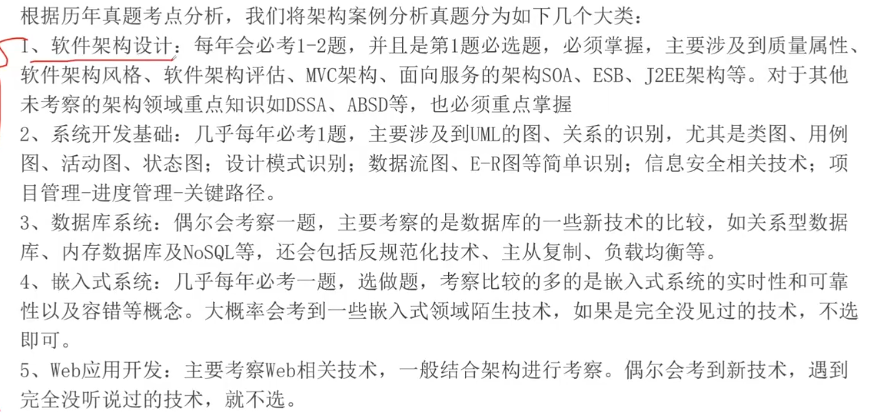

# 备考笔记：架构案例分析-五大类考点分类

## 一、题源说明

> 根据历年真题考点分析，我们将架构案例分析真题分为如下几个大类：
>
> 1、**软件架构设计**：每年会必考 1-2 题，并且是第 1 题必选题，必须掌握，主要涉及到质量属性、软件架构风格、软件架构评估、MVC 架构、面向服务的架构 SOA、ESB、J2EE 架构等。对于其他未考察的架构领域重点知识如 DSSA、ABSD 等，也必须重点掌握。
>
> 2、**系统开发基础**：几乎每年必考 1 题，主要涉及到 UML 的图、关系的识别，尤其是类图、用例图、活动图、状态图；设计模式识别；数据流图、E-R 图等简单识别；信息安全相关技术；项目管理-进度管理-关键路径。
>
> 3、**数据库系统**：偶尔会考察一题，主要考察的是数据库的一些新技术的比较，如关系型数据库、内存数据库及 NoSQL 等，还会包括反规范化技术、主从复制、负载均衡等。
>
> 4、**嵌入式系统**：几乎每年必考一题，选做题，考察比较多的是嵌入式系统的实时性和可靠性以及容错等概念。大概率会考到一些嵌入式领域陌生技术，如果是完全没见过技术，不选即可。
>
> 5、**Web 应用开发**：主要考察 Web 相关技术，一般结合架构进行考察。偶尔会考到新技术，遇到完全没听说过技术，就不选。

**结论：架构案例分析题按考点分为五大类。** 其中软件架构设计、系统开发基础、嵌入式系统三类几乎年年出现；数据库系统偶尔出现；Web 应用开发常与架构合并出题。

## 二、知识点：架构案例分析五大类考点

### 1. 核心结论

架构案例分析 = 从**五个领域**出题，且**部分题目为选做题**。

- **必考 / 高频**：软件架构设计、系统开发基础、嵌入式系统。
- **低频**：数据库系统。
- **合并考察**：Web 应用开发，一般与架构结合出题。

**术语**（首次出现时给出解释）：

- **架构**：软件的整体结构，即系统由哪些部分组成、各部分之间如何交互。
- **案例分析**：软考高级的一类主观题，先给出场景，再要求分析与作答。
- **选做题**：题目提供若干小节，考生只需选择固定数量作答，其余可不做。

### 2. 五大类考点清单

| 序号 | 大类 | 考频 | 核心考点 | 备考要求 |
| --- | --- | --- | --- | --- |
| 1 | 软件架构设计 | **每年 1-2 题，第 1 题必选** | 质量属性、软件架构风格、软件架构评估、MVC 架构、SOA、ESB、J2EE 架构 | **必须掌握**；DSSA、ABSD 等未考重点也要重点掌握 |
| 2 | 系统开发基础 | **几乎每年 1 题** | UML 图与关系识别（类图、用例图、活动图、状态图）、设计模式识别、数据流图与 E-R 图、信息安全技术、项目管理进度与关键路径 | 高频，重点复习 |
| 3 | 数据库系统 | **偶尔 1 题** | 关系型数据库 / 内存数据库 / NoSQL 比较、反规范化、主从复制、负载均衡 | 掌握新技术对比即可 |
| 4 | 嵌入式系统 | **几乎每年 1 题（选做）** | 实时性、可靠性、容错 | 陌生技术可直接不选 |
| 5 | Web 应用开发 | **常结合架构** | Web 相关技术 | 关注与架构结合的考法 |

### 3. 解题步骤

1. **先做第 1 题**：软件架构设计是必选题，分值稳定，优先作答。
2. **按考频分配复习时间**：架构设计、系统开发基础、嵌入式系统为复习重心。
3. **选做题先扫再选**：嵌入式题先通读小节，遇到完全没见过的技术，直接不选。
4. **数据库只抓对比点**：把关系型 / 内存 / NoSQL 的差异记牢，再补反规范化、主从复制、负载均衡。
5. **Web 题连着架构答**：先写架构层面的说法，再补 Web 技术细节。

## 三、易错点（备考提醒）

1. **把选做题当必做题**：嵌入式几乎每年都出，但它是**选做题**。遇到完全没见过的技术，不选即可；硬答反而失分。
2. **只复习「考过的」**：架构设计中的 **DSSA、ABSD** 等尚未考过的重点，原文明确要求**也要重点掌握**。
3. **把数据库系统当重点**：它是低频项，只需掌握**新技术比较**（关系型 / 内存 / NoSQL）与**反规范化、主从复制、负载均衡**。
4. **孤立复习 Web 应用开发**：它一般**结合架构**出题，不能只背纯 Web 技术。
5. **漏掉项目管理考点**：系统开发基础一类里含**进度管理与关键路径**，容易与「架构」主题脱节而被忽略。

## 四、扩展延伸

- **与已有笔记的关联**：架构风格见 [59-架构风格-黑板风格与管道过滤器.md](59-架构风格-黑板风格与管道过滤器.md)、[60-架构风格-五大类变式命题推演.md](60-架构风格-五大类变式命题推演.md)；质量属性见 [69-质量属性-可用性与可修改性辨析.md](69-质量属性-可用性与可修改性辨析.md)；SOA / ESB 见 [74-SOA服务建模-三阶段.md](74-SOA服务建模-三阶段.md)、[80-SOA-ESB总线分层与职责.md](80-SOA-ESB总线分层与职责.md)；设计模式见 [72-设计模式-23种模式三分类清单.md](72-设计模式-23种模式三分类清单.md)、[73-设计模式-类行为模式辨析.md](73-设计模式-类行为模式辨析.md)；数据库新技术见 [16-分布式数据库-CAP理论.md](16-分布式数据库-CAP理论.md)、[24-MySQL主从复制-从服务器线程分工.md](24-MySQL主从复制-从服务器线程分工.md)；关键路径见 [89-项目管理-资源约束工期计算.md](89-项目管理-资源约束工期计算.md)。
- **现实类比**：架构案例分析像**一张五道菜的自助餐菜单**——第 1 道菜「软件架构设计」是必点主菜；「嵌入式系统」是限定菜，不合口味可以不吃；「数据库系统」偶尔上桌，尝一口新做法（新技术对比）就够。

## 五、考点归档

| 序号 | 大类 | 考频 | 题型 | 备考优先级 | 掌握度 |
| --- | --- | --- | --- | --- | --- |
| 1 | 软件架构设计 | 每年 1-2 题（第 1 题必选） | 案例分析 | 高 | 待复习 |
| 2 | 系统开发基础 | 几乎每年 1 题 | 案例分析 | 高 | 待复习 |
| 3 | 数据库系统 | 偶尔 1 题 | 案例分析 | 中 | 待复习 |
| 4 | 嵌入式系统 | 几乎每年 1 题（选做） | 案例分析 | 高 | 待复习 |
| 5 | Web 应用开发 | 常结合架构 | 案例分析 | 中 | 待复习 |

## 六、相关图片

原题截图：`./images/94-架构案例分析-五大类考点分类.png`（由用户上传的原题图复制改名而来）

