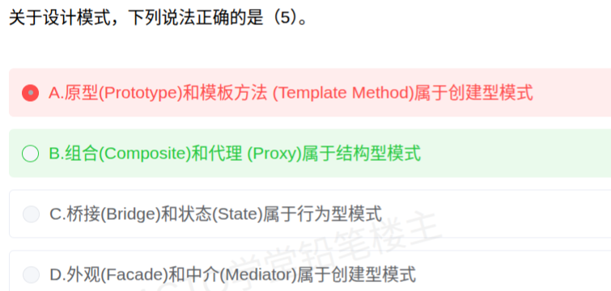

# 备考笔记：设计模式-三分类归属判断

## 一、题目

> 关于设计模式，下列说法正确的是（）。
> A. 原型（Prototype）和模板方法（Template Method）属于创建型模式
> B. 组合（Composite）和代理（Proxy）属于结构型模式
> C. 桥接（Bridge）和状态（State）属于行为型模式
> D. 外观（Facade）和中介（Mediator）属于创建型模式

**答案：B. 组合（Composite）和代理（Proxy）属于结构型模式**

解析：逐项核对每个模式的归属——
A 错：**原型**属创建型，但**模板方法**属**行为型**（类行为模式）；
B 对：**组合、代理**都是**结构型**（7 种之一）；
C 错：**桥接**属**结构型**，只有**状态**属行为型；
D 错：**外观**属**结构型**，**中介**属**行为型**，二者都不是创建型。
每个错误选项都**混搭了一个对、一个错**，只有 B 两项同属结构型，故选 B。

## 二、知识点：设计模式-三分类归属判断

### 1. 核心原理

GoF **23 种设计模式**按**用途**分三类，判断归属只看"**它解决什么问题**"：

| 分类 | 解决的问题 | 数量 |
| --- | --- | --- |
| **创建型** | 怎样**创建对象**（把创建与使用解耦） | 5 |
| **结构型** | 类/对象怎样**组合**成更大结构 | 7 |
| **行为型** | 类/对象怎样**交互、怎样分配职责** | 11 |

本题考的是"**给出两个模式，判断它们是否同属某一类**"——两个模式必须**都对**，说法才成立。

### 2. 关键公式/规则

**（1）三分类完整清单（判断依据）**

| 分类 | 数量 | 模式清单 |
| --- | --- | --- |
| **创建型** | 5 | 工厂方法、抽象工厂、单例、建造者、原型 |
| **结构型** | 7 | 适配器、装饰器、代理、外观、桥接、组合、享元 |
| **行为型** | 11 | 策略、模板方法、观察者、迭代子、责任链、命令、备忘录、状态、访问者、中介者、解释器 |

**（2）本题四个模式的归属速查**

| 模式 | 归属 | 作用 |
| --- | --- | --- |
| 原型 Prototype | **创建型** | 通过**克隆**原型实例创建新对象 |
| 模板方法 Template Method | **行为型** | 定义算法骨架，把某些步骤**延迟到子类** |
| 组合 Composite | **结构型** | 树形结构表示"部分—整体"层次 |
| 代理 Proxy | **结构型** | 提供代理对象**控制对原对象的访问** |
| 桥接 Bridge | **结构型** | 抽象部分与实现部分**分离**，可独立变化 |
| 状态 State | **行为型** | 内部状态改变时**改变行为** |
| 外观 Facade | **结构型** | 为子系统提供**统一高层接口** |
| 中介者 Mediator | **行为型** | 用中介对象**封装同事对象间的交互** |

### 3. 解题步骤

1. **拆选项**：每个选项含两个模式，先分别独立判归属。
2. **逐项定性**：A（创建+行为）、B（结构+结构）、C（结构+行为）、D（结构+行为）。
3. **看是否同类**：只有 B 的两个模式**同属结构型**，说法为真。
4. **遇不确定先排除**：把"必错"的模式先定死（如模板方法一定是行为型、桥接一定是结构型），错误项会迅速暴露。

## 三、易错点

1. **只看第一个模式就下判断**：四个错误项都是"**一个对一个错**"的混搭，只核对前半句就会误判，必须**两个都查**。
2. **把模板方法当创建型**：模板方法名字里有"方法"，易与工厂方法混淆，实际是**行为型**，且是**类行为模式**（另一考点见 [73-设计模式-类行为模式辨析.md](73-设计模式-类行为模式辨析.md)）。
3. **把桥接当行为型**：桥接是**结构型**（抽象与实现分离），不是行为型；同名的"状态"才是行为型。
4. **把外观当创建型**：外观是**结构型**（统一高层接口）；中介者是**行为型**。
5. **"组合/聚合"术语混淆**：**组合模式（Composite）是结构型**，而"用组合关系分派行为"是对象行为模式的机制，二者不是一回事。

## 四、扩展延伸

- **一句话记忆**：创建型管"**怎么造**"（工厂方法、抽象工厂、单例、建造者、原型）；结构型管"**怎么拼**"（适配器、装饰器、代理、外观、桥接、组合、享元）；行为型管"**怎么打交道、谁负责**"（策略、模板方法、观察者、迭代子、责任链、命令、备忘录、状态、访问者、中介者、解释器）。
- **数量助记**：**创建 5、结构 7、行为 11，合计 23**（5-7-11）。
- **两个维度的交叉**：行为型可再分**类行为模式（解释器、模板方法 2 种）**与**对象行为模式（其余 9 种）**；结构型也可分**类结构型（适配器 1 种）**与对象结构型（其余 6 种）。
- **相关笔记**：完整三分类清单见 [72-设计模式-23种模式三分类清单.md](72-设计模式-23种模式三分类清单.md)；行为型内部再分类见 [73-设计模式-类行为模式辨析.md](73-设计模式-类行为模式辨析.md)；组合模式识别见 [77-组合模式-类图识别与结构型分类.md](77-组合模式-类图识别与结构型分类.md)。
- **现实类比**：把三类模式当**装修工具箱的三层抽屉**——**创建型（5 件）**是"怎么造家具"、**结构型（7 件）**是"怎么拼装房间"、**行为型（11 件）**是"住进去后怎么协作"。本题就像问"某两件工具是不是同一层抽屉里的"，得**两件都开对抽屉**才算对。

## 五、错题归档

| 题号 | 题型 | 考点 | 难度 | 掌握度 |
| --- | --- | --- | --- | --- |
| — | 单选-选正确项 | 设计模式三分类归属判断（每个选项含两个模式，需**两项同属一类**） | 中 | 薄弱 |

## 六、相关图片

原题截图：`./images/95-设计模式-三分类归属判断.png`（由用户上传的原题图复制改名而来）

