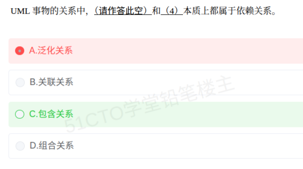

# 备考笔记：UML关系-包含与扩展的依赖本质

## 一、题目

> UML 事物的关系中，（请作答此空）和（4）本质上都属于依赖关系。
>
> A. 泛化关系
>
> B. 关联关系
>
> C. 包含关系
>
> D. 组合关系

**答案：C. 包含关系**

解析：UML 中"事物之间的关系"有**四类基本关系**——依赖、关联、泛化、实现。用例之间的**包含关系**（«include»）和**扩展关系**（«extend»），在图形上都用"**虚线 + 开口箭头 + 构造型**"表示，其本质都是从依赖关系派生出来的**依赖关系**（Dependency）。故本题空填"包含关系"，搭配的另一空（4）即"扩展关系"，二者同属依赖。A 泛化关系属"分类轴"（实线 + 空心三角）；B 关联关系是长期结构联系（实线）；D 组合关系是强整体-部分（实线 + 实心菱形）——三项都不属于依赖关系。

## 二、知识点：UML关系-包含与扩展的依赖本质

### 1. 核心原理

**UML 把"事物之间的关系"归纳为四类基本关系**：

| 基本关系 | 英文 | UML 画法 | 语义 |
| --- | --- | --- | --- |
| 依赖关系 | Dependency | 虚线 + 开口箭头 | 临时使用（use-a） |
| 关联关系 | Association | 实线（可带箭头、角色、多重性） | 长期结构联系（knows-a / has-a） |
| 泛化关系 | Generalization | 实线 + 空心三角（指向父类） | 分类/继承（is-a） |
| 实现关系 | Realization | 虚线 + 空心三角（指向接口） | 类实现接口 |

**用例之间的关系并不是另起一套，而是"落到"上述四类里**：

| 用例间关系 | 落到的基本关系 | UML 画法 |
| --- | --- | --- |
| **包含关系 «include»** | **依赖关系** | 虚线 + 开口箭头 + «include» |
| **扩展关系 «extend»** | **依赖关系** | 虚线 + 开口箭头 + «extend» |
| 用例泛化 | 泛化关系 | 实线 + 空心三角 |

**要点**：

- **包含、扩展本质上都是依赖关系**——这正是本题的考点。二者只是"依赖"加上了不同的**构造型**（stereotype）标注。
- **泛化在任何场景都是泛化关系**，不会因为出现在用例图里就变成依赖（用例泛化仍是实线 + 空心三角）。
- 判断归属看**线型 + 箭头形状**：**虚线 + 开口箭头 = 依赖**；**实线 + 空心三角 = 泛化**；**实线 + 实心菱形 = 组合**。

### 2. 关键公式/规则

**辨别速查表（看线型、箭头、构造型）**：

| 关系 | 线型 | 箭头/端点 | 构造型 |
| --- | --- | --- | --- |
| 依赖关系 | **虚线** | 开口箭头 | 无 |
| **包含关系** | **虚线** | 开口箭头 | **«include»** |
| **扩展关系** | **虚线** | 开口箭头 | **«extend»** |
| 关联关系 | 实线 | 可带箭头 | 无 |
| 泛化关系 | 实线 | 空心三角 | 无 |
| 实现关系 | 虚线 | 空心三角 | 无 |
| 聚合关系 | 实线 | 空心菱形（整体端） | 无 |
| 组合关系 | 实线 | 实心菱形（整体端） | 无 |

记忆口诀：**"含扩本为依赖，泛化仍是泛化；虚箭是依赖、实线是关联、实线三角是泛化。"**

**包含 vs 扩展（最容易混的一对）**：

| 对比项 | 包含 «include» | 扩展 «extend» |
| --- | --- | --- |
| 是否必然发生 | **必然**执行被包含用例 | **特定条件下**才执行 |
| 被包含/扩展的用例地位 | 是基用例的**必要组成**（无条件的公共步骤） | 是**可选**的补充行为 |
| 箭头方向 | 基用例 **→** 被包含用例 | 扩展用例 **→** 基用例 |
| 典型场景 | "网上下单"必然包含"用户登录" | "下单"在"使用优惠券"时被"应用优惠券"扩展 |
| 相同点 | **都是依赖关系**（虚线 + 开口箭头 + 构造型） | **都是依赖关系**（虚线 + 开口箭头 + 构造型） |

### 3. 解题步骤

1. **抓题干关键词**："本质上都属于依赖关系"。
2. **回忆四类基本关系**：依赖、关联、泛化、实现——只有"依赖"是虚线 + 开口箭头。
3. **联想用例关系归属**：用例的**包含**与**扩展**在图形上都用"虚线 + 开口箭头 + 构造型"表示，本质即**依赖关系**。
4. **逐项排除**：A 泛化（实线 + 空心三角）、B 关联（实线）、D 组合（实线 + 实心菱形）均非依赖关系。
5. **定答案**：选 **C. 包含关系**（另一空为"扩展关系"）。

## 三、易错点

1. **误选泛化关系（本次错选 A）**：泛化始终是独立的**泛化关系**（实线 + 空心三角），无论用在类之间还是用例之间，都不属于依赖。
2. **把"包含关系"当成一种独立的基本关系**：基本关系只有依赖、关联、泛化、实现四类；包含/扩展只是**带构造型的依赖关系**，不是第五类。
3. **只看名字、不看图形**：判断归属要回到"线型 + 箭头"——**虚线 + 开口箭头**才是依赖；含扩两条虚线关系因此归入依赖。
4. **混淆包含与扩展的方向**：包含是"基用例 → 被包含用例"（箭头指向被包含者）；扩展是"扩展用例 → 基用例"（箭头指向被扩展的基用例），方向相反。
5. **把组合/聚合误当依赖**：组合、聚合是**整体-部分**关系，用**实线 + 实心/空心菱形**表示，与依赖无关。
6. **把关联当依赖**：关联是**长期持有**（成员变量，实线）；依赖是**临时使用**（方法参数、局部变量、返回值，虚线）。用例之间没有"成员变量"，所以含扩只能落成依赖。
7. **忽略"构造型"**：不写 «include»/«extend» 的虚线箭头只是普通依赖；带上构造型才是包含/扩展关系——但**本质仍属依赖**，不影响本题判断。

## 四、扩展延伸

- **UML 关系全景（线型 → 关系）**：

| 线型 + 端点 | 关系 |
| --- | --- |
| 虚线 + 开口箭头 | 依赖（含用例的**包含**、**扩展**） |
| 实线 | 关联 |
| 实线 + 空心菱形 | 聚合 |
| 实线 + 实心菱形 | 组合 |
| 实线 + 空心三角 | 泛化 |
| 虚线 + 空心三角 | 实现 |

- **包含/扩展为什么设计成依赖**：二者只描述"一个用例在某处**引用**另一个用例的行为"，被引用者不是引用者的属性或组成部分，天然是**临时、单向的引用**——语义上正是"依赖（use-a）"。
- **现实类比**：**包含**像"办婚礼**必然**要走'登记领证'这道流程"（必经步骤，无条件）；**扩展**像"正常下班，**加班时**额外'提交日报'"（条件触发，可有可无）。两者都只是"流程中临时引用到另一件事"，所以都算依赖。
- **相关笔记**：
  - [30-面向对象-泛化与聚合关系.md](30-面向对象-泛化与聚合关系.md)：依赖（use-a，虚线开口箭头）与泛化（is-a，实线空心三角）的画法对照，本篇是其细化到"用例关系"的场景；
  - [37-面向对象-类关系耦合强度排序.md](37-面向对象-类关系耦合强度排序.md)：依赖是耦合阶梯上**最弱**的一环（继承 > 组合 > 聚合 > 关联 > 依赖），包含/扩展既归依赖，耦合自然弱；
  - [50-面向对象-用例模型与分析模型辨析.md](50-面向对象-用例模型与分析模型辨析.md)：用例模型由用例图建立，本篇讲的正是用例图内部"用例之间"的关系。

## 五、错题归档

| 题号 | 题型 | 考点 | 难度 | 掌握度 |
| --- | --- | --- | --- | --- |
| 软考-面向对象与UML（双空） | 单选 | UML 包含关系与扩展关系本质上都属于依赖关系；依赖/关联/泛化/实现四类基本关系辨析 | 易 | 待复习 |

## 六、相关图片

原题截图：`./images/98-UML关系-包含与扩展的依赖本质.png`（由用户上传的原题图复制改名而来）

