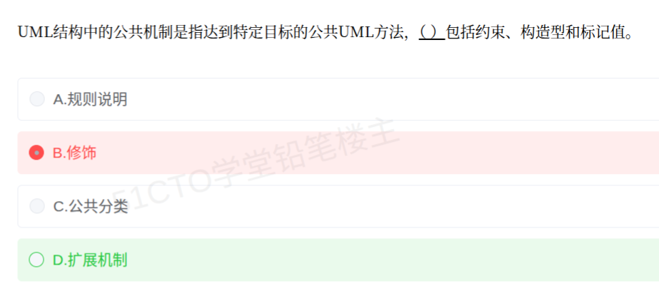

# 备考笔记：UML公共机制-扩展机制含约束构造型标记值

## 一、题目

> UML 结构中的公共机制是指达到特定目标的公共 UML 方法，（ ）包括约束、构造型和标记值。
>
> A. 规则说明
>
> B. 修饰
>
> C. 公共分类
>
> D. 扩展机制

**答案：D. 扩展机制**

解析：UML 的**公共机制**有四类——**规格说明、修饰、公共分类、扩展机制**。其中**扩展机制**由三个要素组成：**约束（Constraint）、构造型（Stereotype）、标记值（Tagged Value）**，题干列举的三项与之完全对应，故选 D。A"规则说明"不是 UML 公共机制的名称；B"修饰"只是通过附加图形符号（如可见性 +/−/#、多重性）表达细节，不含约束/构造型/标记值；C"公共分类"指"类与对象、接口与实现、类型与角色"三组划分，同样不含这三项。

## 二、知识点：UML公共机制-扩展机制含约束构造型标记值

### 1. 核心原理

**公共机制（Common Mechanisms）是 UML 中"达到特定目标的公共方法"**，共 **四类**：

| 公共机制 | 英文 | 含义 | 举例 |
| --- | --- | --- | --- |
| 规格说明 | Specification | 每个模型元素背后都有一份描述其语义的规格说明（文本或图形） | 类的属性/操作可另附文字约束 |
| 修饰 | Adornment | 用附加的图形符号表达模型元素的细节 | 可见性 `+ - #`、多重性 `1..*`、斜体表示抽象类 |
| 公共分类 | Common Division | 三组通用划分 | **类与对象**、**接口与实现**、**类型与角色** |
| **扩展机制** | **Extensibility Mechanisms** | **对 UML 进行扩展以适应特定领域/项目** | **约束、构造型、标记值** |

**本题问的是"包括约束、构造型和标记值"的那一类 → 扩展机制。** 扩展机制的三个要素：

| 要素 | 英文 | 表示法 | 含义与举例 |
| --- | --- | --- | --- |
| **约束** | Constraint | 花括号 `{ }` | 附加的语义限制，如 `{ordered}`（有序）、`{xor}`（互斥）、`{subset}` |
| **构造型** | Stereotype | 双尖括号 `« »` | 在已有元素上派生新元素，如 `«include»`、`«extend»`、`«interface»`、`«entity»` |
| **标记值** | Tagged Value | `{tag = value}` | 为元素附加的键值对属性，如 `{version = 1.0}`、`{author = 张三}`、`{persistence = transient}` |

**要点**：

- 判据一句话：**问"包括约束、构造型和标记值的是哪一类" → 答"扩展机制"**，因为这三者正是 UML 三大扩展手段。
- 四类公共机制是**并列**的，不要把"修饰""公共分类"和"扩展机制"混为一谈。
- 扩展机制是 UML 官方预留的**扩展入口**：想表达 UML 标准之外的概念，就用构造型/标记值/约束去"扩展"，而不必改 UML 本身。

### 2. 关键公式/规则

**UML 公共机制四类 + 扩展机制三要素 速记表**：

| 层级 | 内容 |
| --- | --- |
| 公共机制（4 类） | 规格说明、修饰、公共分类、**扩展机制** |
| 扩展机制（3 要素） | **约束 `{ }`、构造型 `« »`、标记值 `{tag=value}`** |

记忆口诀：**"公机四类：规格、修饰、分类、扩展；扩展三件：约束、构造型、标记值。"**

**表示法辨别（看到符号就想到对应要素）**：

| 符号 | 对应要素 |
| --- | --- |
| `«...»` | 构造型 |
| `{...}`（条件、规则） | 约束 |
| `{名 = 值}` | 标记值 |
| `+ - #`、`1..*`、斜体类名 | 修饰（**不是**扩展机制） |

### 3. 解题步骤

1. **抓题干关键词**：UML"公共机制"、"包括约束、构造型和标记值"。
2. **回忆公共机制四类**：规格说明、修饰、公共分类、扩展机制。
3. **对上三要素**：约束、构造型、标记值 = 扩展机制的三个组成部分。
4. **排除干扰项**：A 非公共机制名称；B 修饰、C 公共分类都是并列的其他公共机制，均不含这三项。
5. **定答案**：选 **D. 扩展机制**。

## 三、易错点

1. **误选"修饰"（本次错选 B）**：修饰讲的是"用额外图形符号表达细节"（可见性、多重性、抽象斜体等）；**约束、构造型、标记值属于扩展机制**，不要因为三者也是"加在模型元素上的东西"就误判成修饰。
2. **把三个要素当成三种独立机制**：约束、构造型、标记值是**同一个**"扩展机制"下的三个**组成要素**，不是并列的三类公共机制。
3. **混淆"公共机制"与"UML 的组成"**：UML 由**事物、关系、图和规则**（Things + Relationships + Diagrams + Rules）构成；这里的"公共机制"是另一组概念，别把"规则"答成公共机制（A 项"规则说明"即由此设陷）。
4. **混淆"公共分类"**：公共分类指**类与对象、接口与实现、类型与角色**三组划分，与扩展机制无关。
5. **符号张冠李戴**：`« »` 是**构造型**不是标记值；`{tag=value}` 是**标记值**不是约束；`{ordered}` 这类只有规则、无"名=值"的才是**约束**。
6. **忽略"扩展机制是给 UML 打补丁的入口"**：它面向特定领域/项目的扩展需求，正好对应"达到特定目标"的表述。
7. **忘记四类齐全**：只记住"扩展机制"而漏掉"规格说明"，遇到问"UML 公共机制包括哪些"的题就会漏选。

## 四、扩展延伸

- **扩展机制三要素对照（一眼分辨）**：

| 要素 | 表示法 | 作用 | 典型例子 |
| --- | --- | --- | --- |
| 约束 | `{ }` | 补充**语义限制条件** | `{ordered}`、`{xor}`、`{incomplete}` |
| 构造型 | `« »` | 在既有元素上**派生新语义元素** | `«include»`、`«extend»`、`«interface»` |
| 标记值 | `{tag = value}` | 给元素**附加键值属性** | `{version=2.0}`、`{author=李四}` |

- **UML 三大扩展机制的现实类比**：把 UML 想象成一套标准"乐高积木"，**构造型**是给积木贴上自定标签（如 `«接口»`），**标记值**是给积木挂上自定铭牌（如"版本 1.0"），**约束**是给积木加上拼装规则（如"必须按顺序拼"）——三者一起让标准积木适配你自家的场景。
- **与关系题的衔接**：上一题（98 号）出现的 `«include»`、`«extend»` 正是**构造型**；本题正好补上"构造型属于哪个公共机制"的上位知识——**构造型 ⊂ 扩展机制 ⊂ 公共机制**。
- **相关笔记**：
  - [98-UML关系-包含与扩展的依赖本质.md](98-UML关系-包含与扩展的依赖本质.md)：`«include»`/`«extend»` 就是本笔记中"构造型"的实例；
  - [30-面向对象-泛化与聚合关系.md](30-面向对象-泛化与聚合关系.md)：UML 关系基础，与"公共机制"同属 UML 元模型知识；
  - [37-面向对象-类关系耦合强度排序.md](37-面向对象-类关系耦合强度排序.md)：关系耦合强弱排序。

## 五、错题归档

| 题号 | 题型 | 考点 | 难度 | 掌握度 |
| --- | --- | --- | --- | --- |
| 软考-UML与面向对象 | 单选 | UML 公共机制四类；扩展机制 = 约束 + 构造型 + 标记值 | 易 | 待复习 |

## 六、相关图片

原题截图：`./images/99-UML公共机制-扩展机制含约束构造型标记值.png`（由用户上传的原题图复制改名而来）

