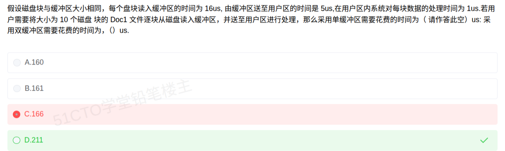

# 备考笔记：单缓冲区与双缓冲区计算

## 一、题目

> 假设磁盘块与缓冲区大小相同，每个盘块读入缓冲区的时间为 16us，由缓冲区送至用户区的时间是 5us，在用户区内系统对每块数据的处理时间为 1us。若用户需要将大小为 10 个磁盘块的 Doc1 文件逐块从磁盘读入缓冲区，并送至用户区进行处理，那么采用单缓冲区需要花费的时间为（ 1 ）us；采用双缓冲区需要花费的时间为（ 2 ）us。
> A. 160
> B. 161
> C. 166
> D. 211

**答案：（1）D. 211；（2）166**

## 二、知识点：单缓冲区与双缓冲区计算

### 1. 核心原理

逐块读文件的过程由三个**串行阶段**构成，它们占用不同资源，正是「资源占用**重叠**」的程度决定了总耗时：

| 阶段 | 记号 | 耗时 | 占用资源 |
| --- | --- | --- | --- |
| 磁盘块 → 缓冲区 | R | 16us | 磁盘 + **缓冲区** |
| 缓冲区 → 用户区 | S | 5us | **缓冲区** + 用户区 |
| 用户区处理 | P | 1us | 用户区 |

**单缓冲区**：只有一块缓冲区。缓冲区的生命期是 R+S 连续占用（读入后必须把数据送走，缓冲区才能空出来给下一块），所以**每块数据的瓶颈周期 = R + S = 21us**；用户区只占用 S+P = 6us，不是瓶颈。磁盘在缓冲区腾空的瞬间（本块 S 结束）即可读下一块，形成重叠。

**双缓冲区**：两块缓冲区交替使用。当 CPU 在把缓冲区 1 的数据送用户区（S）时，磁盘可以**同时**把下一块读进缓冲区 2（R），于是 R 与 S+P 完全重叠。此时缓冲区每块的占用降为 R = 16us，用户区占用 S+P = 6us，**瓶颈周期 = max(R, S+P) = 16us**。

一句话：**单缓冲的瓶颈在「缓冲区被 R+S 长期占住」，双缓冲把缓冲区占用压缩到 R，瓶颈变成 max(R, S+P)。**

### 2. 关键公式/规则

| 场景 | 每块瓶颈周期 | 总时间公式（n 块） |
| --- | --- | --- |
| 单缓冲区 | R + S（缓冲区串行占用） | T = R + (n−1)(R+S) + S + P |
| 双缓冲区 | max(R, S+P) | T = R + (n−1)·max(R, S+P) + S + P |

> 通用写法：T = R(第一块读入) + (n−1)×瓶颈周期 + S + P(最后一块的传送与处理)。
> 本题代入 R=16，S=5，P=1，n=10：
>
> - 单缓冲：16 + 9×21 + 5 + 1 = 16 + 189 + 6 = **211**
> - 双缓冲：16 + 9×16 + 5 + 1 = 16 + 144 + 6 = **166**

### 3. 解题步骤

1. **标出三段耗时**：R（读入缓冲区）=16，S（送用户区）=5，P（用户区处理）=1。
2. **判断缓冲区个数**：题目给「单缓冲区」和「双缓冲区」两问，分别套公式。
3. **求瓶颈周期**：
   - 单缓冲 → R+S = 16+5 = 21（缓冲区是瓶颈）；
   - 双缓冲 → max(R, S+P) = max(16, 6) = 16（缓冲区并行后，磁盘读仍是瓶颈）。
4. **算总时间**：首块完整走 R→S→P，中间 (n−1) 块各按瓶颈周期推进，最后一块补齐 S 和 P。
5. **对照选项**：单缓冲 211 → 选 D；双缓冲 166 → 填空为 166（即选项 C 的数值，但注意它对应的是第二问）。

## 三、易错点

1. **把单缓冲当成 max(R, S+P)+…**：单缓冲中缓冲区被 R 和 S **串行**占用，周期是 R+S=21 而不是 max(16,6)=16，这是本题最核心的陷阱（选成 166 或 160/161 都源于此）。
2. **忘记首块完整耗时**：总时间不是 n×周期，而是 R + (n−1)×周期 + S + P，首块的 S 与末块的 S/P 要单独算，差 6us。
3. **双缓冲周期误算成 21 或 17**：双缓冲下 R 与（S+P）重叠，周期 = max(16, 6) = 16；误写成 max(R,S)+P = 17 会得到 169，误写成 R+S = 21 会得到 211（与单缓冲相同，明显不合理）。
4. **两问答案搞混**：本题两个空，单缓冲 = 211，双缓冲 = 166。题目选项里 166 与 211 同时出现，很容易「第一空选 166、第二空写 211」把顺序填反。
5. **n 的取值**：n=10 个盘块，中间重叠推进的是 (n−1)=9 次，不是 n 次也不是 (n+1) 次。
6. **单位陷阱**：时间单位是 us，本题数值小，算错 5us 就会跨到相邻选项（160/161/166 三选项仅差几个 us），必须逐步写清算式。

## 四、扩展延伸

- **三种缓冲的完整梯度**（软考常一起考）：
  - 单缓冲：缓冲区被 R 与 S **串行**占用，每块周期 = R + S，总时间 = n(R+S) + P；
  - 双缓冲：R 与（S+P）重叠，每块周期 = max(R, S+P)，总时间 = n·R + S + P（当 R 为瓶颈时）；
  - 缓冲池（多缓冲）：R、S、P 三者充分重叠，周期 = max(R, S, P)，理想情况下完全流水。
- **公式变形**：把 R、S、P 数值换掉后，先算瓶颈周期再套总数公式，是所有缓冲题的通用解。若 S+P > R，则双缓冲的瓶颈会转移到用户区，此时周期 = S+P。
- **本质是「流水线」思想**：缓冲技术就是用空间（多块缓冲区）换时间（并行重叠），与 CPU 指令流水线、生产者-消费者模型是同一套「资源重叠」逻辑。
- **生产者-消费者类比**：磁盘是生产者、用户进程是消费者、缓冲区是仓库；单缓冲区只能「放满—取空—再放」，双缓冲区能做到「边放边取」。
- **现实类比**：单缓冲像「只有一张餐桌，客人吃完才能上下一盘菜」；双缓冲像「两张餐桌轮流上菜，厨师和客人可以同时忙」。

## 五、错题归档

| 题号 | 题型 | 考点 | 难度 | 掌握度 |
| --- | --- | --- | --- | --- |
| 用户上传图（第 1 空误选 C.166） | 选择题（双空） | 操作系统-设备管理 单/双缓冲区时间计算 | 中 | 待复习 |

## 六、相关图片

原题截图保存：`../images/03-单缓冲区与双缓冲区计算.png`

