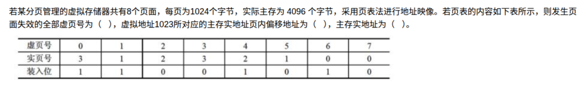

# 备考笔记：分页存储-页表地址映像

## 一、题目

> 若某分页管理的虚拟存储器共有 8 个页面，每页为 1024 个字节，实际主存为 4096 个字节，采用页表法进行地址映像。若页表的内容如下表所示，则发生页面失效的全部虚页号为（ ），虚拟地址 1023 所对应的主存实地址页内偏移地址为（ ），主存实地址为（ ）。
>
> | 虚页号 | 0 | 1 | 2 | 3 | 4 | 5 | 6 | 7 |
> | --- | --- | --- | --- | --- | --- | --- | --- | --- |
> | 实页号 | 3 | 1 | 2 | 3 | 2 | 1 | 0 | 0 |
> | 装入位 | 1 | 1 | 0 | 0 | 1 | 0 | 1 | 0 |

**答案：页面失效的全部虚页号 = 2、3、5、7；页内偏移地址 = 1023；主存实地址 = 4095**

## 二、知识点：分页存储-页表地址映像

### 1. 核心原理

分页存储把**虚拟地址空间**和**主存空间**都切成等长的块：虚拟空间切成「页」，主存切成「页框（实页）」，二者大小相等（本题 1024 B）。

- 虚拟地址 = **虚页号 + 页内偏移**，页内偏移的位数由页大小决定：`1024 = 2^10`，故偏移占 **10 位**。
- 地址映像靠**页表**完成：页表每一项记录「虚页号 → 实页号」以及一个**装入位**。
- **装入位（有效位）= 1**，表示该页已在主存，可正常访问；**装入位 = 0**，表示该页不在主存，访问它就会发生**页面失效（缺页）**。

本题参数：

- 页数 8 → 虚页号 3 位（0~7）；
- 每页 1024 B = 2^10 → 页内偏移 10 位；
- 主存 4096 B = 4 × 1024 → 实页共 **4 个**，实页号 0~3。

### 2. 关键公式/规则

| 名称 | 表达式 |
| --- | --- |
| 虚拟地址分解 | 虚页号 = ⌊虚拟地址 ÷ 页大小⌋；页内偏移 = 虚拟地址 mod 页大小 |
| 查表 | 用虚页号查页表项，取**实页号**与**装入位** |
| 缺页判定 | 装入位 = 0 → 页面失效（不产生实地址） |
| 实地址换算 | 主存实地址 = 实页号 × 页大小 + 页内偏移 |
| 实页总数 | 主存大小 ÷ 页大小 = 4096 ÷ 1024 = 4（实页号 0~3，是自检点） |

### 3. 解题步骤

1. **算位数**：页大小 1024 B = 2^10 → 页内偏移占 10 位；虚页号占 log2(8) = 3 位，共 13 位地址。
2. **找失效页**：逐列看**装入位**，凡为 0 的虚页号即页面失效 → 虚页 **2、3、5、7**。
3. **拆虚拟地址**：1023 < 1024，故 **虚页号 = 0，页内偏移 = 1023**（页内偏移直接就是答案第二空）。
4. **查实页号**：虚页号 0 对应实页号 **3**，装入位 1，可访问。
5. **算实地址**：实地址 = 3 × 1024 + 1023 = 3072 + 1023 = **4095**（< 4096，未越界，验证通过）。

## 三、易错点

1. **偏移和实地址别混**：第二空只问「页内偏移地址」= **1023**；第三空才问「主存实地址」= **4095**。第二空若填 4095 就是把两者搞反。
2. **1023 的页号是 0 不是 1**：地址从 0 开始编号，第 0 页覆盖 [0, 1023]，第 1 页从 1024 开始。1023 仍落在第 0 页，偏移取到最大值 1023。
3. **失效页要全列**：必须把装入位为 0 的全部列出（2、3、5、7），漏掉任何一个都算错。
4. **别把「实页号」当「实地址」**：页表里存的是实页号 3，多乘一次页大小再加偏移才是实地址 4095。
5. **验算越界**：算出实地址后应检查是否小于主存容量（4095 < 4096 ✓）；若实页号 × 页大小 ≥ main memory，说明实页号取错（如误取到装入位为 0 的项）。

## 四、扩展延伸

- **地址结构速记**：页内偏移位数 = log2(页大小)；虚页号位数 = log2(页面数)。本题 3 位虚页号 + 10 位偏移 = 13 位虚拟地址。
- **页面失效 vs 页面淘汰**：装入位为 0 触发的缺页由**请求调页**处理（需从外存调入）；若主存已满，还要配合 FIFO / LRU / LFU 等**页面淘汰算法**腾出空间，这是软考的另一个高频考点。
- **页表的作用**：页表本身也存于主存，访问一次数据需「查页表 + 访问数据」两次访存，故引入 **快表（TLB）** 加速；命中快表可省去一次访存。
- **与 Cache 映像的区分**：页表是「虚页→实页」的映像；Cache 的**直接/全相联/组相联**是「主存块→Cache 块」的映像，两者机制相似但对象不同，别混淆。
- **现实类比**：虚拟地址像「快递单号」，页表像「单号 → 货架格位」的对照表，页内偏移是「同一格内第几个位置」，装入位像「该货架格是否已上货」的标记——没上货（0）就取不到货（缺页）。

## 五、错题归档

| 题号 | 题型 | 考点 | 难度 | 掌握度 |
| --- | --- | --- | --- | --- |
| 系统分析师-计算机组成与体系结构 | 单选（多空） | 操作系统-存储管理 分页页表地址映像与页面失效判定 | 中 | 待复习 |

## 六、相关图片

原题截图：`../images/05-分页存储-页表地址映像.png`（由用户上传的原题截图复制改名而来）

