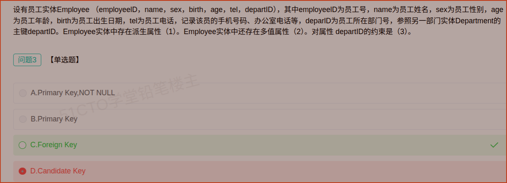

# 备考笔记：数据库-外键约束判定

## 一、题目

> 设有员工实体 Employee（employeeID, name, sex, birth, age, tel, deptID），其中 employeeID 为员工号，name 为员工姓名，sex 为员工性别，age 为员工年龄，birth 为员工出生日期，tel 为员工电话，记录该员工的手机号码、办公室电话等，deptID 为员工所在部门号，**参照另一部门实体 Department 的主键 deptID**。Employee 实体中存在派生属性（1）。Employee 实体中还存在多值属性（2）。对属性 deptID 的约束是（3）。
>
> 【问题3 · 单选题】对属性 deptID 的约束是（  ）。
>
> A. Primary Key, NOT NULL
> B. Primary Key
> C. Foreign Key
> D. Candidate Key

**答案：C. Foreign Key**

解析：题干已明确 deptID「**参照另一部门实体 Department 的主键 deptID**」，凡"参照/引用其他关系主键"的属性（组）就是**外键**，体现参照完整性。deptID 在 Employee 中不唯一（多个员工可属同一部门），故不可能是主键（Primary Key）或候选键（Candidate Key）。

## 二、知识点：数据库-外键约束判定

### 1. 核心原理

关系模型有三类完整性约束，键的角色由此划分：

- **候选键（Candidate Key）**：能**唯一标识**元组的**最小**属性组。一个关系可有多个候选键。
- **主键（Primary Key）**：从候选键中选定一个作为元组唯一标识，**唯一且非空**，一个关系最多一个。
- **外键（Foreign Key）**：本关系中**参照另一关系主键**的属性（组），用于表达实体间联系，体现**参照完整性**。
- **派生属性**：可由其他属性推算得到，如 age 由 birth 推算。
- **多值属性**：同一实体在该属性上有多个取值，如 tel 含手机号码、办公室电话。

判定口诀：**能唯一标识自己 → 候选键/主键；指向别人的主键 → 外键**。

### 2. 关键公式/规则

| 约束 | 含义 | 唯一性 | 空值 | 每关系数量 |
| --- | --- | --- | --- | --- |
| Candidate Key（候选键） | 能唯一标识元组的最小属性组 | 唯一 | 非空 | 可多个 |
| Primary Key（主键） | 选定的候选键 | 唯一 | 非空 | 至多一个 |
| Foreign Key（外键） | 参照另一关系的主键 | 不要求唯一 | 允许（依语义） | 可多个 |
| NOT NULL | 非空约束 | 与键无关 | 非空 | — |

### 3. 解题步骤

1. **抓关键词**：题干出现"参照 / 引用 / 对应另一实体的主键"→ 直接锁定**外键**。
2. **验证唯一性**：判断该属性能否唯一标识元组。deptID 只是部门号，多个员工同属一个部门 → 不唯一 → 排除主键与候选键。
3. **检查空值与个数**：外键允许取空（如新员工尚未分配部门），且可有多个，无需 NOT NULL。
4. **定答案**：deptID 参照 Department 主键 → **Foreign Key**，选 **C**。

## 三、易错点

1. **"部门号"听起来像主键，其实不是**：判断标准是"能否唯一标识本关系的元组"，而不是名字像不像编号。deptID 在 Employee 内重复出现，故只作外键。
2. **外键不一定非空**：选项 A 加了 NOT NULL 属多余且错误；外键是否允许空取决于业务语义。
3. **候选键 ≠ 外键**：候选键必须"唯一标识本关系"，外键没有唯一性要求，二者集合通常不相交。
4. **外键参照的必须是主键**：参照对象是另一关系的**主键**（或候选键），不是任意属性。
5. **主键与外键可同时存在但角色不同**：若某属性既是本表主键又是外键（如 1:1 联系），需依题干语义判断，不可想当然。

## 四、扩展延伸

同题的另两空（关联考点）：

- **（1）派生属性 = age**：年龄可由出生日期 birth 推算得到，属派生属性（也可答 birth 派生出 age）。
- **（2）多值属性 = tel**：题干说明 tel "记录该员工的手机号码、办公室电话等"，同一属性多个取值，属多值属性。

其它要点：

- **参照完整性**：外键的取值必须是被参照关系中已存在的主键值，或为空（当允许空时），否则违反参照完整性。
- **ER 图转关系模式**：1:N 联系通常把"1"端的主键放入"N"端作外键，本题员工与部门正是典型的 N:1，deptID 便落在 Employee 中。
- **现实类比**：employeeID 像"个人身份证号"（唯一标识自己→主键）；deptID 像"所属班级编号"（很多人共用一个→外键）。
- **考点归属**：数据库-关系模型与完整性约束，选择题常以"判断某属性的约束/键的角色"形式出现。

## 五、错题归档

| 题号 | 题型 | 考点 | 难度 | 掌握度 |
| --- | --- | --- | --- | --- |
| 系统分析师-数据库系统 | 单选（问题3） | 数据库-关系模型 外键/主键/候选键判定 | 易 | 待复习 |

## 六、相关图片

原题截图：`../images/08-数据库-外键约束判定.png`（由用户上传的原题截图复制改名而来）

