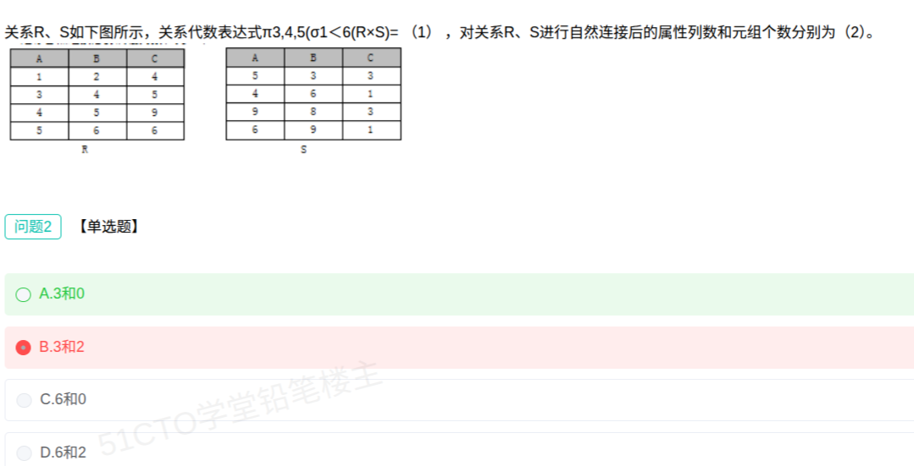

# 备考笔记：数据库-自然连接属性列数与元组数

## 一、题目

> 关系 R、S 如下图所示，关系代数表达式 π3,4,5(σ1<6(R×S)) = （1），对关系 R、S 进行自然连接后的属性列数和元组个数分别为（2）。
>
> | R.A | R.B | R.C |
> | --- | --- | --- |
> | 1 | 2 | 4 |
> | 3 | 4 | 5 |
> | 4 | 5 | 9 |
> | 5 | 6 | 6 |
>
> | S.A | S.B | S.C |
> | --- | --- | --- |
> | 5 | 3 | 3 |
> | 4 | 6 | 1 |
> | 9 | 8 | 3 |
> | 6 | 9 | 1 |
>
> 【问题2 · 单选题】对关系 R、S 进行自然连接后的属性列数和元组个数分别为（  ）。
>
> A. 3 和 0
> B. 3 和 2
> C. 6 和 0
> D. 6 和 2

**答案：A. 3 和 0**

解析：R 与 S 的属性集**完全相同**，都是 (A, B, C)，自然连接会把**同名属性合并**，故属性列数仍为 **3**；而逐行比对可见两关系**没有任何一组 (A,B,C) 取值相同**，公共元组为 0，故元组个数为 **0**。

## 二、知识点：数据库-自然连接属性列数与元组数

### 1. 核心原理

- **自然连接（⋈）**：在**同名属性**上做等值比较，并且**去掉重复的同名属性**（只保留一份）。
  - **列数** = 左关系列数 + 右关系列数 − **同名属性个数**。
  - **元组数** = 两关系在**所有同名属性上取值完全相等**的元组配对个数（无配对即为 0）。
- **笛卡尔积（×）**：不做任何条件筛选的"全配对"，列数为两关系列数之和，元组数为两关系元组数之积。
- **选择（σ）**：按条件筛选**行**，列数不变。
- **投影（π）**：按序号挑选**列**，行数可能因去重而减少。

本题 R、S 三列全同名（A、B、C），即**所有属性都是公共属性**。

### 2. 关键公式/规则

| 运算 | 列数变化 | 元组数变化 |
| --- | --- | --- |
| 笛卡尔积 R×S | m + n（不改名时） | \|R\| × \|S\| |
| 选择 σ | 不变 | 满足条件的行 |
| 投影 π | 指定的列 | 去重后可能减少 |
| 自然连接 R⋈S | m + n − k（k = 同名属性数） | 同名属性取值全等的配对个数 |
| 本题 | 3 + 3 − 3 = **3** | **0**（无任何全等配对） |

### 3. 解题步骤

1. **找公共属性**：R、S 的属性都是 (A, B, C)，公共属性个数 k = 3。
2. **算列数**：3 + 3 − 3 = **3**（同名属性合并成一份）。据此可先排除 C、D 的"6 列"（6 列是笛卡尔积的结果）。
3. **列配对**：把 R 的 4 行与 S 的 4 行逐一比较 (A, B, C)：
   - R：(1,2,4)、(3,4,5)、(4,5,9)、(5,6,6)
   - S：(5,3,3)、(4,6,1)、(9,8,3)、(6,9,1)
4. **数配对**：R.B 全为 2/4/5/6，S.B 全为 3/6/8/9；逐一比对无一行三元组完全相同 → 公共元组 **0** 个。
5. **定答案**：3 和 0，选 **A**。

## 三、易错点

1. **"三列全同名"要合并，不是相加**：自然连接必须去掉重复同名属性，答案是 3 而不是 6。选 6 的是把自然连接当成了笛卡尔积。
2. **别只看部分属性相等就算匹配**：本题 R 有 (4,5,9)、S 有 (4,6,1)，A 都是 4 但 B、C 不同，**不算匹配**；必须**所有同名属性都相等**。
3. **自然连接 ≠ 等值连接**：等值连接保留两份同名属性（结果 6 列），自然连接合并（结果 3 列），这是最常设的陷阱。
4. **元组数不一定是 2**：误以为"左右各 4 行总能配上 2 组"是想当然，本题恰好为 0，要老实逐行比对。
5. **σ 的条件里数字是"列序号"**：σ1<6 表示"第 1 列 < 第 6 列"，不是数值比较 1 < 6。

## 四、扩展延伸

同题第（1）空（关联考点，一并掌握）：

- **R×S 的属性顺序**为 R.A, R.B, R.C, S.A, S.B, S.C，共 6 列，列序号 1~6。
- **σ1<6** 即条件 R.A < S.C。逐行筛选：
  - S(5,3,3)：S.C = 3，需 R.A < 3 → 只有 R(1,2,4) 满足；
  - S(4,6,1)：S.C = 1，需 R.A < 1 → 无满足；
  - S(9,8,3)：S.C = 3，需 R.A < 3 → 只有 R(1,2,4) 满足；
  - S(6,9,1)：S.C = 1 → 无满足。
- **π3,4,5** 取第 3、4、5 列，即 (R.C, S.A, S.B)：
  - R(1,2,4) 与 S(5,3,3) → (R.C=4, S.A=5, S.B=3)
  - R(1,2,4) 与 S(9,8,3) → (R.C=4, S.A=9, S.B=8)
- **结果：(4, 5, 3)、(4, 9, 8) 两行**（属性为 C, A, B）。

其它要点：

- **结果元组数为 0 的含义**：自然连接结果为空关系，但**属性列数仍由属性集决定**，不受元组是否存在影响——这正是本题"3 和 0"并存的道理。
- **与 SQL 对应**：自然连接相当于 `SELECT * FROM R NATURAL JOIN S`；等值连接相当于 `... FROM R, S WHERE R.A=S.A ...`。
- **现实类比**：自然连接像"同一张表按共同字段合并去重"，好比把两份名单按"姓名+学号+班级"三项都一致才认作同一个人，只要有一项不同就不合并。

## 五、错题归档

| 题号 | 题型 | 考点 | 难度 | 掌握度 |
| --- | --- | --- | --- | --- |
| 系统分析师-数据库系统（问题2） | 单选 | 数据库-关系代数 自然连接/笛卡尔积的列数与元组数 | 中 | 待复习 |

## 六、相关图片

原题截图：`../images/10-数据库-自然连接属性列数与元组数.png`（由用户上传的原题截图复制改名而来）

