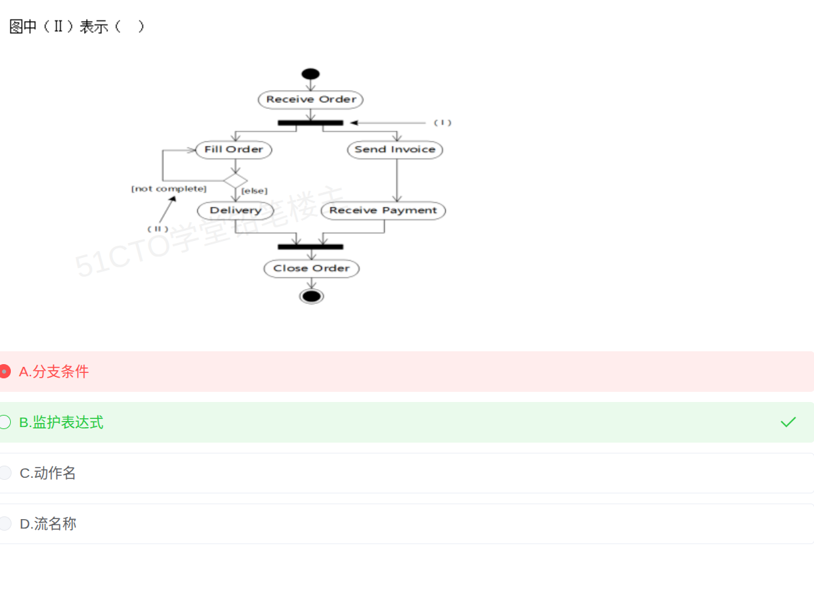

# 备考笔记：UML活动图-监护表达式

## 一、题目
> 图中（Ⅱ）表示（ ）
> A. 分支条件
> B. 监护表达式
> C. 动作名
> D. 流名称

**答案：B. 监护表达式**

解析：该图为 UML 活动图（订单处理流程）。图中（Ⅱ）指向判断节点（菱形）输出到循环回边上的方括号条件 `[not complete]`。在 UML 中，写在控制流（转移）上、用方括号 `[ ]` 括起来的布尔条件称为**监护表达式（guard condition）**，只有条件为真时该控制流才会触发。它既不是流的名称（流名不带方括号），也不是动作节点内部的动作名，故 A「分支条件」为干扰项，正确选 B。

## 二、知识点：UML活动图-监护表达式

### 1. 核心原理
活动图（Activity Diagram）用于描述系统内部的**控制流与对象流**，本质是一种流程建模图。其中的**控制流（转移，transition）**连接两个活动节点，可在流上加注三类标注：

- **流名称**：控制流的名字，直接书写，**不加方括号**；
- **监护表达式**：形如 `[条件]`，用**方括号**括起的布尔表达式，是转移的触发条件——只有求值为真，流才被触发；
- **动作名**：写在活动节点/动作状态**内部**，标识该动作，与流无关。

监护表达式最典型的用法是配合**判断节点（菱形 decision）**做分支与循环：判断节点每条输出流各带一个互斥的监护表达式，运行时择一为真者通过。

### 2. 关键公式/规则
| 名称 | 符号/位置 | 含义 |
| --- | --- | --- |
| 监护表达式 | `[condition]`，写在控制流上 | 转移的守卫条件，为真才触发 |
| 流名称 | 文字，写在控制流旁 | 控制流的名字，无方括号 |
| 动作名 | 写在活动节点内部 | 标识动作/活动本身 |
| 判断节点 | 菱形 ◇ | 分支，各输出流带互斥监护表达式 |
| 合并节点 | 菱形 ◇ | 多流入一出，无监护表达式 |
| 分叉/汇合 | 粗黑横线 | 并发分支（fork）/并发同步（join） |
| 起始/终止节点 | 实心圆 ● / 牛眼 ◉ | 流程起点/终点 |

### 3. 解题步骤
1. 看标号（Ⅱ）箭头**指向什么图元**：指向的是菱形输出的那条带 `[not complete]` 的控制流。
2. 判断该位置上书写的是**带方括号的条件**，还是**节点内部的名字**，还是**流的名字**。
3. 带方括号 → 监护表达式（B）；不带方括号的文字 → 流名称（D）；写在节点内 → 动作名（C）。

## 三、易错点
1. **误选 A「分支条件」**：菱形判断节点输出流上的 `[条件]` 常被口语称作"分支条件"，但 UML 规范术语是**监护表达式（guard condition）**，选项 A 是干扰项。
2. **混淆"流名称"与"监护表达式"**：关键看有没有方括号——`[not complete]` 是被括起的条件，不是流的名字。
3. **错认动作名**：动作名一定写在**节点（圆角矩形）内部**，不在流上；图中 Fill Order、Delivery 等才是动作名。
4. **忽略循环回边**：循环（loop）也由判断节点 + 监护表达式实现，回到前一活动的那条流上的条件同样是监护表达式。

## 四、扩展延伸
- **监护表达式 vs 状态图转移**：状态图的转移也可带 `[条件]`，语义一致，都是"守卫"，只有为真才迁移。
- **求值时机**：监护表达式在**转移被触发时求值**，为假则该转移不发生、流程停在原节点；因此判断节点的多条输出流监护表达式应**互斥且至少一条为真**（必要时用 `[else]` 兜底）。
- **与"事件/动作"三要素**：UML 转移的完整语法为 `触发事件 [监护条件] / 动作`，图中 `[not complete]` 即其中的监护条件部分。
- **现实类比**：监护表达式相当于程序里的 `if` 条件——`if (not complete) goto Fill Order; else goto Delivery;`。

## 五、错题归档
| 题号 | 题型 | 考点 | 难度 | 掌握度 |
| --- | --- | --- | --- | --- |
| 101 | 单选 | UML活动图-监护表达式 | 易 | 待复习 |

（重做本题时在表尾追加 `重做 N` 行，见「步骤 2.5 重做留痕」）

## 六、相关图片
原题截图：`../images/101-UML活动图-监护表达式.png`（由用户上传的原题图复制改名而来）

