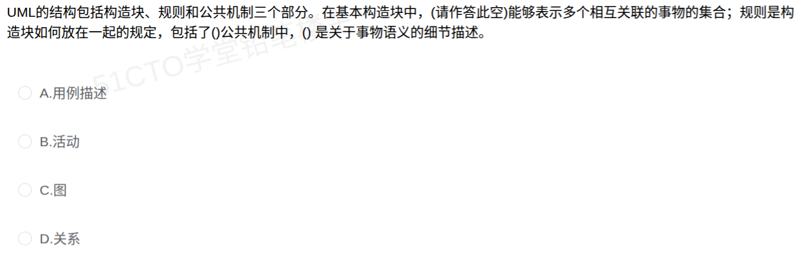

# 备考笔记：UML基本构造块-图与关系辨析

## 一、题目
> UML 的结构包括构造块、规则和公共机制三个部分。在基本构造块中，（请作答此空）能够表示多个相互关联的事物的集合；规则是构造块如何放在一起的规定，包括了（　）；公共机制中，（　）是关于事物语义的细节描述。
> A. 用例描述
> B. 活动
> C. 图
> D. 关系

**答案：C. 图**

解析：UML 的**基本构造块**由**事物（Things）、关系（Relationships）、图（Diagrams）**三类组成。**事物**是模型中最基本的成分，**关系**把事物结合在一起，而**图**是"**多个相互关联的事物的集合**"——正是题干的定义，故选 C。A"用例描述"是具体模型内容、B"活动"属于行为事物、D"关系"只是把事物"连起来"，都不是"多个相互关联事物的集合"这一整体概念。

（同题其余两空：规则包括**命名、范围、可见性、完整性、执行**；公共机制中**规格说明**是关于事物语义的细节描述。）

## 二、知识点：UML基本构造块-图与关系辨析

### 1. 核心原理
UML 的**结构**由三大部分组成：**构造块、规则、公共机制**。其中**基本构造块**是 UML 词汇表的"三件套"：

| 基本构造块 | 英文 | 含义 | 一句话判据 |
| --- | --- | --- | --- |
| **事物** | Things | 模型中最基本的成分（结构事物、行为事物、分组事物、注释事物） | "最基本的成分""名词性元素" |
| **关系** | Relationships | 把事物结合在一起（依赖、关联、泛化、实现） | "把事物连在一起""连接关系" |
| **图** | Diagrams | **多个相互关联的事物的集合** | "事物的集合""汇集" |

- **事物**是最基本的，**关系**把事物绑定，**图**则是把一组关联事物"打包"呈现的整体——所以"多个相互关联的事物的集合"描述的是**图**。
- 构成一个 UML 模型的正是**事物 + 关系 + 图**；规则约束它们"如何放在一起"，公共机制是达到特定目标的公共方法。

**规则（Rules）——构造块如何放在一起的规定，共 5 条**：命名、范围、可见性、完整性、执行。

**公共机制中"关于事物语义的细节描述" = 规格说明（Specification）**：每个模型元素背后都附有一份描述其语义的规格说明（文本或更细的图形）。

### 2. 关键公式/规则
| 层级 | 组成 | 记忆锚点 |
| --- | --- | --- |
| UML 结构三部分 | 构造块、规则、公共机制 | "块—则—制" |
| 基本构造块（3 类） | **事物、关系、图** | "事、关、图" |
| 规则（5 条） | 命名、范围、可见性、完整性、执行 | "名范可完执" |
| 公共机制（4 类） | 规格说明、修饰、公共分类、扩展机制 | "规修分扩" |

**判据速查**：

| 题干措辞 | 对应答案 |
| --- | --- |
| "多个相互关联的事物的集合" | **图** |
| "把事物结合在一起" | **关系** |
| "模型中基本的成分" | **事物** |
| "构造块如何放在一起的规定" | **规则**（命名/范围/可见性/完整性/执行） |
| "关于事物语义的细节描述" | **规格说明**（公共机制之一） |

### 3. 解题步骤
1. 定位空所属层级："在**基本构造块**中" → 答案只能是**事物、关系、图**三者之一。
2. 比对定义："多个相互关联的事物的集合" → 事物是"基本成分"、关系是"连接"，只有**图**是"集合"。
3. 排除干扰项：A 用例描述、B 活动都是具体模型元素（不是构造块层级）；D 关系是"连接"而非"集合"。
4. 定答案：选 **C. 图**。

## 三、易错点
1. **误选 D「关系」**：关系只把两个（或多个）事物"连起来"，并非"多个相互关联事物的**集合**"这一整体；集合是**图**。
2. **把"图"当成画法而非构造块**：图本身就是 UML 的三大基本构造块之一，不要以为它只是"呈现形式"。
3. **混淆层级**：基本构造块（事物/关系/图）≠ 规则（5 条）≠ 公共机制（4 类）；题干常把三层混在一句话里设空。
4. **"用例描述""活动"的干扰**：二者是具体事物/模型内容（活动属行为事物、用例描述是具体文档），不属于基本构造块的分类名称。
5. **规则条目记不全**：规则 5 条是**命名、范围、可见性、完整性、执行**，别与公共机制的"规格说明、修饰、公共分类、扩展机制"串台。

## 四、扩展延伸
- **四类事物速记**：结构事物（类、接口、协作、用例、活动类、构件、节点）、行为事物（交互、状态机、活动）、分组事物（包）、注释事物（注释）。事物是"名词"，关系是"动词"，图是"句子/段落"。
- **四种关系**：依赖、关联、泛化、实现（与 [30-面向对象-泛化与聚合关系.md](30-面向对象-泛化与聚合关系.md)、[37-面向对象-类关系耦合强度排序.md](37-面向对象-类关系耦合强度排序.md) 相连）。
- **现实类比**：基本构造块像语言三要素——**事物 = 词**，**关系 = 语法连接**，**图 = 由词和连接组成的句子/篇章**；规则 = 语法规则，公共机制 = 修辞手法。
- **相关笔记**：
  - [99-UML公共机制-扩展机制含约束构造型标记值.md](99-UML公共机制-扩展机制含约束构造型标记值.md)：本笔记第二层"公共机制"的展开；
  - [98-UML关系-包含与扩展的依赖本质.md](98-UML关系-包含与扩展的依赖本质.md)：四种关系中"依赖"的构造型实例。

## 五、错题归档
| 题号 | 题型 | 考点 | 难度 | 掌握度 |
| --- | --- | --- | --- | --- |
| 102 | 单选 | UML基本构造块（事物/关系/图）；规则与公共机制组成 | 易 | 待复习 |

（重做本题时在表尾追加 `重做 N` 行，见「步骤 2.5 重做留痕」）

## 六、相关图片
原题截图：`../images/102-UML基本构造块-图与关系辨析.png`（由用户上传的原题图复制改名而来）

