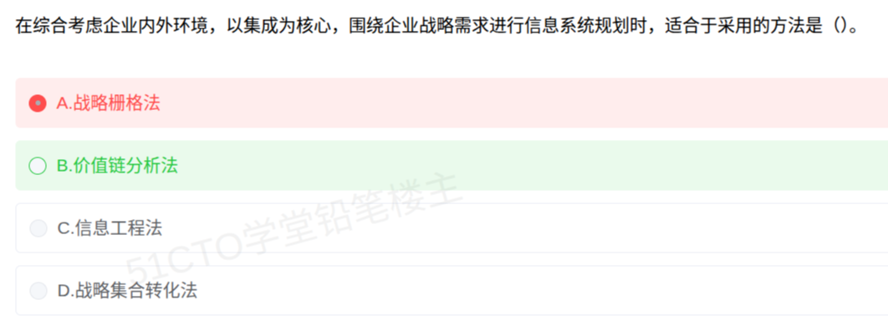

# 备考笔记：信息系统规划方法-价值链分析法

## 一、题目
> 在综合考虑企业内外环境，以集成为核心，围绕企业战略需求进行信息系统规划时，适合于采用的方法是（　）。
> A. 战略栅格法
> B. 价值链分析法
> C. 信息工程法
> D. 战略集合转化法

**答案：B. 价值链分析法**

解析：题干三个关键词——"**综合考虑企业内外环境**""**以集成为核心**""**围绕企业战略需求**"——指向**价值链分析法**。它由波特（Porter）提出，把企业活动分解为**基本活动**与**支持活动**，并沿**上游供应商—企业内部—下游客户**的价值链把内外环节**集成**起来分析，据此确定信息系统投资的关键环节，以获取竞争优势，故选 B。A 战略栅格法只按"信息系统对企业的战略影响"作**四象限定位**；C 信息工程法强调**以数据为中心**；D 战略集合转化法是把**组织战略集转化为信息系统战略集**，均不契合"以集成为核心、综合内外环境"的表述。

## 二、知识点：信息系统规划方法-价值链分析法

### 1. 核心原理
**信息系统战略规划（ISSP）**的常用方法有四种，各有侧重，考试常以"特征描述 + 反选"方式命题：

| 方法 | 提出者/核心 | 关键特征 | 一句话识别词 |
| --- | --- | --- | --- |
| **战略集合转化法（SST）** | King | 把**组织战略集**（使命、目标、战略）转化为**信息系统战略集**（系统目标、系统约束、系统设计战略） | "战略→MIS 战略的转化" |
| **战略栅格法（Strategic Grid）** | McFarlan | 按"**现有**信息系统对企业的战略影响"和"**拟开发**信息系统的战略影响"两个维度，把企业分为**四象限**：战略型、工厂型、支持型、转向型 | "四象限、定位信息系统战略地位" |
| **价值链分析法（Value Chain）** | **Porter** | 把企业活动分为**基本活动 + 支持活动**，沿价值链**综合企业内部与上下游外部环境**，**以集成**为企业找出信息系统投资的关键环节 | "**内外环境 + 集成为核心 + 战略需求**" |
| **信息工程法（Information Engineering）** | James Martin | **以数据为中心**，自顶向下规划、自底向上实施，建立企业模型与主题数据库 | "以数据为中心" |

**价值链分析法的展开**：

- 两类活动：
  - **基本活动**：内部后勤（进料物流）、生产作业、外部后勤（发货物流）、市场营销与销售、服务；
  - **支持活动**：企业基础设施、人力资源管理、技术开发、采购。
- 分析从**企业内部各环节**延伸到**上下游（供应商、渠道、客户）**，找出**能带来差异化/低成本优势的关键环节**，信息系统即投向这些环节。
- 因此它天然强调"**综合企业内外环境**""**以集成为核心**"，并与企业**战略需求**对齐。

### 2. 关键公式/规则
| 识别关键词 | 对应方法 |
| --- | --- |
| 综合考虑企业内外环境、以集成为核心、围绕战略需求 | **价值链分析法** |
| 两个维度、四象限（战略型/工厂型/支持型/转向型） | **战略栅格法** |
| 组织战略集 → 信息系统战略集 | **战略集合转化法（SST）** |
| 以数据为中心、主题数据库、自顶向下规划 | **信息工程法** |
| 企业过程/业务流程为核心、自顶向下识别过程 | 企业系统规划法（BSP，本题未出现） |

口诀：**"转化看 SST，象限看栅格，内外集成看价值链，数据中心看信息工程。"**

### 3. 解题步骤
1. **抓关键词**：题干出现"综合企业内外环境""以集成为核心""围绕企业战略需求"。
2. **逐项对特征**：
   - A 战略栅格法 → 讲"四象限定位"，无关集成内外；
   - B 价值链分析法 → 讲"内外部价值链 + 集成 + 战略优势"，**契合**；
   - C 信息工程法 → 讲"以数据为中心"，不符；
   - D 战略集合转化法 → 讲"战略集转化"，不符。
3. **定答案**：选 **B. 价值链分析法**。

## 三、易错点
1. **本题误选 A「战略栅格法」**：栅格法的核心是拿**两个"战略影响"维度做四象限分类**（战略型/工厂型/支持型/转向型），用来判断信息系统的战略地位；它**不**描述"综合内外环境、以集成为核心"，故 A 错。
2. **混淆"价值链分析法"与"战略集合转化法"**：前者分析**活动链**（Porter，找关键环节）；后者做**战略集→系统战略集**的**转化**（King）。看到"转化"选 SST，看到"价值活动/内外集成"选价值链。
3. **把"信息工程法"当成万能规划法**：信息工程法的标签是"**以数据为中心**"（自顶向下规划、主题数据库），常出现在"数据/信息"字眼旁，而不是"集成内外环境"。
4. **只看"围绕企业战略需求"就选 SST**：四个方法都与企业战略相关，须用**更独特的关键词**（内外环境、集成、四象限、以数据为中心）区分。
5. **记混四象限名称**：战略栅格法四类为**战略型、工厂型、支持型、转向型**，别与别的分类混淆。

## 四、扩展延伸
- **四种方法速记**：SST=**转化**；栅格=**象限**；价值链=**内外集成、Porter**；信息工程=**数据中心、Martin**。
- **与其他规划方法衔接**：企业系统规划法（BSP）以**企业过程**为核心、自底向上识别数据类；关键成功因素法（CSF）从**关键成功因素**反推信息需求；这些常与本题四法一起出现在"信息系统规划方法"考点群中。
- **现实类比**：价值链分析法像"给企业做一次全身血管造影"——从进货、生产、发货到售后（基本活动），再到人力、技术、采购（支持活动），找出哪一段血管最容易"堵"，信息系统就投向那一段，同时要看上下游供应商与客户的接口是否通畅（内外集成）。
- **相关笔记**：
  - [44-信息工程方法论-以数据为中心.md](44-信息工程方法论-以数据为中心.md)：本笔记中"信息工程法"的展开；
  - [45-信息工程四阶段-信息规划.md](45-信息工程四阶段-信息规划.md)：信息工程法在规划阶段的具体步骤；
  - [49-信息资源规划IRP-两条主线与业务模型三层结构.md](49-信息资源规划IRP-两条主线与业务模型三层结构.md)：同属信息化规划方法谱系；
  - [92-系统规划-可行性分析与投资决策计算.md](92-系统规划-可行性分析与投资决策计算.md)：系统规划章节的计算类考点。

## 五、错题归档
| 题号 | 题型 | 考点 | 难度 | 掌握度 |
| --- | --- | --- | --- | --- |
| 103 | 单选 | 信息系统战略规划方法辨析（价值链分析法） | 易 | 待复习 |

（重做本题时在表尾追加 `重做 N` 行，见「步骤 2.5 重做留痕」）

## 六、相关图片
原题截图：`../images/103-信息系统规划方法-价值链分析法.png`（由用户上传的原题图复制改名而来）

