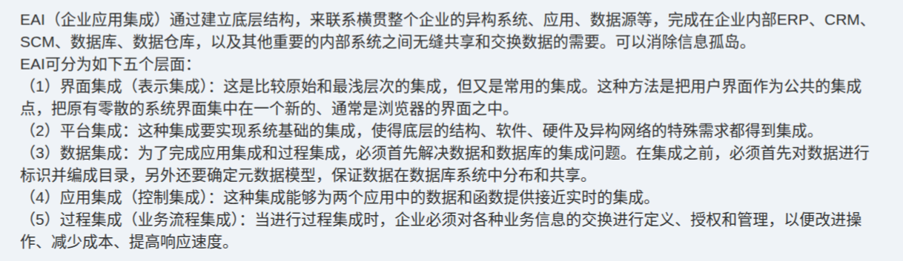

# 备考笔记：EAI企业应用集成-五个集成层面

## 一、题目
> （本题为教材知识点原文整理，无选择项）
>
> EAI（企业应用集成）通过建立底层结构，来联系横贯整个企业的异构系统、应用、数据源等，完成在企业内部 ERP、CRM、SCM、数据库、数据仓库，以及其他重要的内部系统之间无缝共享和交换数据的需要。可以消除信息孤岛。
> EAI 可分为如下五个层面：
> （1）界面集成（表示集成）：这是比较原始和最浅层次的集成，但又是常用的集成。这种方法是把用户界面作为公共的集成点，把原有零散的系统界面集中在一个新的、通常是浏览器的界面之中。
> （2）平台集成：这种集成要实现系统基础的集成，使得底层的结构、软件、硬件及异构网络的特殊需求都得到集成。
> （3）数据集成：为了完成应用集成和过程集成，必须首先解决数据和数据库的集成问题。在集成之前，必须首先对数据进行标识并编成目录，另外还要确定元数据模型，保证数据在数据库系统中分布和共享。
> （4）应用集成（控制集成）：这种集成能够为两个应用中的数据或函数提供接近实时的集成。
> （5）过程集成（业务流程集成）：当进行过程集成时，企业必须对各种业务信息的交换进行定义、授权和管理，以便改进操作、减少成本、提高响应速度。

**答案（五个层面）：界面集成（表示集成）、平台集成、数据集成、应用集成（控制集成）、过程集成（业务流程集成）**

解析（记忆主线）：EAI 的目标是**消除信息孤岛**，让企业内部 ERP、CRM、SCM、数据库、数据仓库等异构系统**无缝共享与交换数据**。其集成由浅入深分为五层：**界面 → 平台 → 数据 → 应用（控制）→ 过程（业务流程）**。题中"**最原始、最浅层次但最常用**"是**界面集成**的标签；"**接近实时的数据或函数集成**"是**应用集成（控制集成）**的标签；"**定义、授权和管理业务信息交换，改进操作、减少成本、提高响应速度**"是**过程集成**的标签。

## 二、知识点：EAI企业应用集成-五个集成层面

### 1. 核心原理
**EAI（Enterprise Application Integration，企业应用集成）**：通过建立**底层结构（集成基础设施）**，联系横贯整个企业的**异构系统、应用、数据源**，完成 ERP、CRM、SCM、数据库、数据仓库等内部系统之间的**无缝共享与交换数据**，从而**消除信息孤岛**。

**五个集成层面（由浅到深）**：

| 层面 | 别称 | 集成对象/位置 | 关键特征（识别标签） |
| --- | --- | --- | --- |
| **① 界面集成** | 表示集成 | **用户界面** | **最原始、最浅层次**，但**最常用**；把零散系统界面集中到一个新界面（通常是**浏览器**）中，构造**公共集成点** |
| **② 平台集成** | — | 底层**结构、软件、硬件、异构网络** | 实现**系统基础的集成**，把底层结构与异构网络的特殊需求统一 |
| **③ 数据集成** | — | **数据与数据库** | 应用集成与过程集成的前提；需先对数据**标识并编成目录**、确定**元数据模型**，保证数据**分布和共享** |
| **④ 应用集成** | **控制集成** | 两个应用之间的**数据或函数** | 提供**接近实时**的集成（调用对方数据/函数） |
| **⑤ 过程集成** | **业务流程集成** | **业务信息交换与业务流程** | 对业务信息交换进行**定义、授权和管理**，以**改进操作、减少成本、提高响应速度**（层次最高） |

**层次理解**：
- **界面集成**动的是"门面"——不改后台，只把多个系统的界面"拼"到一个统一门户/浏览器里，所以**最浅、最省事、也最常用**。
- **平台集成**动的是"地基"——统一底层结构、软硬件与异构网络。
- **数据集成**动的是"血液"——统一数据的标识、目录与元数据模型，是上层集成的**前提**。
- **应用集成（控制集成）**动的是"功能"——让一个应用能**近实时**地调用另一个应用的数据或函数。
- **过程集成（业务流程集成）**动的是"流程"——跨系统编排业务流程，**层次最高、价值最大**。

### 2. 关键公式/规则
**标签速查（看到表述答层面）**：

| 题干/原文表述 | 对应层面 |
| --- | --- |
| 最原始、最浅层次、最常用；把界面集中到浏览器 | **界面集成（表示集成）** |
| 底层的结构、软件、硬件、异构网络的集成 | **平台集成** |
| 先解决数据与数据库集成；标识并编成目录、元数据模型 | **数据集成** |
| 为两个应用的数据或函数提供**接近实时**的集成 | **应用集成（控制集成）** |
| 定义、授权、管理业务信息交换；改进操作、减少成本、提高响应速度 | **过程集成（业务流程集成）** |
| **消除信息孤岛**、联系跨企业异构系统/应用/数据源 | EAI 总目标 |

**口诀**：**"界面最浅最常用，平台治底，数据打底，应用近实时，过程最高管流程。"**

**别称配对**：界面集成 = 表示集成；应用集成 = 控制集成；过程集成 = 业务流程集成。

### 3. 解题步骤
1. **先认整体**：题干出现"EAI / 企业应用集成 / 消除信息孤岛 / 联系异构系统与数据源"，定位到 EAI 五层集成。
2. **按标签对号**：抓住每层的独有表述——"界面最浅"→界面集成；"底层软硬件/网络"→平台集成；"数据标识、元数据"→数据集成；"近实时数据或函数"→应用集成；"业务流程定义授权管理"→过程集成。
3. **清别名**：表示集成=界面集成，控制集成=应用集成，业务流程集成=过程集成；命题常以"别名"设陷阱。
4. **定层次序**：由浅到深为 **界面 → 平台 → 数据 → 应用 → 过程**。

## 三、易错点
1. **把"应用集成=控制集成"当成两个独立层面**：二者是**同一层面的两个名字**，不要数成六层。
2. **界面集成被轻视**：它是**最浅层次**，却是**最常用**的集成——"浅"≠"不重要/不常用"，命题常用"最常用的集成是（　）"来考它。
3. **数据集成与应用集成混淆**：数据集成解决的是**数据/数据库**层面的统一（标识、目录、元数据模型）；应用集成（控制集成）解决的是**应用之间数据或函数**的**近实时**调用。
4. **过程集成层次记反**：过程集成（业务流程集成）是**层次最高**的集成，绝非最浅；它落在"业务流程的编排与业务信息交换管理"上。
5. **漏掉"平台集成"**：五层中最易被忽略的一层，其特征是**底层结构、软件、硬件、异构网络**的集成（"系统基础的集成"）。
6. **与总线/EAI 架构选型混淆**：本笔记讲"集成的**五个层面**"；[75-异构系统集成-总线架构选型.md](75-异构系统集成-总线架构选型.md)讲"异构系统集成选**哪种架构**（总线）"——考法不同，勿串。

## 四、扩展延伸
- **与外延概念衔接**：EAI 的五层与 SOA/ESB 的关系——总线（ESB）主要承载**应用集成（控制集成）**与**过程集成**的消息中介（见 [80-SOA-ESB总线分层与职责.md](80-SOA-ESB总线分层与职责.md)）。
- **现实类比**：把企业五个系统想成五个国家的使节——**界面集成**=给他们建一个统一的接待大厅（同一门户）；**平台集成**=统一修路、统一供电（底层设施）；**数据集成**=统一语言词典与户口登记（数据标识与元数据）；**应用集成**=允许互相直接打电话办事（近实时调用）；**过程集成**=把跨国业务流程整体重排（定义、授权、管理业务交换）。
- **相关笔记**：
  - [75-异构系统集成-总线架构选型.md](75-异构系统集成-总线架构选型.md)：EAI 的**架构选型**考法（总线 vs 共享库/RPC/事件驱动），其"扩展延伸"已列出集成层次，本篇是其**层次明细**的展开；
  - [76-工作流参考模型-六大基本模块辨析.md](76-工作流参考模型-六大基本模块辨析.md)：同属"六、企业信息化与战略"，过程集成常借工作流引擎实现；
  - [49-信息资源规划IRP-两条主线与业务模型三层结构.md](49-信息资源规划IRP-两条主线与业务模型三层结构.md)：数据集成/元数据模型的上游规划方法。

## 五、错题归档
| 题号 | 题型 | 考点 | 难度 | 掌握度 |
| --- | --- | --- | --- | --- |
| 105 | 知识点整理 | EAI 企业应用集成的**五个层面**及其别名与识别标签 | 中 | 待复习 |

（重做本题时在表尾追加 `重做 N` 行，见「步骤 2.5 重做留痕」）

## 六、相关图片
原题截图：`../images/105-EAI企业应用集成-五个集成层面.png`（由用户上传的原题图复制改名而来）

