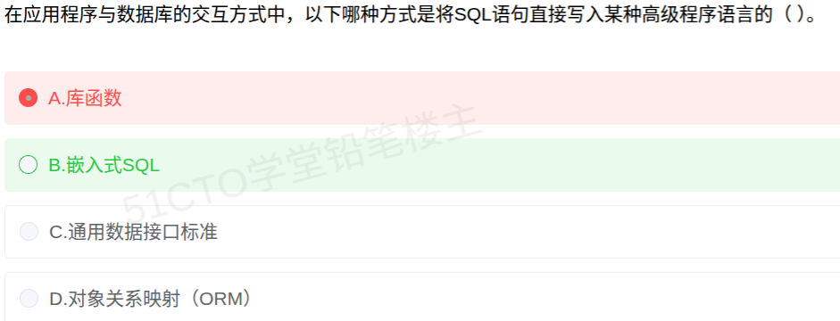

# 备考笔记：应用程序与数据库交互方式-嵌入式SQL

## 一、题目
> 在应用程序与数据库的交互方式中，以下哪种方式是将 SQL 语句直接写入某种高级程序语言的（　）。
> A. 库函数
> B. 嵌入式SQL
> C. 通用数据接口标准
> D. 对象关系映射（ORM）

**答案：B. 嵌入式SQL**

解析：题干说的是把 **SQL 语句直接写进高级程序语言**——这正是**嵌入式 SQL（Embedded SQL）** 的定义：将 SQL 语句**嵌入宿主语言**（如 C、COBOL、Java）的程序中混合编写，由**预编译器**处理 SQL，并通过**主变量**在 SQL 与宿主语言之间传递数据，故 B 对。A 库函数方式虽也用 SQL，但 SQL 是作为**函数调用的参数**传入，不是"直接写入高级语言语句"；C 通用数据接口标准（ODBC/JDBC 等）是**屏蔽数据库差异的接口规范**；D ORM 是用**对象操作**替代直接写 SQL、由框架生成 SQL，方向相反。

## 二、知识点：应用程序与数据库交互方式-嵌入式SQL

### 1. 核心原理
应用程序访问数据库主要有**四种交互方式**，软考常以"**定义描述 → 选方式**"命题：

| 交互方式 | 做法 | 关键特征（识别标签） | 典型代表 |
| --- | --- | --- | --- |
| **嵌入式SQL** | 把 **SQL 语句直接写入高级程序语言（宿主语言）** 的程序中，混合编写 | **SQL 与宿主语言混写**；需**预编译**；用**主变量**传参；语句前有前缀（如 `EXEC SQL`） | 在 C / COBOL 中嵌入 SQL |
| **库函数（API）方式** | 高级语言**调用数据库厂商提供的函数库**访问数据库 | SQL 作为**函数参数**（字符串）传入；由数据库厂商提供 | Oracle OCI、DB2 CLI |
| **通用数据接口标准** | 通过**标准接口**访问不同数据库 | **屏蔽数据库差异**、**一次编码多库可移植** | **ODBC、JDBC、OLEDB** |
| **对象关系映射（ORM）** | 用**对象**操作数据库，框架**自动生成并执行 SQL** | **不直接写 SQL**，由框架完成对象↔关系表映射 | Hibernate、MyBatis |

**嵌入式 SQL 的要点**：

- **宿主语言（Host Language）**：SQL 所嵌入的高级语言，如 C、C++、COBOL、Java。
- **预编译（预处理）**：含 SQL 的程序先经**预编译器**把 SQL 转换为对数据库的调用，再交给宿主语言编译器编译。
- **主变量（Host Variable）**：宿主语言程序中的变量，供 SQL 语句读取/写入，实现 SQL 与宿主语言的数据交换。
- **语句前缀**：嵌入式 SQL 语句前需加标识前缀（传统为 `EXEC SQL`）以便预编译器识别。

**核心区分**：只有**嵌入式 SQL** 是"**SQL 语句直接写进高级语言程序里**"；其余方式要么把 SQL 当**函数参数**传（库函数），要么干脆**不写 SQL**（ODBC/JDBC 是接口标准，ORM 由框架生成 SQL）。

### 2. 关键公式/规则
| 题干关键词 | 对应方式 |
| --- | --- |
| **SQL 语句直接写入高级程序语言** / 嵌入宿主语言 / 预编译 / 主变量 | **嵌入式SQL** |
| 调用数据库厂商提供的**函数库**、SQL 作参数 | **库函数** |
| **屏蔽数据库差异**、可移植、一次编码多库访问 | **通用数据接口标准**（ODBC/JDBC） |
| 用**对象**操作、**自动生成 SQL**、不写 SQL | **对象关系映射（ORM）** |

口诀：**"SQL 写进高级语言＝嵌入式SQL；SQL 当函数参数＝库函数；统一接口屏蔽差异＝ODBC/JDBC；不写 SQL 只管对象＝ORM。"**

### 3. 解题步骤
1. 圈关键词："**将 SQL 语句直接写入某种高级程序语言**" → 强调 SQL 与高级语言**混写**。
2. 逐项对特征：
   - A 库函数 → SQL 是**函数参数**，非"直接写入"，排除；
   - B 嵌入式SQL → **SQL 嵌入宿主语言、预编译、主变量**，**契合**；
   - C 通用数据接口标准 → 讲的是**接口规范/可移植**，不符；
   - D ORM → **不写 SQL**、以对象操作，方向相反。
3. 定答案：选 **B. 嵌入式SQL**。

## 三、易错点
1. **本题误选 A「库函数」**：库函数方式中 SQL 是**作为函数调用的字符串参数**出现（如 `execSQL("select ...")`），是"通过函数访问数据库"；只有**嵌入式SQL** 是把 SQL **语句本身混写在宿主语言程序里**，还须预编译。二者易混，关键词是"**直接写入**"与"**预编译/主变量**"。
2. **把 ORM 也当成"写 SQL"**：ORM 恰恰是**不写 SQL**、用对象操作——题干若说"以对象方式访问数据库"才选 ORM。
3. **混淆 ODBC / JDBC 与"嵌入式SQL"**：ODBC/JDBC 属**通用数据接口标准**，价值在"跨数据库可移植"，不强调把 SQL 嵌进语言。
4. **漏记"预编译/主变量"这两大嵌入式 SQL 标志**：它们是区分嵌入式 SQL 与库函数方式的最硬判据。
5. **以为"嵌入式"指嵌入硬件/系统**：这里的"嵌入式"指 SQL **嵌入宿主语言程序**，与嵌入式系统无关。

## 四、扩展延伸
- **两种"应用访问数据库"思路**：**SQL 主动嵌入应用**（嵌入式 SQL，SQL 与程序混写）vs **应用调用接口访问**（库函数/ODBC/JDBC/ORM，SQL 或对象经接口传递）。题干问"SQL 直接写入高级语言"属前者。
- **演进脉络**：嵌入式SQL（混写、预编译）→ 库函数/API（函数调用）→ 通用接口标准 ODBC/JDBC（跨库可移植）→ ORM（面向对象、免写 SQL），抽象层次递升、开发效率升、SQL 可控性降。
- **现实类比**：**嵌入式SQL** 像"双语混说的演讲稿"（中文稿里直接夹英文句子，需编辑统稿＝预编译）；**库函数**像"打电话下订单"（把要求当参数报给对方）；**ODBC/JDBC** 像"通用转接头"（什么插头都能接）；**ORM** 像"点外卖"（说要什么，后厨怎么做不用你写 SQL）。
- **相关笔记**：
  - [106-数据持久化框架辨析-iBatis与Hibernate.md](106-数据持久化框架辨析-iBatis与Hibernate.md)：本表"ORM"一行的展开（iBatis 半自动 / Hibernate 全自动）；
  - [107-全自动ORM框架-Hibernate与MyBatis.md](107-全自动ORM框架-Hibernate与MyBatis.md)：ORM 的"全自动/半自动"辨析，与本篇同属"应用与数据库交互"知识群。

## 五、错题归档
| 题号 | 题型 | 考点 | 难度 | 掌握度 |
| --- | --- | --- | --- | --- |
| 108 | 单选 | 应用与数据库交互方式辨析（嵌入式SQL vs 库函数/接口标准/ORM） | 易 | 待复习 |

（重做本题时在表尾追加 `重做 N` 行，见「步骤 2.5 重做留痕」）

## 六、相关图片
原题截图：`../images/108-应用程序与数据库交互方式-嵌入式SQL.png`（由用户上传的原题图复制改名而来）

