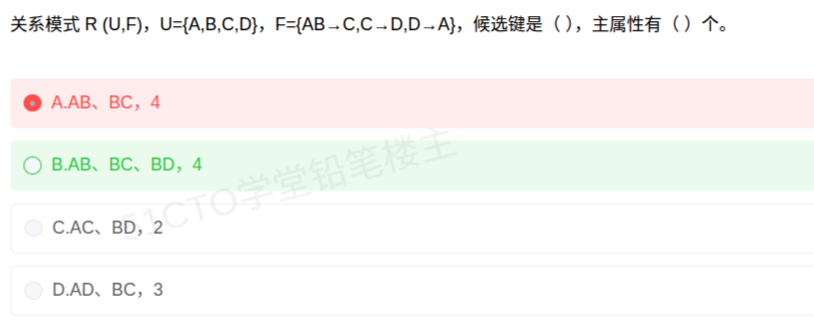

# 备考笔记：数据库-候选键与主属性判定

## 一、题目

> 关系模式 R(U,F)，U={A,B,C,D}，F={AB→C, C→D, D→A}，候选键是（  ），主属性有（  ）个。
>
> A. AB、BC，4
> B. AB、BC、BD，4
> C. AC、BD，2
> D. AD、BC，3

**答案：B. AB、BC、BD，4**

解析：B 只出现在函数依赖的左部、从未出现在右部，因此**每个候选键都必须包含 B**。逐个求闭包：AB⁺ = ABCD、BC⁺ = ABCD、BD⁺ = ABCD，三者都能推出全部属性且各自最小，故候选键为 **AB、BC、BD** 共 3 个；而 A、B、C、D 都出现在某个候选键中，故**主属性有 4 个**。

## 二、知识点：数据库-候选键与主属性判定

### 1. 核心原理

- **候选键（Candidate Key）**：能**唯一标识**元组、且**不含多余属性**（极小性）的属性组。其判定标准是闭包 $X^+$ = U 且 X 的任何真子集闭包 ≠ U。
- **主属性（Prime Attribute）**：包含在**任何一个候选键**中的属性。
- **非主属性**：不在任何候选键中的属性。
- **闭包 $X^+$**：由 X 出发，反复应用函数依赖（Armstrong 推理规则）能推出的全部属性集合。

**L-R-N-LR 分类法**（按属性在函数依赖中出现的位置）：

| 类别 | 出现位置 | 对候选键的影响 |
| --- | --- | --- |
| L 类 | 只在左部出现 | **必在**每个候选键中 |
| R 类 | 只在右部出现 | **必不在**候选键中 |
| N 类 | 左右都不出现 | **必在**每个候选键中 |
| LR 类 | 左右都出现 | 可能在内，需逐个验证 |

### 2. 关键公式/规则

| 名称 | 判定式 |
| --- | --- |
| 候选键条件 | $X^+ = U$ 且 X 极小（真子集闭包 ≠ U） |
| 主属性 | $X \in \{$ 所有候选键 $\}$ |
| 主属性个数 | 所有候选键的并集的势 |
| 求闭包 | 从 X 出发不断用 A→B 扩充，直到不再增加 |

本题属性分类：

| 属性 | 出现位置 | 类别 | 结论 |
| --- | --- | --- | --- |
| A | AB→C（左）、D→A（右） | LR | 需验证 |
| B | AB→C（左） | L | **必在键中** |
| C | C→D（左）、AB→C（右） | LR | 需验证 |
| D | D→A（左）、C→D（右） | LR | 需验证 |

### 3. 解题步骤

1. **分类定"必含"属性**：B 只在左部出现（L 类）→ B 必在每个候选键中；无 R 类、无 N 类。
2. **从 B 出发补属性**求闭包：
   - **AB⁺**：A、B → AB→C 得 C → C→D 得 D → 得 **ABCD**，故 AB 是候选键（A 单独 $A^+$ = A，不可省 B）。
   - **BC⁺**：B、C → C→D 得 D → D→A 得 A → 得 **ABCD**，故 BC 是候选键（$C^+$ = CDA，缺 B，不可省 B）。
   - **BD⁺**：B、D → D→A 得 A → AB→C 得 C → 得 **ABCD**，故 BD 是候选键（$D^+$ = DA，不可省 B）。
   - 其余含 B 的组合（ABC、ABD、BCD、ABCD）均含上述键为其真子集，**不满足极小性**，不算候选键。
   - 不含 B 的组合（AC、AD、CD）闭包都推不出 B，全部排除。
3. **确定候选键**：**AB、BC、BD**，共 3 个。
4. **数主属性**：三个键的并集 = {A, B, C, D}，全部 4 个属性都是主属性。
5. **定答案**：AB、BC、BD，**4**，选 **B**。

## 三、易错点

1. **漏掉 BD 最典型**：从 AB 出发只顺着"加 C"找键，就只得到 AB、BC，漏了 BD。必须对**所有含必含属性 B 的最小组合**（BA、BC、BD……）逐一求闭包。
2. **主属性不是"主键里的属性"而是"所有候选键的属性并集"**：本题因 A、C、D 各自出现在某个键中，主属性才有 4 个，别只盯着一个主键。
3. **候选键必须满足极小性**：ABC、ABCD 虽然闭包也是 ABCD，但含真候选键，**不是**候选键，不能计入。
4. **L 类必含不等于 L 类就是键**：B 是必含属性，但 $B^+$ = B 远不能推出 U，必须与其他属性组合。
5. **AC、AD 容易误判**：AC⁺ = {A,C,D}、AD⁺ = {A,D} 都推不出 B，均不是候选键，C、D 选项即此陷阱。

## 四、扩展延伸

- **找全部候选键的套路**：先由 L 类与 N 类定"必含核心"，再把 LR 类属性逐个"尝试加入"，每次加入后求闭包；闭包 = U 且不能再删 → 得到一个候选键；删掉任一核心属性后若闭包 ≠ U，则说明该组合仍需补属性。
- **Armstrong 公理**：自反律、增广律、传递律，是求闭包与推导依赖的理论基础。
- **范式与主属性的关系**（软考常连带考）：
  - 若所有非主属性都完全依赖于候选键 → 满足 2NF；
  - 若没有非主属性传递依赖于候选键 → 满足 3NF；
  - 本题 F 中存在 C→D、D→A 的传递链（AB→C→D→A），说明本题关系模式**不满足 3NF**，可作进一步判断的引子。
- **现实类比**：候选键像"能唯一确定一份档案的最小字段组合"。本题中"姓名缩写"B 是任何组合都离不开的字段，而 A、C、D 之间可互相推出，因此只有 {B+A}、{B+C}、{B+D} 三种最小组合能锁定唯一记录。

## 五、错题归档

| 题号 | 题型 | 考点 | 难度 | 掌握度 |
| --- | --- | --- | --- | --- |
| 系统分析师-数据库系统 | 单选 | 数据库-函数依赖 候选键求解与主属性计数 | 中 | 待复习 |

## 六、相关图片

原题截图：`../images/11-数据库-候选键与主属性判定.png`（由用户上传的原题截图复制改名而来）

