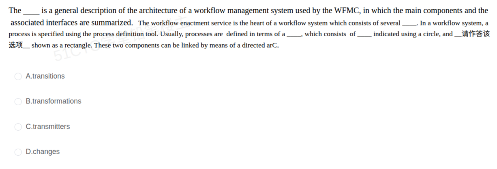

# 备考笔记：工作流参考模型-Petri网过程定义英文辨析

## 一、题目
> The ___ is a general description of the architecture of a workflow management system used by the WFMC, in which the main components and the associated interfaces are summarized. The workflow enactment service is the heart of a workflow system which consists of several ___. In a workflow system, a process is specified using the process definition tool. Usually, processes are defined in terms of a ___, which consists of ___ indicated using a circle, and ___ shown as a rectangle. These two components can be linked by means of a directed arc.
> A. transitions
> B. transformations
> C. transmitters
> D. changes

**答案：A. transitions**（本题所问空为 "and ___ shown as a rectangle"）

## 二、知识点：工作流参考模型-Petri网过程定义英文辨析

### 1. 核心原理
本题为 2008 上半年系统分析师上午英语完形填空（71~75），围绕 **WFMC 工作流参考模型** 与 **过程定义方法（Petri 网）** 展开。全文五空答案：

| 空号 | 答案 | 含义 |
| --- | --- | --- |
| 71 | workflow reference model | 工作流参考模型是 WFMC 对工作流管理系统体系结构的通用描述 |
| 72 | workflow engines | 工作流执行服务是核心，由多个**工作流引擎**构成 |
| 73 | Petri Net | 过程定义工具目前多采用 **Petri 网** |
| 74 | places | 库所，用**圆圈**表示 |
| 75 | transitions | 变迁，用**矩形**表示 |

所问空（75）：Petri 网由**库所（places，圆圈）**与**变迁（transitions，矩形）**两类节点组成，二者用**有向弧（directed arc）**连接 → **transitions**。

**形近词辨析**：`transition`=变迁/转换（Petri 网规范术语）；`transformation`=变换（数学/图形变换）；`transmitter`=发射机/发送器（硬件）；`change`=普通"变化"。

### 2. 关键公式/规则

| Petri 网元素 | 图形表示 | 英文术语 |
| --- | --- | --- |
| 库所 | 圆圈 | places |
| 变迁 | 矩形 | transitions |
| 连接关系 | 有向箭头 | directed arc |

记忆锚：**圆圈=places（库所），矩形=transitions（变迁）**，二者用有向弧相连。

### 3. 解题步骤
1. 定位所问空——紧跟 "indicated using a circle" 的 places 之后，与之配对的是 Petri 网的另一类节点。
2. Petri 网 = **places + transitions**；矩形对应 **transitions**。
3. 排除形近词：transformations（变换）、transmitters（发射器）、changes（变化）。

## 三、易错点
1. **形近词干扰**：transformations / transmitters 与 transitions 拼写接近，但只有 **transition** 是 Petri 网的规范术语（变迁）。
2. **图形与术语错配**：圆圈 = places（库所），矩形 = transitions（变迁），不要记反。
3. **只记模块、忘方法**：本题考的是"过程定义工具采用的方法（Petri 网）及其元素"，仅记住"工作流参考模型"会答不出。

## 四、扩展延伸
- **全空答案串**：71 workflow reference model → 72 workflow engines → 73 Petri Net → 74 places → 75 transitions。
- **Petri 网**：由 Carl Adam Petri 提出，用库所、变迁、有向弧描述并发/异步系统，是工作流过程建模的常用形式化工具。
- **相关既有笔记**：[76-工作流参考模型-六大基本模块辨析.md](76-工作流参考模型-六大基本模块辨析.md)（同主题中文题）。

## 五、错题归档
| 题号 | 题型 | 考点 | 难度 | 掌握度 |
| --- | --- | --- | --- | --- |
| — | 单选（英文完形） | 工作流过程定义：Petri 网 places/transitions 术语与图形对应 | 中 | 待复习 |

（重做本题时在表尾追加 `重做 N` 行，见「步骤 2.5 重做留痕」）

## 六、相关图片
原题截图：`../images/110-工作流参考模型-Petri网过程定义英文辨析.png`（由用户上传的原题图复制改名而来）

