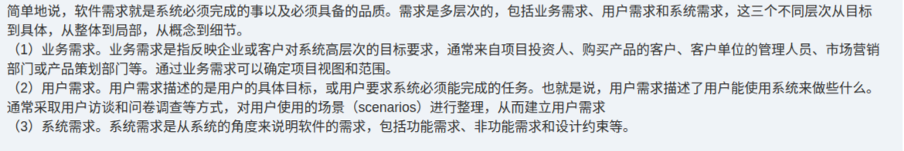

# 备考笔记：软件需求层次-业务用户系统三层辨析

## 一、题目
> 【知识点原文摘录】（本图未含原题题干与选项，为教程"需求的层次"解析原文）
>
> 简单地说，软件需求就是系统必须完成的事以及必须具备的品质。需求是多层次的，包括业务需求、用户需求和系统需求，这三个不同层次从目标到具体，从整体到局部，从概念到细节。
> （1）业务需求。业务需求是指反映企业或客户对系统高层次的目标要求，通常来自项目投资人、购买产品的客户、客户单位的管理人员、市场营销部门或产品策划部门等。通过业务需求可以确定项目视图和范围。
> （2）用户需求。用户需求描述的是用户的具体目标，或用户要求系统必须能完成的任务。也就是说，用户需求描述了用户能使用系统来做些什么。通常采取用户访谈和问卷调查等方式，对用户使用的场景（scenarios）进行整理，从而建立用户需求。
> （3）系统需求。系统需求是从系统的角度来说明软件的需求，包括功能需求、非功能需求和设计约束等。

**答案：本图未附题目与选项，属知识点整理**。核心结论：软件需求分为**业务需求 → 用户需求 → 系统需求**三个层次（从目标到具体、从整体到局部、从概念到细节）。

## 二、知识点：软件需求层次-业务用户系统三层辨析

### 1. 核心原理
软件需求 = 系统**必须完成的事** + **必须具备的品质**。它分三个层次，层层递进：

| 层次 | 是什么 | 主要来源 / 手段 | 作用 |
| --- | --- | --- | --- |
| 业务需求 | 企业/客户对系统**高层次的目标要求** | 项目投资人、购买产品的客户、客户单位管理人员、市场营销部门、产品策划部门 | 确定**项目视图与范围** |
| 用户需求 | **用户的具体目标**，即用户要求系统必须完成的任务 | 用户访谈、问卷调查，对使用**场景（scenarios）**进行整理 | 形成用户原始需求文档 |
| 系统需求 | 从**系统角度**说明软件的需求 | 在业务/用户需求基础上分析推导 | 含**功能需求、非功能需求、设计约束** |

一句话记忆：**业务需求回答"为什么要做"（目标/范围），用户需求回答"用户要做什么"（具体任务/场景），系统需求回答"系统要做成什么样"（功能+非功能+约束）。**

### 2. 关键公式/规则

| 名称 | 内容 |
| --- | --- |
| 三层次顺序 | 业务需求 → 用户需求 → 系统需求 |
| 递进方向 | 从目标到具体、从整体到局部、从概念到细节 |
| 业务需求关键词 | 高层次目标、确定项目**视图与范围** |
| 用户需求关键词 | 用户具体目标、用户能用系统做什么、**场景 scenarios** |
| 系统需求关键词 | 从系统角度、**功能需求 + 非功能需求 + 设计约束** |
| 需求获取方法 | 用户访谈、问卷调查、采样、情节串联板、联合需求计划（JRP） |
| 需求分析建模 | E-R 图 = 数据模型；DFD = 功能模型；STD = 行为模型 |

### 3. 解题步骤
1. 抓"层次"二字：需求层次只认 **业务 / 用户 / 系统** 三层。
2. 按关键词对号入座：出现"高层次目标/范围"→业务需求；出现"用户具体任务/场景"→用户需求；出现"功能/非功能/约束"→系统需求。
3. 若问"哪个不是需求层次"，用排除法：如"数据需求""功能需求"均不是**层次**（功能需求属于系统需求的**内容**）。

## 三、易错点
1. **层次与内容混淆**：功能需求、非功能需求、设计约束是**系统需求的内容**，不是独立的需求层次；"数据需求"也不是层次（常见干扰项）。
2. **业务需求 ≠ 用户需求**：业务需求来自投资人/客户/管理层/市场/产品策划，管**目标与范围**；用户需求靠**访谈、问卷、场景整理**，管**具体任务**。
3. **顺序倒置**：必须先业务→再用户→再系统，方向是"从目标到具体"，不可反着推。
4. **系统需求的三个成分**：功能需求、非功能需求、设计约束，缺一不可；考试常拆开考"某某属于哪一类"。

## 四、扩展延伸
- **需求获取 vs 需求分析**：获取 = 与干系人合作、挖掘真正/潜在需求（访谈、问卷、采样、情节串联板、JRP）；分析 = 把原始要求转成规范的用户需求并建模。
- **需求分析三模型**：E-R 图（数据模型）、数据流图 DFD（功能模型）、状态转换图 STD（行为模型），核心是数据字典。
- **常见变式题**：「（ ）不是软件需求的常用层次」→ 选"数据需求"。
- **相关既有笔记**：[109-软件需求分析-任务描述与产出规格辨析.md](109-软件需求分析-任务描述与产出规格辨析.md)、[88-需求分析方法-三类清单辨析.md](88-需求分析方法-三类清单辨析.md)。

## 五、错题归档
| 题号 | 题型 | 考点 | 难度 | 掌握度 |
| --- | --- | --- | --- | --- |
| — | 单选 | 软件需求的三个层次（业务/用户/系统）及各自来源与内容 | 易 | 待复习 |

（重做本题时在表尾追加 `重做 N` 行，见「步骤 2.5 重做留痕」）

## 六、相关图片
原题截图：`../images/111-软件需求层次-业务用户系统三层辨析.png`（由用户上传的原题图复制改名而来）

