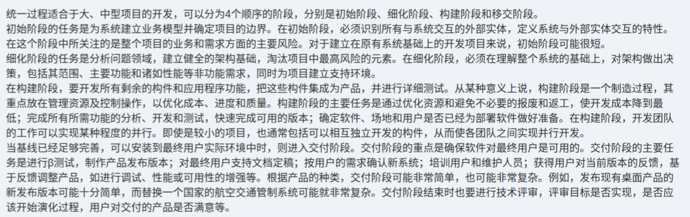

# 备考笔记：统一过程-四阶段任务与关注点辨析

## 一、题目
> 【知识点原文摘录】（本图未含原题题干与选项，为"统一过程（RUP）四阶段"解析原文）
>
> 统一过程适合于大、中型项目的开发，可以分为 4 个顺序的阶段，分别是初始阶段、细化阶段、构建阶段和移交阶段。
> - **初始阶段**的任务是为系统建立业务模型并确定项目的边界。在初始阶段，必须识别所有与系统交互的外部实体，定义系统与外部实体交互的特性。在这个阶段中关注的是整个项目的业务和需求方面的主要风险。对于建立在原有系统基础上的开发项目来说，初始阶段可能很短。
> - **细化阶段**的任务是分析问题领域，建立健全的架构基础，淘汰项目中最高风险的元素。在细化阶段，必须在理解整个系统的基础上，对架构作出决策，包括其范围、主要功能和诸如性能等非功能需求，同时为项目建立支持环境。
> - **构建阶段**，要开发所有剩余的构件和应用程序功能，把这些构件集成为产品，并进行详细测试。从某种意义上说，构建阶段是一个制造过程，其重点放在管理资源及控制操作，以优化成本、进度和质量。构建阶段的主要任务是通过优化资源和避免不必要的报废和返工，使开发成本降到最低；完成所有所需功能的分析、开发和测试，快速完成可用的版本；确定软件、场地和用户是否已经为部署软件做好准备。构建阶段中，开发团队的工作可以实现某种程度的并行。
> - 当基线已经足够完善，可以安装到最终用户实际环境中时，则进入**交付阶段**。交付阶段的重点是确保软件对最终用户是可用的。主要任务是进行测试，制作产品发布版本；对最终用户支持文档定稿；按用户的需求确认新系统；培训用户和维护人员；获得用户对当前版本的反馈，基于反馈调整产品。交付阶段结束时也要进行技术评审，评审目标是否实现、是否应该开始演化过程、用户对交付的产品是否满意等。

**答案：本图未附题目与选项，属知识点整理**。核心结论：统一过程（RUP）四阶段顺序为 **初始 → 细化 → 构建 → 移交（交付）**，各阶段任务与关注点如上方原文。

## 二、知识点：统一过程-四阶段任务与关注点辨析

### 1. 核心原理
统一过程（RUP）适用于**大、中型项目**，按 **4 个顺序阶段**推进，每阶段可含多个迭代。各阶段的**任务（做什么）**与**关注点（风险/重点）**是命题核心：

| 阶段 | 主要任务 | 关注点 / 产出 |
| --- | --- | --- |
| 初始阶段（Inception） | 为系统建立**业务模型**、确定**项目边界**；识别所有与系统交互的**外部实体**并定义交互特性 | 关注整个项目**业务和需求方面的主要风险**；基于原有系统的项目此阶段可能很短 |
| 细化阶段（Elaboration） | 分析问题领域，建立健全的**架构基础**，**淘汰最高风险元素**；对架构作决策（范围、主要功能、性能等非功能需求） | 在**理解整个系统**基础上决策架构，并为项目**建立支持环境** |
| 构建阶段（Construction） | 开发所有剩余**构件与应用功能**，集成为产品并**详细测试** | 本质是**制造过程**：管理资源与控制操作，**优化成本/进度/质量**；避免报废返工、快速形成可用版本、确认部署准备；团队工作可**并行** |
| 移交/交付阶段（Transition） | 测试、制作**产品发布版本**；支持文档定稿；**按用户需求确认新系统**；**培训**用户与维护人员；收集反馈并调整 | 重点是**确保软件对最终用户可用**；复杂度因产品种类而异；结束时做**技术评审**（目标是否实现、是否开始演化、用户是否满意） |

一句话记忆：**初始定边界与风险 → 细化定架构 → 构建造产品 → 移交交用户。**

### 2. 关键公式/规则

| 名称 | 内容 |
| --- | --- |
| 四阶段顺序 | 初始阶段 → 细化阶段 → 构建阶段 → 移交阶段 |
| 别名对应 | 构建 = 构造（Construction）；移交 = 交付（Transition） |
| 初始阶段关键词 | 业务模型、项目边界、外部实体、主要风险 |
| 细化阶段关键词 | 架构基础、淘汰最高风险、架构决策、支持环境 |
| 构建阶段关键词 | 制造过程、资源控制、成本/进度/质量、并行 |
| 移交阶段关键词 | 可用、发布版本、文档定稿、培训、用户确认、技术评审 |
| RUP 三大特点 | 用例驱动、架构为中心、迭代增量 |

### 3. 解题步骤
1. 先背顺序：**初始 → 细化 → 构建 → 移交**（选项乱序时按此排）。
2. 按"关键词归位"：出现"业务模型/项目边界/外部实体"→初始；出现"架构/淘汰最高风险"→细化；出现"制造/资源控制/成本进度质量/集成测试"→构建；出现"培训/文档定稿/用户确认/发布版本"→移交。
3. 特别注意"架构决策"只在**细化**阶段、"制造过程"只在**构建**阶段，二者是最常互换的干扰点。

## 三、易错点
1. **阶段顺序与别名**：四阶段必须按序；"构造≠构建吗"——构建即构造（Construction），"交付"即"移交"（Transition），是同一阶段的不同译名。
2. **初始阶段 ≠ 做架构**：初始阶段只建立**业务模型、确定项目边界、识别外部实体**；**架构决策在细化阶段**，别把两者互换。
3. **淘汰最高风险元素在细化阶段**（不是初始阶段）；初始阶段关注的是**业务与需求方面的主要风险**。
4. **构建阶段的本质是"制造过程"**：重点是资源控制、成本/进度/质量优化、避免报废返工、**并行开发**，而不是"架构设计"。
5. **移交阶段不做主要新功能开发**：重点是把已完成的系统**交到用户手中可用**（培训、文档、确认、反馈、调整）。

## 四、扩展延伸
- **RUP 三大特点**：用例驱动（Use-Case Driven）、架构为中心（Architecture-Centric）、迭代增量（Iterative & Incremental）。
- **与瀑布模型的区别**：RUP 同样有清晰阶段（像瀑布），但阶段内**迭代**、每阶段有明确里程碑评审，风险更可控。
- **四阶段的英文与里程碑**：Inception / Elaboration / Construction / Transition，对应生命周期目标、生命周期架构、初始运作能力、产品发布四个里程碑。
- **相关既有笔记**：[90-软件开发模型-论文写作要点.md](90-软件开发模型-论文写作要点.md)（含 RUP 与瀑布/螺旋/敏捷的选型对比）、[43-开发过程模型选型-高风险项目螺旋模型.md](43-开发过程模型选型-高风险项目螺旋模型.md)。

## 五、错题归档
| 题号 | 题型 | 考点 | 难度 | 掌握度 |
| --- | --- | --- | --- | --- |
| — | 单选 | 统一过程（RUP）四阶段的任务与关注点辨析 | 中 | 待复习 |

（重做本题时在表尾追加 `重做 N` 行，见「步骤 2.5 重做留痕」）

## 六、相关图片
原题截图：`../images/112-统一过程-四阶段任务与关注点辨析.png`（由用户上传的原题图复制改名而来）

