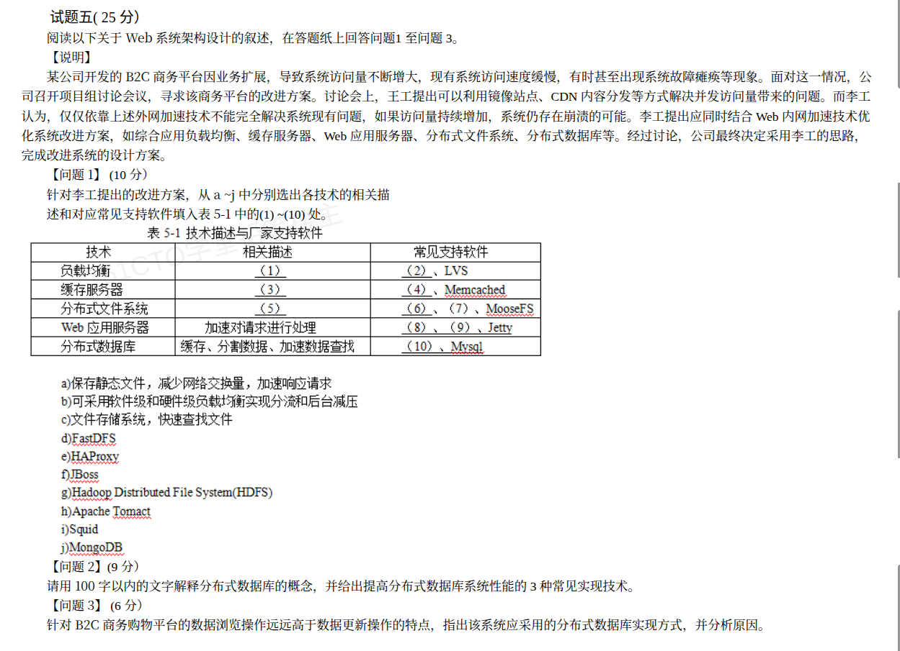

# 备考笔记：Web 系统架构改进——技术选型与分布式数据库

## 一、题目

> **试题五（25 分）**
>
> 阅读以下关于 Web 系统架构设计的叙述，在答题纸上回答问题 1 至问题 3。
>
> **【说明】** 某公司开发的 B2C 商务平台因业务扩展，导致系统访问量不断增大，现有系统访问速度缓慢，有时甚至出现系统故障瘫痪等现象。面对这一情况，公司召开项目组讨论会议，寻求该商务平台的改进方案。讨论会上，王工提出可以利用镜像站点、CDN 内容分发等方式解决并发访问量带来的问题。而李工认为，仅仅依靠上述外网加速技术不能完全解决系统现有问题，如果访问量持续增加，系统仍存在崩溃的可能。李工提出应同时结合 Web 内涵加速技术优化系统改进方案，如综合应用负载均衡、缓存服务器、Web 应用服务器、分布式文件系统、分布式数据库等。经过讨论，公司最终决定采用李工的思路，完成改进系统的设计方案。
>
> **【问题 1】（10 分）** 针对李工提出的改进方案，从 a~j 中分别选出各技术的相关描述和对应常见支持软件填入表 5-1 中的 (1)~(10) 处。
>
> | 技术 | 相关描述 | 常见支持软件 |
> | --- | --- | --- |
> | 负载均衡 | (1) | (2)、LVS |
> | 缓存服务器 | (3) | (4)、Memcached |
> | 分布式文件系统 | (5) | (6)、(7)、MooseFS |
> | Web 应用服务器 | 加速对请求进行处理 | (8)、(9)、Jetty |
> | 分布式数据库 | 缓存、分割数据、加速数据查找 | (10)、Mysql |
>
> a) 保存静态文件，减少网络交换量，加速响应请求
> b) 可采用软件级和硬件级负载均衡实现分流和后台减压
> c) 文件存储系统，快速查找文件
> d) FastDFS　e) HAProxy　f) JBoss　g) Hadoop Distributed File System(HDFS)
> h) Apache Tomcat　i) Squid　j) MongoDB
>
> **【问题 2】（9 分）** 请用 100 字以内的文字解释分布式数据库的概念，并给出提高分布式数据库系统性能的 3 种常见实现技术。
>
> **【问题 3】（6 分）** 针对 B2C 商务购物平台的数据浏览操作远远高于数据更新操作的特点，指出该系统应采用的分布式数据库实现方式，并分析原因。

**答案：**

- **问题 1**：（1）b；（2）e（HAProxy）；（3）a；（4）i（Squid）；（5）c；（6）d（FastDFS）；（7）g（HDFS）；（8）f（JBoss）；（9）h（Apache Tomcat）；（10）j（MongoDB）。
- **问题 2**：**概念**——分布式数据库是分布在计算机网络不同节点上的一组数据的集合，各节点具有**场地自治**能力可执行局部应用，又能通过网络通信协同执行**全局应用**。**3 种性能提升技术**：①数据分片（分割）；②数据复制（副本/冗余）；③分布式查询处理与优化。
- **问题 3**：应采用**数据复制（多副本/主从复制、读写分离）为主、结合数据分片**的实现方式。原因：B2C 平台**读多写少**，设置数据副本后读请求可分散到多个副本节点**并行处理**，提升并发读性能、降低单节点负载，并提高可用性与容错性；而更新操作少，副本同步与一致性维护**开销小**，整体收益大于代价。

## 二、知识点：Web 系统架构改进的技术选型与分布式数据库

### 1. 核心原理

**（1）外网加速 vs 内涵加速**
- **外网加速**（王工思路）：**镜像站点、CDN 内容分发**——把静态内容推到离用户更近的边缘节点，减少骨干网传输压力。
- **内涵加速**（李工思路，本题主线）：在**系统内部**做架构优化，综合应用 **负载均衡、缓存服务器、Web 应用服务器、分布式文件系统、分布式数据库**，从根本上提升系统的并发处理、存储与数据库能力。仅靠外网加速无法解决源站并发瓶颈，故被否决。

**（2）五类组件各自的角色**

| 技术 | 作用定位 | 常见支持软件 |
| --- | --- | --- |
| 负载均衡 | 把请求分流到多台服务器，实现后台减压、消除单点 | **HAProxy**、**LVS**、Nginx、F5 |
| 缓存服务器 | 保存静态文件/热点数据，减少网络交换与后端压力 | **Squid**、**Memcached**、Redis、Varnish |
| 分布式文件系统 | 海量文件的分布式存储与快速查找 | **FastDFS**、**HDFS**、**MooseFS**、Ceph |
| Web 应用服务器 | 运行动态应用、加速对请求的处理 | **JBoss**、**Apache Tomcat**、**Jetty**、WebLogic |
| 分布式数据库 | 缓存、分割（分片）数据、加速数据查找 | **MongoDB**、MySQL、HBase |

**（3）分布式数据库**

分布式数据库 = **数据分布（分片/复制）+ 场地自治 + 全局应用**。数据物理上分布在多节点，逻辑上是一个整体，用户可透明地访问。

### 2. 关键公式/规则

**分布式数据库的两大基础技术与三大性能技术**

| 类别 | 技术 | 说明 |
| --- | --- | --- |
| 数据分布 | **数据分片（分割）** | 把一张表按规则切分到多个节点，减少单节点数据量与查询范围 |
| 数据分布 | **数据复制（副本/冗余）** | 同一数据在多个节点保留副本，提升读并发与可用性 |
| 性能提升 | 数据分片 | 缩小查询数据范围、并行处理 |
| 性能提升 | 数据复制 | 读请求分散到多副本、就近访问、容错 |
| 性能提升 | 分布式查询处理与优化 | 把全局查询分解为局部子查询，并行执行后汇总 |

**分片 vs 复制 的适用判据（问题 3 核心）**

| 场景 | 推荐 | 理由 |
| --- | --- | --- |
| **读多写少** | **数据复制（副本）为主** | 副本分散读压力、同步代价低 |
| 写多或数据量大 | 数据分片为主 | 分摊写入与存储，缩小查询范围 |
| 混合 | 分片 + 复制结合 | 分片解决容量/写，副本解决并发读与可用 |

### 3. 解题步骤

**问题 1（匹配题）**
1. 先配"描述"：负载均衡→**b**（软件级/硬件级分流减压）；缓存服务器→**a**（保存静态文件、减少网络交换）；分布式文件系统→**c**（文件存储系统、快速查找）。题目已给出 Web 应用服务器与分布式数据库的描述，只需配软件。
2. 再配"软件"：按各技术所属领域归类——负载均衡取 **HAProxy**；缓存取 **Squid**；分布式文件系统取 **FastDFS、HDFS**；Web 应用服务器取 **JBoss、Tomcat**；分布式数据库取 **MongoDB**。
3. 用"**排除法 + 领域归类**"校验：10 个空恰好用完 3 个描述 + 7 个软件，选项 a~j 一一对应，不重不漏。

**问题 2（概念 + 3 技术）**
1. 概念必须点出三个关键词：**数据分布（分布在不同节点）**、**场地自治**、**全局应用**。
2. 3 种技术固定答：**数据分片、数据复制、分布式查询优化**（也可写"数据分割、数据副本、并行查询处理"）。

**问题 3（实现方式 + 原因）**
1. 抓场景关键词：**浏览 ≫ 更新 → 读多写少**。
2. 结论先写：采用**数据复制（多副本/读写分离）**方式（可加"结合分片"）。
3. 原因按"**读**（副本分散并发读、提升响应）+ **写**（更新少、同步开销小）+ **可用性**（副本容错）"三点展开。

## 三、易错点

1. **外网加速 ≠ 内涵加速**：CDN/镜像站点只解决**内容分发**，解决不了源站的并发与应用/数据库瓶颈；本题李工思路的落点是**系统内部**的负载均衡、缓存、分布式文件系统、分布式数据库，别把两套技术混为一谈。
2. **软件归类最容易错**：`Squid` 是**缓存（代理缓存）服务器**，不是负载均衡器；`HAProxy` 是**负载均衡/反向代理**，不要误归缓存；`HDFS` 虽是"文件系统"但属**分布式文件系统**而非本地文件系统；`MongoDB` 属**分布式数据库/NoSQL**，不是缓存软件。
3. **别把 `Memcached` 当缓存"描述"**：题目中 `Memcached` 是**已给出的支持软件**，填空 (3) 要填的是**描述 a**，别把软件名误填进描述栏。
4. **问题 2 字数限制 100 字以内**：概念写太长会扣分，抓住"分布 + 场地自治 + 全局应用"三要素即可。
5. **问题 3 只答"用副本"不分析原因会失分**：必须点出 **读多写少** 这一前提，并说明副本对"读并发"的收益与"写同步开销小"的代价对比。
6. **分片与复制别写反**：题设是**读多写少**，应选**数据复制（副本）**；若答成"以分片为主"则与场景不匹配（分片主要解决容量与写扩展）。

## 四、扩展延伸

- **Web 系统性能优化的分层全景**：
  - **接入层**：CDN、镜像、DNS/GSLB；
  - **分发层**：负载均衡（LVS/HAProxy/Nginx）；
  - **应用层**：Web 应用服务器集群（Tomcat/JBoss/Jetty）、应用缓存；
  - **缓存层**：Squid/Memcached/Redis；
  - **存储层**：分布式文件系统（FastDFS/HDFS）；
  - **数据层**：分布式数据库（分片 + 复制）。
- **读多写少的经典组合**：**主从复制 + 读写分离**——主库承担写、多从库承担读，配合缓存（Redis）进一步挡在读库之前，是电商、资讯类系统的标准套路。
- **CAP 取舍**：分布式数据库在读多写少场景常牺牲强一致性换取可用性与分区容忍（**AP**），副本间采用**最终一致**，这与本知识点互相印证，可结合 [16-分布式数据库-CAP理论.md](16-分布式数据库-CAP理论.md) 复习。
- **知识连线**：本篇与 [17-分布式缓存与文件存储辨析.md](17-分布式缓存与文件存储辨析.md)（Squid/缓存、FastDFS/HDFS 分布式文件系统）、[65-负载均衡-分类与集群实现方案.md](65-负载均衡-分类与集群实现方案.md)（LVS/HAProxy 与集群方案）、[23-分布式数据库-分布透明性层次.md](23-分布式数据库-分布透明性层次.md)（分片与透明性）互为体系。
- **现实类比**：把 B2C 平台想成**大型超市**——
  - CDN/镜像 = 在各小区开**便利店**（就近取货）；
  - 负载均衡 = **客流引导员**把顾客分到不同收银台；
  - 缓存服务器 = 把**常买商品**摆在门口货架（拿得快）；
  - 分布式文件系统 = 把货物分放多个**仓库**（海量存储、就近调货）；
  - 数据复制 = 同一款商品在**多个货架都备货**，顾客（读）随便哪个货架都能拿，补货（写）少所以同步不累。

## 五、错题归档

| 题号 | 题型 | 考点 | 难度 | 掌握度 |
| --- | --- | --- | --- | --- |
| 系统分析师-案例分析 试题五 | 案例分析（3 小问） | Web 系统架构改进：内涵加速技术组件选型（负载均衡/缓存/分布式文件系统/Web 应用服务器/分布式数据库）、分布式数据库概念与性能技术、读多写少下的数据复制实现方式 | 中 | 待复习 |

## 六、相关图片

原题截图：`../images/114-Web系统架构改进-技术选型与分布式数据库.png`（由用户上传的原题图复制改名而来）

