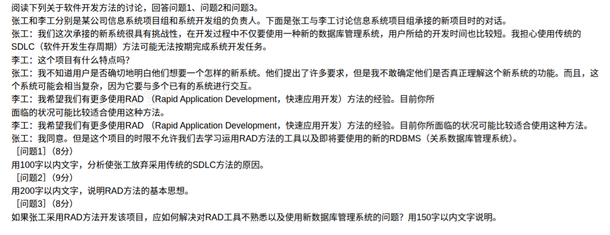

# 备考笔记：RAD 快速应用开发与 SDLC 方法选型

## 一、题目

> 阅读下列关于软件开发方法的讨论，回答问题 1、问题 2 和问题 3。
>
> 张工和李工分别是某公司信息系统项目组和系统开发组的负责人。下面是张工与李工讨论信息系统项目组承接的新项目时的对话。
>
> 张工：我们这次承接的新系统很具有挑战性，在开发过程中不仅要使用一种新的数据库管理系统，用户所给的开发时间也比较短。我担心使用传统的 SDLC（软件开发生存周期）方法可能无法按期完成系统开发任务。
>
> 李工：这个项目有什么特点吗？
>
> 张工：我不知道用户是否确切地明白他们想要一个怎样的新系统。他们提出了许多要求，但是我不敢确定他们是否真正理解这个新系统的功能。而且，这个系统可能会相当复杂，因为它要与多个已有的系统进行交互。
>
> 李工：我希望我们有更多使用 RAD（Rapid Application Development，快速应用开发）方法的经验。目前你所面临的状况可能比较适合使用这种方法。
>
> 张工：我同意。但是这个项目的时限不允许我们去学习运用 RAD 方法的工具以及即将要使用的新的 RDBMS（关系数据库管理系统）。
>
> **【问题 1】**（8 分）用 100 字以内文字，分析使张工放弃采用传统的 SDLC 方法的原因。
>
> **【问题 2】**（9 分）用 200 字以内文字，说明 RAD 方法的基本思想。
>
> **【问题 3】**（8 分）如果张工采用 RAD 方法开发该项目，应如何解决对 RAD 工具不熟悉以及使用新数据库管理系统的问题？用 150 字以内文字说明。

**答案：**

- **问题 1（放弃 SDLC 的原因）**：① 用户**需求不明确**，SDLC（瀑布式）要求需求**明确、稳定、完整**，否则阶段评审无法推进；② 开发**时间短**，SDLC 阶段多、文档驱动、周期长，无法按期完成；③ 系统**复杂**、需与多个已有系统交互，需求易变化，SDLC 对变化适应性差。
- **问题 2（RAD 的基本思想）**：RAD（快速应用开发）以**用户参与、快速原型迭代、并行开发与构件复用**为核心——让用户尽早看到可运行的原型并持续反馈，从而**快速澄清需求、缩短开发周期**；将大系统**分解为若干子系统并行开发**；充分利用 **CASE 工具、4GL 与可视化开发**快速生成代码，以应对快速变化的市场需求。
- **问题 3（解决工具不熟悉 + 新 RDBMS 问题）**：① 对项目组开展 **RAD 工具与新 RDBMS 的集中培训**，先掌握再上项目；② **先小范围试点/做原型**，在可控范围内熟悉工具与新技术、验证可行性；③ 借助**外部有经验的人员/咨询顾问**进行技术指导；④ 采用**迭代推进**策略，边开发边积累经验，控制技术风险。

## 二、知识点：RAD 快速应用开发与 SDLC 对比

### 1. 核心原理

**SDLC（软件开发生存周期）**：广义指软件从"提出、开发、运行维护到退役"的完整过程；在方法论语境下常特指**瀑布式生命周期**——按**需求分析 → 设计 → 编码 → 测试 → 维护**线性推进，**文档驱动、阶段评审、需求前置且假定稳定**。其优点是规范、可控；缺点是**周期长、不适应需求变化**。

**RAD（Rapid Application Development，快速应用开发）**：以**快速原型 + 用户全程参与 + 并行开发 + 构件复用 + CASE/4GL 工具支撑**来**压缩开发周期**的开发方法族。核心思想是尽早给用户看到可运行的东西，用反馈代替一次性的需求评审。

**选型主线**：需求越**明确稳定**、越强调文档与规范 → 偏向 SDLC（瀑布）；需求越**模糊多变**、工期越紧 → 偏向 RAD（或原型/敏捷）。

### 2. 关键公式/规则

**SDLC 与 RAD 对比表：**

| 维度 | SDLC（瀑布式） | RAD |
| --- | --- | --- |
| 需求 | 要求**明确、稳定、完整** | 允许**模糊、渐进澄清** |
| 周期 | 长（阶段串行、评审多） | 短（快速迭代、并行） |
| 用户参与 | 主要集中在需求与验收阶段 | **全程深度参与**、频繁反馈 |
| 交付物 | 大量**文档** + 最终系统 | **可运行原型**快速迭代 |
| 适用场景 | 需求明确、规范性强、大型稳定系统 | 需求多变、工期紧、交互界面型系统 |
| 技术支撑 | 常规开发工具 | **CASE、4GL、可视化开发工具** |

**一句话锚点：需求稳用 SDLC（瀑布），需求变、工期紧用 RAD。**

> 判定诀窍：题干出现"**需求不明确** + **时间短** + **新工具/新技术**"三个信号，就是在指向 **RAD**。

### 3. 解题步骤

1. **问题 1 抓"为何放弃 SDLC"**：从对话中逐条提取 SDLC 的"不匹配点"——**需求不清**（用户不明白要什么）、**工期短**（SDLC 慢）、**系统复杂/与多系统交互**（需求易变）。把这三点组织成 100 字内的理由。
2. **问题 2 抓 RAD 的"基本思想"**：按"**用户参与 + 快速原型 + 并行开发 + 构件复用 + 工具支撑**"五个要点展开，说明目的是"**压缩周期、快速澄清需求**"，控制在 200 字内。
3. **问题 3 抓"如何落地"**：针对"**工具不熟 + 新技术（新 RDBMS）**"两个障碍，答"**培训 + 试点/原型 + 外援 + 迭代**"四条对策，控制在 150 字内。
4. **字数是软考案例分析题的硬约束**：超字会扣分，先列要点再压缩成句。

## 三、易错点

1. **把"SDLC"误当作"所有开发方法"的总称**：广义上是，但本题语境中 SDLC 特指**瀑布式生命周期**，其核心约束是"**需求必须明确稳定**"，这是放弃它的第一理由。
2. **问题 1 只答"时间短"一点**：漏掉"**需求不明确**"和"**系统复杂、需与多系统交互**"会失分——三点都要点到。
3. **问题 2 只答"快"而不展开**："快速"是结果，**基本思想**要落到"**原型迭代 + 用户参与 + 并行/复用 + 工具支撑**"的机制上。
4. **问题 3 答成"改用别的方法"**：题目假定"如果张工采用 RAD"，要答的是**如何在 RAD 框架内解决障碍**，而不是改换方法。
5. **忽略新技术（新 RDBMS）风险**：新数据库管理系统本身就是技术风险源，需要**先验证/试点**，这是问题 3 的隐藏考点。
6. **超字数**：案例分析题**有明确字数上限**，答点齐全但超字依然失分。

## 四、扩展延伸

- **RAD 与敏捷的关系**：RAD 出现更早，与敏捷理念相近（都强调**快速交付、用户参与、迭代**）；敏捷更强调**价值观与原则**（敏捷宣言 4 价值观 + 12 原则）、团队自组织；RAD 更强调**工具与快速原型**的支撑。
- **RAD 的适用边界**：RAD 不适合**高风险、大规模、需求极不稳定**的大型系统（缺少严谨的风险分析与架构管控），此时更适合**螺旋模型**。
- **RAD 的三大阶段**：需求计划（用户+开发共同研讨需求）→ 用户设计（用户与开发共同构建可运行原型）→ 构造（编码、测试、并行实施）。
- **RAD 的构件复用**：通过复用**已有构件、类库、模板**和 **CASE/4GL 工具**大幅减少手工编码，是"快速"的关键来源之一。
- **与相关笔记的联系**：
  - [43-开发过程模型选型-高风险项目螺旋模型.md](43-开发过程模型选型-高风险项目螺旋模型.md)：开发模型选型总纲，含瀑布/原型/增量/螺旋对照；
  - [93-敏捷开发-基本原则与实践.md](93-敏捷开发-基本原则与实践.md)：RAD 与敏捷的关系，及快速应用开发工具的展开说明。
- **现实类比**：**SDLC（瀑布）** ＝"**图纸完全定死，按图一次盖完**"；**RAD** ＝"**先搭个能住的样板间，你看完提意见，边改边盖、并行施工**"。

## 五、错题归档

| 题号 | 题型 | 考点 | 难度 | 掌握度 |
| --- | --- | --- | --- | --- |
| 案例分析-RAD/SDLC | 案例分析（3 问） | RAD 与 SDLC 方法选型：放弃 SDLC 的原因、RAD 基本思想、RAD 落地障碍（工具+新 RDBMS）对策 | 中 | 待复习 |

## 六、相关图片

原题截图：`../images/116-RAD快速应用开发与SDLC方法选型.png`（由用户上传的原题图复制改名而来）

