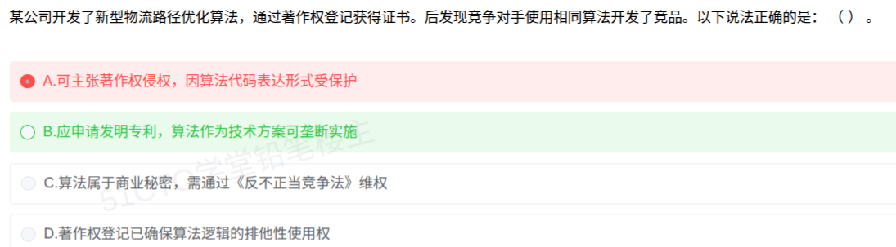

# 备考笔记：算法成果的知识产权保护方式辨析

## 一、题目

> 某公司开发了新型物流路径优化算法，通过著作权登记获得证书。后发现竞争对手使用相同算法开发了竞品。以下说法正确的是：（ ）。
>
> A. 可主张著作权侵权，因算法代码表达形式受保护
> B. 应申请发明专利，算法作为技术方案可垄断实施
> C. 算法属于商业秘密，需通过《反不正当竞争法》维权
> D. 著作权登记已确保算法逻辑的排他性使用权

**答案：B. 应申请发明专利，算法作为技术方案可垄断实施**

## 二、知识点：算法成果的知识产权保护方式

### 1. 核心原理

**算法是"思想/方法"，不是"表达"**。著作权保护的是**作品的表达形式**（源代码、文档等文字表达），**不保护思想、处理过程、操作方法、数学概念本身**（《计算机软件保护条例》明确规定）。因此，竞争对手**另行编写代码**实现同一算法，**不构成著作权侵权**——著作权只防"抄代码"，不防"用同一思路"。

**想对算法本身获得排他性技术垄断，唯一途径是申请发明专利**。涉及计算机程序的发明，只要**解决技术问题、采用技术手段、获得技术效果**（即构成"技术方案"），就可以申请**方法发明专利**；授权后他人**未经许可不得实施**该算法。

**三者的分工**：

| 保护方式 | 保护对象 | 能否防"同算法不同代码" | 取得方式 | 期限 |
| --- | --- | --- | --- | --- |
| 著作权 | 代码/文档的**表达形式** | **不能** | 完成即自动产生，登记自愿 | 长（自然人终生+50 年） |
| 发明专利 | 算法**技术方案本身** | **能**（排他实施） | **须申请、审查授权** | 20 年（自申请日起） |
| 商业秘密 | 采用**保密措施**的技术/经营信息 | 能（防获取/披露/使用） | 不公开 + 保密措施 | 不公开即持续 |

### 2. 关键公式/规则

**判定口诀：**

1. **防抄代码 → 著作权**（自动取得，登记只是初步证明，**不产生排他性使用权**）；
2. **防"想法被用" → 发明专利**（要"技术方案 + 申请授权"，才能垄断实施）；
3. **防"人员带走/泄露" → 商业秘密**（必须**有保密措施**，且**未被公开**）。

**一句话锚点：著作权保表达，专利保方案；算法想要排他，只能走专利。**

### 3. 解题步骤

1. **抓关键词"使用相同算法"**：注意是**算法（思想）相同**，而非**代码抄录**→ 直接排除"著作权侵权"类选项（A、D）。
2. **看 D 的"著作权登记已确保排他性"**：著作权登记**不产生排他效力**，登记只是权利归属的初步证明，D 错。
3. **看 C 的"商业秘密"**：题干只说"著作权登记获得证书"，**未题及保密措施**，且登记本身意味着一定程度的公开，商业秘密要件不成立，C 错。
4. **落到 B**：算法若构成**技术方案**，可申请**发明专利**，授权后方能**垄断（排他）实施**，B 正确。

## 三、易错点

1. **混淆"著作权登记"的效力**：著作权自作品完成即产生，登记是**自愿的、初步证明性的**，**不像专利那样授予排他权**；选项里出现"登记即获得排他/垄断"的表述基本都是错的。
2. **把著作权保护范围扩大化**：著作权**只保护表达，不保护思想**。竞争对手"用相同算法、自己写代码"不侵权，这是本题最大的陷阱（本次误选 A）。
3. **误判专利与著作权的保护对象**：想防"同算法不同实现"，只能靠**发明专利**，不是著作权。
4. **看到"商业秘密"就选**：商业秘密的成立要件是"**不为公众所知悉 + 有商业价值 + 采取保密措施**"，题干未提保密措施，不能想当然。
5. **忽略专利的取得条件**：纯数学算法本身不可专利，但**与具体技术领域结合、能解决技术问题的技术方案**（如物流路径优化算法）可以申请发明专利。

## 四、扩展延伸

- **计算机软件的三重保护**：
  - **著作权**：保代码、文档的表达（防复制、防抄袭），自动取得、成本低；
  - **专利权**：保技术方案的**功能/方法**（防他人用同一方法实现），需申请授权、审查严，保护力度最强；
  - **商业秘密**：保未公开的技术与经营信息（如核心参数、配方、客户名单），靠保密制度维系。
- **《计算机软件保护条例》第六条**：本条例对软件著作权的保护**不延及**开发软件所用的**思想、处理过程、操作方法或者数学概念**等。
- **涉及计算机程序的发明专利申请**：须满足"**技术问题—技术手段—技术效果**"三要素，例如"一种物流路径优化方法"作为**方法权利要求**申请。
- **专利 vs 商业秘密的权衡**：申请专利要**公开**换**20 年排他**；保密则可**长期独占**但一旦泄露即失去（且被反向工程合法获取时无法追责）。软件核心算法常用**专利 + 商业秘密**组合保护。
- **现实类比**：**著作权**像是"**只防别人照着你的菜谱原样抄，不防别人吃过之后自己另写一份**"；**发明专利**则是"**把这道菜的做法申请成专利，别人用同一种做法做菜就侵权**"；**商业秘密**是"**配方锁进保险柜，靠保密协议守住**"。

## 五、错题归档

| 题号 | 题型 | 考点 | 难度 | 掌握度 |
| --- | --- | --- | --- | --- |
| 单选-算法知识产权保护 | 单选 | 算法成果保护：著作权只保表达不保思想、专利保技术方案、商业秘密成立要件、登记无排他效力 | 中 | 薄弱 |

（重做本题时在表尾追加 `重做 N` 行，见「步骤 2.5 重做留痕」）

## 六、相关图片

原题截图：`../images/117-知识产权-算法成果保护方式辨析.png`（由用户上传的原题图复制改名而来）

