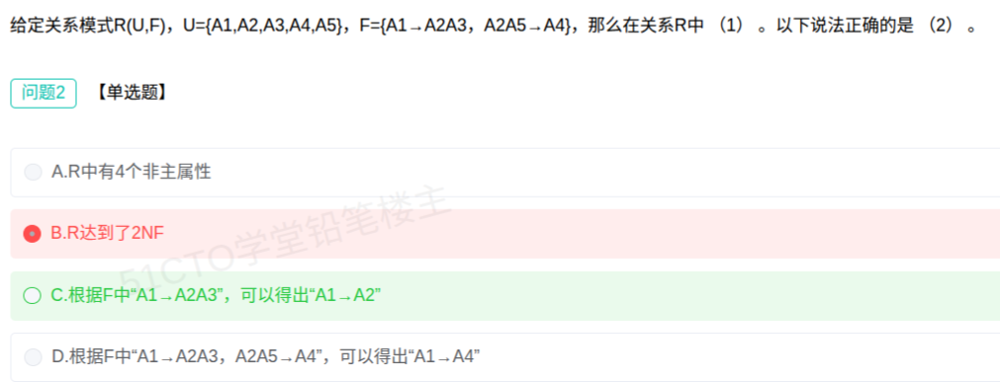

# 备考笔记：数据库-函数依赖推导与范式判定

## 一、题目

> 给定关系模式 R(U,F)，U={A1,A2,A3,A4,A5}，F={A1→A2A3, A2A5→A4}，那么在关系 R 中（1）。以下说法正确的是（2）。
>
> 【问题2 · 单选题】以下说法正确的是（  ）。
>
> A. R 中有 4 个非主属性
> B. R 达到了 2NF
> C. 根据 F 中 "A1→A2A3"，可以得出 "A1→A2"
> D. 根据 F 中 "A1→A2A3, A2A5→A4"，可以得出 "A1→A4"

**答案：C. 根据 F 中 "A1→A2A3"，可以得出 "A1→A2"**

解析：由 Armstrong **分解规则**，若 A1→A2A3 成立，则 A1→A2 与 A1→A3 **同时成立**（右部可拆），故 C 正确。其余三项均不成立：本模式候选键为 A1A5，非主属性有 3 个（A 错）；存在非主属性对候选键的部分依赖，未达 2NF（B 错）；A1 推不出 A5，因此无法由 A2A5→A4 推出 A1→A4（D 错）。

## 二、知识点：数据库-函数依赖推导与范式判定

### 1. 核心原理

**Armstrong 公理与常用推理规则**（决定"能否由 F 推出某依赖"）：

| 规则 | 形式 | 说明 |
| --- | --- | --- |
| 自反律 | 若 Y ⊆ X，则 X→Y | 平凡依赖 |
| 增广律 | 若 X→Y，则 XZ→YZ | 两边同加属性 |
| 传递律 | 若 X→Y、Y→Z，则 X→Z | 链式传递 |
| **分解规则** | 若 X→YZ，则 X→Y 且 X→Z | **右部可拆**（本题 C 考点） |
| 合并规则 | 若 X→Y、X→Z，则 X→YZ | 右部可并 |
| 伪传递 | 若 X→Y、WY→Z，则 WX→Z | 传递的推广 |

注意：**右部可拆，左部不可拆**——由 A1→A2A3 能推出 A1→A2，但由 A1A2→A3 **不能**推出 A1→A3。

**范式判定要点**：

- **1NF**：属性不可再分。
- **2NF**：满足 1NF，且**所有非主属性都完全函数依赖**于候选键（**不允许部分依赖**：非主属性不能只依赖候选键的一部分）。
- **3NF**：满足 2NF，且**没有非主属性传递依赖**于候选键。

### 2. 关键公式/规则

| 名称 | 表达式/判据 |
| --- | --- |
| 候选键 | $X^+ = U$ 且 X 极小 |
| 非主属性 | 不属于任何候选键的属性 |
| 2NF 判据 | 不存在非主属性对候选键的**部分依赖** |
| 3NF 判据 | 不存在非主属性对候选键的**传递依赖** |
| 分解规则 | $X \to YZ \;\Rightarrow\; X \to Y,\; X \to Z$ |
| 合并规则 | $X \to Y,\; X \to Z \;\Rightarrow\; X \to YZ$ |

本题求解过程：

- 属性分类：A1（只在左部）L 类；A5（只在左部）L 类；A2（左又右）LR 类；A3、A4（只在右部）R 类。
- L 类必含 → 候选键必含 {A1, A5}。
- 求闭包 A1A5⁺：A1→A2A3 得 A2、A3；再由 A2A5→A4 得 A4 → **A1A5⁺ = {A1,A2,A3,A4,A5} = U**。
- 结论：**唯一候选键 = A1A5**；主属性 = {A1, A5}（2 个），**非主属性 = {A2, A3, A4}（3 个）**。

### 3. 解题步骤

1. **逐项验证 C（正向推导）**：A1→A2A3 是右部多属性，套用**分解规则**可直接拆出 A1→A2、A1→A3 → **C 正确**。
2. **验证 A（非主属性个数）**：先求候选键 A1A5，得主属性 {A1,A5}，非主属性为 A2、A3、A4 共 **3 个**，不是 4 个 → **A 错**。
3. **验证 B（是否 2NF）**：候选键是 A1A5，而 A1→A2A3 表明非主属性 A2、A3 只依赖键的**一部分 A1**，属**部分依赖** → 未达 2NF → **B 错**。
4. **验证 D（能否推出 A1→A4）**：A2A5→A4 的左部含 A5，而 A1⁺ = {A1,A2,A3} 推不出 A5，无法触发该依赖 → **D 错**。
5. **定答案**：选 **C**。

## 三、易错点

1. **左右部拆并规则不对称**：**右部可拆、左部不可拆**。C 之所以对，就因为 A2A3 在**右部**；若写成 A1A2→A3，则不能拆出 A1→A3。
2. **非主属性个数别与属性总数混**：R 共 5 个属性，但非主属性只有 3 个（A2、A3、A4），A1、A5 是主属性，要先把候选键求出来再数。
3. **部分依赖是 2NF 的"红线"**：只要非主属性依赖候选键的真子集，就不满足 2NF，本题 A1→A2A3 正是此情况。
4. **D 项是"看着像传递"的陷阱**：A1→A2A3 与 A2A5→A4 之间并没有 A1→A5，传递链**接不上**，不能用传递律。
5. **候选键唯一≠主属性只有一个键**：主属性是**所有候选键的并集**；本题唯一候选键 A1A5，故主属性恰为 A1、A5。

## 四、扩展延伸

- **本题的范式结论**：R 不满足 2NF（存在部分依赖）。**规范化处理**：把 R 分解为 R1(A1,A2,A3) 与 R2(A2,A5,A4)，即可让两个子模式都达到 2NF/3NF，这属**无损连接分解**（有损无损需另外验证）。
- **求候选键的标准套路**：先用 L/R/N/LR 分类法定"必含"属性，再对候选组合求闭包，闭包 = U 且极小即为候选键。
- **常用推理规则速记**：自反、增广、传递是**公理**；分解、合并、伪传递是**推论**。考试中判断"能否推出"先看能否套这三条公理，再考虑推论。
- **现实类比**：函数依赖像"确定关系"。由"学号 → 姓名+班级"，当然能推出"学号 → 姓名"（右部可拆）；但由"学号+课程 → 成绩"推不出"学号 → 成绩"（左部不可拆），因为一个学生多门课成绩不同。

## 五、错题归档

| 题号 | 题型 | 考点 | 难度 | 掌握度 |
| --- | --- | --- | --- | --- |
| 系统分析师-数据库系统（问题2） | 单选 | 数据库-函数依赖 Armstrong 规则 与 2NF 判定 | 中 | 待复习 |

## 六、相关图片

原题截图：`../images/12-数据库-函数依赖推导与范式判定.png`（由用户上传的原题截图复制改名而来）

