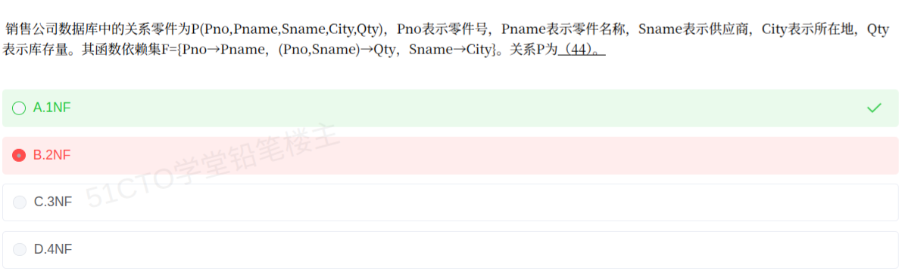

# 备考笔记：数据库-范式判定与部分依赖

## 一、题目

> 销售公司数据库中的关系零件为 P(Pno, Pname, Sname, City, Qty)，Pno 表示零件号，Pname 表示零件名称，Sname 表示供应商，City 表示所在地，Qty 表示库存量。其函数依赖集 F={Pno→Pname, (Pno,Sname)→Qty, Sname→City}。关系 P 为（44）。
>
> A. 1NF
> B. 2NF
> C. 3NF
> D. 4NF

**答案：A. 1NF**

解析：候选键是 (Pno, Sname)，非主属性为 Pname、City、Qty。由于存在 **Pno→Pname**，非主属性 Pname 只依赖于候选键的**一部分**（Pno），属**部分依赖**，违反 2NF 的要求，故 P 只达到 **1NF**。

## 二、知识点：数据库-范式判定与部分依赖

### 1. 核心原理

关系规范化逐级消除"不好的依赖"，判定要**逐层向上验证，卡在哪一级就停在哪一级**：

- **1NF**：每个属性都是**原子**的（不可再分）。只要字段没有"表中有表"就满足。
- **2NF**：在 1NF 基础上，**所有非主属性都完全函数依赖**于候选键，即**不允许部分依赖**（非主属性不能只依赖候选键的真子集）。
- **3NF**：在 2NF 基础上，**不允许非主属性对候选键有传递依赖**。
- **BCNF**：在 3NF 基础上，要求**每个非平凡函数依赖的决定因素都必须是超键**。
- **4NF**：针对**多值依赖**，消除非平凡且非函数依赖的多值依赖。

判断 2NF 的**唯一红线**：候选键是多属性组合时，**有没有非主属性只被其中一部分属性决定**。

### 2. 关键公式/规则

| 范式 | 判据 | 要消除的问题 |
| --- | --- | --- |
| 1NF | 属性原子，不可再分 | 非原子属性 |
| 2NF | 非主属性**完全函数依赖**于候选键 | 部分依赖 |
| 3NF | 非主属性不传递依赖于候选键 | 传递依赖 |
| BCNF | 每个非平凡依赖的决定因素都是超键 | 主属性间的依赖异常 |
| 4NF | 无非平凡且非函数依赖的多值依赖 | 多值依赖 |

本题形式化推导：

| 步骤 | 结论 |
| --- | --- |
| 属性分类 | Pno（仅左）、Sname（仅左）为 L 类；Pname、City、Qty 仅在右部为 R 类 |
| 候选键 | (Pno, Sname)⁺ = U，且极小 → **唯一候选键 (Pno, Sname)** |
| 主属性 | {Pno, Sname} |
| 非主属性 | {Pname, City, Qty} |
| 部分依赖 | **Pno→Pname**：Pname 只依赖候选键中的 Pno → 存在 |
| 结论 | 违反 2NF，仅达 **1NF** |

### 3. 解题步骤

1. **判 1NF**：Pno、Pname、Sname、City、Qty 均为不可再分的原子属性 → 满足 1NF，排除"非 1NF"的隐含可能。
2. **求候选键**：Pno 与 Sname 都只出现在函数依赖左部（L 类），必在键中；(Pno,Sname)⁺ 能推出 Pname（Pno→Pname）、Qty（(Pno,Sname)→Qty）、City（Sname→City）→ 得 **U**，故唯一候选键为 **(Pno, Sname)**。
3. **定主属性**：主属性 = {Pno, Sname}；非主属性 = {Pname, City, Qty}。
4. **查部分依赖（2NF 红线）**：候选键是两属性组合，而 **Pno→Pname** 使非主属性 Pname 仅依赖键的一部分 Pno → **存在部分依赖** → **不满足 2NF**。
5. **定答案**：卡在 2NF 之前，关系 P 只能是 **1NF**，选 **A**。（2NF 不满足时，3NF、BCNF、4NF 均无需再谈，因为范式是逐级递进的。）

## 三、易错点

1. **别被"有主键就成了 2NF"误导**：本题选 B 的失分就在此。2NF 的实质是"**非主属性不能只依赖候选键的一部分**"，组合键场景下极易出现部分依赖。
2. **范式是"逐级台阶"**：不满足 2NF 就一定不满足 3NF/BCNF，答题时一旦卡在某一级，后面的选项可**直接排除**，不必逐个验证。
3. **部分依赖要盯"非主属性"**：若被部分决定的是**主属性**，不影响 2NF（这与全主属性关系天然满足 3NF 的道理相通）。
4. **传递依赖与部分依赖易混**：Pno→Pname 是**部分依赖**（键的一部分决定非主属性）；Sname→City 若 Sname 为键则属**传递依赖**。本题卡在更靠前的部分依赖上。
5. **候选键可能不止一个**：本题恰好唯一，但做题务必先用 L/R 分类法确认，不可想当然。

## 四、扩展延伸

- **规范化分解方案**：把 P 拆成三个关系即可逐级达到 3NF/BCNF：
  - R1(Pno, Pname) —— 消除 Pno→Pname 带来的部分依赖；
  - R2(Pno, Sname, Qty) —— 保留 (Pno,Sname)→Qty 的主依赖，恰好是原候选键；
  - R3(Sname, City) —— 承接 Sname→City。
  三者的决定因素都是各自的候选键，故均满足 **BCNF**；该分解为**无损连接**分解。
- **数据冗余视角**：原模式中同一供应商的 City 会随每一条零件记录重复存储，一旦某供应商搬迁就要改动多行，正是 Sname→City 造成的一致性隐患，规范化就是为消除这类冗余与异常。
- **几条递进的等价说法**：
  - 2NF = 消除**非主属性对键的部分依赖**；
  - 3NF = 消除**非主属性对键的传递依赖**；
  - BCNF = 消除**主属性对键的部分与传递依赖**。
- **现实类比**：把"零件—供应商—库存"记账时，若一张表同时写零件名、供应商所在地和库存量，供应商搬迁就得改一堆行；拆成"零件表 + 供应关系表 + 供应商表"才符合"一事一地"的原则。

## 五、错题归档

| 题号 | 题型 | 考点 | 难度 | 掌握度 |
| --- | --- | --- | --- | --- |
| 系统分析师-数据库系统（题44） | 单选 | 数据库-范式判定 部分依赖与 2NF | 中 | 待复习 |

## 六、相关图片

原题截图：`../images/14-数据库-范式判定与部分依赖.png`（由用户上传的原题截图复制改名而来）

