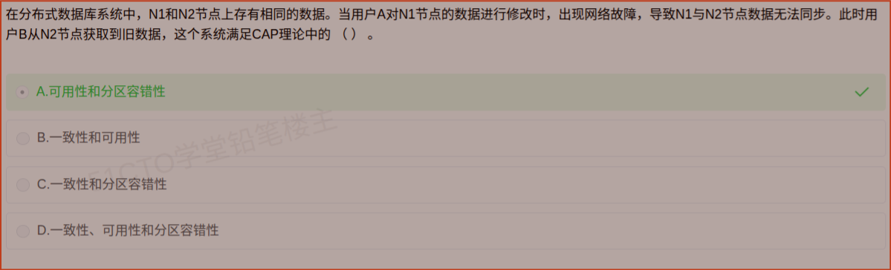

# 备考笔记：分布式数据库-CAP理论

## 一、题目

> 在分布式数据库系统中，N1 和 N2 节点上存有相同的数据。当用户 A 对 N1 节点的数据进行修改时，出现网络故障，导致 N1 与 N2 节点数据无法同步。此时用户 B 从 N2 节点获取到旧数据，这个系统满足 CAP 理论中的（  ）。
>
> A. 可用性和分区容错性
> B. 一致性和可用性
> C. 一致性和分区容错性
> D. 一致性、可用性和分区容错性

**答案：A. 可用性和分区容错性**

解析：出现网络故障，说明**分区（P）已经发生**且系统仍能对外服务；用户 B 依然能从 N2 读到数据（尽管是旧数据），说明**可用性（A）得到满足**；但 B 读到的是**旧数据**，说明各节点数据不再一致，**一致性（C）被牺牲**。故该系统的取舍是 **AP**。

## 二、知识点：分布式数据库-CAP理论

### 1. 核心原理

CAP 理论指出，分布式系统无法同时满足以下三项，最多只能同时满足两项：

- **Consistency（一致性 C）**：所有节点在同一时刻看到的数据是**相同的（最新）**，等价于所有读操作都能读到最近一次写的结果。
- **Availability（可用性 A）**：每个请求都能在**有限时间内得到响应**（成功或失败），**但不保证返回的是最新数据**。
- **Partition tolerance（分区容错性 P）**：当网络分区（节点间消息丢失、延迟、中断）发生时，系统**仍能继续运行**。

**关键理解**：分布式系统中网络故障**不可避免**，因此 **P 通常是必选项**，真正的工程取舍发生在 **C 与 A 之间**：

| 取舍 | 放弃项 | 典型系统 | 特征 |
| --- | --- | --- | --- |
| **CP** | 放弃可用性 | ZooKeeper、HBase、Etcd | 分区时宁可拒绝服务，也要保证数据一致 |
| **AP** | 放弃强一致性 | Cassandra、DynamoDB、Eureka | 分区时继续提供服务，允许读到旧数据，追求最终一致 |
| CA | 放弃分区容错性 | 单机关系数据库 | 不发生分区时才成立，分布式下不现实 |

### 2. 关键公式/规则

| 名称 | 判定信号（出现在题干里的表现） |
| --- | --- |
| C（一致性） | 各节点数据**始终相同**、读到的都是最新值 |
| A（可用性） | 请求**总能得到响应**（哪怕返回旧数据或失败提示） |
| P（分区容错性） | 出现**网络故障 / 节点失联**，系统**仍在运行** |
| CAP 结论 | C、A、P **三者不可兼得**，最多取其二 |
| 本题结论 | 网络故障 → P 生效；仍能读到数据 → A；读到旧数据 → **牺牲 C** → **AP** |

### 3. 解题步骤

1. **找"分区"证据**：题干出现"网络故障，导致 N1 与 N2 数据无法同步"→ **P 已发生且被容忍**，可先排除把 P 丢掉的说法（如 B 项"一致性和可用性"在分布式下不成立）。
2. **判"可用性"**：用户 B **仍然从 N2 获取到了数据**，请求得到响应 → **A 满足**。
3. **判"一致性"**：B 拿到的是**旧数据**，说明节点间数据不一致 → **C 未满足**。
4. **组合结论**：满足的是 **A + P**，牺牲的是 C → 选 **A**。
5. **顺手排除 D**：CAP 三者**不可能同时满足**，D 项必然错误。

## 三、易错点

1. **D 项是"送分陷阱"**：CAP 的定义就是三者不可同时兼得，看到"一致性、可用性、分区容错性"全选，可直接判错。
2. **不要把 P 当成"可选项"**：分布式系统网络故障不可避免，一旦题干描述网络故障，P 就已在起作用，不必纠结"是否满足 P"。
3. **"可用性"不等于"正确性"**：可用性只要求**有响应**，返回旧数据也算可用；是否最新由**一致性**负责。这是本题的核心区分点。
4. **C 被牺牲不等于系统有问题**：这是**有意的取舍**，许多互联网系统为高可用主动选择 AP + 最终一致。
5. **别与 ACID 混为一谈**：ACID 是**单机事务**的特性（强调强一致），CAP 是**分布式系统**的取舍理论；AP 系统常改用 **BASE** 原则。

## 四、扩展延伸

- **BASE 理论**（AP 系统的指导思想）：**B**asically **A**vailable（基本可用）、**S**oft state（软状态）、**E**ventually consistent（最终一致）。它是对 CAP 中 AP 的延伸，明确"允许短暂不一致，最终收敛"。
- **ACID 与 BASE 对比**：ACID 追求强一致、隔离与即时正确，适合金融交易；BASE 追求高可用与最终一致，适合互联网大规模场景（如购物车、点赞数、推荐流）。
- **实际系统的取舍举例**：
  - ZooKeeper、Etcd：CP，选举期间可能短暂不可用；
  - Cassandra、DynamoDB：AP，通过可调一致性级别（Quorum）在 C 与 A 之间滑动；
  - 单机 MySQL：CA，一旦跨机房分布式部署就不得不在 C/A 中取舍。
- **易混淆点补充**：题目里"N1、N2 存有相同数据"是**副本**设定；只要有副本 + 网络分区，就必然面对"要么拒绝服务保一致，要么继续服务容忍脏读"的经典抉择。
- **现实类比**：两支笔记录同一份账（两份副本），一旦两边电话打不通（分区），你可以选择**停笔等消息**（保一致、牺牲可用）或**继续记账、之后再对账**（保可用、牺牲一致）。本题系统选了后者。

## 五、错题归档

| 题号 | 题型 | 考点 | 难度 | 掌握度 |
| --- | --- | --- | --- | --- |
| 系统分析师-数据库系统 | 单选 | 分布式数据库-CAP 理论 C/A/P 的取舍判定 | 易 | 待复习 |

## 六、相关图片

原题截图：`../images/16-分布式数据库-CAP理论.png`（由用户上传的原题截图复制改名而来）

