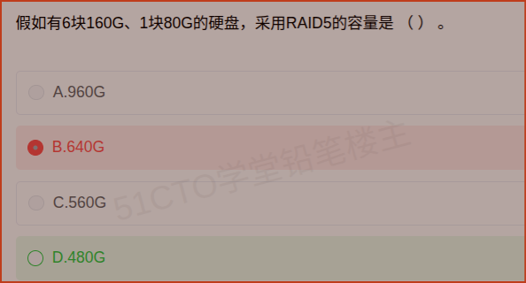

# 备考笔记：存储-RAID5容量计算

## 一、题目

> 假如有 6 块 160G、1 块 80G 的硬盘，采用 RAID5 的容量是（  ）。
>
> A. 960G
> B. 640G
> C. 560G
> D. 480G

**答案：D. 480G**

解析：RAID 阵列中**各盘必须按相同容量参与组阵列**，混合容量时以**最小容量盘**为准，超出部分被浪费。本题共 7 块盘，统一按 **80G** 计算。RAID5 容量公式为 (N − 1) × 单盘容量，故 (7 − 1) × 80G = **480G**。

## 二、知识点：存储-RAID5容量计算

### 1. 核心原理

RAID（独立磁盘冗余阵列）通过条带化与冗余提升性能/可靠性。计算容量有两条铁律：

1. **混合容量取最小值**：阵列由多块盘组成时，**每块盘都按最小盘容量**参与，大容量盘多出的空间**闲置浪费**。本题 6 块 160G 都要"降级"当 80G 用。
2. **按级别扣减校验开销**：不同 RAID 级别扣除的磁盘（空间）数量不同，RAID5 需扣 1 块盘的容量用于**分布式奇偶校验**。

RAID5 的关键特征：

- **数据条带化 + 奇偶校验分布在所有盘上**（无专用校验盘，避免了 RAID3/4 的校验盘瓶颈）；
- **允许任意 1 块盘故障**，故障后可由其余盘校验重建；
- **有效容量 = (N − 1) × 单盘容量**，磁盘利用率 (N − 1) / N；
- 至少需 **3 块盘**（2 块时校验无意义）。

### 2. 关键公式/规则

| RAID 级别 | 校验方式 | 有效容量（N 块盘，单盘容量 C） | 容错能力 | 利用率 |
| --- | --- | --- | --- | --- |
| RAID0 | 无校验（纯条带） | N × C | 不允许坏盘 | 100% |
| RAID1 | 镜像 | (N / 2) × C | 坏 1 块/每组镜像 | 50% |
| RAID3 | 专用校验盘（位交叉） | (N − 1) × C | 坏 1 块盘 | (N−1)/N |
| **RAID5** | **分布式校验** | **(N − 1) × C** | **坏 1 块盘** | **(N−1)/N** |
| RAID6 | 双校验（分布式） | (N − 2) × C | 坏 2 块盘 | (N−2)/N |
| RAID10 | 先镜像再条带 | (N / 2) × C | 每个镜像组可坏 1 块 | 50% |

> 上述 C 一律取阵列中的**最小盘容量**。

### 3. 解题步骤

1. **数盘数**：6 块 160G + 1 块 80G = **7 块盘**，即 N = 7。
2. **统一容量**：混合容量取最小 → **C = 80G**（160G 的盘也只按 80G 计入）。
3. **扣校验盘**：RAID5 扣 1 块盘的空间 → 有效盘数 = 7 − 1 = **6 块**。
4. **算容量**：6 × 80G = **480G**，选 **D**。
5. **自检**：7 块盘原始裸容量 7 × 80 = 560G，利用率 6/7 ≈ 85.7%，结果 480G 落在裸容量之内，合理。

## 三、易错点

1. **忘记"混合容量取最小"**：直接用 160G 参与计算 → 得到 6 × 160 = 960G（选 A），或用 5 × 160 = 800G，都会脱离正确值。**第一步必须先统一到最小容量 80G**。
2. **忘记扣校验盘**：按 7 × 80 = 560G 算（选 C），这是把 RAID5 当成 RAID0 了。**RAID5 永远扣 1 块盘**。
3. **B. 640G 的错法**：把不同容量盘混合折算、未先统一到最小盘，得出的数字无法自洽——凡计算结果不是"最小容量的整数倍"就要警觉。
4. **RAID5 与 RAID6 混淆**：RAID6 扣 2 块盘，容量为 (N − 2) × C；本题若按 RAID6 算应为 5 × 80 = 400G，无此选项，可反向验证是 RAID5。
5. **RAID ≠ 备份**：RAID5 只能防**单块磁盘物理故障**，防不了误删除、病毒、机房灾难，仍需独立备份。

## 四、扩展延伸

- **容错与级别的选择**：追求性能且数据可重来（如临时缓存/日志）用 RAID0；追求高可靠小容量（如系统盘）用 RAID1；**兼顾容量、性能、可靠性的通用方案**是 RAID5；对可用性要求极高（如数据库）用 RAID6 或 RAID10。
- **写惩罚（Write Penalty）**：RAID5 每次写需"读旧数据 + 读旧校验 + 写新数据 + 写新校验"共 4 次 I/O，随机写性能较差；RAID10 无此问题但利用率仅 50%。这解释了"数据库常用 RAID10、归档存储常用 RAID5/6"的工程惯例。
- **热备盘（Hot Spare）**：RAID5 阵列常配一块空闲热备盘，某盘故障时自动顶替并开始重建，缩短降级运行窗口。
- **重建风险**：大容量盘重建耗时长（可能数小时到数十小时），期间若再坏一块盘，RAID5 将整体失效——这是大容量时代 RAID5 逐渐让位于 RAID6 的原因。
- **现实类比**：RAID5 像**7 个人抬一张桌子，但只允许每人使 80 斤的力**（哪怕有人力气更大也用不上，多余的力气闲置）；同时**留 1 个人专门替补**（校验盘），剩下 6 个人真正出力搬东西 → 实际运力 6 × 80 = 480。这就是"最小容量原则 + 扣一块校验"的直观含义。

## 五、错题归档

| 题号 | 题型 | 考点 | 难度 | 掌握度 |
| --- | --- | --- | --- | --- |
| 系统分析师-系统规划（存储） | 单选 | 存储-RAID5 有效容量计算（最小盘原则 + 扣校验） | 易 | 待复习 |

## 六、相关图片

原题截图：`../images/19-存储-RAID5容量计算.png`（由用户上传的原题截图复制改名而来）

