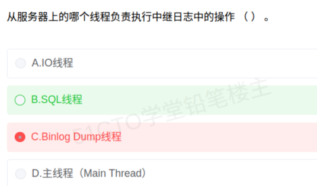

# 备考笔记：MySQL主从复制-从服务器线程分工

## 一、题目

> 从服务器上的哪个线程负责执行中继日志中的操作（  ）。
>
> A. IO线程
> B. SQL线程
> C. Binlog Dump线程
> D. 主线程（Main Thread）

**答案：B. SQL线程**

解析：MySQL 主从复制中，**从服务器（Slave）** 上的 **SQL 线程（SQL Thread）** 负责**读取中继日志（relay log）中的事件并执行**，从而把主库的变更在从库上重放出来。A"IO 线程"虽也在从服务器上，但它的职责是从主库**拉取 binlog 并写入中继日志**，不负责执行；C"Binlog Dump 线程"运行在**主服务器（Master）** 上，负责向从库发送 binlog；D"主线程"不是复制线程。故选 B。

## 二、知识点：MySQL主从复制-从服务器线程分工

### 1. 核心原理

MySQL 主从复制为**异步复制**，核心是主库的 **binlog（二进制日志）** 传送到从库、再由从库重放。整个过程涉及三个**不同分工的线程**，其中两个在从库、一个在主库：

| 线程 | 所在服务器 | 职责 | 一句话记忆 |
| --- | --- | --- | --- |
| Binlog Dump 线程 | **主库 Master** | 读取主库 binlog，通过网络把 binlog 事件**推送给从库** | "主库的发货员" |
| IO 线程（I/O Thread） | **从库 Slave** | 连接主库、**接收 binlog 事件并写入中继日志（relay log）** | "从库的收货员" |
| SQL 线程（SQL Thread） | **从库 Slave** | **读取中继日志中的事件并执行（重放）** | "从库的加工员" |

完整数据流：

主库写入数据 → 记入 **binlog** → 主库 **Binlog Dump 线程** 发送 binlog → 从库 **IO 线程** 接收并写入 **relay log（中继日志）** → 从库 **SQL 线程** 读取 relay log 并**执行其中的操作**，最终写入从库数据文件。

**本题落点**正是链条末端那一步：**执行中继日志中的操作 = SQL 线程**。

### 2. 关键公式/规则

线程与职责对应表（解题时先定"服务器"，再定"职责"）：

| 判断维度 | 主库上的线程 | 从库上的线程 |
| --- | --- | --- |
| 线程名 | Binlog Dump | IO 线程、SQL 线程 |
| 与日志的关系 | 读 binlog 并**发送** | IO 线程：写 **relay log**；SQL 线程：读 **relay log** 并**执行** |
| 常见题干关键词 | "发送""dump""推送" | "接收并写入中继日志"→IO；"执行中继日志中的操作"→SQL |

速记口诀：**主库 Dump 发，从库 IO 收、SQL 干**。

- **"发"**：Binlog Dump 线程把 binlog 发给从库；
- **"收"**：IO 线程把收到的 binlog 落成中继日志；
- **"干"**：SQL 线程真正把操作**执行**一遍。

### 3. 解题步骤

1. **看问的是哪台机器**：题干说"**从服务器上**的哪个线程"，D"主线程"先排除，C"Binlog Dump 线程"属主库，也排除。
2. **辨别从库两个线程的职责**：IO 线程只负责**接收/写入中继日志**；SQL 线程负责**读取并执行**。
3. **对号入座**：题干关键词是"**负责执行中继日志中的操作**"→ 执行 → **SQL 线程**，选 **B**。
4. **复盘错选**：若选 C（Binlog Dump 线程），是把它当成了"搬运 binlog 的线程"。需牢记 **Binlog Dump 跑在主库上**，从库上根本没有它。

## 三、易错点

1. **Binlog Dump 线程在主库，不在从库**：题干限定"从服务器上"，C 项本身就不在这台机器上，属"位置性错误"选项。这是本题最主要的陷阱。
2. **IO 线程 vs SQL 线程的分工**：IO 线程**只搬运**（收 binlog → 写中继日志），SQL 线程**才执行**。看到"执行/重放"要选 SQL 线程，看到"接收/连接主库/写中继日志"才选 IO 线程。
3. **中继日志（relay log）是"从库本地"的日志**：它是从库把主库 binlog 落到本地后的中间产物，**不是主库的日志**；SQL 线程读的正是这份本地中继日志。
4. **不要把"主线程（Main Thread）"当成复制线程**：MySQL 中并无负责复制的"主线程"这一概念，D 是纯干扰项。
5. **注意问句方向**：本题是正向设问（问"哪个负责执行"）。若改为问"哪个负责写入中继日志"，答案就变成 **IO 线程**——务必看清是"执行"还是"接收"。

## 四、扩展延伸

- **主从复制的价值**：读写分离（主库写、从库读）、数据备份与容灾、故障切换、提升整体读吞吐。
- **复制模式对比**：
  - **异步复制**：主库提交后不等从库确认即返回（MySQL 传统默认，可能丢数据）；
  - **半同步复制**：主库需等至少一个从库**收到**（写进中继日志）后才返回，降低丢数据风险；
  - **全同步/组复制（MGR）**：基于 Paxos 类协议，保证一致性更强，性能代价更高。
- **与"复制"相关的进阶考点**：
  - **GTID**（全局事务标识）替代 binlog 文件名 + 偏移量来定位复制位点；
  - **并行复制**：MySQL 5.7+ 支持多 worker 线程并行重放，缓解"**主库多线程写、从库单线程重放**"造成的**复制延迟（主从延迟）**；
  - **binlog 格式**：STATEMENT（记 SQL 语句）、ROW（记行变更，更安全）、MIXED（混合）。
- **同域常考概念串联**：**两阶段提交（2PC）**、**XA 事务**、**redo log / undo log / binlog** 三种日志的分工（redo 保持久性、undo 保原子性与回滚、binlog 用于复制与恢复）。
- **现实类比**：把主从复制想成"总部与分公司同步公文"。
  - **Binlog Dump 线程** = 总部的**发件员**，把总部签发的公文（binlog）寄往分公司；
  - **IO 线程** = 分公司的**收发员**，只负责把邮件**收下、登记进收文簿（中继日志）**；
  - **SQL 线程** = 分公司的**执行员**，逐条翻开收文簿，**照着文件把事办一遍**（执行操作）。
  - 所以"**负责执行**"的，一定是那位**执行员**——SQL 线程；发件员再忙，也只在总部，不替分公司干活。

## 五、错题归档

| 题号 | 题型 | 考点 | 难度 | 掌握度 |
| --- | --- | --- | --- | --- |
| 系统分析师-数据库（数据库性能/复制） | 单选 | MySQL 主从复制中三个线程的分工，特别是从库 SQL 线程执行中继日志 | 中 | 待复习 |

## 六、相关图片

原题截图：`../images/24-MySQL主从复制-从服务器线程分工.png`（由用户上传的原题截图复制改名而来）

