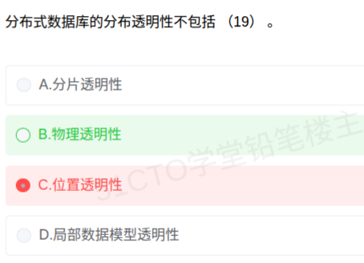

# 备考笔记：分布式数据库-分布透明性构成辨析

## 一、题目

> 分布式数据库的分布透明性不包括（19）。
>
> A. 分片透明性
> B. 物理透明性
> C. 位置透明性
> D. 局部数据模型透明性

**答案：B. 物理透明性**

解析：分布透明性**只包括三种**——**分片透明性（A）、位置透明性（C）、局部数据模型透明性（D，又称逻辑透明性）**。B"物理透明性"不在其中，故本题应选 B（设问是"**不包括**"）。注意：分布透明性虽与"物理独立性"相关，但教材并未设置"物理透明性"这一层次名称，它是针对本知识点设计的**编造项**。

## 二、知识点：分布透明性构成辨析

### 1. 核心原理

分布式数据库的数据独立性在逻辑独立、物理独立之外，还多一项**分布独立性**，即**分布透明性**：用户不必关心数据的**逻辑分片**、**物理位置分配**，也不必关心**局部场地上的数据模型**。

教材把分布透明性**分为三个层次**，它们同时也构成了"分布透明性"的**全部内容**：

| 层次（高→低） | 名称（本题用法） | 用户不必知道的 | 用户需知道的 |
| --- | --- | --- | --- |
| 最高 | 分片透明性（A） | 数据如何**分片** | 只对**全局关系**操作 |
| 中间 | 位置透明性（C） | 片段存在**哪个场地** | 需了解**分片** |
| 最低 | 局部数据模型透明性（D，逻辑透明性） | 局部场地用的是**何种数据模型** | 需了解**分片**与**各片段存储的场地** |

由此可见，"分布透明性"是一个**封闭的三元集合**：**{ 分片透明性、位置透明性、局部数据模型透明性 }**。凡不在此三者之列的命名，均为干扰项——本题的 **B"物理透明性"** 就是这样一项。

### 2. 关键公式/规则

分布透明性构成的正负清单（解题时用"包含清单"对齐选项）：

| 选项名称 | 是否属于分布透明性 | 依据 |
| --- | --- | --- |
| 分片透明性 | 是 | 最高层次，用户不必知道如何分片 |
| 位置透明性 | 是 | 知道分片、不知场地 |
| 局部数据模型透明性（逻辑透明性） | 是 | 知道分片与场地、不知局部数据模型 |
| **物理透明性** | **否（编造项）** | 教材三层中没有此名称 |
| 全局透明性 | 否（编造项） | 教材三层中没有此名称 |
| 复制透明性 | 否（属透明性范畴，但不在此三层序列） | 它是并行的另一概念，不参与层次划分 |

速记口诀：**分布透明就三层——分片、位置、逻辑（局部数据模型）；"物理""全局"都是编的**。

一个小提醒，把相关"独立性"与"透明性"分清：

- **物理独立性**：用户的应用程序与数据的**物理存储**相互独立（改存储结构不必改程序）；
- **分布透明性**：用户的应用程序与数据的**分布（分片+场地+局部模型）** 相互独立。
- 二者相关，但**"物理透明性"不是教材给分布透明性起的名字**——这正是本题的陷阱所在。

### 3. 解题步骤

1. **看设问方向**：题干问"**不包括**"，属反向选择，要挑出"不在清单里"的一项。
2. **背出三层清单**：分片透明性、位置透明性、局部数据模型透明性（逻辑透明性）。
3. **逐项比对**：A、C、D 均在清单内；B"物理透明性"不在清单内。
4. **得结论**：选 **B**（问的是"不包括"，即"哪一项不属于"）。
5. **复盘错选**：若误选 C（位置透明性），同样是"反向设问 + 把真实项当成不属于"的老毛病——位置透明性恰恰是分布透明性的**第二层次**，铁定属于。

## 三、易错点

1. **反向设问再出错**：本题问"**不包括**"。C（位置透明性）是真实存在的层次，属于"分布透明性"，绝不能选。启动作答前先圈出"不包括/不属于/不正确/除外"。
2. **"物理透明性"极易被误认**：因为大家都知道数据库有"物理独立性"，于是"物理透明性"听起来顺理成章。但分布透明性的三个层次名称是**固定的**，不含"物理透明性"。
3. **"全局透明性"是另一个编造项**：与本题的"物理透明性"同属"看着像、实际无"的干扰命名（详见 [23-分布式数据库-分布透明性层次.md](23-分布式数据库-分布透明性层次.md)）。
4. **别把"复制透明性"当成一层**：复制透明指用户不必关心数据副本的复制与同步，虽属分布式数据库的透明性范畴，但**不参与**分布透明性的三层划分；本题选项里没有它，但换题可能拿它当干扰。
5. **别被"局部数据模型透明性"的别名绕晕**：它又叫**逻辑透明性**（局部映像透明性）。两个名字是同一层，见到"逻辑透明性"要能对上"局部数据模型透明性"。

## 四、扩展延伸

- **与第 23 篇的关系**：这两道题考的是**同一知识点的两个侧面**——
  - [23-分布式数据库-分布透明性层次.md](23-分布式数据库-分布透明性层次.md)：问**哪一层最高**（答案：分片透明性）；
  - 本篇：问**哪些不属于**（答案：物理透明性）。
  只要记住"三个层次 + 层次顺序"，两题都能秒答：**最高=分片，中间=位置，最低=逻辑（局部数据模型）**。
- **三层为什么这样排序**：透明性描述"用户被屏蔽掉多少分布细节"。屏蔽分片（连分片都不用管）最强，故最高；屏蔽到只剩局部数据模型一层没屏蔽，故最低。
- **分布式数据库的其他常考特点**（常同题出现）：
  - **数据独立性**：多一项"分布独立性"；
  - **集中与自治相结合的控制结构**；
  - **适当增加数据冗余**（多副本提高可靠性/可用性，代价是一致性维护）；
  - **全局的一致性、可串行性与可恢复性**；
  - 总体特征常表述为"**物理上分布、逻辑上集中**"。
- **易混概念再澄清**：
  - **分片模式**：定义"数据怎么分"；**分配（分布）模式**：定义"片段放哪个场地"；**全局概念模式**：定义"整体逻辑结构"。
  - 分片方式：水平分片、垂直分片、混合分片。
- **现实类比**：把分布式数据库想成"全国连锁书店"。
  - **分片透明**：你只点"《软考教程》"，按地区怎么分册、怎么摆，你不管；
  - **位置透明**：你知道"这本书按地区分册"，但哪册在北京店还是上海店，你不用管；
  - **逻辑（局部数据模型）透明**：你知道分册、也知道各店在哪，只是不用关心北京店用自研系统、上海店用外来系统。
  - 如果有人说还有一种"**物理透明**"或"**全局透明**"，就像宣称"你连书有没有实体、连锁店存不存在都不用知道"——听着更玄，其实不在真实的三级菜单上，是拿来考你的"假菜名"。

## 五、错题归档

| 题号 | 题型 | 考点 | 难度 | 掌握度 |
| --- | --- | --- | --- | --- |
| 系统分析师-数据库（分布式数据库） | 单选 | 分布透明性的构成（分片/位置/局部数据模型），"物理透明性"为编造项 | 中 | 待复习 |
| 系统分析师-数据库（分布式数据库） | 单选 | 分布透明性的层次高低（同主题变式，见第 23 篇） | 中 | 待复习 |

## 六、相关图片

原题截图：`../images/25-分布式数据库-分布透明性构成辨析.png`（由用户上传的原题截图复制改名而来）

