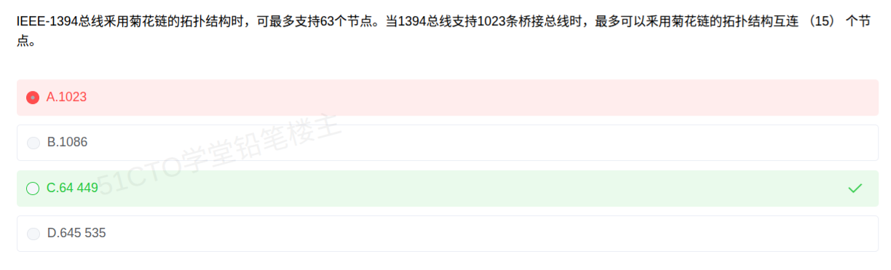

# 备考笔记：IEEE1394总线-菊花链节点数计算

## 一、题目

> IEEE-1394 总线采用菊花链的拓扑结构时，可最多支持 63 个节点。当 1394 总线支持 1023 条桥接总线时，最多可以采用菊花链的拓扑结构互连（15）个节点。
>
> A. 1023
> B. 1086
> C. 64 449
> D. 645 535

**答案：C. 64 449**

解析：每条 1394 总线（菊花链）最多挂 **63 个节点**；支持 **1023 条桥接总线**时，总节点数就是"每条总线的节点数"与"总线条数"的**乘积**：

$$63 \times 1023 = 64449$$

故选 **C**。A"1023"只是**桥接总线的条数**（漏乘 63）；B"1086"是 1023 与 63 **相加**（该乘却用加）；D"645 535"是凭空放大的干扰值。

## 二、知识点：IEEE1394总线-菊花链节点数计算

### 1. 核心原理

IEEE 1394（商用名 **FireWire**，火线）是一种**高速串行总线**，具有如下特性：

- **拓扑结构**：支持**菊花链（Daisy Chain）** 与**树形**结构，采用**点对点**连接、支持**热插拔（热插拔）与即插即用**；
- **单总线节点上限：63 个**（因为 1394 的节点地址用 6 位表示，$$2^6 - 1 = 63$$，地址全 1 保留作广播）；
- **多总线可互连**：通过**桥（Bridge）** 把多条 1394 总线连接成更大的网络，最多支持 **1023 条桥接总线**；
- **理论最大节点数**：把每条总线的节点上限 × 总线条数。

因此本题的核心就是一个"**乘法**"：

$$\text{最多节点数} = \text{单条总线节点上限} \times \text{桥接总线条数} = 63 \times 1023 = 64449$$

### 2. 关键公式/规则

关键数字与公式（建议直接背下这组常数）：

| 项目 | 数值 | 说明 |
| --- | --- | --- |
| 单条 1394 总线最多节点数 | 63 | 由 6 位节点地址决定，$$2^6 - 1 = 63$$ |
| 最多桥接总线条数 | 1023 | 记为 $$2^{10} - 1 = 1023$$ |
| 理论最大节点数（互连后） | 64 449 | $$63 \times 1023 = 64449$$ |

算式拆解（便于口算校验）：

$$63 \times 1023 = 63 \times 1000 + 63 \times 23 = 63000 + 1449 = 64449$$

干扰项是怎么造出来的：

| 选项 | 数值 | 造错方式 |
| --- | --- | --- |
| A | 1023 | 只取"桥接总线条数"，**漏乘 63** |
| B | 1086 | $$1023 + 63 = 1086$$，**该乘却用加** |
| C | 64 449 | $$63 \times 1023$$，**正确** |
| D | 645 535 | 无对应算式，纯放大干扰值 |

### 3. 解题步骤

1. **抓两个已知数**：单条总线最多 **63** 个节点；最多 **1023** 条桥接总线。
2. **判运算关系**：问"互连后**最多**节点数"，是"每条的节点数 × 条数"，属**乘积**关系。
3. **算乘**：$$63 \times 1023$$，用"$$63 \times 1000 + 63 \times 23$$"心算得 **64449**。
4. **排干扰**：1023 是漏乘、1086 是错加，直接排除；选 **C**。
5. **复盘错选**：若选 A（1023），是把"**桥接总线条数**"当成了"节点数"——题目问的是**节点**，不是**总线**。

## 三、易错点

1. **把"总线条数"当成"节点数"**：1023 是总线条数，63 才是单条总线的节点数，二者**相乘**才是节点总数。A 选项正是利用了这种混淆。
2. **该乘却用加**：1086 = 1023 + 63，形式上"两个数都用上了"，但题意是"每条总线各挂 63 个节点"，必须累乘，不能相加。
3. **"63"的来源要清楚**：它不是随便给的数，而是由 6 位节点地址空间决定的（$$2^6 - 1 = 63$$）。理解了来源就不易记错。
4. **注意"最多"二字**：题干两处"最多"对应的是"上限 × 上限"，取的是理论上限值，不需要扣减桥节点等实际开销。
5. **不要与其它总线规范的数字串台**：USB 一条总线最多可连 **127** 个设备（7 位地址），与 1394 的 **63** 不同，别记混。

## 四、扩展延伸

- **地址位数与节点上限的换算**：这是软考常考的"套路"——**节点上限 = 2 的地址位数次方减 1**（减去保留的广播/全 1 地址）。
  - 1394：6 位地址 → $$2^6 - 1 = 63$$；
  - USB：7 位地址 → $$2^7 - 1 = 127$$；
  - 记住这组对应关系，遇到"最多支持多少个设备/节点"就能直接算。
- **IEEE 1394 的常考特性**：
  - **高速串行**总线，支持**热插拔**与**即插即用**；
  - 支持**异步（asynchronous）** 与**等时（isochronous）** 两种传输方式——等时传输适合音视频实时流；
  - 支持**点对点**通信与**供电**（可通过总线供电）；
  - 常见端口形态：4 针（不带供电）与 6 针（带供电）。
- **与之容易对比的总线/接口**：
  - **USB**：树形菊花链结构（星形集线器扩展），最多 127 个设备，支持热插拔；
  - **SATA**：点对点串行，一条线一个设备，不支持多设备级联；
  - **PCIe**：点对点串行、差分信号，属**系统内部**总线，与 1394/USB 这类**外部**总线定位不同。
- **总线分类的常考视角**（可与本题联动记忆）：
  - 按**传输方式**：串行总线 / 并行总线；1394、USB 都属**串行**；
  - 按**位置**：内部总线 / 系统总线 / 外部总线；
  - 按**数据传送方式**：单工 / 半双工 / 全双工。
- **现实类比**：把 1394 网络想成"连锁停车场"。
  - 一条**菊花链总线** = 一个**独立停车场**，最多停 **63** 辆车；
  - **桥** = 连接相邻停车场的**内部通道**，最多把 **1023** 个停车场串成一片园区；
  - 问"整片园区最多停车多少辆"，自然要 **63 辆/场 × 1023 场 = 64449 辆**。
  - 只报"有 1023 个停车场"（选 A），等于报了**车位数以外的数字**——停车场再多，不提每场容量也算不出总车位。

## 五、错题归档

| 题号 | 题型 | 考点 | 难度 | 掌握度 |
| --- | --- | --- | --- | --- |
| 系统分析师-计算机系统（总线与接口） | 单选 | IEEE 1394 菊花链：单总线 63 节点 × 1023 条桥接总线 = 64449 | 易 | 待复习 |

## 六、相关图片

原题截图：`../images/26-IEEE1394总线-菊花链节点数计算.png`（由用户上传的原题截图复制改名而来）

