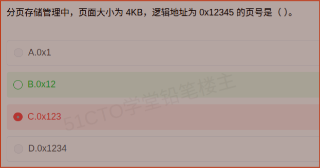

# 备考笔记：分页存储-页号与页内偏移计算

## 一、题目

> 分页存储管理中，页面大小为 4KB，逻辑地址为 0x12345 的页号是（ ）。
>
> A. 0x1
> B. 0x12
> C. 0x123
> D. 0x1234

**答案：B. 0x12**

解析：页面大小为 4KB，即 $$2^{12}$$ 字节，故逻辑地址的低 **12 位**为**页内偏移**，**其余高位**为**页号**。把 0x12345 按 12 位切开：

$$0x12345 = \underbrace{0x12}_{\text{页号}}\;\underbrace{0x345}_{\text{页内偏移}}$$

所以页号为 **0x12**（十进制 18），页内偏移为 0x345。故选 **B**。

## 二、知识点：分页存储-页号与页内偏移计算

### 1. 核心原理

分页存储管理把进程的逻辑地址空间切成等长的**页（Page）**，把内存切成同样大小的**物理块（页框，Frame）**。逻辑地址由两部分拼接而成：

$$\text{逻辑地址} = \text{页号} \times \text{页面大小} + \text{页内偏移}$$

反过来，已知逻辑地址和页面大小时：

$$\text{页号} = \left\lfloor \frac{\text{逻辑地址}}{\text{页面大小}} \right\rfloor \quad , \quad \text{页内偏移} = \text{逻辑地址} \bmod \text{页面大小}$$

**关键简化技巧**：当页面大小是 2 的整数次幂时，乘除等价于**移位**。

| 页面大小 | 表示为 2 的幂 | 页内偏移位数 | 取页号的办法 |
| --- | --- | --- | --- |
| 1KB | $$2^{10}$$ | 10 位 | 逻辑地址右移 10 位 |
| 4KB | $$2^{12}$$ | 12 位 | 逻辑地址**右移 12 位** |
| 8KB | $$2^{13}$$ | 13 位 | 逻辑地址右移 13 位 |

本题中 4KB 对应右移 12 位（十六进制即"**砍掉低 3 位十六进制数**"，因为 1 位十六进制 = 4 位二进制，$$12 / 4 = 3$$）。

### 2. 关键公式/规则

十六进制速算法（最实用的一条）：

| 步骤 | 操作 | 本题 |
| --- | --- | --- |
| 1. 求偏移位数 | 页面大小 = $$2^{k}$$ | 4KB = $$2^{12}$$，k = 12 |
| 2. 换算成十六进制位数 | $$k / 4$$ 位 | $$12 / 4 = 3$$ 位十六进制 |
| 3. 从右数砍掉这几位 | 左边剩下的就是页号 | 0x12345 → 砍掉 345 → **0x12** |
| 4. 被砍掉的部分 | 即页内偏移 | **0x345** |

校验（用回原式）：

$$0x12 \times 4096 + 0x345 = 0x12000 + 0x345 = 0x12345 \;\checkmark$$

干扰项是怎么造出来的——**都是"砍错了位置"**：

| 选项 | 数值 | 错在哪（等效移位） |
| --- | --- | --- |
| A | 0x1 | 右移 16 位（砍掉低 4 位十六进制） |
| B | 0x12 | 右移 12 位 —— **正确** |
| C | 0x123 | 右移 8 位（砍掉低 2 位十六进制），把偏移按 256B 算了 |
| D | 0x1234 | 右移 4 位（砍掉低 1 位十六进制），把偏移按 16B 算了 |

### 3. 解题步骤

1. **定偏移位数**：页面大小 4KB = $$2^{12}$$ → 页内偏移占 **12 位**。
2. **换算十六进制位数**：$$12 / 4 = 3$$ 位十六进制。
3. **切地址**：逻辑地址 0x12345，从右往左数 3 位（3、4、5）为偏移，剩下 0x12 为页号。
4. **回代校验**：$$0x12 \times 4096 + 0x345 = 0x12345$$，无误。
5. **得答案**：页号 **0x12**，选 **B**。

## 三、易错点

1. **偏移位数算错**：4KB 是 $$2^{12}$$ 而非 $$2^{4}$$ 或 $$2^{8}$$，必须换算成**二进制位数**（12 位），不能直接拿"4"或"4096 的位数"去切。C、D 两个选项正是按 8 位、4 位切出来的。
2. **十六进制位数与二进制位数混淆**：1 位十六进制 = 4 位二进制，所以 12 位二进制 = 3 位十六进制。记不住这点，就会在"砍 3 位还是砍 2 位"上出错。
3. **页号与偏移的顺序**：页号在**高位**，偏移在**低位**；别把 0x345 当成页号。
4. **页号从 0 开始**：页号 0x12 = 18 表示"第 **18** 页"（第 0 页是首页）。若题目问"第几页"要注意是否 +1。
5. **逻辑地址 vs 物理地址**：本类题问的是**逻辑地址**到**页号**的换算；物理地址要再经**页表**把页号映射成物理块号后重新拼接，不要混为一谈。

## 四、扩展延伸

- **与第 05 篇的关系**：两道题是同一知识点的两个侧面——
  - [05-分页存储-页表地址映像.md](05-分页存储-页表地址映像.md)：侧重**页表如何完成页号到物理块号的映射**；
  - 本篇：侧重**由逻辑地址反算页号与页内偏移**。
  做题链条是连贯的：**逻辑地址 →（本篇：切出页号）→（查页表）→ 物理块号 → 拼上页内偏移 → 物理地址**。
- **完整的一次地址变换**（常考的"接着往下算"）：
  - 逻辑地址 = [页号 P | 页内偏移 W]；
  - 用 P 查页表得物理块号 B（**页表项 = 物理块号 + 状态/控制位**）；
  - 物理地址 = B × 页面大小 + W。
- **相关的内存管理考点**：
  - **页表**存在内存中，每次访存需**两次访问**（先查页表再取数据）；用 **TLB（快表）** 把常用页表项放入相联存储器，可减少一次访存；
  - **有效访问时间 EAT** 的计算：命中 TLB 与未命中的加权平均；
  - **页面置换算法**：OPT（最优）、FIFO（先进先出）、LRU（最近最久未使用）、CLOCK（时钟）——FIFO 会出现 **Belady 异常**（增加页框反而缺页更多）；
  - **缺页中断**：访问的页不在内存时产生，属**内部中断**；
  - 分页 vs **分段**：页是**物理单位**、大小固定、对用户不可见；段是**逻辑单位**、大小可变、对用户可见；**段页式**则是先分段、段内再分页。
- **现实类比**：把逻辑地址想成"**图书馆索书号**"，页面大小就是"**每排书架的容量**"。
  - 4KB = 每排能放 4096 本书；
  - 索书号 0x12345 表示"总第 0x12345 本"；
  - 用总编号除以每排容量，**商**就是"在第几排书架"（页号 0x12），**余数**就是"在排内第几位"（偏移 0x345）。
  - 若按 256 本一排去算（C），或按 16 本一排去算（D），排号当然会算错——**先确认"每排容量"这个分母，再动手除**。

## 五、错题归档

| 题号 | 题型 | 考点 | 难度 | 掌握度 |
| --- | --- | --- | --- | --- |
| 系统分析师-操作系统（存储管理） | 单选 | 由逻辑地址算页号：页面大小 $$2^k$$ → 偏移 k 位，页号取高位 | 易 | 待复习 |
| 系统分析师-操作系统（存储管理） | 单选 | 页表地址映像（同主题变式，见第 05 篇） | 中 | 待复习 |

## 六、相关图片

原题截图：`../images/27-分页存储-页号与页内偏移计算.png`（由用户上传的原题截图复制改名而来）

