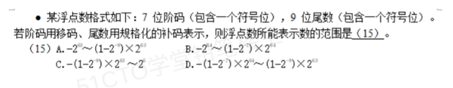

# 备考笔记：浮点数表示范围-移码阶码与规格化补码尾数

## 一、题目

> 某浮点数格式如下：7 位阶码（包含一个符号位），9 位尾数（包含一个符号位）。若阶码用移码、尾数用规格化的补码表示，则浮点数所能表示数的范围是（ ）。
>
> A. $$-2^{63} \sim (1-2^{-8}) \times 2^{63}$$
> B. $$-2^{64} \sim (1-2^{-7}) \times 2^{64}$$
> C. $$-(1-2^{-8}) \times 2^{63} \sim 2^{63}$$
> D. $$-(1-2^{-7}) \times 2^{64} \sim (1-2^{-8}) \times 2^{63}$$

**答案：A**

解析：浮点数的表示范围由**阶码的上限**和**尾数的区间**共同决定：

$$\text{数值} = \text{尾数} \times 2^{\text{阶码}}$$

- **阶码**：7 位含 1 位符号位，即 **6 位数值位**。移码的数值区间为 $$[-2^{6},\; 2^{6}-1] = [-64,\; 63]$$，故**最大阶码为 63**。
- **尾数**：9 位含 1 位符号位，即 **8 位数值位**。规格化补码小数的区间为 $$[-1,\; 1-2^{-8}]$$。

于是：

- **最大正数** = 最大尾数 × 最大阶码 =

$$(1-2^{-8}) \times 2^{63}$$

- **绝对值最大的负数** = 最小尾数 × 最大阶码 =

$$-1 \times 2^{63} = -2^{63}$$

所以可表示的范围是 **A. $$-2^{63} \sim (1-2^{-8}) \times 2^{63}$$**。

## 二、知识点：浮点数表示范围-移码阶码与规格化补码尾数

### 1. 核心原理

浮点数由**阶码（指数）**和**尾数（有效数字）**两部分构成，形如：

$$\text{数值} = \text{尾数} \times 2^{\text{阶码}}$$

- **阶码决定"大小范围"（量级）**：阶码越大，能表示的数越"大"；阶码越小，能表示的数越"精细"。
- **尾数决定"有效位数"（精度）**：尾数位数越多，精度越高。

浮点数能表示的**最大正数**、**最小负数**由"**尾数的极值 × 阶码的极值**"组合得到：

$$\text{最大正数} = \text{尾数最大值} \times 2^{\text{阶码最大值}}$$

$$\text{最小负数} = \text{尾数最小值} \times 2^{\text{阶码最大值}}$$

**为什么负数极值也取"最大阶码"？** 因为要得到"**绝对值最大**的负数"，需要**尾数最负**同时**阶码最大**（把量级放到最大），即 $$-1 \times 2^{63} = -2^{63}$$。

### 2. 关键公式/规则

#### （1）阶码：移码表示

设阶码共 $$k$$ 位（含 1 位符号位），则数值位 $$p = k - 1$$。**移码**（偏移量为 $$2^{p}$$）的取值范围是：

$$[-2^{p},\; 2^{p}-1]$$

| 阶码总位数 k | 数值位 p | 移码范围 | 最大阶码（$$2^{p}-1$$） |
| --- | --- | --- | --- |
| 5 | 4 | $$-16 \sim 15$$ | 15 |
| 7 | 6 | $$-64 \sim 63$$ | **63** |
| 8 | 7 | $$-128 \sim 127$$ | 127 |

本题阶码 7 位 → $$p = 6$$ → 最大阶码 $$= 2^{6}-1 = 63$$。

> 记忆点：**移码的最大值 = $$2^{p}-1$$**（而不是 $$2^{p}$$）。

#### （2）尾数：规格化补码

设尾数共 $$m$$ 位（含 1 位符号位），则数值位 $$n = m - 1$$。**补码**表示的小数（定点小数）区间为：

$$[-1,\; 1-2^{-n}]$$

| 尾数总位数 m | 数值位 n | 补码小数范围 | 最大尾数（$$1-2^{-n}$$） |
| --- | --- | --- | --- |
| 8 | 7 | $$-1 \sim 1-2^{-7}$$ | $$1-2^{-7}$$ |
| 9 | 8 | $$-1 \sim 1-2^{-8}$$ | **$$1-2^{-8}$$** |

本题尾数 9 位 → $$n = 8$$ → 尾数区间 $$[-1,\; 1-2^{-8}]$$。

> **最关键的一条**：补码小数的**负边界是 $$-1$$**（不是 $$-(1-2^{-n})$$）。因为补码 $$1.000\cdots0$$ 恰好表示 $$-1$$，这是补码比原码/反码多出来的一个可表示数。

#### （3）范围合成

| 项目 | 取值 | 来源 |
| --- | --- | --- |
| 阶码最大 | 63 | 7 位移码，$$2^{6}-1$$ |
| 阶码最小 | -64 | 7 位移码，$$-2^{6}$$ |
| 尾数最大 | $$1-2^{-8}$$ | 9 位补码，$$1-2^{-8}$$ |
| 尾数最小 | -1 | 9 位补码，负边界 |

$$\text{最大正数} = (1-2^{-8}) \times 2^{63} \qquad \text{最小负数} = -1 \times 2^{63} = -2^{63}$$

### 3. 解题步骤

1. **拆位宽**：阶码 7 位（含 1 符号位）→ 6 位数值位；尾数 9 位（含 1 符号位）→ 8 位数值位。
2. **算阶码上限**：移码上限 $$= 2^{6}-1 = 63$$。
3. **写尾数区间**：补码小数区间 $$= [-1,\; 1-2^{-8}]$$。
4. **合成范围**：最大正数 $$(1-2^{-8}) \times 2^{63}$$，最小负数 $$-1 \times 2^{63} = -2^{63}$$。
5. **对选项**：与 **A** 完全一致。

### 4. 干扰项逐条拆解

| 选项 | 内容 | 错在哪里 |
| --- | --- | --- |
| A | $$-2^{63} \sim (1-2^{-8}) \times 2^{63}$$ | **正确** |
| B | $$-2^{64} \sim (1-2^{-7}) \times 2^{64}$$ | 阶码上限误算为 $$2^{64}$$（应为 $$2^{63}$$）；尾数位误算成 $$2^{-7}$$（应为 $$2^{-8}$$） |
| C | $$-(1-2^{-8}) \times 2^{63} \sim 2^{63}$$ | 负边界漏掉补码的 $$-1$$（写成 $$-(1-2^{-8})$$）；正边界写成 $$2^{63}$$（应为 $$(1-2^{-8}) \times 2^{63}$$） |
| D | $$-(1-2^{-7}) \times 2^{64} \sim (1-2^{-8}) \times 2^{63}$$ | 阶码上限误写成 $$2^{64}$$；负边界误写成 $$-(1-2^{-7}) \times 2^{64}$$ |

## 三、易错点

1. **补码负边界是 $$-1$$，不是 $$-(1-2^{-n})$$**：这是本题最核心的陷阱。C、D 都用 $$-(1-2^{-8}) \times 2^{63}$$ 或 $$-(1-2^{-7}) \times 2^{64}$$ 作负边界，**漏掉了补码能多表示一个数的 $$-1$$**。补码 $$1.000\cdots0$$ 就是 $$-1$$。
2. **阶码上限别写成 $$2^{p}$$**：$$p$$ 位数值位的移码范围是 $$[-2^{p},\; 2^{p}-1]$$，**上限是 $$2^{p}-1$$**。本题 $$p = 6$$，故上限是 $$2^{6}-1 = 63$$；$$2^{63}$$ 说明底数是 2、指数是 63，别把体感上的"$$2^{64}$$"写进去。
3. **"含一个符号位"要减 1**：题干强调"7 位阶码（包含一个符号位）"——数值位只有 6 位。若不减这 1 位，阶码上限会算成 127，尾数区间会算成 $$[-1, 1-2^{-7}]$$，正好掉进 B、D 的陷阱。
4. **负数极值取"最大阶码"**：求最小负数时要把量级放到最大，即尾数取 $$-1$$、阶码取 63；不要误以为"阶码取最小会得到最小负数"。
5. **规格化意味着区间是"满"的**：规格化补码尾数能覆盖整个 $$[-1, 1-2^{-n}]$$ 区间（$$-1$$ 除外可含），因此直接用这个满区间算极值即可；若题目给的是**原码/反码**尾数，区间则不同（原码小数为 $$-(1-2^{-n}) \sim 1-2^{-n}$$，出现正负两个零）。
6. **移码用于阶码、补码用于尾数是惯例**：移码使阶码"数值越大码值越大"，便于浮点数**比较大小**；补码使加减法统一。题目给定用什么码，就按该码的区间算。

## 四、扩展延伸

- **浮点数的完整表示要素**：一位符号位 + 阶码（决定表示范围与量级）+ 尾数（决定精度）。三者的位宽分配是**精度与范围之间的折中**——阶码位越多范围越大、尾数位越多精度越高，二者此消彼长。
- **规格化的目的**：让尾数的绝对值尽量大（最高有效位非零），从而在给定尾数位数下获得**最高的表示精度**，同时使表示**唯一**。
- **各码制的定点小数区间对比**（尾数若用不同码制，结果不同）：

| 码制 | 定点小数可表示范围 | 零的个数 |
| --- | --- | --- |
| 原码 | $$-(1-2^{-n}) \sim 1-2^{-n}$$ | 2 个（+0、-0） |
| 反码 | $$-(1-2^{-n}) \sim 1-2^{-n}$$ | 2 个（+0、-0） |
| 补码 | $$-1 \sim 1-2^{-n}$$ | 1 个（唯一 0） |
| 移码 | $$-1 \sim 1-2^{-n}$$（同补码符号位取反） | 1 个 |

- **IEEE 754 标准对照**：单精度 float 为"1 位符号 + 8 位阶码 + 23 位尾数"，双精度 double 为"1 位符号 + 11 位阶码 + 52 位尾数"；IEEE 754 采用**隐含最高位 1** 的规格化表示，与本题"明写符号位"的经典考法不同，但**"阶码定范围、尾数定精度"的结论一致**。
- **与第 06 篇的关系**：[06-系统可靠性-串并联冗余模型.md](06-系统可靠性-串并联冗余模型.md) 讲的是数据表示之外的可靠性计算；本篇属**数据表示**范畴，二者同属"三、计算机系统"章节的不同考点。
- **现实类比**：把浮点数想成"**科学计数法**"——$$3.14 \times 10^{5}$$。
  - **尾数** $$3.14$$ 是"有效数字"（决定**精度**）；
  - **阶码** $$5$$ 是"数量级"（决定**范围**）；
  - 本题就是问"有效数字最大能到多少、数量级最大能到多少"→ 相乘即得最大正数，再配最负的尾数即得最小负数。

## 五、错题归档

| 题号 | 题型 | 考点 | 难度 | 掌握度 |
| --- | --- | --- | --- | --- |
| 系统分析师-计算机系统（数据表示） | 单选 | 浮点数表示范围：移码阶码上限 $$2^{p}-1$$ + 规格化补码尾数区间 $$[-1, 1-2^{-n}]$$ | 中 | 待复习 |
| 系统分析师-计算机系统（数据表示） | 单选 | 补码负边界为 $$-1$$（同主题变式，结合各码制定点小数区间辨析） | 中 | 待复习 |

## 六、相关图片

原题截图：`../images/28-浮点数表示范围-移码阶码与规格化补码尾数.png`（由用户上传的原题截图复制改名而来）

