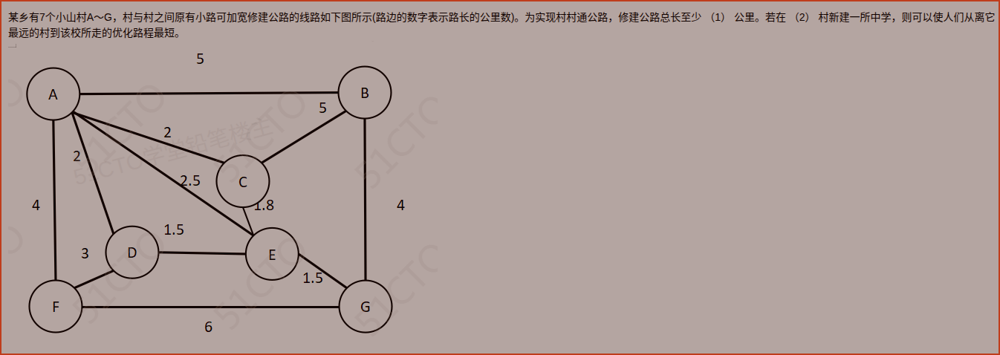

# 备考笔记：最小生成树与图中心选址

## 一、题目

> 某乡有 7 个小山村 A\~G，村与村之间原有小路可加宽修建公路的线路如下图所示（路边的数字表示路长的公里数）。为实现村村通公路，修建公路总长至少 （1） 公里。若在 （2） 村新建一所中学，则可以使人们从离它最远的村到该校所走的优化路程最短。

图中各村的连通关系与路长（公里）如下：

| 边   | 路长  | 边   | 路长  |
| --- | --- | --- | --- |
| A-B | 5   | A-C | 2   |
| A-D | 2   | A-E | 2.5 |
| A-F | 4   | B-C | 5   |
| B-G | 4   | C-E | 1.8 |
| D-E | 1.5 | D-F | 3   |
| E-G | 1.5 | F-G | 6   |

**答案：（1）13.8 公里　（2）A 村**

解析：本题一问两模型——

- 第（1）问"村村通公路、总长至少"= 求**最小生成树**（MST）的权和。
- 第（2）问"离它最远的村到该校路程最短"= 求**图的中心**（偏心距最小点）：对每个候选村求"到其余各村的**最长**最短路径"，再取其中**最小**者。

MST 边集为 {D-E, E-G, C-E, A-C, D-F, B-G}，总长 $1.5+1.5+1.8+2+3+4=13.8$；各点偏心距中 A 村最小（$e(\text{A})=5$），故（2）选 **A 村**。

## 二、知识点：最小生成树与图中心选址

### 1. 核心原理

一道题里藏了两个经典的**图论优化模型**：

**（1）村村通公路、造价最低 → 最小生成树（MST）**

要把 7 个村用公路连成一片（任意两村可达），且**总路长最小**。这样的方案必然是一棵**树**：$n$ 个顶点只用 $n-1$ 条边、且**不含环**（有环就可以删掉环上最长的一条边，反而更省）。所以问题归结为求**最小生成树**。

**（2）建中学使"最远的村"路程最短 → 图的中心**

"最远的村到该校的路程"就是该校到其余各村**最短距离中的最大值**，称为该点的**偏心距** $e(v)$。要求"这个最远路程最短"，即求偏心距最小的点，称为**图的中心**：

$\text{中心} = \arg\min_{v} e(v), \qquad e(v) = \max_{u} d(v, u)$

> 这是 **min-max（让最坏情况最好）**，而不是 min-sum（让总距离最小）——后者求的是"重心/中位点"，两者常被混淆。

### 2. 关键公式/规则

| 名称            | 定义                  | 常用算法                             |
| ------------- | ------------------- | -------------------------------- |
| 最小生成树 MST     | 连通所有顶点、权和最小的无环子图    | Kruskal（边权升序 + 并查集防环）、Prim（点集扩张） |
| 最短路径 $d(v,u)$ | 两点间权和最小的路径          | Dijkstra（非负权，单源）、Floyd（任意两点）     |
| 偏心距 $e(v)$    | $\max_{u} d(v,u)$   | 对每个点各跑一次单源最短路                    |
| 图的中心          | $\arg\min_{v} e(v)$ | 比较各点偏心距，取最小                      |
| 图的直径          | $\max_{v} e(v)$     | 所有偏心距中的最大值                       |

### 3. 解题步骤

**第 1 步：列全边权**（共 12 条边）——

A-B=5，A-C=2，A-D=2，A-E=2.5，A-F=4，B-C=5，B-G=4，C-E=1.8，D-E=1.5，D-F=3，E-G=1.5，F-G=6。

**第 2 步：Kruskal 求 MST**——按边权升序选边，不成环就加入，直到选满 $7-1=6$ 条。

| 序  | 边   | 权   | 处理                      | 累计权  |
| -- | --- | --- | ----------------------- | ---- |
| 1  | D-E | 1.5 | 加入                      | 1.5  |
| 2  | E-G | 1.5 | 加入                      | 3.0  |
| 3  | C-E | 1.8 | 加入                      | 4.8  |
| 4  | A-C | 2   | 加入                      | 6.8  |
| 5  | A-D | 2   | 弃（A、D 已连通，成环 A-C-E-D-A） | 6.8  |
| 6  | A-E | 2.5 | 弃（A、E 已连通，成环）           | 6.8  |
| 7  | D-F | 3   | 加入                      | 9.8  |
| 8  | A-F | 4   | 弃（A、F 已连通，成环）           | 9.8  |
| 9  | B-G | 4   | 加入                      | 13.8 |
| 10 | A-B | 5   | 弃（成环）                   | 13.8 |
| 11 | B-C | 5   | 弃（成环）                   | 13.8 |
| 12 | F-G | 6   | 弃（成环）                   | 13.8 |

MST 边集：$\{D\text{-}E,\; E\text{-}G,\; C\text{-}E,\; A\text{-}C,\; D\text{-}F,\; B\text{-}G\}$

$\text{总长} = 1.5+1.5+1.8+2+3+4 = 13.8\ \text{公里}$

**第 3 步：逐点求偏心距**——对每个村跑一次 Dijkstra，取"到其余各村的**最长**最短路径"。

| 起点 \ 终点 | A   | B   | C   | D   | E   | F   | G   | **偏心距 e** |
| ------- | --- | --- | --- | --- | --- | --- | --- | --------- |
| A       | 0   | 5   | 2   | 2   | 2.5 | 4   | 4   | **5**     |
| B       | 5   | 0   | 5   | 7   | 5.5 | 9   | 4   | 9         |
| C       | 2   | 5   | 0   | 3.3 | 1.8 | 6   | 3.3 | 6.3       |
| D       | 2   | 7   | 3.3 | 0   | 1.5 | 3   | 3   | 7         |
| E       | 2.5 | 5.5 | 1.8 | 1.5 | 0   | 4.5 | 1.5 | 5.5       |
| F       | 4   | 9   | 6   | 3   | 4.5 | 0   | 6   | 9         |
| G       | 4   | 4   | 3.3 | 3   | 1.5 | 6   | 0   | 6         |

**第 4 步：取最小偏心距**——最小值为 $5$，出现在 **A 村**（离 A 最远的是 B 村，距离 5 公里）。故（2）选 **A 村**。

> 上述最短路并非都走直达边（这是本题的隐藏考点）。例如从 A 到 F：直达 4，绕 A-D-F 为 $2+3=5$，取 **4**；从 G 到 F：直达 6，绕 G-E-D-F 为 $1.5+1.5+3=6$，两者相等。必须做"直达 vs 绕行"的比较，不能只看直连边。

### 4. 两个模型对照

| 维度   | 第（1）问               | 第（2）问                      |
| ---- | ------------------- | -------------------------- |
| 目标   | 总造价最小               | 最远用户出行最短                   |
| 数学模型 | 最小生成树（min-sum，无环连通） | 图的中心（min-max，偏心距最小）        |
| 算法   | Kruskal / Prim      | 每点 Dijkstra + 取 max，再取 min |
| 输出   | 6 条边的边集与总长 13.8     | 一个顶点（A）                    |

## 三、易错点

1. **"总长至少"≠ 最短路径**：这是"要把所有村连成一片"（MST，$n-1$ 条边），不是"两点之间走哪条路最短"（最短路）。若误按最短路去累加，得不到 13.8。
2. **MST 必须防环**：Kruskal 选边时每一步都要判断"两端是否已连通"，一旦成环就丢弃。本题边权相同的边（A-C 与 A-D 都是 2；A-F 与 B-G 都是 4）**并不都要选**，只选不成环的那条——A-D、A-F 因成环被弃，B-G 被选。
3. **选址别凭直觉**：不能选"度数最高"的点（A 与 E 度数都很高），也不能选"几何中心"。必须老老实实算每点的**偏心距**。本题 A=5、E=5.5、C=6、G=6、D=7、B=F=9，最小在 A。
4. **min-max 还是 min-sum**：题目说"从**离它最远**的村到该校所走的优化路程最短"，是**最小化最大值**（图中心）。若误读成"所有村到学校总路程最短"，那是**重心/中位点**（1-median），结果会不同。
5. **最短路要考虑绕行**：A→F 的直达边是 4，但若误以为必须"挑一条最长的直达边"，或漏掉 A-D-E-G 等绕行比较，都会算错偏心距。逐点用 Dijkstra/表格法完整迭代最稳妥。
6. **边权可为小数**：本题出现 1.5、1.8、2.5，结果 13.8 是小数，不要因为"看着不像整数"而怀疑答案。

## 四、扩展延伸

- **图中心 vs 图重心（中位点）**：

| 名称       | 目标函数                   | 含义               | 典型场景        |
| -------- | ---------------------- | ---------------- | ----------- |
| 图的中心     | $\min_v \max_u d(v,u)$ | 让**最坏**情况最好（公平性） | 中学、消防站、医院选址 |
| 图重心（中位点） | $\min_v \sum_u d(v,u)$ | 让**总距离**最小（效率）   | 物流仓库、快递集散中心 |

- **最小生成树的两大算法**：
  - **Kruskal**：把边按权升序排，逐条尝试，用**并查集**判断是否成环，选满 $n-1$ 条即止。适合**稀疏图**（边少）。
  - **Prim**：从一个点出发，每次把"连接已选点集与未选点集的最小边"加入（贪心扩张）。适合**稠密图**（点少边多）。
  - 两者都基于**贪心**且都能得到最优解。
- **最短路径的两大算法**：
  - **Dijkstra**：单源、要求**边权非负**，逐步"确定"当前最近的未访问点（贪心）。
  - **Floyd**：三重循环，可求**任意两点**的最短路，允许负权（不含负环），适合小规模稠密图；本题 $n=7$，用 Floyd 也很方便。
- **现实类比**：
  - **村村通公路 / 电网布线 / 光纤入户** → 最小生成树（用最少线缆连通所有节点）。
  - **基站、消防站、急救中心选址** → 图的中心（保证最远的那户也能最快到达），核心是"最坏的通行时间尽量短"。
- **与已有笔记的联系**：本篇属**图论与运筹**考点（图的最优化），与 [20-计算机系统性能评价方法.md](20-计算机系统性能评价方法.md) 同属"算法/数量"类思维；与 [06-系统可靠性-串并联冗余模型.md](06-系统可靠性-串并联冗余模型.md) 的"网络模型"角度互补。

## 五、错题归档

| 题号                | 题型 | 考点                                                | 难度 | 掌握度 |
| ----------------- | -- | ------------------------------------------------- | -- | --- |
| 系统分析师-数学与经济管理（图论） | 单选 | 最小生成树（Kruskal 防环）求村村通公路最短总长 = 13.8                | 中  | 待复习 |
| 系统分析师-数学与经济管理（图论） | 单选 | 图的中心（偏心距 min-max）选址，最短路含绕行比较（同主题变式，对比图重心 min-sum） | 中  | 待复习 |

## 六、相关图片

原题截图：`../images/29-最小生成树与图中心选址.png`（由用户上传的原题截图复制改名而来）

