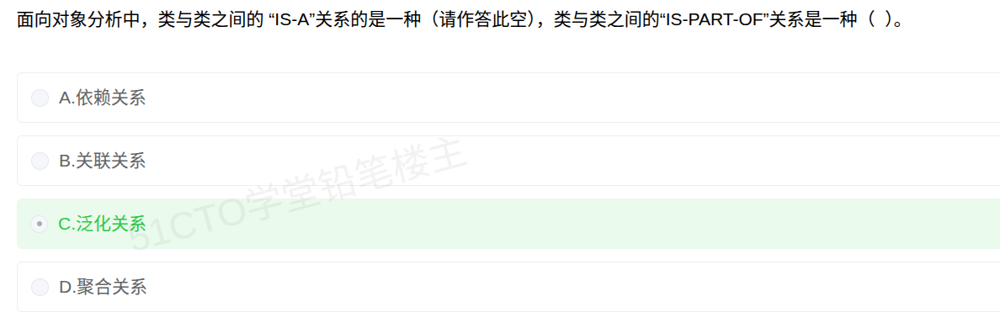

# 备考笔记：面向对象-泛化与聚合关系

## 一、题目

> 面向对象分析中，类与类之间的"IS-A"关系是一种（请作答此空），类与类之间的"IS-PART-OF"关系是一种（ ）。
> A. 依赖关系
> B. 关联关系
> C. 泛化关系
> D. 聚合关系

**答案：（1）C. 泛化关系　（2）D. 聚合关系**

解析：本题两个空，考的正是**英文语义**到**中文术语**的对应。

- 空（1）"IS-A"=「是一种」，描述"子类是一般的父类的一个特例"，即**继承/分类**关系，对应 **C. 泛化关系**（Generalization）。
- 空（2）"IS-PART-OF"=「是一部分」，描述"整体与部分"，属于整体-部分关系，四个选项中只有 **D. 聚合关系**（Aggregation，弱整体-部分）对应此语义。

一句话记忆：**is-a 走泛化，is-part-of 走聚合**。

## 二、知识点：面向对象类间关系

### 1. 核心原理

面向对象分析（OOA）里，类与类之间的关系可以从"**语义（英文说法）**"和"**UML 图形**"两个角度识别。软考选择题常直接拿英文短语来问中文术语，因此**先记英文语义**是最省力的破题方式：

| 英文语义  | 中文含义  | 对应关系   |
| ----- | ----- | ------ |
| use-a | 使用      | 依赖关系   |
| knows-a / has-a | 知道 / 持有 | 关联关系   |
| is-a  | 是一种     | **泛化关系** |
| is-part-of | 是一部分    | 聚合 / 组合 |

本题的两个空：

- **IS-A → 泛化关系**：`汽车 is-a 交通工具`、`学生 is-a 人`。子类**继承**父类的属性与方法，是一种"纵向分类"。
- **IS-PART-OF → 聚合关系**：`发动机 is-part-of 汽车`、`学生 is-part-of 班级`。它是**整体-部分**关系；若"部分"可以脱离"整体"独立存在，就是弱整体-部分的**聚合**（若不能独立存在，则是更强的**组合**）。

四选项中的 A.依赖、B.关联都不能表达"是一种"；D.聚合只能表达"是一部分"——所以两个空必然分别落在 C 与 D 上，不会重复。

### 2. 关键公式/规则

面向对象中常见六种关系，对照如下：

| 关系   | 英文        | 语义        | UML 画法（速记）              | 典型例子         |
| ---- | --------- | --------- | ----------------------- | ------------ |
| 依赖关系 | Dependency | use-a（使用） | **虚线 + 开口箭头** → 被使用者    | 人 → 工具、方法参数  |
| 关联关系 | Association | knows-a / has-a | **实线**（可带箭头、角色名、多重性）   | 老师 — 学生、公司 — 员工 |
| 聚合关系 | Aggregation | is-part-of（弱整体-部分） | **实线 + 空心菱形**，菱形在**整体端** | 电脑 ◇— 鼠标、班级 ◇— 学生 |
| 组合关系 | Composition | is-part-of（强整体-部分） | **实线 + 实心菱形**，菱形在**整体端** | 人 ◆— 心脏、订单 ◆— 订单项 |
| 泛化关系 | Generalization | **is-a**（是一种） | **实线 + 空心三角箭头**，箭头指向**父类** | 汽车 ▷— 交通工具 |
| 实现关系 | Realization | 类实现接口     | **虚线 + 空心三角箭头**，箭头指向**接口** | 类 ▷- - 接口     |

> 速记：**三角形指父（泛化/实现），菱形指整体（聚合/组合）；三角实线是继承、三角虚线是实现；菱形空心是弱（聚合）、实心是强（组合）。**

若把"耦合（关联）强度"由**弱到强**排一条线，可以记住：

`依赖（最弱）` 由弱到强依次是 `依赖 → 关联 → 聚合 → 组合（最强）`。

而**泛化不属于耦合强弱这条线**——它是"分类/继承"维度（纵向的 is-a），与"整体-部分"维度（横向的 is-part-of）是两条不同的轴，切勿混排。

### 3. 解题步骤

1. **先翻译英文**：IS-A = 是一种；IS-PART-OF = 是一部分。
2. **对号入座**：
   - "是一种/继承/分类" → **泛化关系**（UML 空心三角指向父类）；
   - "是一部分/整体与部分" → **聚合/组合**（UML 菱形指向整体）。
3. **判是否可独立存在**（仅当要区分聚合与组合时）：
   - 部分能脱离整体**独立存在** → **聚合**（弱）；如"鼠标—电脑""学生—班级"。
   - 部分**不能**脱离整体存在 → **组合**（强）；如"心脏—人""订单项—订单"，整体销毁则部分随之销毁。
4. **本题**：空（1）is-a → 泛化（C）；空（2）is-part-of → 聚合（D）。注意选项表是同一套（A~D），两个空取不同项。

## 三、易错点

1. **is-a 与 is-part-of 张冠李戴**：把 IS-A 当成聚合、或把 IS-PART-OF 当成泛化，都会反向丢分。口诀：**"is-a 泛化（继承），is-part-of 聚合（整体-部分）"**。
2. **聚合 vs 组合分不清**：两者都是"整体-部分"（都是 is-part-of），区别只在**部分能否独立存在**。能独立存活 = 聚合（空心菱形）；随整体存亡 = 组合（实心菱形）。本题只问 is-part-of，未要求细分强弱，故答**聚合**即可。
3. **关联 ≠ 依赖**：关联是"类之间**长期稳定**的结构联系"（有成员变量持有对方）；依赖是"**临时**的使用关系"（只在某个方法里用到，如作为参数/局部变量）。看"是否持有"即可区分。
4. **泛化 ≠ 实现**：两者 UML 都是**空心三角箭头**，差别在**线型**与**指向对象**——泛化是**实线**、指向**父类**（类继承类）；实现是**虚线**、指向**接口**（类实现接口）。
5. **别把泛化当成强弱耦合的一种**：泛化是"分类/继承"轴，不参与"依赖→关联→聚合→组合"的耦合强弱排序；选项里若同时出现"关联"与"泛化"，用"是不是 is-a"来判，而不要用强弱去比。
6. **双空题只答一空**：本题是"（请作答此空）"的双空题，作答要**两个空都给出**——空（1）C. 泛化关系，空（2）D. 聚合关系，不要因为高亮只标了一个空就漏答另一个。

## 四、扩展延伸

- **两条轴，两种关系维度**：
  - **分类轴（纵向）**：is-a，对应**泛化/继承**，回答"这是什么"。
  - **结构轴（横向）**：is-part-of，对应**聚合/组合**，回答"由什么组成"。
  面向对象分析时，先问"是不是一类"（泛化），再问"是不是组成部分"（聚合/组合），是区分二者的稳定思路。
- **聚合/组合的现实类比**：
  - **聚合（弱）**：电脑与鼠标、班级与学生、球队与球员——整体没了，部分（鼠标、学生、球员）仍可独立存在。
  - **组合（强）**：人与心脏、订单与订单项、窗口与窗口内的滚动条——整体销毁时，部分一并消亡。
- **与面向对象三大特征的联系**：
  - **封装**：把属性与操作打包，对外隐藏实现；
  - **继承**：正是**泛化关系**的代码落地（子类 extends 父类），实现"is-a"复用；
  - **多态**：父类引用指向子类对象，建立在**泛化 + 重写**之上。
  可见泛化关系是"继承/多态"的建模基础。
- **与已有笔记的联系**：本篇属**软件工程/系统分析与设计（面向对象分析）**考点，与 [22-构件接口不兼容的常见问题.md](22-构件接口不兼容的常见问题.md) 同属面向对象/构件化设计主题；"类间关系 → 接口/构件接口"可对照理解"实现关系"如何在构件层面演化为"接口契约"。

## 五、错题归档

| 题号 | 题型 | 考点 | 难度 | 掌握度 |
| --- | --- | --- | --- | --- |
| 系统分析师-软件工程（面向对象分析） | 单选（双空） | is-a 对应泛化关系（继承/分类），UML 空心三角指向父类 | 中 | 待复习 |
| 系统分析师-软件工程（面向对象分析） | 单选（双空） | is-part-of 对应聚合关系（弱整体-部分，空心菱形指向整体），与组合（实心菱形）辨析 | 中 | 待复习 |

## 六、相关图片

原题截图：`../images/30-面向对象-泛化与聚合关系.png`（由用户上传的原题截图复制改名而来）

