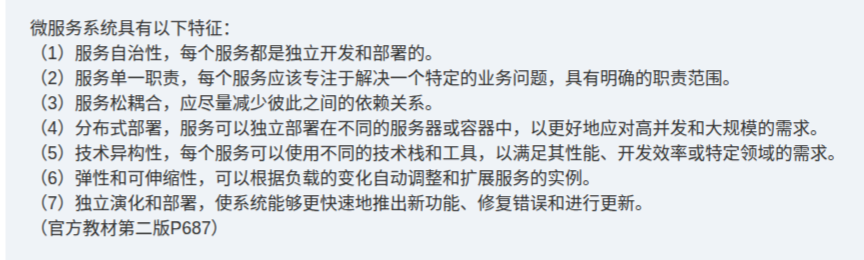

# 备考笔记：微服务系统特征

## 一、题目

> （高频知识点摘录 · 官方教材第二版 P687）
>
> 微服务系统具有以下特征：
>
> (1) **服务自治性**，每个服务都是独立开发和部署的。
> (2) **服务单一职责**，每个服务应该专注于解决一个特定的业务问题，具有明确的职责范围。
> (3) **服务松耦合**，应尽量减少彼此之间的依赖关系。
> (4) **分布式部署**，服务可以独立部署在不同的服务器或容器中，以更好地应对高并发和大规模的需求。
> (5) **技术异构性**，每个服务可以使用不同的技术栈和工具，以满足其性能、开发效率或特定领域的需求。
> (6) **弹性和可伸缩性**，可以根据负载的变化自动调整和扩展服务的实例。
> (7) **独立演化和部署**，使系统能够更快速地推出新功能、修复错误和进行更新。

**答案：微服务的七大特征——服务自治、单一职责、松耦合、分布式部署、技术异构、弹性与可伸缩、独立演化和部署。**

解析：微服务架构的落脚点是"**拆**"与"**独**"——把一个单体应用按业务能力**拆**成一组小服务，每个服务都**独**立开发、部署、运行与演化。七条特征可归为三组：**边界与内聚**（自治、单一职责）、**解耦与部署**（松耦合、分布式部署、技术异构）、**运行与演进**（弹性可伸缩、独立演化）。考题常以"以下不属于微服务特征的是"或与 SOA/单体架构对比的方式出现，判断标准就是"该服务是否可独立开发、部署、伸缩、替换"。

## 二、知识点：微服务系统特征

### 1. 核心原理

**微服务（Microservices）** 是一种以**业务能力**为边界、把应用拆分为**一组小型自治服务**的架构风格。每个服务：运行在**独立进程**中、通过**轻量级通信机制**（如 HTTP/REST、gRPC、消息队列）交互、可**独立部署与升级**、可由**不同团队**用**不同技术栈**实现。

七大特征逐条理解：

- **服务自治性**：服务自带完整的运行环境与生命周期，能独立开发、独立部署、独立运行，一个服务的代码变更不强制其它服务同步发版。
- **服务单一职责**：拆分粒度遵循"做好一件事"，每个服务对应一个特定业务问题/业务能力，职责范围明确（对应设计原则中的 **单一职责原则 SRP**）。
- **服务松耦合**：服务之间尽量减少直接依赖，通过定义良好的**接口/契约**通信，一方内部实现变化不应影响另一方（对应**低耦合**目标）。
- **分布式部署**：服务可分散部署在不同服务器或容器（如 Kubernetes Pod）上，通过水平扩展应对高并发与大规模访问。
- **技术异构性**：不同服务可按需选用不同语言、框架、数据库（如计算密集用 Go、数据分析用 Python），互不约束。
- **弹性和可伸缩性**：可根据负载自动**扩/缩容**服务实例（弹性伸缩），并在故障时具备降级、熔断、限流等自愈能力。
- **独立演化和部署**：服务可独立迭代发版，缩短交付周期，更快推出新功能、修复缺陷。

一句话记忆：**自治一小步，独立一大步；拆分靠业务，协作靠契约。**

### 2. 关键公式/规则

七大特征速查表：

| 特征 | 含义要点 | 关键词 |
| --- | --- | --- |
| 服务自治性 | 独立开发、独立部署、独立运行 | 自治 |
| 服务单一职责 | 聚焦一个业务问题，职责明确 | 内聚 |
| 服务松耦合 | 减少服务间依赖，靠接口通信 | 契约 |
| 分布式部署 | 可分散部署到多服务器/容器 | 分布式 |
| 技术异构性 | 各服务可用不同技术栈和工具 | 异构 |
| 弹性和可伸缩性 | 按负载自动调整、扩展实例 | 伸缩 |
| 独立演化和部署 | 独立发版、快速迭代 | 演化 |

对比辨析（判断架构风格的关键）：

| 维度 | 单体架构 | SOA | 微服务 |
| --- | --- | --- | --- |
| 拆分粒度 | 不拆，一个整体 | 粗粒度服务 | 细粒度、按业务能力 |
| 通信方式 | 进程内调用 | **ESB（企业服务总线）** 集中式 | 轻量级（REST/gRPC/MQ），去中心化 |
| 数据管理 | 单一数据库 | 可共享数据库 | 各服务**独立数据库**（去中心化数据管理） |
| 部署方式 | 整体部署 | 相对集中 | 独立部署、容器化 |
| 技术栈 | 统一 | 相对统一 | 可异构 |
| 典型代价 | 可维护性差 | 总线复杂、重量级 | 分布式复杂度、运维成本高 |

> 记忆锚点：微服务的七特征本质是 **"六个独立"** ——独立开发、独立部署、独立运行、独立选型、独立伸缩、独立演化。

### 3. 解题步骤

1. **抓题干设问方向**：先看清问"属于"还是"不属于"，是"微服务特征"还是"SOA 特征"。
2. **回归七特征清单**：自治性、单一职责、松耦合、分布式部署、技术异构、弹性可伸缩、独立演化。
3. **逐项比对关键词**：
   - 出现"独立开发/部署""各服务不同技术栈""按负载自动扩缩""独立数据库"→ 属微服务；
   - 出现"集中式 ESB""统一数据库""整体打包发布"→ 偏 SOA / 单体，不属微服务。
4. **排除编造项**：如"服务间必须强依赖""全局统一技术栈""单点集中总线"等与"自治、松耦合、异构"相矛盾的描述，必为干扰项。
5. **锁定答案并复核**：确认所选特征在教材七条之内。

## 三、易错点

1. **微服务 ≠ SOA**：二者都"服务化"，但 SOA 常用**集中式 ESB**、粒度粗、可共享数据库；微服务强调**去中心化、轻量通信、细粒度、独立数据存储**。看到"ESB/企业服务总线"要警惕是 SOA。
2. **"松耦合"不等于"无耦合"**：微服务只是**尽量减少**依赖并通过接口契约协作，服务之间仍需通信，不存在完全无依赖。
3. **"技术异构性"是权利而非义务**：允许不同服务用不同技术栈，并非要求每个服务都必须用不同技术。
4. **"独立部署"与"分布式部署"别混**：前者强调**各自发版、互不牵连**（演化维度）；后者强调**物理上分散在多台服务器/容器**（部署拓扑维度）。
5. **弹性（elasticity）与可伸缩（scalability）常被等同**：可伸缩偏向"能扩"，弹性偏向"按负载**自动**动态扩缩"，二者常连用但侧重点不同。
6. **独立数据库易被忽略**：微服务提倡**每个服务独享数据库**（Database per Service），这是"松耦合 + 独立演化"在数据层的体现，也是与共享库架构的重要分界。
7. **代价也是考点**：微服务并非只有优点——分布式事务、服务治理、链路追踪、运维复杂度都是其代价，反向题可能借此设置"优点/缺点"干扰项。

## 四、扩展延伸

- **配套的核心组件**：服务注册与发现、API 网关、配置中心、负载均衡、熔断/限流/降级、分布式链路追踪、容器编排（Kubernetes）。
- **设计原则呼应**：微服务的"单一职责、松耦合"正是 **SOLID** 中 **SRP（单一职责）** 与 **高内聚低耦合** 思想在架构层的放大。
- **数据一致性**：因各服务独立数据库，跨服务事务无法用传统 2PC 简单解决，常用 **Saga（补偿事务）**、**最终一致性**、事件驱动（Eventual Consistency）来替代强一致。
- **与相关笔记的联系**：
  - [18-云计算服务模式-IaaS-PaaS-SaaS.md](18-云计算服务模式-IaaS-PaaS-SaaS.md)：微服务的"技术异构、弹性可伸缩"高度依赖**容器 + 云平台**提供的基础设施弹性；
  - [16-分布式数据库-CAP理论.md](16-分布式数据库-CAP理论.md)：微服务分布式部署 + 独立数据库，一致性取舍离不开 **CAP** 权衡；
  - [17-分布式缓存与文件存储辨析.md](17-分布式缓存与文件存储辨析.md)：都属于"分布式/基础设施"主题簇。
- **现实类比**：单体架构像**一家全能大食堂**（一个团队、一套设备、一起开饭）；微服务像**美食街的独立档口**——每家自备厨师（技术栈）、自主营业（独立部署）、各管各的账（独立数据库），靠统一规则（接口契约）协作，顾客多时各自加灶（弹性伸缩）。

## 五、错题归档

| 题号 | 题型 | 考点 | 难度 | 掌握度 |
| --- | --- | --- | --- | --- |
| 系统分析师-系统架构设计（微服务） | 单选 | 微服务系统七大特征：自治、单一职责、松耦合、分布式部署、技术异构、弹性可伸缩、独立演化 | 易 | 待复习 |
| 系统分析师-系统架构设计（微服务） | 单选 | 微服务与 SOA/单体架构的辨析（ESB、独立数据库、去中心化） | 中 | 待复习 |

## 六、相关图片

原题截图：`../images/32-微服务系统特征.png`（由用户上传的知识点截图复制改名而来）

