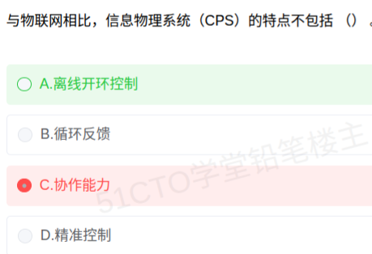

# 备考笔记：信息物理系统CPS与物联网辨析

## 一、题目

> 与物联网相比，信息物理系统（CPS）的特点不包括（  ）。
>
> A. 离线开环控制
> B. 循环反馈
> C. 协作能力
> D. 精准控制

**答案：A. 离线开环控制**

解析：信息物理系统（CPS，Cyber-Physical Systems）的本质是**计算、通信与控制（3C）的深度融合**，实现物理世界与信息世界的**实时闭环交互**。其典型特点是**循环反馈（闭环）、精准控制、协作能力**，以及深度感知、实时性、自治性等——它们都是"控制"取向的能力。物联网（IoT）则更侧重"**感知 + 互联**"：把物理世界的数据采集并上传汇聚，控制环节相对薄弱，常表现为**开环、离线**的控制方式。因此"离线开环控制"描述的是物联网一侧的特征，**不是 CPS 的特点**，是本题"不包括"的一项。C.协作能力恰恰是 CPS 的典型特征之一，不能选。

## 二、知识点：信息物理系统（CPS）与物联网（IoT）辨析

### 1. 核心原理

**CPS（信息物理系统）** 是**计算、通信、控制（3C, Computation / Communication / Control）** 与物理过程深度耦合的系统，通过**实时感知—计算决策—精准控制**的闭环，实现物理世界与信息世界的融合。

**IoT（物联网）** 侧重**感知层 + 网络层的"万物互联"**：用传感器采集物理数据，经网络汇聚与共享，实现物的识别、监控与信息交互。

二者关系：**物联网是 CPS 的重要基础与感知手段，CPS 在物联网之上强化了"控制"与"闭环"。** 判别的核心就一句话：

> **物联网重在"感知与连接"（开环、偏信息侧）；CPS 重在"计算与控制的融合"（闭环、偏物理侧）。**

CPS 与物联网相比的典型特点：

| 特点 | 含义 |
| --- | --- |
| 循环反馈 | 感知 → 计算 → 控制 → 再感知，形成**闭环反馈** |
| 精准控制 | 基于实时数据对物理过程做**精确、实时**的控制 |
| 协作能力 | 多个子系统/设备之间**协同**完成复杂任务 |
| 深度感知 | 更强调与物理过程同步的高精度、实时感知 |
| 自治/自适应 | 能根据环境变化自主调整与优化 |

### 2. 关键公式/规则

CPS 与 IoT 对照表：

| 维度 | 物联网（IoT） | 信息物理系统（CPS） |
| --- | --- | --- |
| 核心 | 感知 + 互联（万物相连） | 3C 融合（计算+通信+控制） |
| 控制方式 | 多为**开环/离线**控制 | **闭环/在线**的循环反馈 |
| 与控制关系 | 控制能力弱，侧重数据采集上传 | 控制是核心，强调**精准控制** |
| 协同 | 以数据共享为主 | 强调子系统间**协作** |
| 与物理世界 | 偏"看得见"（感知） | 偏"动得了"（作用与控制） |

记忆锚点：

- **CPS = 3C = Computation + Communication + Control**，核心是 **Control（控制）**，所以必然**闭环、在线、精准**；
- **"离线开环控制" = 物联网侧的描述**，凡出现"离线""开环"，通常**不属于 CPS**；
- 循环反馈、精准控制、协作能力 → **都是 CPS 的特点**，反向设问时不能选。

### 3. 解题步骤

1. **看设问方向**：题干问"与物联网相比，CPS 的特点**不包括**"，是反向选择。
2. **回忆 CPS 特征清单**：循环反馈、精准控制、协作能力、深度感知、自治/自适应——CPS 一切都围绕"**实时闭环控制**"。
3. **逐项比对**：
   - B.循环反馈 → CPS 的闭环本质，**属于**；
   - C.协作能力 → CPS 多系统协同的特点，**属于**；
   - D.精准控制 → CPS 控制取向的核心，**属于**；
   - A.离线开环控制 → 与 CPS"闭环、在线、精准"矛盾，**是物联网侧特征，不属于**。
4. **锁定 A**，并复核是否落入"反向设问"陷阱。

## 三、易错点

1. **反向设问易失手**：题干问"**不包括**"，一字之差结果全反。建议先在题干圈出"不包括/不属于"。
2. **误把"协作能力"当成 IoT 独有**：协作能力是 **CPS 的典型特点**（多个物理子系统协同完成复杂任务），不是物联网独享，因此不能选 C。
3. **"离线开环控制"是物联网侧描述**：IoT 偏感知与互联，控制环节弱，常为开环、离线；把它当成 CPS 的特点就错了。
4. **抓住"控制"二字**：CPS 的 C 里含 **Control（控制）**，其控制是**在线、闭环、精准**的；凡"离线/开环"必与之相悖。
5. **CPS 与 IoT 常被混为一谈**：二者都涉及"物"，但**IoT 重在感知互联、CPS 重在计算控制融合**，牢记"感知 vs 控制"这条主线。
6. **别把"深度感知"误判为非 CPS 特点**：CPS 也强调感知，但是**与物理过程同步、服务于精准控制**的深度实时感知，层次高于 IoT 的普通数据采集。

## 四、扩展延伸

- **CPS 的 3C 与 5C 架构**：基础是 **3C（计算、通信、控制）**；工业界常提 **5C 架构**——智能感知（Smart Connection）、数据到信息的转换（Data-to-Information）、信息到知识的转换（Cyber）、认知决策（Cognition）、配置执行（Configuration），逐层实现从"感知"到"自主控制"。
- **与工业 4.0 / 智能制造**：CPS 是**工业 4.0 的核心技术**，智能工厂、智能电网、自动驾驶、智能医疗等都是 CPS 的典型应用。
- **与数字孪生**：数字孪生（Digital Twin）可视为 CPS 在**物理实体的高保真虚拟映射**方向的延伸，二者常配合出现。
- **与相关笔记的联系**：
  - [07-人工智能-智能的四大特征.md](07-人工智能-智能的四大特征.md)：同属"新技术"主题簇，CPS 的自治/自适应能力与人工智能的智能特征互为支撑；
  - [18-云计算服务模式-IaaS-PaaS-SaaS.md](18-云计算服务模式-IaaS-PaaS-SaaS.md)：CPS 的海量感知数据与计算决策往往依托云计算/边缘计算完成。
- **现实类比**：物联网像给城市装上**无数摄像头与温度计**（感知、上报数据，但不动手）；CPS 则像**自动驾驶汽车**——摄像头感知（感知）→ 芯片决策（计算）→ 油门刹车转向（控制），感知—决策—控制**实时闭环**，还能与红绿灯、其它车辆**协作**。

## 五、错题归档

| 题号 | 题型 | 考点 | 难度 | 掌握度 |
| --- | --- | --- | --- | --- |
| 系统分析师-新技术（物联网/CPS） | 单选 | CPS 与物联网的特点辨析：循环反馈、精准控制、协作能力属 CPS；离线开环控制属 IoT | 易 | 待复习 |

## 六、相关图片

原题截图：`../images/33-信息物理系统CPS与物联网辨析.png`（由用户上传的原题截图复制改名而来）

