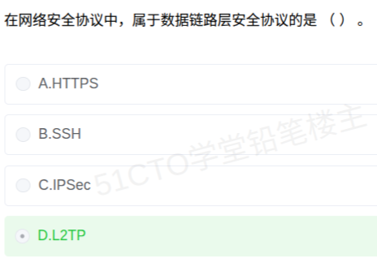

# 备考笔记：网络安全协议分层辨析

## 一、题目

> 在网络安全协议中，属于数据链路层安全协议的是（  ）。
>
> A. HTTPS
> B. SSH
> C. IPSec
> D. L2TP

**答案：D. L2TP**

解析：判断安全协议所属层次，看它**封装/保护的是哪一层的数据单元**。**L2TP（Layer 2 Tunneling Protocol，第二层隧道协议）** 在名字里就点明了"**Layer 2**"——它把**数据链路层**的帧（PPP 帧）封装进隧道传输，属于**数据链路层**安全协议（同族的还有 **PPTP**）。其余三项：**HTTPS** 是 HTTP 叠加 TLS/SSL，工作在**应用层**；**SSH** 是安全外壳协议，同样属于**应用层**；**IPSec** 保护的是 IP 数据报，工作在**网络层**。故选 D。

## 二、知识点：网络安全协议与 OSI 层次对应

### 1. 核心原理

网络安全协议可以按**它在 OSI/RM（或 TCP/IP）中保护的层次**归类。判定诀窍：**协议名字里的"层"、它加密保护的原始数据单元（帧/包/段/报文），决定了它属于哪一层。**

- **数据链路层**保护的是一"**帧**"，典型是各类**第二层隧道协议**：把点到点链路的帧封装、加密后在网络上传输。
- **网络层**保护的是一"**包**"（IP 数据报），典型是 **IPSec**。
- **传输层/会话层**保护的是**端到端的连接**，典型是 **SSL/TLS**。
- **应用层**保护的是**具体应用的报文**，如 HTTPS、SSH、SFTP、PGP、S/MIME、SET 等。

一句话锚点：**"二层隧道看链路，IPSec 管网络，TLS 护传输，HTTPS/SSH 在应用。"**

### 2. 关键公式/规则

各层典型安全协议对照表：

| OSI 层次 | 数据单元 | 典型安全协议 | 说明 |
| --- | --- | --- | --- |
| 应用层 | 报文 | **HTTPS、SSH、SFTP、PGP、S/MIME、SET、Kerberos** | 直接保护具体应用数据 |
| 表示层/会话层 | — | （较少独立安全协议） | SSL/TLS 常被划到这里或传输层 |
| 传输层 | 段（Segment） | **SSL/TLS** | 为上层应用提供端到端加密通道 |
| 网络层 | 包（Packet） | **IPSec（AH / ESP / IKE）** | 保护 IP 数据报，支持传输/隧道模式 |
| 数据链路层 | 帧（Frame） | **L2TP、PPTP、802.1X、MACsec(802.1AE)** | 隧道封装链路帧 / 链路接入认证 |
| 物理层 | 比特 | （无专门安全协议） | 安全防护层次最低 |

本题四个选项的定位：

| 选项 | 全称 | 工作层次 | 端口/说明 |
| --- | --- | --- | --- |
| A. HTTPS | HyperText Transfer Protocol Secure | **应用层** | HTTP + TLS/SSL，默认 443 |
| B. SSH | Secure Shell | **应用层** | 安全远程登录/传输，默认 22 |
| C. IPSec | IP Security | **网络层** | AH 认证、ESP 加密、IKE 协商 |
| D. L2TP | Layer 2 Tunneling Protocol | **数据链路层** | 名字即"第二层"，常与 IPSec 配合使用 |

### 3. 解题步骤

1. **抓题干关键词**：问"**数据链路层**安全协议"，直接锁定"二层"。
2. **按名字与数据单元逐项定位**：
   - A. HTTPS → 应用层（HTTP + TLS，443 端口）；
   - B. SSH → 应用层（安全远程登录，22 端口）；
   - C. IPSec → 网络层（保护 IP 包）；
   - D. L2TP → **Layer 2 = 数据链路层**（第二层隧道协议）。
3. **锁定 D**，并顺带回忆同族的 **PPTP** 也是数据链路层隧道协议。

## 三、易错点

1. **把 HTTPS / SSH 误判为传输层**：二者都"跑在" TCP 之上、并使用 TLS/SSL 加密，容易与"传输层安全"混淆；但 **HTTPS、SSH 是应用层协议**（有独立端口 443 / 22），SSL/TLS 才是传输/会话层的加密机制。
2. **把 IPSec 当成数据链路层**：IPSec 保护的是 **IP 数据报（网络层）**，名字里的"IP"就是线索，属于**网络层**，最容易被错选。
3. **忽略"隧道协议"这一族**：**L2TP、PPTP** 都是**第二层（数据链路层）隧道协议**，名字里的数字"2"是最强提示；与之相对的 **GRE** 更偏网络层隧道，注意区分。
4. **SSL/TLS 的层次归属**：它介于传输层与应用层之间，软考中通常归入**传输层（或会话层）**，不要与 HTTPS 的应用层混为一谈。
5. **记混"认证类"协议**：**802.1X** 是**数据链路层的接入认证**协议，**Kerberos** 属于**应用层**认证，二者常被放在一起做干扰项。
6. **牢记"数据单元判层法"**：加密/封装的是**帧**→链路层，是**包（IP）**→网络层，是**段（TCP/UDP）**→传输层，是**应用报文**→应用层。看到不出名的协议时用这招最稳。

## 四、扩展延伸

- **L2TP 与 IPSec 的经典组合**：L2TP 本身**不提供强加密**（只做隧道封装），实际部署常与 **IPSec** 配合，形成 **L2TP/IPSec VPN**——用 L2TP 封装二层帧、用 IPSec 做加密封装，正好体现"**链路层隧道 + 网络层加密**"的分层协作。
- **PPTP vs L2TP**：二者都是第二层隧道协议，PPTP 由微软等主导、安全性较弱（依赖 MPPE），L2TP 由 IETF 标准化、常与 IPSec 搭配，更安全。
- **IPSec 两大部分**：**AH（Authentication Header，只认证不加密）** 与 **ESP（Encapsulating Security Payload，认证 + 加密）**，配合 **IKE** 完成密钥协商，支持**传输模式**与**隧道模式**。
- **TLS/SSL 与 HTTPS 的关系**：TLS 是"加密通道"，HTTPS = HTTP 跑在 TLS 通道里，所以 **HTTPS 属于应用层、TLS 属于传输层**，是"应用层协议 + 传输层加密"的典型叠加。
- **与相关笔记的联系**：
  - [33-信息物理系统CPS与物联网辨析.md](33-信息物理系统CPS与物联网辨析.md)：同属软考"新技术/网络"常考簇，都爱考"概念归类与辨析"；
  - [18-云计算服务模式-IaaS-PaaS-SaaS.md](18-云计算服务模式-IaaS-PaaS-SaaS.md)：VPN、L2TP/IPSec 是云网接入与远程办公的常见基础设施。
- **现实类比**：把网络安全协议想成"**快递层层加固**"——**L2TP** 是给**同城短驳车（链路帧）**套上标准集装箱（二层封装）；**IPSec** 是给**跨省干线（IP 包）**加封条与密码锁；**TLS** 是给**收件人与寄件人之间（端到端连接）**开一条专用加密通道；**HTTPS/SSH** 则是包裹里**具体那件商品（应用报文）**本身的安全说明。

## 五、错题归档

| 题号 | 题型 | 考点 | 难度 | 掌握度 |
| --- | --- | --- | --- | --- |
| 系统分析师-网络与安全 | 单选 | 安全协议所属 OSI 层次：L2TP/PPTP→数据链路层，IPSec→网络层，TLS/SSL→传输层，HTTPS/SSH→应用层 | 易 | 待复习 |

## 六、相关图片

原题截图：`../images/34-网络安全协议分层辨析.png`（由用户上传的原题截图复制改名而来）

