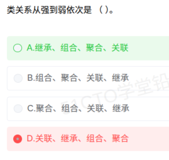

# 备考笔记：面向对象-类关系耦合强度排序

## 一、题目

> 类关系从强到弱依次是 （ ） 。
>
> A. 继承、组合、聚合、关联
> B. 组合、聚合、关联、继承
> C. 聚合、组合、关联、继承
> D. 关联、继承、组合、聚合

**答案：A. 继承、组合、聚合、关联**

解析：选项给的四个概念是 UML 中类之间关系的**耦合强度**序列。它们的强弱与"两个类**绑得有多紧**"直接相关：**继承（is-a）最强**——子类在结构上完全依赖父类，父类一改、子类全受影响；**组合（强聚合，同生共死）次之**；**聚合（弱组合，可独立存活）再次**；**关联（只是"认识/持有"，彼此独立）最弱**。故从强到弱为 **继承 > 组合 > 聚合 > 关联**，选 A。

## 二、知识点：UML 类关系与耦合强度

### 1. 核心原理

**耦合（Coupling）** 指两个类之间**相互依赖的紧密程度**。UML 里类与类之间的关系，按耦合强度**从强到弱**可排成一个链条：

**继承/实现 > 组合 > 聚合 > 关联 > 依赖**

判定强度的一个实用直觉：**看"一方消失，另一方还能不能活"以及"影响是否波及编译"**——绑得越死、越绕不开，耦合越强。

各关系的本质：

| 关系 | 语义 | 判定要点 | 典型例子 | UML 画法 |
| --- | --- | --- | --- | --- |
| **继承 / 实现（泛化）** | is-a，"是一种" | 子类是父类的一种，**编译期强绑定**，父类改动直接冲击子类 | 学生 **是一种** 人 | 实线 + 空心三角（实现为虚线） |
| **组合（Composition）** | 强聚合，整体—部分，**同生共死** | 部分**不能独立**于整体存在，整体销毁部分随之销毁 | 人 **由** 手 组成 | **实心**菱形（菱形在整体端） |
| **聚合（Aggregation）** | 弱聚合，整体—部分，**可分离** | 部分**可以独立**存在，生命周期不必同步 | 班级 **拥有** 学生 | **空心**菱形（菱形在整体端） |
| **关联（Association）** | "认识 / 持有" | 一个类持有另一个类的引用，但两者**彼此独立** | 老师 **关联** 学生 | 实线（可带箭头表示可导航） |
| **依赖（Dependency）** | "临时用一下" | 只在**方法参数、局部变量、返回值**里短暂使用，非成员 | 订单 **依赖** 支付工具 | **虚线**箭头 |

### 2. 关键公式/规则

**耦合强度阶梯（本题答案的钥匙）：**

| 从强到弱（强 → 弱） | 关系 | 强度来源 |
| --- | --- | --- |
| ① 最强 | 继承 / 实现 | 编译期绑定，父类变动全量传导 |
| ② | 组合 | 生命周期绑定，"同生共死" |
| ③ | 聚合 | 有整体—部分结构，但部分可独立 |
| ④ | 关联 | 仅持有引用，双方独立 |
| ⑤ 最弱 | 依赖 | 临时使用，用完即散 |

**速记口诀：**

> **"继组聚关"** —— **继**承 > **组**合 > **聚**合 > **关**联（最强的排最前，只要记住这个降序，选项任你怎么排都能选）。
> 补一句最强最弱：**继承最强、依赖最弱。**

**组合 vs 聚合的判据（一对一错的核心区分）：**

| 判据 | 组合 | 聚合 |
| --- | --- | --- |
| 部分能否独立存在 | **不能** | **能** |
| 生命周期 | 与整体**同步** | **不必**同步 |
| 菱形 | **实心**菱形 | **空心**菱形 |
| 例 | 人与手、订单与订单行 | 班级与学生、汽车与备胎 |

### 3. 解题步骤

1. **认题**：问"类关系从强到弱"，即考查**耦合强度排序**，答案必是"继承打头"的降序。
2. **定最强者**：继承是 is-a、编译期强绑定，**必然最强** → 含"继承"且在**首位**的只有 A。
3. **定最弱者**：四个选项里出现的"关联"是"仅持有引用、彼此独立"，**比组合、聚合都弱** → 应排在组合、聚合之后，进一步锁定 A。
4. **复核排除**：B、C 把"继承"排到末位（继承绝不可能是最弱）；D 把"关联"排到首位（关联也不是最强）→ 全部排除，选 **A**。

## 三、易错点

1. **把"关联"当作最强**：关联只是"我持有你的引用、我们互相认识"，双方**彼此独立**；它比组合、聚合都弱得多。误选 D 正是把"有关联"当成了"绑得很紧"。
2. **把"继承"排到末位**：继承意味着**子类完全建立在父类之上**，父类任何改动都会波及子类，是**最强耦合**，绝不可能是 B、C 里那种"最弱"的排法。
3. **组合与聚合颠倒**：两者的先后极易记反。抓住一个判据就够——**部分能不能独立活**：不能独立活（同生共死）的是**组合**，更强；能独立活的是**聚合**，较弱。例：手离了人就废了（组合）；学生毕了业班级解散了学生照样在（聚合）。
4. **把"依赖"和"关联"混为一谈**：依赖是**临时性**的（方法参数、局部变量），关联是**长期持有**（成员变量）。本题没列依赖，但要记住它在链条**最末端**。
5. **只看名字不看语义**：中文里"组合""聚合"字面相近，务必回到**菱形实/空、生命周期是否同步**这两个硬判据，不要凭语感排序。
6. **忽略"实现"**：接口的**实现（Realization）**同样属于 is-a 家族，耦合强度与继承同级，排在最强档。

## 四、扩展延伸

- **耦合强度的现实含义**：耦合越强，**复用越难、改动越贵**。设计原则是"**尽量用弱关系替代强关系**"——能关联就别继承，能依赖就别关联（"**组合优于继承**"这条经典原则正源于此）。
- **"组合优于继承（Composition over Inheritance）"**：继承在编译期把子类与父类死死绑定，父类改动会"**脆化**"子类；用组合把行为**委托**给成员对象，能在运行期灵活替换，耦合更弱、扩展更好。
- **依赖倒置与面向接口**：把强耦合的"直接继承具体类"改成"依赖抽象接口"，本质就是**往耦合阶梯的弱端移动**。
- **一张图串起五个关系**：继承（is-a）→ 组合（同生共死）→ 聚合（可分离）→ 关联（认识）→ 依赖（临时用），恰好是"**关系由紧密到松散**"的连续谱。
- **与相关笔记的联系**：
  - [30-面向对象-泛化与聚合关系.md](30-面向对象-泛化与聚合关系.md)：**泛化**即继承（is-a，本题的最强档），**聚合**是本题第三强档，两篇互为印证；
  - [35-面向对象-多态性分类与算子鉴别.md](35-面向对象-多态性分类与算子鉴别.md)：**包含多态**正是建立在"继承/泛化"这一最强耦合关系之上的；
  - [31-面向对象分析-建模过程.md](31-面向对象分析-建模过程.md)：识别类之间的关系及其强弱，是 OOA 建（静态）类图阶段的核心工作。
- **现实类比**：把两个类想成两个人——**继承**是"**亲父子**"（血脉相连，改爹就影响儿）；**组合**是"**连体婴**"（一死俱死）；**聚合**是"**公司与兼职员工**"（公司没了员工照样活）；**关联**是"**微信好友**"（互相认识，各自独立）；**依赖**是"**问路的路人**"（问完就走，毫无瓜葛）。

## 五、错题归档

| 题号 | 题型 | 考点 | 难度 | 掌握度 |
| --- | --- | --- | --- | --- |
| 类关系耦合强度排序 | 单选 | UML 类关系强弱：继承/实现 > 组合 > 聚合 > 关联 > 依赖；组合与聚合靠"部分能否独立存在"区分 | 易 | 待复习 |

## 六、相关图片

原题截图：`../images/37-面向对象-类关系耦合强度排序.png`（由用户上传的原题图复制改名而来）

