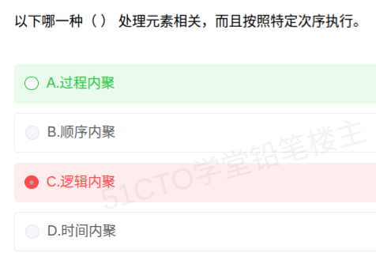
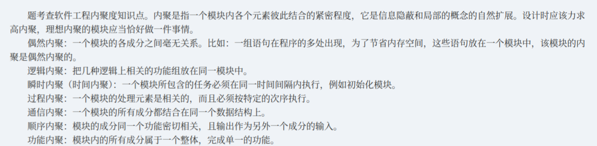

# 备考笔记：软件设计-内聚类型辨析

## 一、题目

> 以下哪一种 （ ） 处理元素相关，而且按照特定次序执行。
>
> A. 过程内聚
> B. 顺序内聚
> C. 逻辑内聚
> D. 时间内聚

**答案：A. 过程内聚**

解析：题干的关键词是「**处理元素相关**」+「**按照特定次序执行**」。这正是**过程内聚（Procedural Cohesion）**的标准定义——模块内各处理元素彼此相关，且**必须按某一特定次序执行**。四个选项中只有"过程内聚"把"**次序**"写进定义；B 顺序内聚强调的是一条元素的数据输出作为下一条的**输入（数据流）**；C 逻辑内聚是"功能相似、由参数择一执行"，与次序无关；D 时间内聚只是"要求在同一时间窗口内执行"，同样不约束次序。故选 **A**。

## 二、知识点：模块内聚的七种类型

### 1. 核心原理

**内聚（Cohesion）** 度量**一个模块内部各元素之间结合的紧密程度**，是软件设计"高内聚、低耦合"中的"高内聚"一侧。它是**信息隐蔽**和**局部化**概念的自然扩展——理想的模块应当**恰好做一件事情**。内聚越强，模块职责越单一、越易维护复用。

按内聚**由弱到强**排列，共七级：

**偶然内聚 < 逻辑内聚 < 时间内聚 < 过程内聚 < 通信内聚 < 顺序内聚 < 功能内聚**

各级本质：

| 级别（弱 → 强） | 名称 | 定义要点 | 典型例子 |
| --- | --- | --- | --- |
| ① 最弱 | **偶然内聚**（巧合内聚） | 模块内各成分之间**没有任何联系**，只是被偶然凑在一起 | 程序多处出现的同一组语句，**为节省内存**硬塞进一个模块 |
| ② | **逻辑内聚** | 各成分**逻辑上相似**（做同类的事），由**传入参数决定执行哪一个** | 一个"输入模块"按参数分别读键盘/读文件/读网络 |
| ③ | **时间内聚**（瞬时内聚） | 各成分**必须在同一时间段内执行**，**与次序无关** | 系统初始化模块：清屏、置初值、开中断一次做完 |
| ④ | **过程内聚** | 各成分**处理元素相关，且必须按特定次序执行**（次序由**流程**决定） | 先读入、再校验、后存库 |
| ⑤ | **通信内聚** | 各成分**使用同一输入数据**或**产生同一输出数据**（数据共享；也常表述为"所有成分都集中在**同一个数据结构**上"） | "打印月报表"：都围绕同一份月报数据 |
| ⑥ | **顺序内聚** | 各成分密切相关，且**一个成分的输出恰是另一个成分的输入**（数据流） | 先算总价、再按总价算折扣 |
| ⑦ 最强 | **功能内聚** | 模块内**所有元素共同完成一个单一功能**，缺一不可、不可再分 | "求平方根"模块 |

### 2. 关键公式/规则

**内聚强度阶梯（本题的钥匙）：**

| 从弱到强（弱 → 强） | 名称 | 一句话判据 |
| --- | --- | --- |
| ① 最弱 | 偶然内聚 | 毫无关系，纯凑数 |
| ② | 逻辑内聚 | 功能相似，**靠参数选一个** |
| ③ | 时间内聚 | **同时**执行，**不论次序** |
| ④ | 过程内聚 | 元素相关，**必须按次序** |
| ⑤ | 通信内聚 | 共用**同一份数据** |
| ⑥ | 顺序内聚 | 前一个的**输出** = 后一个的**输入** |
| ⑦ 最强 | 功能内聚 | 合起来只办**一件事** |

**速记口诀：**

> **"偶逻时过通顺功"** —— 内聚由弱到强：**偶**然 < **逻**辑 < **时**间（也叫**瞬时内聚**） < **过**程 < **通**信 < **顺**序 < **功**能。
> 补一句两端：**偶然最弱、功能最强。**

**四个易混级别的判别表（本题核心）：**

| 名称 | 有无次序要求 | 有无数据传递 | 一句话定位 |
| --- | --- | --- | --- |
| 时间内聚 | **无**（只要求同时段） | 无 | "**同时做**" |
| **过程内聚** | **有**（特定次序） | **无**（不是必需） | "**按次序做**" |
| 通信内聚 | 无（次序不定） | 共用同一数据 | "**围着同一份数据做**" |
| 顺序内聚 | 有 | **有**（输出→输入） | "**前一步的结果喂给下一步**" |

### 3. 解题步骤

1. **抓关键词**：题干"**处理元素相关 + 按特定次序执行**"，两个条件同时指向**过程内聚**的定义。
2. **对号入座**：过程内聚 = 元素相关 + **次序驱动**；顺序内聚 = 元素相关 + **数据流驱动**（输出即输入）。题干只强调次序、未提数据传递 → 选**过程内聚**。
3. **排除干扰项**：
   - B 顺序内聚：虽有次序，但**其标志是"输出即输入"的数据依赖**，题干未给 → 排除；
   - C 逻辑内聚：讲的是"功能相似、参数择一"，与次序**无关** → 排除；
   - D 时间内聚：只要求"同一时间段内执行"，**明确不要求次序**（如初始化模块内部无先后）→ 排除。
4. **定案**：只有 A 过程内聚同时满足"相关 + 特定次序"，选 **A**。

## 三、易错点

1. **过程内聚与顺序内聚混淆（最高频）**：两者都"按次序"，区别在**驱动因素**——**过程内聚靠流程次序**（元素相关性由控制流决定），**顺序内聚靠数据流**（前一个的输出是后一个的输入）。题干若出现"某步的**结果**给下一步用"，才是顺序内聚。
2. **把"时间内聚"当成"有次序"**：时间内聚恰恰是"**要同时、不要次序**"（如系统初始化：清屏、开中断谁先谁后都行，只要在启动阶段完成）。题干写"按照特定次序"就要把 D 排除。
3. **逻辑内聚与通信内聚混淆**：逻辑内聚是"**功能同类、参数选一**"（一次只做其中一件）；通信内聚是"**共用同一数据、可都做**"。关键看是否**由参数择一执行**。
4. **方向记反**：内聚是**越强越好**，故"功能内聚"是最优；但题目若问"从弱到强"要按口诀 `偶逻时过通顺功` 排，切勿从功能内聚起头。
5. **忽视题干定语**：本题两个定语"**处理元素相关**"和"**特定次序**"必须**同时**满足，只抓住"次序"会误选 B，只抓住"相关"会误选 C 或 D。
6. **与耦合记混**：耦合**越低越好**，内聚**越高越好**；两者方向相反，是要点也是常错点。

## 四、扩展延伸

- **设计目标：高内聚、低耦合**。内聚衡量"模块**内部**抱得紧不紧"，耦合衡量"模块**之间**牵得牢不牢"。理想的模块是"对内铁板一块（功能内聚），对外界限分明（弱耦合）"。
- **实践中最常见的退化内聚**：真实系统里大量模块停在**逻辑内聚**或**时间内聚**（如各种"工具类""初始化类"），它们是重构的重点对象——应尽量拆成若干**功能内聚**的小模块。
- **过程内聚 vs 顺序内聚的记忆锚点**：把模块想成流水线——**过程内聚**是"工序排好队，但彼此不传零件"；**顺序内聚**是"上一道工序的**成品直接成为**下一道的**原料**"。后者因为多了数据耦合，内聚更强。
- **与相关笔记的联系**：
  - [37-面向对象-类关系耦合强度排序.md](37-面向对象-类关系耦合强度排序.md)：本篇讲模块内部"内聚"，该篇讲类之间"耦合"，**一体两面**，建议对照复习；
  - [22-构件接口不兼容的常见问题.md](22-构件接口不兼容的常见问题.md)：接口不兼容本质是模块间**耦合**问题的外化，与内聚共同构成模块化设计的两把尺子；
  - [32-微服务系统特征.md](32-微服务系统特征.md)：微服务强调"**围绕业务能力高内聚、服务间低耦合**"，正是本知识点的工程化落地。
- **现实类比**：把模块想成一个班组——**偶然内聚**是"被抓壮丁的陌生人"；**逻辑内聚**是"都会开车的司机，谁上由调度定"；**时间内聚**是"约好同一时间集合，来了干啥随便"；**过程内聚**是"流水线工人，顺序不能乱但各干各的"；**通信内聚**是"都围着同一张图纸干活"；**顺序内聚**是"我磨的零件直接给你装"；**功能内聚**是"一个只为完成这一件产品的专班组"。

## 五、错题归档

| 题号 | 题型 | 考点 | 难度 | 掌握度 |
| --- | --- | --- | --- | --- |
| 内聚类型辨析 | 单选 | 七种内聚的强弱排序与定义；过程内聚=元素相关+特定次序，顺序内聚=输出即输入的数据流 | 易 | 待复习 |

## 六、相关图片

原题截图：`../images/38-软件设计-内聚类型辨析.png`（由用户上传的原题图复制改名而来）

补充讲义截图（七种内聚的定义总结，含"内聚是信息隐蔽和局部概念的自然扩展"及偶然内聚"重复语句省内存"经典例子）：`../images/38-软件设计-内聚类型辨析-讲义总结.png`

