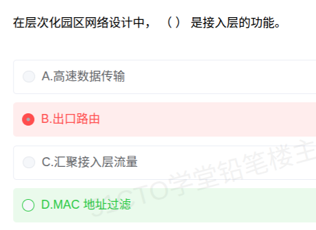

# 备考笔记：园区网络层次化设计中接入层的功能

## 一、题目

> 在层次化园区网络设计中，（  ）是接入层的功能。
>
> A. 高速数据传输
> B. 出口路由
> C. 汇聚接入层流量
> D. MAC 地址过滤

**答案：D. MAC 地址过滤**

解析：层次化园区网络按**核心层（Core）→ 汇聚层（Distribution）→ 接入层（Access）** 自顶向下划分职责。**接入层**是终端设备（PC、AP、IP 电话、打印机等）**接入网络的边界**，核心职责是**把用户接入进来并做基础的安全与隔离控制**，包括 **MAC 地址过滤、端口安全、VLAN 划分、接入认证（802.1X）、PoE 供电**等，故 D 正确。

其余三项均为其他层的职责：**高速数据传输（A）** 是**核心层**的职责（高速转发、低时延）；**出口路由（B）** 通常是**核心层（或边界路由器）** 与外部网络互通的功能；**汇聚接入层流量（C）** 字面即点明是**汇聚层**的职责（汇聚接入层流量、策略控制、路由聚合）。

## 二、知识点：园区网络三层层次化设计

### 1. 核心原理

**层次化设计（Hierarchical Network Design）** 把复杂园区网按功能横向切分为三层，各司其职、上下配合，从而获得**可扩展、易管理、故障域小**的网络。

- **接入层（Access Layer）**：网络的**最下层**，直接连接**终端用户设备**。关键词是"**接进来 + 管住它**"——提供端口接入、VLAN 划分、**MAC 地址过滤 / 端口安全**、接入认证、PoE 供电、冲突域隔离。**追求端口密度与低成本**，不做复杂路由。
- **汇聚层（Distribution Layer）**：位于接入与核心之间，是"**承上启下的策略层**"。关键词是"**汇聚流量 + 施加策略**"——汇聚接入层流量、划分广播域（VLAN 间路由）、访问控制（ACL）、QoS 标记、路由聚合、冗余网关。
- **核心层（Core Layer）**：网络的**骨干**，关键词是"**快、稳、简**"——只做**高速数据转发**与**出口路由**，尽量不做策略与过滤，以免拖慢转发性能。

一句话锚点：**"接入层管接入选端口，汇聚层管汇聚加策略，核心层管高速转发通出口。"**

> 判定诀窍：看到"**MAC 地址过滤、端口安全、802.1X、VLAN 接入、PoE**"→ **接入层**；看到"**汇聚流量、策略、ACL、路由聚合**"→ **汇聚层**；看到"**高速转发、骨干、出口路由**"→ **核心层**。

### 2. 关键公式/规则

**三层职责对照表：**

| 层次 | 核心定位 | 典型功能 |
| --- | --- | --- |
| **核心层** | 高速骨干 | **高速数据传输/转发**、出口路由、低时延、高可靠性、冗余链路 |
| **汇聚层** | 策略与汇聚 | **汇聚接入层流量**、VLAN 间路由、访问控制（ACL）、QoS、路由聚合、广播域划分 |
| **接入层** | 用户接入边界 | **MAC 地址过滤**、端口安全、VLAN 划分、接入认证（802.1X）、PoE 供电、冲突域隔离 |

**本题选项定位：**

| 选项 | 实际归属 | 说明 |
| --- | --- | --- |
| A. 高速数据传输 | **核心层** | 骨干层追求高速转发，不做策略 |
| B. 出口路由 | **核心层 / 边界路由器** | 与外部网络（Internet/其他园区）互通 |
| C. 汇聚接入层流量 | **汇聚层** | 题干已含"汇聚"二字，是最直接的提示 |
| **D. MAC 地址过滤** | **接入层** | 终端接入端口的二层安全控制，属接入层 |

### 3. 解题步骤

1. **识别题型**：问"哪一项是**接入层**的功能"，属"**功能—层次归属**"辨析题。
2. **默写三层职责**：接入=接入与端口安全；汇聚=汇聚与策略；核心=高速转发与出口。
3. **逐项定位**：A 高速数据传输 → 核心层；B 出口路由 → 核心层/边界；C 汇聚接入层流量 → 汇聚层；**D MAC 地址过滤 → 接入层**。
4. **锁定 D**，并注意：若选项出现"**端口安全、802.1X 认证、VLAN 接入**"，同样属接入层。

## 三、易错点

1. **把"汇聚接入层流量"当成接入层功能**（高频陷阱）：题干里"接入层"三字很诱人，但**"汇聚……流量"是汇聚层的定义式职责**；C 是把"接入层"当宾语而非主语，要看清动作主体。
2. **把"高速数据传输"误分给接入层**：**高速转发是核心层**的天职，接入层只负责低速、海量的**端口接入**，不承担骨干转发。
3. **混淆"出口路由"的层次**：园区网访问外网由**核心层设备或边界路由器**完成，**接入层不做出口路由**。
4. **误认为接入层不做安全**：恰恰相反，**MAC 地址过滤、端口安全、802.1X 接入认证**都是**接入层**的典型安全手段，因为它是**用户进入网络的第一道关口**。
5. **忽略"接入层可选"的简化设计**：小型园区常采用**二层结构（核心 + 接入，汇聚被精简）**，此时原本汇聚层的部分功能会下沉；但**软考标准答案仍按完整三层模型判定**，不要被"实际部署"带偏。
6. **层次名称记混**：注意"**汇聚层 = Distribution Layer**"常译为**分布层**，别因译名不同而与"接入层"混淆。

## 四、扩展延伸

- **三层模型的规模适用性**：
  - **小型网络**：**核心 + 接入**两层（汇聚层被折叠）；
  - **中型网络**：**核心 + 汇聚 + 接入**标准三层；
  - **大型园区**：可引入**"区域—核心"多点结构**或"**核心—汇聚—接入**的模块化多区设计"。
- **接入层的常见技术细节**：
  - **端口安全（Port Security）**：限制单端口可学习的 MAC 数量、绑定合法 MAC，防 MAC 泛洪攻击；
  - **802.1X**：基于端口的接入认证，未通过认证的端口只放行认证流量；
  - **VLAN 划分**：把不同用户划分到不同逻辑网络，缩小广播域；
  - **PoE（Power over Ethernet）**：为 AP、IP 电话、摄像头等终端**网线供电**。
- **汇聚层的经典功能展开**：**VLAN 间路由**（三层交换）、**ACL 访问控制**、**QoS 优先级标记**、**路由聚合**（减少核心路由表项）、**HSRP/VRRP 冗余网关**。
- **核心层设计原则**：**"简洁至上"**——不在此层做 ACL、地址转换、复杂的策略路由；宁可多花钱买高带宽设备，也不让策略拖慢转发。
- **与相关笔记的联系**：
  - [34-网络安全协议分层辨析.md](34-网络安全协议分层辨析.md)：同样考"协议/功能与层次的对应"，均可用"看数据单元与职责"的判层法；
  - [39-ICMP协议所属层次辨析.md](39-ICMP协议所属层次辨析.md)：都属网络分层归属类命题，可对照记忆"分层—职责"映射。
- **现实类比**：把园区网想成**一栋写字楼**——**接入层**是**每层的工位与门禁卡（端口接入 + MAC 过滤）**；**汇聚层**是**各楼层的配电房与楼层交换机（汇聚各工位线路并分区分管）**；**核心层**是**大楼的主干竖井与总配电站（高速通道 + 对外电力接入）**。

## 五、错题归档

| 题号 | 题型 | 考点 | 难度 | 掌握度 |
| --- | --- | --- | --- | --- |
| 系统分析师-网络与安全 | 单选 | 层次化园区网络三层职责：接入层=MAC 地址过滤/端口安全，汇聚层=汇聚流量与策略，核心层=高速转发与出口路由 | 易 | 待复习 |

## 六、相关图片

原题截图：`../images/41-园区网络层次化设计-接入层功能辨析.png`（由用户上传的原题图复制改名而来）

