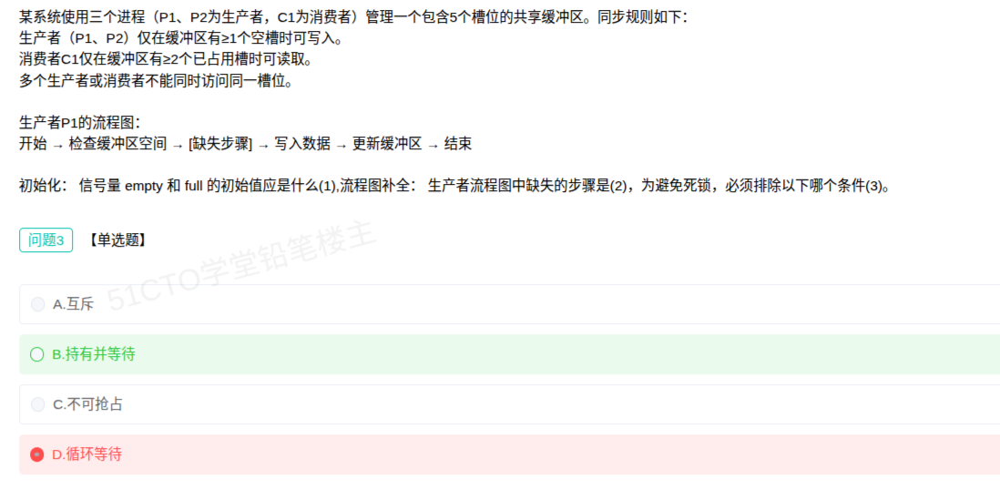

# 备考笔记：死锁的必要条件与避免死锁

## 一、题目

> 某系统使用三个进程（P1、P2 为生产者，C1 为消费者）管理一个包含 5 个槽位的共享缓冲区。同步规则如下：
> 生产者（P1、P2）仅在缓冲区有 ≥1 个空槽时可写入。
> 消费者 C1 仅在缓冲区有 ≥2 个已占用槽时可读取。
> 多个生产者或消费者不能同时访问同一槽位。
>
> 生产者 P1 的流程图：开始 → 检查缓冲区空间 → [缺失步骤] → 写入数据 → 更新缓冲区 → 结束
>
> 初始化：信号量 empty 和 full 的初始值应是什么（1）；流程图补全：生产者流程图中缺失的步骤是（2）；**为避免死锁，必须排除以下哪个条件（3）**。
>
> A. 互斥
> B. 持有并等待
> C. 不可抢占
> D. 循环等待

**答案：B. 持有并等待**

解析：死锁的产生必须**同时满足四个必要条件**：**互斥、请求与保持（即"持有并等待"）、不可剥夺（即"不可抢占"）、循环等待**。**只要破坏其中任意一个，死锁就不会发生**。其中**互斥条件**由临界资源（本题中的共享缓冲区槽位）本身性质决定，**无法破坏**——一次只允许一个进程访问同一槽位是同步规则所要求的。因此要避免死锁，必须从**其余三个条件**入手，**"持有并等待"** 正是其一（让进程**一次性申请全部所需资源**，或**不持有资源就等待**，即可打破）。故选 B。

> 注意：本题的问题是"**必须排除（即必须破坏）的条件**"，答案落在**四个必要条件中可被破坏的那一类**上；**互斥（A）是必须保留、不可破坏的条件**，是典型干扰项。

## 二、知识点：死锁的四个必要条件和避免死锁

### 1. 核心原理

**死锁（Deadlock）** 指多个进程因**互相持有对方所需的资源并等待对方释放**而**永久阻塞**的状态。发生死锁需**同时满足四个必要条件（Coffman 条件）**，缺一不可：

1. **互斥条件**：资源**一次只能被一个进程占用**（临界资源）。
2. **请求与保持条件（持有并等待）**：进程**已持有至少一个资源**，同时又**申请新资源并阻塞等待**，且不释放已持有资源。
3. **不可剥夺条件（不可抢占）**：资源**只能由持有者主动释放**，不能被强行剥夺。
4. **循环等待条件**：存在一个进程—资源的**环形等待链**，每个进程都在等待下一个进程持有的资源。

**死锁的预防思路 = 破坏上述四个条件中的至少一个：**

- **破坏互斥**：改由**可共享**的资源替代临界资源（如只读文件），多数场合**不可行**，因为临界资源的互斥性是其固有属性。
- **破坏"持有并等待"**：**静态分配 / 一次性申请**全部所需资源；或规定**申请新资源前先释放已持有资源**。
- **破坏"不可剥夺"**：允许**抢占**——资源被占用时可被系统强行收回（适用于 CPU 寄存器、内存等可保存/恢复状态的资源）。
- **破坏"循环等待"**：采用**资源有序分配法**，给资源编号，规定进程**只能按递增（或递减）顺序申请**资源，从根上无法形成环路。

一句话锚点：**"互斥是天生、动不得；要防死锁，就破坏后三条中的任意一条。"**

### 2. 关键公式/规则

**四个必要条件与破坏手段对照表：**

| 必要条件 | 含义 | 能否破坏 | 破坏手段 |
| --- | --- | --- | --- |
| **互斥** | 资源一次仅一个进程可用 | **不可破坏** | 临界资源固有属性，无法消除（只能换共享资源，通常不可行） |
| **请求与保持（持有并等待）** | 持有资源的同时等待新资源 | 可破坏 | **一次性申请全部资源**；申请新资源前先释放已持有资源 |
| **不可剥夺（不可抢占）** | 资源不能被强行收回 | 可破坏 | 允许系统**抢占**资源，暂存/恢复进程状态 |
| **循环等待** | 进程间形成环形等待链 | 可破坏 | **资源有序分配**（按编号顺序申请），打破环路 |

**本题三个小问的定位：**

| 小问 | 结论 | 依据 |
| --- | --- | --- |
| （1）empty / full 初始值 | **empty = 5，full = 0** | empty 表示**空槽数**（初始 5 个槽全空），full 表示**已占槽数/可读数据数**（初始为 0） |
| （2）流程图缺失步骤 | 与**互斥锁 P(mutex)** 成对的操作（写入前申请、更新后释放） | "检查缓冲区空间"对应 `P(empty)`，进入临界区前须 `P(mutex)`，退出时 `V(mutex)` |
| （3）必须排除的条件 | **B. 持有并等待** | 互斥不可破坏，需从"持有并等待/不可抢占/循环等待"中排除 |

### 3. 解题步骤

1. **识别题型**：题干问"为避免死锁，必须排除哪个条件"，直接考**死锁的四个必要条件的可破坏性**。
2. **默写四条件**：互斥、请求与保持、不可剥夺、循环等待。
3. **判断可破坏性**：**互斥**是临界资源固有属性、**不可破坏**（排除 A）；其余三个均可通过相应策略破坏。
4. **对照题干语境**：本题"多个生产者或消费者不能同时访问同一槽位"正是**互斥**（必须保留），故要避免死锁就得从**持有并等待**等入手 → 选 **B**。
5. **落到"排除"二字**：题目问的是"排除"（破坏），而非"保留"，注意不要选成 A.互斥。

## 三、易错点

1. **把"互斥"当成要排除的条件**（本题最大陷阱）：互斥是死锁四条件中**唯一不可破坏**的一个，本题题干还专门强调"不能同时访问同一槽位"，恰恰说明互斥必须保留；要选的是**可被破坏**的条件。
2. **误答"循环等待"**：**循环等待**虽可破坏（资源有序分配），但它**不是本题语境下最直接指向的条件**——环路的形成前提是进程"**持有并等待**"，本题正是生产者持有资源（占用槽位/信号量）又去竞争互斥锁的场景，故标准答案取 B。
3. **分不清"请求与保持"与"不可剥夺"**：前者强调"**拿着不放还要再要**"，后者强调"**别人要不走**"；本题对应前者。
4. **误认为"死锁存在就一定四条件齐备"是废话**：这是**判定死锁的充分必要条件**——四条件**同时满足才可能死锁**，**缺一即不会死锁**，这正是"破坏任一条件即可预防"的依据。
5. **把"死锁预防"与"死锁避免"混为一谈**：**预防（Prevention）** 是**破坏必要条件**、静态限制资源申请；**避免（Avoidance）** 是**动态判断**——如**银行家算法**在每次分配前检查系统是否仍处于**安全状态**（存在安全序列）。二者答题话术不同。
6. **忽略"同一槽位"这一限定**：题干说的是多个生产者/消费者"**不能同时访问同一槽位**"，因此**互斥是必要的**，这进一步印证 A 不可能是"要排除"的答案。

## 四、扩展延伸

- **死锁处理的三条路（对比记忆）**：
  - **死锁预防（Prevention）**：静态破坏四条件之一，如**资源有序分配**、**一次性申请**；
  - **死锁避免（Avoidance）**：动态检测安全性，代表是 **银行家算法（Banker's Algorithm）**，分配前判断是否仍存在**安全序列**；
  - **死锁检测与解除（Detection & Recovery）**：允许死锁发生，用**资源分配图**的**化简/循环检测**发现后，采取**资源剥夺、进程撤销/回滚、进程重启**等手段解除。
- **银行家算法的要点**：系统维护 **Available（可用资源）、Max（最大需求）、Allocation（已分配）、Need（尚需）** 四类数据；每次分配前试探，若存在使所有进程能依次完成的安全序列，则分配，否则让进程等待。它正是通过**避免出现"持有并等待 + 循环等待"的组合**来预防死锁。
- **资源分配图判定死锁**：图中**无环 → 无死锁**；**有环**时，若每类资源仅有一个实例则**必有死锁**，若含多个实例则**有环未必死锁**，需进一步化简判断。
- **生产者—消费者的信号量配套**（结合本题语境）：
  - 同步信号量 **empty（空槽数，初值 = 缓冲区容量 5）**、**full（已占槽数，初值 0）**；
  - 互斥信号量 **mutex（初值 1）**，用于保护**对同一槽位的访问**；
  - **关键顺序：先对资源信号量 P(empty)/P(full)，再对互斥信号量 P(mutex)**，且两者**不可颠倒**，否则会因"持有并等待"引发死锁——这正是本题第（3）问的现实落点。
- **与相关笔记的联系**：
  - [04-生产者消费者问题-PV操作.md](04-生产者消费者问题-PV操作.md)：本题是其延伸，先掌握 PV 操作配对与顺序，再理解"顺序颠倒为何死锁"；
  - [03-单缓冲区与双缓冲区计算.md](03-单缓冲区与双缓冲区计算.md)：同为缓冲区同步类命题，对照理解容量与信号量初值的关系。
- **现实类比**：把死锁想成**两人在窄巷对向而行的"礼让僵局"**——**互斥**是"巷子一次只能过一人"（路宽决定，改不了）；**持有并等待**是"我已站进巷口，还要往前走"；**不可剥夺**是"谁也不能被推回去"；**循环等待**是"我等你退、你等我退"的闭环。要化解，最实际的不是拓宽巷子（破坏互斥），而是**规定先退到路口再进巷**（破坏持有并等待）或**按固定顺序通行**（破坏循环等待）。

## 五、错题归档

| 题号 | 题型 | 考点 | 难度 | 掌握度 |
| --- | --- | --- | --- | --- |
| 系统分析师-操作系统 | 单选 | 死锁四个必要条件（互斥/持有并等待/不可抢占/循环等待）与避免死锁：互斥不可破坏，须破坏其余任一条件 | 中 | 待复习 |

## 六、相关图片

原题截图：`../images/42-死锁必要条件-生产者消费者场景辨析.png`（由用户上传的原题图复制改名而来）

