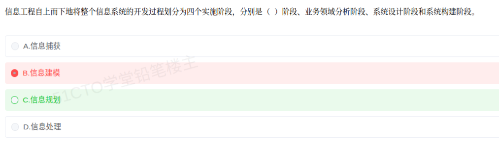

# 备考笔记：信息工程的四个实施阶段

## 一、题目

> 信息工程自上而下地将整个信息系统的开发过程划分为四个实施阶段，分别是（  ）阶段、业务领域分析阶段、系统设计阶段和系统构建阶段。
>
> A. 信息捕获
> B. 信息建模
> C. 信息规划
> D. 信息处理

**答案：C. 信息规划**

解析：**信息工程（IE）** 采用"**自顶向下规划、自底向上实施**"的思路，把整个信息系统的开发过程划分为**四个实施阶段**，顺序为：

**① 信息规划（企业规划）→ ② 业务领域分析 → ③ 系统设计 → ④ 系统构建**

题干已给出后三个阶段，缺的**第一阶段**正是"**信息规划**"（也常译作"**企业规划**"），它是全过程的**战略起点**——从企业全局视角规划数据与信息需求，划分**主题数据库**。故本题选 **C. 信息规划**。

其余三项均非 IE 的阶段名：**信息捕获（A）**、**信息建模（B）**、**信息处理（D）** 是通用的信息处理环节用语，被用作形近干扰项。

## 二、知识点：信息工程的四阶段与"自顶向下规划、自底向上实施"

### 1. 核心原理

信息工程把企业信息系统的建设看成一条**从战略到实现逐步收敛**的路径，因此划分为**四个递进阶段**，且体现"**自顶向下规划、自底向上实施**"的思想：**前两阶段（规划、领域分析）自顶向下**把握全局与业务领域，**后两阶段（设计、构建）自底向上**把一个个系统落地。

四阶段的核心任务：

1. **信息规划（企业规划）**：从**企业战略与全局**出发，明确企业的信息需求，进行**战略数据规划**，划分**主题数据库**，形成全局的数据蓝图。**这是整个 IE 的起点与顶层设计**。
2. **业务领域分析**：将企业按**业务领域**分解，逐一对各领域做业务过程与数据关系的详细分析，产出该领域的**业务模型与数据模型**（如实体—关系模型）。
3. **系统设计**：在领域分析的基础上进行**系统级设计**——功能设计、数据库设计、界面/接口设计等，把模型转化为可实施的设计方案。
4. **系统构建**：进入**实现阶段**，编码、测试、部署与交付，把设计变成可运行的信息系统。

一句话锚点：**"先规划、再分析、然后设计、最后构建——规划与分析自顶向下，设计与构建自底向上。"**

> 记忆口诀：**"规（信息规划）— 域（业务领域分析）— 设（系统设计）— 建（系统构建）"**，也可记为"**规划领域、设计构建**"。

### 2. 关键公式/规则

**四阶段一览表：**

| 序号 | 阶段 | 主要任务 | 关键产出 | 方向 |
| --- | --- | --- | --- | --- |
| ① | **信息规划**（企业规划） | 从企业全局明确信息需求，做战略数据规划 | **主题数据库划分、全局数据蓝图** | **自顶向下** |
| ② | **业务领域分析** | 按业务领域分解，分析业务过程与数据关系 | 业务模型、数据模型（E-R 模型） | **自顶向下** |
| ③ | **系统设计** | 功能设计、数据库设计、接口设计 | 系统设计方案 | **自底向上** |
| ④ | **系统构建** | 编码、测试、部署、交付 | 可运行的信息系统 | **自底向上** |

**本题选项定位：**

| 选项 | 是否 IE 阶段 | 说明 |
| --- | --- | --- |
| A. 信息捕获 | 否 | 形近干扰项，非 IE 阶段名 |
| B. 信息建模 | 否 | 建模是各阶段内的活动，不是阶段名 |
| **C. 信息规划** | **是** | 四阶段之首，对应企业规划/战略数据规划 |
| D. 信息处理 | 否 | 通用用语，非 IE 阶段名 |

### 3. 解题步骤

1. **抓题干结构**：题目已列出"**业务领域分析 → 系统设计 → 系统构建**"，问**第一阶段**。
2. **回忆 IE 四阶段顺序**：**信息规划 → 业务领域分析 → 系统设计 → 系统构建**。
3. **逐项排除**：A 信息捕获、B 信息建模、D 信息处理均非 IE 的**阶段命名**（属形近干扰）。
4. **锁定 C. 信息规划**，并牢记它对应"**战略数据规划、主题数据库划分**"，是整个 IE 的顶层设计。

## 三、易错点

1. **误选"信息建模"（B）**（本题陷阱）：建模（如 E-R 模型）是**业务领域分析阶段内部**要做的事，**不是一个独立的阶段名**。要区分"**阶段名**"与"**阶段内的活动**"。
2. **把"信息规划"与"系统规划"混为一谈**：IE 的四阶段**首阶段叫"信息规划"**（又称企业规划，聚焦**数据与信息**的全局规划）；而"系统规划"是更泛的用语，注意与本题的标准阶段名对齐。
3. **记错四阶段顺序**：务必记牢是"**规划 → 领域分析 → 系统设计 → 系统构建**"，不可把"设计"与"分析"颠倒。
4. **混淆"自顶向下"与"自底向上"的归属**：IE 是"**自顶向下规划、自底向上实施**"；**规划与领域分析自顶向下**，**设计与构建自底向上**，这是常考辨析点。
5. **与软件工程生命周期混淆**：**软件工程**的生命周期是"需求 → 设计 → 编码 → 测试 → 维护"；**IE 四阶段**是"**信息规划 → 业务领域分析 → 系统设计 → 系统构建**"，强调**企业级数据规划**，层次更高，二者不要套用。
6. **忽略首阶段的战略地位**：**信息规划**之所以放第一，是因为 IE 主张**先做全局数据规划、再逐域建设**，若把它当成"需求收集"这类操作性工作，就容易选错。

## 四、扩展延伸

- **IE 四阶段与"自顶向下/自底向上"的对应关系**：**前半段（信息规划、业务领域分析）** 自顶向下——由企业战略逐层分解到业务领域；**后半段（系统设计、系统构建）** 自底向上——由具体系统实现逐层支撑全局规划。这正是 IE"**先全局后局部、先规划后落地**"的体现。
- **与战略数据规划（SDP）的衔接**：**信息规划阶段**的核心方法就是**战略数据规划（SDP）**，其产物是**主题数据库**与**企业数据模型**；后续的**业务领域分析**则把主题数据库细化到各业务领域，形成局部数据模型。
- **与结构化方法的阶段对比**：**结构化方法**是"**需求分析 → 概要设计 → 详细设计 → 编码测试**"，**以处理/功能分解为主线**；**IE 四阶段**则以"**数据规划**"打头，**以数据为主线**，起点与主线都不同。
- **IE 的后续发展**：IE 的"数据为中心 + 全局规划"思想，可视为后来**数据仓库、数据中台、主数据管理（MDM）** 等企业级数据治理方法的早期源头；现代"先建数据底座、再上应用"的做法与 IE 一脉相承。
- **与相关笔记的联系**：
  - [44-信息工程方法论-以数据为中心.md](44-信息工程方法论-以数据为中心.md)：本题是其直接延续——先懂"以数据为中心"，再记"四阶段"就不易混；
  - [31-面向对象分析-建模过程.md](31-面向对象分析-建模过程.md)：可对照理解不同方法论"分几步、每步产出什么"的命题套路；
  - [18-云计算服务模式-IaaS-PaaS-SaaS.md](18-云计算服务模式-IaaS-PaaS-SaaS.md)：同属企业信息化域，云平台正承载 IE 所倡导的共享数据底座。
- **现实类比**：把 IE 四阶段想成**城市规划**——**信息规划**是"**先做城市总体规划与地下管网蓝图**"（顶层设计、全局数据）；**业务领域分析**是"**分区调研，逐个片区做详细规划**"（分领域建模）；**系统设计**是"**每个片区的施工图设计**"；**系统构建**是"**按图施工、竣工交付**"。

## 五、错题归档

| 题号 | 题型 | 考点 | 难度 | 掌握度 |
| --- | --- | --- | --- | --- |
| 系统分析师-企业信息化 | 单选 | 信息工程的四个实施阶段：信息规划 → 业务领域分析 → 系统设计 → 系统构建 | 易 | 待复习 |

## 六、相关图片

原题截图：`../images/45-信息工程四阶段-信息规划.png`（由用户上传的原题图复制改名而来）

