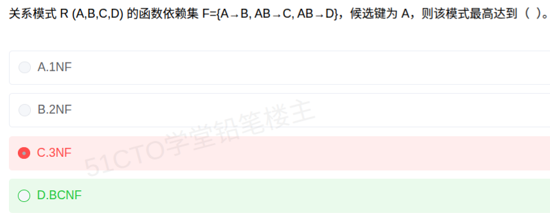

# 备考笔记：数据库-范式判定与BCNF

## 一、题目

> 关系模式 R(A,B,C,D) 的函数依赖集 F={A→B, AB→C, AB→D}，候选键为 A，则该模式最高达到（ ）。
>
> A. 1NF
>
> B. 2NF
>
> C. 3NF
>
> D. BCNF

**答案：D. BCNF**

解析：候选键 A 是单属性，故不可能存在非主属性对键的**部分依赖**，2NF 成立；又 A→B、A→C、A→D 均为直接依赖，无**传递依赖**，3NF 成立；再查 BCNF 条件——F 中三个依赖的左部 A、AB、AB **都包含候选键 A**（AB 是超键），不存在"左部非超键"的非平凡依赖，故 **BCNF 成立**，最高达到 BCNF。

## 二、知识点：数据库-范式判定与BCNF

### 1. 核心原理

**范式判定链**（逐级收紧，1NF ⊃ 2NF ⊃ 3NF ⊃ BCNF）：

| 范式 | 判据（以函数依赖表述） |
| --- | --- |
| 1NF | 每个属性都不可再分（原子性） |
| 2NF | 1NF + **不存在非主属性对候选键的部分依赖** |
| 3NF | 2NF + **不存在非主属性对候选键的传递依赖** |
| BCNF | 3NF + **每个非平凡依赖 X→Y 的左部 X 都是超键**（即 X 包含某个候选键） |

**关键区分：3NF 与 BCNF**

- 3NF 约束的是"**非主属性**"不能被传递决定；它允许**主属性**被非超键决定。
- BCNF 更严：**不管右部是不是主属性**，只要某依赖的左部不是超键，就违反 BCNF。
- 因此 **BCNF ⟹ 3NF**，反之不成立；本题依赖左部全是超键，所以能到 BCNF。

**左部冗余依赖的处理**：本题 AB→C、AB→D 的左部含多余属性——因 A→B，由增广律得 A→AB，再结合 AB→C 由传递律得 **A→C**，说明 AB 中的 B 是冗余的。但**左部冗余本身不违反任何范式**，范式只看"左部是否为超键"。

### 2. 关键公式/规则

| 名称 | 表达式/判据 |
| --- | --- |
| 候选键闭包判据 | $X^+ = U$ 且 X 极小 |
| 部分依赖（违反 2NF） | 非主属性依赖候选键的**真子集** |
| 传递依赖（违反 3NF） | 非主属性 ← 非超键 ← 候选键，链式可得 |
| 超键判据 | X 包含任一候选键 ⟹ X 是超键 |
| BCNF 判据 | 任一非平凡 $X \to Y$，X 均为超键 |
| 增广 + 传递推导 | $A \to B$ 且 $AB \to C \;\Rightarrow\; A \to C$ |

本题求解过程：

- 候选键 A 已知，求闭包 $A^+$：由 A→B 得 B；此时 A→AB，结合 AB→C 得 C、AB→D 得 D → $A^+ = \{A,B,C,D\} = U$，验证 A 确为候选键。
- 主属性 = {A}（所有候选键的并集）；**非主属性 = {B, C, D}**。
- 逐级判定：无非主属性的部分依赖 → 2NF；无非主属性的传递依赖 → 3NF；三个依赖左部 A、AB、AB 全含 A（超键）→ **BCNF**。

### 3. 解题步骤

1. **圈定候选键与主属性**：题目已给候选键 A，则主属性 {A}，非主属性 {B,C,D}。
2. **查 2NF**：候选键是**单属性**，非主属性无法依赖键的真子集 → 不存在部分依赖，**2NF 成立**。
3. **查 3NF**：非主属性 B、C、D 都由 A 直接决定（A→C、A→D 可经增广+传递推出），链条上不存在"非主属性 ← 非超键"的中间跳板 → **3NF 成立**。
4. **查 BCNF**：逐个依赖看左部——A→B（左部 A 是超键）、AB→C（左部 AB ⊇ A，是超键）、AB→D（同）→ 无"左部非超键"的依赖 → **BCNF 成立**。
5. **定答案**：最高范式取四级中最高者，选 **D. BCNF**。

## 三、易错点

1. **误把 AB→C 当成"违反 BCNF"**：BCNF 要求左部是**超键**而非"恰好等于候选键"。AB 含候选键 A，本身就是超键，因此合法。这是本题最容易掉进去的坑。
2. **把"左部有冗余属性"当成范式问题**：AB→C 中 B 冗余（A→C 已成立），但**冗余不是违反范式的理由**，只需看左部是否为超键。
3. **单属性候选键时遗漏最高范式**：候选键为单个属性时 2NF 必然成立（无真子集可依赖），可直接从 3NF 往 BCNF 判，别在 2NF 上纠结。
4. **3NF 与 BCNF 的判据串味**：3NF 只管**非主属性**的传递依赖；BCNF 管**所有**依赖的左部是否超键。若把 3NF 判据套到 BCNF 上，就会漏判。
5. **"最高达到"要取上限**：满足 3NF 不等于答案就是 3NF，只要还满足 BCNF 就必须选 BCNF。

## 四、扩展延伸

- **范式包含关系**：1NF ⊃ 2NF ⊃ 3NF ⊃ BCNF ⊃ 4NF ⊃ 5NF。BCNF 属于 3NF 的强化版，凡违反 BCNF 的模式一定存在主属性被非超键函数决定的情况。
- **3NF 与 BCNF 的经典反例**：R(S,T,J)，F={SJ→T, T→J}，候选键为 SJ 和 ST。T→J 左部 T 不是超键（违反 BCNF），但右部 J 是主属性（不违反 3NF），故该模式只到 **3NF**——这正是 3NF 与 BCNF 的分水岭。
- **规范化与实用权衡**：BCNF 分解不一定保持函数依赖（如上述反例），实际工程中常"退一步"到 3NF 以保住依赖，这与考试中"追求最高范式"的取向不同，需按题意作答。
- **现实类比**：候选键好比"唯一身份证号"。只要决定因素里**含有**身份证号（哪怕还夹带别的属性），它就能唯一锁定一条记录，符合 BCNF；若决定因素里不含身份证号，才可能出问题。

## 五、错题归档

| 题号 | 题型 | 考点 | 难度 | 掌握度 |
| --- | --- | --- | --- | --- |
| 系统分析师-数据库系统 | 单选 | 数据库-范式判定与 BCNF（左部是否为超键） | 中 | 待复习 |

## 六、相关图片

原题截图：`../images/46-数据库-范式判定与BCNF.png`（由用户上传的原题图复制改名而来）

