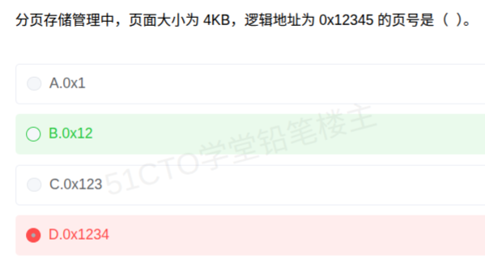

# 备考笔记：分页存储-页号提取速算

## 一、题目

> 分页存储管理中，页面大小为 4KB，逻辑地址为 0x12345 的页号是（ ）。
>
> A. 0x1
> B. 0x12
> C. 0x123
> D. 0x1234

**答案：B. 0x12**

解析：页面大小 4KB = $$2^{12}$$，页内偏移占低 **12 位**，页号占其余**高位**。十六进制下 12 位二进制 = 3 位十六进制，故**从右砍掉 3 位**：

$$0x12345 = \underbrace{0x12}_{\text{页号}}\;\underbrace{0x345}_{\text{页内偏移}}$$

页号为 **0x12**（十进制 18），页内偏移 0x345。故选 **B**。本次误选 D（0x1234），是把偏移当成 4 位（16B 一页）切出来了。

## 二、知识点：分页存储-页号提取速算

### 1. 核心原理

逻辑地址由**页号**和**页内偏移**拼接：

$$\text{逻辑地址} = \text{页号} \times \text{页面大小} + \text{页内偏移}$$

已知地址与页面大小时反推：

$$\text{页号} = \left\lfloor \frac{\text{逻辑地址}}{\text{页面大小}} \right\rfloor \quad , \quad \text{页内偏移} = \text{逻辑地址} \bmod \text{页面大小}$$

当页面大小为 $$2^{k}$$ 时，除法退化为**右移 k 位**，在十六进制里就是"**砍掉低 $$k/4$$ 位**"。

| 页面大小 | 2 的幂 | 偏移位数 k | 等价十六进制操作 |
| --- | --- | --- | --- |
| 1KB | $$2^{10}$$ | 10 | 二进制右移 10 位 |
| 4KB | $$2^{12}$$ | 12 | **砍掉低 3 位十六进制** |
| 8KB | $$2^{13}$$ | 13 | 位宽非 4 的倍数，宜先转二进制 |
| 16KB | $$2^{14}$$ | 14 | 位宽非 4 的倍数，宜先转二进制 |

### 2. 关键公式/规则

| 步骤 | 操作 | 本题代入 |
| --- | --- | --- |
| 1. 页面大小写成 $$2^{k}$$ | 4KB = $$2^{12}$$ | k = 12 |
| 2. 换算十六进制位宽 | $$k / 4$$ | 12 / 4 = 3 位 |
| 3. 自右砍掉这几位 | 剩下即页号 | 0x12345 → 砍 `345` → **0x12** |
| 4. 被砍部分即偏移 | — | **0x345** |
| 5. 回代校验 | 页号 × 页大小 + 偏移 | 0x12 × 4096 + 0x345 = 0x12345 ✓ |

干扰项全部是**砍错位置**造出来的：

| 选项 | 数值 | 等效偏移位宽 | 错因 |
| --- | --- | --- | --- |
| A | 0x1 | 16 位（16 位十六进制的 4 位） | 砍多了低 4 位 |
| B | 0x12 | 12 位 | **正确** |
| C | 0x123 | 8 位（256B 一页） | 砍少了，低 2 位当偏移 |
| D | 0x1234 | 4 位（16B 一页） | 砍最少，只砍低 1 位 |

### 3. 解题步骤

1. **定偏移位数**：4KB = $$2^{12}$$ → 偏移 12 位。
2. **换算十六进制位宽**：12 ÷ 4 = 3 位。
3. **切地址**：0x12345 从右数 3 位（3、4、5）为偏移，余下 0x12 为页号。
4. **回代校验**：0x12 × 4096 + 0x345 = 0x12345，核对无误。
5. **作答**：页号 **0x12**，选 **B**。

## 三、易错点

1. **反复踩同一个坑：偏移位宽按"字面数字"取**。4KB 里的 "4" 不是 4 位，$$4096 = 2^{12}$$ 才是 12 位——**先把容量写成 2 的幂，再谈位宽**。D 选项就是按 4 位（16B）切出来的，和上次同类错误的根源一致。
2. **二进制位宽 ↔ 十六进制位宽未打通**：1 位十六进制 = 4 位二进制，所以 12 位 = 3 位十六进制；若位宽不是 4 的倍数（如 14 位），**先转成二进制**再切，别硬凑。
3. **页号在高位、偏移在低位**，顺序颠倒会把 0x345 当页号。
4. **页号从 0 起编**：0x12 指"第 18 页"，若题目问"第几页"需注意是否 +1。
5. **逻辑地址 ≠ 物理地址**：本题只做逻辑地址 → 页号；到物理地址还要经**页表**映射成物理块号后重新拼接。
6. **选完要回代**：把算出的页号 × 页面大小 + 偏移，看是否等于原地址，几秒钟即可排除 A/C/D 三个干扰项。

## 四、扩展延伸

- **与已有笔记的关系**（同一知识点、两次犯错，务必对比复习）：
  - [27-分页存储-页号与页内偏移计算.md](27-分页存储-页号与页内偏移计算.md)：题干、选项与本篇**完全相同**，是同一道题的上一次记录；
  - [05-分页存储-页表地址映像.md](05-分页存储-页表地址映像.md)：侧重**页表完成页号→物理块号映射**。
  - 完整链条：**逻辑地址 →（切出页号）→ 查页表 → 物理块号 → 拼页内偏移 → 物理地址**。
- **通用迁移**：任何"总地址 → 分块编号"的题（页号、块号、扇区号、Cache 行号、磁盘柱面号）都是同一套除法/取模：
  - 由**局部容量**定分母 $$2^{k}$$；
  - 商 = 块号，余数 = 块内偏移。
- **配套考点**：页表两次访存与 **TLB** 加速、**EAT** 计算、**页面置换算法**（OPT/FIFO/LRU/CLOCK，FIFO 的 Belady 异常）、**缺页中断**属内部中断、**分页 vs 分段 vs 段页式**。
- **现实类比**：把逻辑地址看作"**全书总页码**"，页面大小就是"**每章固定页数**"。
  - 4KB = 每章 4096 页；
  - 总页码 0x12345（十进制 74565）；
  - 74565 ÷ 4096 = 18 余 837 → **第 18 章**（页号 0x12）、**章内第 837 页**（偏移 0x345）。
  - 若误以为"每章 16 页"（D），商立即虚高——**分母错了，编号必错**。

## 五、错题归档

| 题号 | 题型 | 考点 | 难度 | 掌握度 |
| --- | --- | --- | --- | --- |
| 系统分析师-操作系统（存储管理） | 单选 | 由逻辑地址算页号：$$2^k$$ 定偏移位宽，页号取高位 | 易 | 薄弱（本次错选 D） |
| 系统分析师-操作系统（存储管理） | 单选 | 同题重做（见第 27 篇），两次均在此知识点失分 | 易 | 薄弱（待复习） |
| 系统分析师-操作系统（存储管理） | 单选 | 页表地址映像（同主题变式，见第 05 篇） | 中 | 待复习 |

## 六、相关图片

原题截图：`../images/51-分页存储-页号提取速算.png`（由用户上传的原题图复制改名而来）

