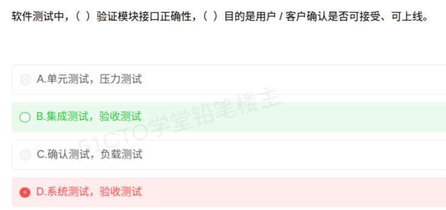

# 备考笔记：软件测试-测试阶段目的与接口验证辨析

## 一、题目

> 软件测试中，（ ）验证模块接口正确性，（ ）目的是用户/客户确认是否可接受、可上线。
>
> A. 单元测试，压力测试
> B. 集成测试，验收测试
> C. 确认测试，负载测试
> D. 系统测试，验收测试

**答案：B. 集成测试，验收测试**

解析：第一空的关键词是"**模块接口**"。**单元测试**面对的是单个模块内部；一旦涉及**模块之间**的接口与协作，就进入**集成测试**阶段。第二空的关键词是"**用户/客户确认是否可接受、可上线**"，这是**验收测试**（含确认测试）的典型定义。故选 **B**。

本次误选 D："系统测试"针对的是**整个系统的功能、性能、可靠性等非功能需求**，不是"模块接口"；其第二空虽然也填对了验收测试，但第一空错，故 D 整项不成立。

## 二、知识点：软件测试-测试阶段目的与接口验证辨析

### 1. 核心原理

软件测试按**测试对象由小到大、由内到外**分为若干阶段，每个阶段的**测试对象**与**目的**各不相同。软考常把"两个空"打乱成选项，考的就是**阶段名 ↔ 目的**的对应关系：

| 阶段 | 测试对象 | 核心目的 | 依据文档 |
| --- | --- | --- | --- |
| **单元测试** | 单个模块/函数（最小单位） | 验证**模块内部**的逻辑、算法、分支是否正确 | 详细设计 |
| **集成测试** | **模块之间的接口与组装** | 验证**模块接口**是否正确、组装后能否协同工作 | 概要设计 |
| **系统测试** | 整个软件系统 | 验证**整体功能与性能**（含非功能需求）是否达标 | 需求规格说明书 |
| **验收测试** | 交付给用户的实际系统 | 由**用户/客户**确认是否**可接受、可上线** | 用户需求/合同 |

关键区分点：

- **"模块接口" → 集成测试**（单元测试只管模块**内部**，接口是模块**之间**的事）；
- **"用户/客户确认、可否上线" → 验收测试**（只有它由用户主导）。

### 2. 关键公式/规则

**"关键词 → 阶段"速查表**（选项常靠这张表制造干扰）：

| 题干关键词 | 对应阶段 |
| --- | --- |
| 模块内部、代码逻辑、语句/分支覆盖 | 单元测试 |
| **模块间接口**、自顶向下/自底向上组装、桩模块/驱动模块 | **集成测试** |
| 整个系统、功能 + **性能**、压力/负载/并发 | 系统测试 |
| **用户/客户**、可接受、可上线、α/β 测试 | **验收测试** |
| 白盒、黑盒、灰盒 | 属**测试方法**，不是阶段（易混考点） |

**测试方法 ≠ 测试阶段**：

| 维度 | 内容 |
| --- | --- |
| 是否看代码 | 白盒（结构）/ 黑盒（功能）/ 灰盒 |
| 是否运行程序 | 静态测试 / 动态测试 |
| 用例设计 | 等价类划分、边界值、因果图、判定表、正交、错误推测 |

### 3. 解题步骤

1. **抓第一空关键词**："验证**模块接口**正确性"——模块**之间**的接口 → **集成测试**。
2. **抓第二空关键词**："**用户/客户**确认是否可接受、可上线" → **验收测试**。
3. **组合比对选项**：
   - A：单元测试（管模块内部，❌）+ 压力测试（属系统测试的性能手段，❌）；
   - B：集成测试 + 验收测试 → **两项全对** ✓；
   - C：确认测试（即验收测试）虽然第二空语义接近，但第一空"确认测试"不负责模块接口，❌；
   - D：系统测试（针对整体，非接口，❌）+ 验收测试（✓）→ 只对一半。
4. **选定 B**。

## 三、易错点

1. **把"模块接口"错配给单元测试或系统测试**：单元测试覆盖**模块内部**，系统测试覆盖**整体**；**只有集成测试**对着**模块之间的接口**。这是本题的失分点。
2. **"确认测试"与"集成测试"混淆**：确认测试（Validation，即验收测试）是**面向用户需求**的确认，不是"模块确认"；其位置在**验收测试**一侧，而不是集成测试一侧（C 选项正是借此设陷）。
3. **把测试层次（阶段）与测试方法混为一谈**：白盒/黑盒、静态/动态属**方法**；单元/集成/系统/验收属**阶段**。问"阶段"时别答方法。
4. **只对一半就下手**：这类"两空题"必须**两空同时匹配**才可选，D 就是"第一空错、第二空对"的假阳性。
5. **验收测试的别称**：验收测试又称**确认测试**；对应的验证概念还有 **V&V**——**Verification（验证，做对产品）** 对 **Validation（确认，做对的产品）**，常被拿来比较。
6. **压力测试/负载测试的位置**：二者是**性能测试**的具体手段，隶属**系统测试**阶段，不是独立阶段，更不能与集成/验收并列（A、C 的干扰来源）。

## 四、扩展延伸

- **测试阶段与开发阶段的对应（V 模型）**：单元测试 ← 详细设计；集成测试 ← 概要设计；系统测试 ← 需求规格；验收测试 ← 用户需求。**每级测试都以对应的设计文档为依据**，这是常考的"依据文档"配对题。
- **集成测试的两种策略**：
  - **自顶向下**：从主控模块开始，需**桩模块（Stub）**模拟下层被调模块；
  - **自底向上**：从最底层模块开始，需**驱动模块（Driver）**调用被测模块；
  - **三明治**：两者结合。
- **验收测试的形态**：**α 测试**（开发方场所、用户参与）、**β 测试**（用户场所、真实使用）、正式验收测试。
- **黑盒用例设计方法**：等价类划分、边界值分析、错误推测、因果图/判定表、正交试验、场景法；**白盒覆盖强度**由弱到强：语句 → 判定（分支）→ 条件 → 判定/条件 → 条件组合 → 路径覆盖。
- **V&V 与测试的关系**：V&V（Verification & Validation）是贯穿**全生命周期**的活动，**测试只是 V&V 的一部分**——静态评审、代码走查、形式化验证同样属于 V&V，不要窄化为"V&V 就是测试"。
- **现实类比**：把造车想成软件测试的四个阶段——
  - **单元测试**：单独检验每个零件（螺丝、刹车片）本身合不合格；
  - **集成测试**：把零件**装到一起**，检验**接口**（刹车片装到轮毂上是否咬合）；
  - **系统测试**：整车**功能与性能**（百公里加速、油耗、碰撞）；
  - **验收测试**：**交付给客户**，由客户判断"这车我能不能接受、能不能上路"。

## 五、错题归档

| 题号 | 题型 | 考点 | 难度 | 掌握度 |
| --- | --- | --- | --- | --- |
| 系统分析师-系统测试 | 单选 | 测试阶段与目的配对：模块接口→集成测试；用户确认可接受/可上线→验收测试 | 易 | 薄弱（本次错选 D） |
| 系统分析师-系统测试 | 单选 | 测试阶段与依据文档配对（V 模型） | 中 | 待复习 |
| 系统分析师-系统测试 | 单选 | 测试方法（白盒/黑盒、覆盖强度）与测试阶段的区分 | 中 | 待复习 |

## 六、相关图片

原题截图：`../images/52-软件测试-测试阶段目的与接口验证辨析.png`（由用户上传的原题图复制改名而来）

