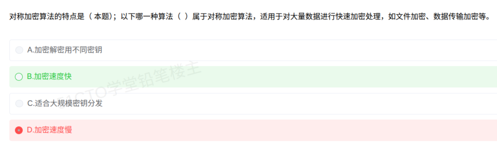

# 备考笔记：对称加密-特点及与非对称加密对比

## 一、题目

> 对称加密算法的特点是（ ）；以下哪一种算法属于对称加密算法，适用于对大量数据进行快速加密处理，如文件加密、数据传输加密等。
>
> A. 加密解密用不同密钥
> B. 加密速度快
> C. 适合大规模密钥分发
> D. 加密速度慢

**答案：B. 加密速度快**

解析：**对称加密**的加解密**使用同一把密钥**，算法多为**位运算与查表**，因此**加解密速度快**、适合**大数据量**加密（文件加密、数据传输加密）。A"不同密钥"、C"适合大规模密钥分发"、D"速度慢"都是**非对称加密（公钥密码）**的特征，故排除。选 **B**。

本次误选 D："加密速度慢"恰好说反了——**对称快、非对称慢**，记住这个最基本的对比即可避坑。

> 注：题干第二空"哪一种算法属于对称加密算法"应为另一小问的引子；若选项给出算法名，答案应落在 **DES / 3DES / AES / IDEA / RC4 / SM4** 等对称算法上（详见"扩展延伸"）。

## 二、知识点：对称加密-特点及与非对称加密对比

### 1. 核心原理

**对称加密（私钥密码）**：加密与解密**共用同一把密钥** $$K$$。

$$\text{密文} = E_K(\text{明文}) \qquad \text{明文} = D_K(\text{密文})$$

- **优点**：算法简单、**速度快**（比非对称快几个数量级），适合**大量数据**加密；
- **缺点**：密钥必须**安全地共享**，密钥管理困难——$$n$$ 人两两通信需 $$C_n^2 = n(n-1)/2$$ 把密钥；且**无法直接实现数字签名/不可否认性**。

**非对称加密（公钥密码）**：使用**一对密钥**——公钥加密、私钥解密（或反之签名）。

- **优点**：密钥**分发方便**（公钥可公开）、可**数字签名**；
- **缺点**：基于大数分解/离散对数等数学难题，**运算慢**，**不适合大数据量**。

### 2. 关键公式/规则

**对称 vs 非对称 对照表**（高频考点，务必记牢）：

| 对比项 | 对称加密 | 非对称加密 |
| --- | --- | --- |
| 密钥 | **加解密同一把** | **公私钥成对** |
| 速度 | **快** | 慢 |
| 适用数据量 | **大**（文件、批量传输） | 小（密钥、摘要、签名） |
| 密钥分发 | 困难（需安全信道） | **方便**（公钥可公开） |
| 密钥数量（n 方两两通信） | $$n(n-1)/2$$ | $$2n$$（每人一对） |
| 数字签名 | 不支持 | **支持** |
| 典型算法 | **DES、3DES、AES、IDEA、RC4、SM4** | **RSA、ECC、ElGamal、DSA、SM2** |

**混合加密（实际工程做法）**：用**非对称**算法传递**对称密钥**，再用**对称**算法加密**大数据**——兼得"密钥分发方便"与"加解密快速"（如 HTTPS/TLS、PGP）。

### 3. 解题步骤

1. **抓考点**：题干问"**对称加密**的特点"。
2. **回放对称的定义**：加解密**同一密钥**、**速度快**、适合**大数据量**。
3. **逐项核对**：
   - A"不同密钥" → 对称是**相同**密钥，描述的是非对称 ✗；
   - B"速度快" → **对称的招牌特点** ✓；
   - C"适合大规模密钥分发" → 这是**非对称**的优势 ✗；
   - D"速度慢" → 说反了 ✗。
4. **选定 B**。（若第二空问"哪种算法"，则选 **DES/AES** 一类对称算法名。）

## 三、易错点

1. **"快慢"记反**：**对称快、非对称慢**。非对称因大数运算而慢，只能加小数据；对称才是"批量加密"的主力。D 就是靠记反来设陷。
2. **"密钥分发"张冠李戴**：**分发方便是非对称的长处**，对称恰恰**难在分发**（C 选项正是这么错的）。
3. **"同一把 vs 不同把"搞混**：对称是**同一把密钥**加解密；非对称才"公钥加密、私钥解密"（A 描述的是非对称）。
4. **误以为对称算法能做数字签名**：对称**不支持**数字签名/不可否认性（因为双方共享同一密钥，无法证明来源），签名要靠**非对称**。
5. **算法归类混淆**：
   - 对称：**DES、3DES、AES、IDEA、RC4、SM4**（国密）；
   - 非对称：**RSA、ECC、ElGamal、DSA、SM2**（国密）；
   - **摘要（Hash）**：MD5、SHA 系列、SM3 —— 注意它们是**单向散列**，**既不是对称也不是非对称加密**，别归错队。
6. **把"密钥数量"算反**：$$n$$ 人两两通信，对称需 $$\frac{n(n-1)}{2}$$ 把，非对称只需 $$2n$$（每人一对）——这是"对称分发难"的量化体现。

## 四、扩展延伸

- **HTTPS/TLS 的经典组合**（把对称与非对称串起来考）：
  1. 客户端用**非对称加密**（RSA/ECDHE）与服务器协商出会话密钥；
  2. 之后所有数据用**对称加密**（AES）高速传输；
  3. 完整性由**消息摘要 + 数字签名**（Hash + 非对称）保证。
  一句话：**"非对称管钥匙，对称管数据，摘要管完整"**。
- **国密算法体系（SM 系列，国产化考点）**：
  - **SM1**：对称，硬件实现；
  - **SM2**：**非对称**，基于椭圆曲线（ECC）；
  - **SM3**：**摘要**（Hash）；
  - **SM4**：**对称**，分组密码；
  - **SM9**：标识密码。
- **密钥管理**：对称加密在大规模系统中的最大痛点就是密钥分配与更新，故实践中常用**密钥分配中心（KDC）**或**数字信封**来解决——这也解释了为什么真实系统采用**混合加密**而非单纯对称/非对称。
- **攻击面差异**：对称算法常被分析**差分/线性密码分析**（如针对 DES）；DES 因密钥仅 56 位已不安全，需用 **3DES** 或 **AES** 替代。
- **现实类比**：
  - **对称加密**＝**一把锁一把钥匙复制两份**，双方各拿一把，开门快、上锁快；但钥匙被偷就全完，且人多时"每人配多少把钥匙"很麻烦（$$n(n-1)/2$$）。
  - **非对称加密**＝**邮箱**：**公钥像收件口**，谁都能往里投信（加密）；**私钥像钥匙**，只有本人能开箱读信（解密）；但每次"投递"都慢（大数运算），**大文件不合适**。
  - 于是现实中：**用邮箱（非对称）把一把锁的钥匙寄给对方，之后双方用锁（对称）快速锁箱传文件**——这就是混合加密。

## 五、错题归档

| 题号 | 题型 | 考点 | 难度 | 掌握度 |
| --- | --- | --- | --- | --- |
| 系统分析师-网络与信息安全 | 单选 | 对称加密特点：**同一密钥、速度快**、适合大数据量；与"不同密钥/慢/便于分发"（非对称）区分 | 易 | 薄弱（本次错选 D） |
| 系统分析师-网络与信息安全 | 单选 | 对称/非对称算法归类（DES/AES vs RSA/ECC，SM 系列） | 中 | 待复习 |
| 系统分析师-网络与信息安全 | 单选 | 混合加密（非对称传密钥 + 对称传数据）流程 | 中 | 待复习 |

## 六、相关图片

原题截图：`../images/54-对称加密-特点及与非对称加密对比.png`（由用户上传的原题图复制改名而来）

