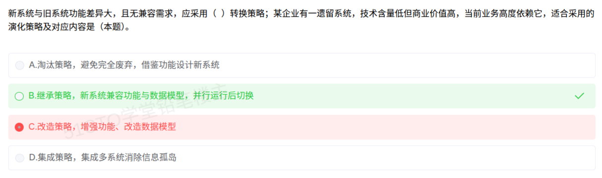

# 备考笔记：遗留系统演化策略-技术含量与商业价值二维判断

## 一、题目

> 新系统与旧系统功能差异大，且无兼容需求，应采用（ ）转换策略；某企业有一遗留系统，技术含量低但商业价值高，当前业务高度依赖它，适合采用的演化策略及对应内容是（本题）。
>
> A. 淘汰策略，避免完全废弃，借鉴功能设计新系统
> B. 继承策略，新系统兼容功能与数据模型，并行运行后切换
> C. 改造策略，增强功能、改造数据模型
> D. 集成策略，集成多系统消除信息孤岛

**答案：B. 继承策略，新系统兼容功能与数据模型，并行运行后切换**

解析：
- 第一空"**新系统与旧系统功能差异大，且无兼容需求**"——既然不需兼容，就不必在新系统中保留旧系统的功能与数据模型，直接**淘汰旧系统、重新开发**即可，对应 **淘汰策略**；
- 第二空（本题所问）给定条件是"**技术含量低、商业价值高、业务高度依赖**"。遗留系统演化策略按 **技术含量 × 商业价值** 两个维度划分，此象限落在 **继承策略**——**保留**原系统继续使用（因商业价值高、业务依赖强），**新系统兼容其功能与数据模型，并行运行后再切换**。

故选 **B**。

本次误选 C："改造策略"对应的是 **技术含量高 + 商业价值高**（需要**增强功能、改造数据模型**）的象限；本题技术含量**低**，无需大改，故 C 不成立。

## 二、知识点：遗留系统演化策略-技术含量与商业价值二维判断

### 1. 核心原理

**遗留系统（Legacy System）** 指仍在承担关键业务、但技术上已陈旧的老系统。对它**既不能盲目废弃（业务依赖），也不能原样死守（技术落后）**，需按两个维度综合判断采取哪种**演化策略**：

- **技术含量 / 技术水平**：低 ↔ 高（系统本身的技术是否落后、是否需要大改）；
- **商业价值**：低 ↔ 高（系统对当前业务的重要程度、是否被高度依赖）。

两个维度交叉成 **四象限**，每象限对应一种策略：

| 技术含量 ＼ 商业价值 | 商业价值 **低** | 商业价值 **高** |
| --- | --- | --- |
| 技术含量 **低** | **淘汰策略** | **继承策略** |
| 技术含量 **高** | **集成策略** | **改造策略** |

### 2. 关键公式/规则

**四策略速查表**（背熟这张表，本题一眼可判）：

| 策略 | 象限（技术含量 / 商业价值） | 适用情形 | 对应做法 |
| --- | --- | --- | --- |
| **淘汰** | 低 / 低 | 技术落后、业务价值低 | **避免完全废弃**，借鉴其功能重新设计**新系统**替代 |
| **继承** | **低 / 高** | 技术不先进，但**业务高度依赖**、价值高 | **保留**旧系统，新系统**兼容其功能与数据模型**，**并行运行后切换** |
| **改造** | **高 / 高** | 技术含量高、价值也高，值得投入 | **增强功能、改造数据模型**（再工程/重构） |
| **集成** | **高 / 低** | 系统技术尚可但业务价值有限、且分散 | **集成多个系统**，消除**信息孤岛** |

**一句话记忆**：
**"低低淘汰、低高继承、高高改造、高低集成"**
（技术含量在前、商业价值在后）

**易混对照（本题的分水岭）**：

| 对比 | 继承（低技术价值高） | 改造（高技术价值高） |
| --- | --- | --- |
| 触发条件 | 技术含量**低**，不必大改 | 技术含量**高**，需要升级 |
| 关键动作 | **保留 + 兼容 + 并行切换** | **增强功能 + 改造数据模型** |
| 口诀 | **"接着用，别乱动"** | **"修得好，用得久"** |

### 3. 解题步骤

1. **先看第一空**："功能差异大 + 无兼容需求"→ 不需要在新系统中保留旧功能与数据模型 → **淘汰（重新开发）**。
2. **再看本题所问**：提取两个维度信息——**技术含量低**、**商业价值高**（业务高度依赖）。
3. **对号入座四象限**：低技术 + 高价值 → **继承策略**。
4. **核对选项描述**：B"新系统兼容功能与数据模型，并行运行后切换"正是继承策略的做法 ✓；C"增强功能、改造数据模型"属改造策略 ✗。
5. **选定 B**。

## 三、易错点

1. **只看"技术含量低"就误判为"淘汰"**：淘汰要求**商业价值也低**。本题商业价值**高**、业务高度依赖，绝不能淘汰，只能**继承**。
2. **把"继承"错当"改造"**（本次失分点）：**改造针对"技术含量高"的系统**（需要大改、增强功能、改数据模型）；**技术含量低**的系统没有大改的必要，直接**继承（保留 + 兼容）**即可。记住分水岭是**技术含量的高低**。
3. **四象限维度记反**：务必确认两个轴各自的含义——**横轴商业价值、纵轴技术含量**。若把两轴对调，"继承/集成"就会互换（继承＝低技术+高价值；集成＝高技术+低价值），极易选错。
4. **混淆"继承"与"集成"**：**继承**是"单个高价值系统保留沿用"；**集成**是"多个价值不高、技术尚可的系统**整合打通、消除信息孤岛**"。方向完全不同。
5. **忽略"无兼容需求"这个前提**：第一空的关键就是"无兼容需求"——若有兼容需求，通常就不能直接淘汰，而要采用并行切换等稳妥方式。
6. **把"淘汰"理解成"直接扔掉"**：淘汰策略的正确定义是"**避免完全废弃**，借鉴其功能来设计新系统"，即**淘汰系统、继承经验**。选项 A 的描述其实没错，只是**与第一空的题干要求虽相关，但本题问的是第二空的策略**——要看清题目问的是哪一空。

## 四、扩展延伸

- **与"系统维护"的关系**：遗留系统演化本质上是**维护与再工程**问题。软件维护分四类：
  - **改正性维护**（修 bug）、**适应性维护**（适应环境变化）、**完善性维护**（增加新功能）、**预防性维护**（防止未来出问题，常对应再工程/改造）。其中**完善性维护占比最大**，是常考常识。
- **再工程（Reengineering）**：不改动系统功能，但**改进其内部结构/技术实现**（如重构、逆向工程 → 重构 → 正向工程），正是"改造策略"在工程层面的落地手段。
- **银行/ERP 场景的现实映射**（软考案例分析常用背景）：
  - **老核心账务系统**：技术陈旧但承载全部业务 → **继承**（先兼容、新老并行、灰度切换）；
  - **多个互不联通的业务小系统**：技术还行但各自为政 → **集成**（建统一数据/服务总线，消除信息孤岛）；
  - **纸质/边缘台账工具**：技术低、业务价值也低 → **淘汰**（直接重做）。
- **与"新旧系统转换方式"的关联**（第一空的延伸考点，常与之配套考）：

| 转换方式 | 特点 |
| --- | --- |
| **直接转换** | 旧系统停用、新系统立即上线，**风险最大**、成本最低 |
| **并行转换** | 新旧**并行运行**一段时间，**风险最小**、成本最高（本题 B 采用的是这一方式） |
| **分段转换** | 按模块/子系统**分批切换**，风险与成本居中 |

- **现实类比**：把遗留系统当成**老房子**——
  - **低价值 + 低技术**＝**危房**：拆了重盖（**淘汰**）；
  - **高价值 + 低技术**＝**地段极好、结构简单的老宅**：不拆，**原样保留、稍加维护接着住**（**继承**，搬家的东西（数据/功能）都要能带过来）；
  - **高价值 + 高技术**＝**好地段的豪宅**：值得**翻新加固、扩改建**（**改造**）；
  - **低价值 + 高技术**＝**几间分散但还算结实的仓库**：不值得大动，**打通连成一片用**（**集成**）。

## 五、错题归档

| 题号 | 题型 | 考点 | 难度 | 掌握度 |
| --- | --- | --- | --- | --- |
| 系统分析师-系统维护与演化 | 单选 | 遗留系统演化策略：**技术含量低 + 商业价值高 → 继承策略**（兼容功能与数据模型、并行运行后切换） | 易 | 薄弱（本次错选 C） |
| 系统分析师-系统维护与演化 | 单选 | 四象限判断（淘汰/继承/改造/集成）与技术含量的分水岭 | 中 | 待复习 |
| 系统分析师-系统维护与演化 | 单选 | 新旧系统转换方式（直接/并行/分段）与软件维护四类 | 中 | 待复习 |

## 六、相关图片

原题截图：`../images/56-遗留系统演化策略-技术含量与商业价值二维判断.png`（由用户上传的原题图复制改名而来）

