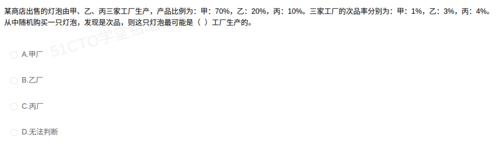

# 备考笔记：贝叶斯公式-次品来源概率比较

## 一、题目

> 某商店出售的灯泡由甲、乙、丙三家工厂生产，产品比例为：甲 70%，乙 20%，丙 10%。三家工厂的次品率分别为：甲 1%，乙 3%，丙 4%。从中随机购买一只灯泡，发现是次品，则这只灯泡最可能是 （ ） 工厂生产的。
>
> A. 甲厂
> B. 乙厂
> C. 丙厂
> D. 无法判断

**答案：A. 甲厂**

解析：这是典型的**贝叶斯（逆概）问题**——已知结果"是次品"，反推它最可能来自哪个"原因"（哪家工厂）。用条件概率比较三家的后验概率：

- 甲：$P(\text{甲})P(\text{次品}\mid\text{甲})=0.70\times0.01=0.007$
- 乙：$P(\text{乙})P(\text{次品}\mid\text{乙})=0.20\times0.03=0.006$
- 丙：$P(\text{丙})P(\text{次品}\mid\text{丙})=0.10\times0.04=0.004$

三者的联合概率和为 $0.007+0.006+0.004=0.017$（正是全概率公式给出的**次品率**）。后验概率：

- $P(\text{甲}\mid\text{次品})=0.007/0.017\approx41.2\%$
- $P(\text{乙}\mid\text{次品})=0.006/0.017\approx35.3\%$
- $P(\text{丙}\mid\text{次品})=0.004/0.017\approx23.5\%$

甲厂后验概率最大，故这只次品**最可能来自甲厂**，选 **A**。

> 关键点：**比较后验只需比较"先验 × 似然"这一乘积**（分母 $P(\text{次品})$ 对三家相同，可约去），不必真算出百分数。

## 二、知识点：贝叶斯公式-次品来源概率比较

### 1. 核心原理

**（1）先验概率（Prior）**：购买前，灯泡来自甲乙丙的概率由**产量比例**决定，$P(\text{甲})=0.7$、$P(\text{乙})=0.2$、$P(\text{丙})=0.1$。

**（2）似然 / 条件概率（Likelihood）**：各家自己的**次品率**，$P(\text{次品}\mid\text{甲})=0.01$、$P(\text{次品}\mid\text{乙})=0.03$、$P(\text{次品}\mid\text{丙})=0.04$。

**（3）全概率公式**：把"是次品"按来源拆开相加，得到**总的次品率**

$$P(\text{次品})=\sum_i P(\text{来源}_i)\,P(\text{次品}\mid\text{来源}_i)$$

**（4）贝叶斯公式（后验）**：反过来问"已知是次品，来自某厂的概率"

$$P(\text{来源}_i\mid\text{次品})=\frac{P(\text{来源}_i)\,P(\text{次品}\mid\text{来源}_i)}{P(\text{次品})}$$

即 **后验 ∝ 先验 × 似然**。分母 $P(\text{次品})$ 是三家的公共项，**比较谁最大时可直接省略**。

### 2. 关键公式/规则

| 名称 | 表达式 | 本题取值 |
| --- | --- | --- |
| 先验概率 | $P(\text{来源}_i)$ | 甲 0.7，乙 0.2，丙 0.1 |
| 似然（条件概率） | $P(\text{次品}\mid\text{来源}_i)$ | 甲 0.01，乙 0.03，丙 0.04 |
| 全概率公式 | $P(\text{次品})=\sum_i P(\text{来源}_i)P(\text{次品}\mid\text{来源}_i)$ | 0.007+0.006+0.004=**0.017** |
| 贝叶斯公式 | $P(\text{来源}_i\mid\text{次品})=\dfrac{P(\text{来源}_i)P(\text{次品}\mid\text{来源}_i)}{P(\text{次品})}$ | 见下表 |
| **比较口诀** | 后验 ∝ 先验 × 似然，分母相同可约去 | 直接比 $0.007>0.006>0.004$ |

| 来源 | 先验 $P$ | 次品率 $P(\text{次}\mid\text{源})$ | 联合 $P\times P(\text{次}\mid\text{源})$ | 后验 $P(\text{源}\mid\text{次})$ |
| --- | --- | --- | --- | --- |
| 甲 | 0.70 | 0.01 | **0.007** | **41.2%（最大）** |
| 乙 | 0.20 | 0.03 | 0.006 | 35.3% |
| 丙 | 0.10 | 0.04 | 0.004 | 23.5% |
| 合计 | 1.00 | — | 0.017 | 100% |

### 3. 解题步骤

1. **列出先验**：把"产量/来源比例"写成 $P(\text{甲}),P(\text{乙}),P(\text{丙})$。
2. **列出似然**：把各"次品率"写成 $P(\text{次品}\mid\text{来源})$。
3. **算联合（先验 × 似然）**：$0.007,\ 0.006,\ 0.004$。
4. **求和得全概率**：$0.017$（即总次品率）。
5. **比大小定答案**：联合概率最大者即为最可能来源 → **甲厂（A）**；若要求具体后验，再各自除以 $0.017$。

## 三、易错点

1. **误选丙厂**：看到"丙厂次品率最高（4%）"就选丙，是**只看似然、忽略先验**的典型错误。丙的产量只占 10%，先验太小，被甲的"高产量 + 低次品率"反超。
2. **把先验与似然相乘的顺序搞反或漏乘**：必须先验 × 似然（$0.7\times0.01$），**不能只比次品率**，也不能只比产量比例。
3. **忘记全概率（不除以分母）**：只比较"先验 × 似然"大小即可选出答案，但若要给出**具体概率值**，必须除以 $P(\text{次品})=0.017$，否则不是概率。
4. **"最可能"≠"一定"**：甲厂后验约 41%，只是**最大**，仍不到一半，不能理解为"必然是甲厂"。因此选项 D"无法判断"是干扰项——虽然不能确定，但**可以判断谁最可能**。
5. **混淆"次品率"与"次品来自某厂的概率"**：前者是 $P(\text{次品}\mid\text{来源})$（正向），后者是 $P(\text{来源}\mid\text{次品})$（逆向），**正是贝叶斯要转换的两个方向**。
6. **百分数小数点错位**：$70\%\times1\%=0.7\times0.01=0.007$，不要把 $1\%$ 当成 $0.1$ 或把百分比直接相乘得 $"70"$。

## 四、扩展延伸

- **贝叶斯思想的本质**：**用新证据（是次品）修正旧信念（先验）**。先验 + 证据 → 后验。这与"垃圾邮件识别""疾病检测""质量管理溯源"的推理逻辑完全一致。
- **现实类比**：
  - **医院筛查**：某病患病率极低（先验小），即便检测很准（似然大），阳性者真正患病的概率也未必高——与本题"丙次品率高但产量低，反而不是最可能来源"同理。
  - **供应链追责**：一批来料不良，要判断最可能来自哪个供应商，必须综合**供货量**与**各家不良率**，不能只看不良率。
- **正逆两个方向的对照**：

| 方向 | 名称 | 公式 | 本题含义 |
| --- | --- | --- | --- |
| 由因求果 | 全概率公式 | $P(\text{次品})=\sum P(\text{源})P(\text{次}\mid\text{源})$ | 从各家产量与次品率算出**总次品率** 0.017 |
| 由果溯因 | 贝叶斯公式 | $P(\text{源}\mid\text{次})=\dfrac{P(\text{源})P(\text{次}\mid\text{源})}{P(\text{次品})}$ | 已知是次品，反推**最可能的来源**（甲） |

- **与已有笔记的联系**：本题属 **概率论（数学与经济管理）** 考点，与 [29-最小生成树与图中心选址.md](29-最小生成树与图中心选址.md) 同属"数学与经济管理"章节的数量型计算；与 [06-系统可靠性-串并联冗余模型.md](06-系统可靠性-串并联冗余模型.md) 都涉及 **概率相乘/分解** 思维，可对照记忆。

## 五、错题归档

| 题号 | 题型 | 考点 | 难度 | 掌握度 |
| --- | --- | --- | --- | --- |
| 系统分析师-数学与经济管理（概率） | 单选 | 贝叶斯公式：先验 × 似然比较后验，判断次品最可能来源（甲厂） | 中 | 待复习 |
| 系统分析师-数学与经济管理（概率） | 单选 | 全概率公式求总次品率 + 逆概方向区分（易误选次品率最高的丙厂） | 中 | 待复习 |

## 六、相关图片

原题截图：`../images/61-贝叶斯公式-次品来源概率比较.png`（由用户上传的原题图复制改名而来）

