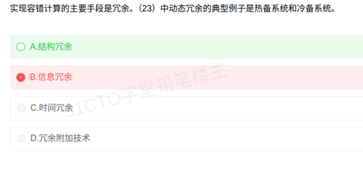

# 备考笔记：容错计算-冗余技术分类与结构冗余

## 一、题目

> 实现容错计算的主要手段是冗余。（23）中动态冗余的典型例子是热备系统和冷备系统。
>
> A. 结构冗余
> B. 信息冗余
> C. 时间冗余
> D. 冗余附加技术

**答案：A. 结构冗余**

解析：容错计算的核心手段是**冗余**，即用"多余的资源换取可靠性"。按冗余资源的性质，可分为**结构冗余、信息冗余、时间冗余、冗余附加技术**四类，其中**结构冗余（硬件冗余）**又细分为**静态冗余、动态冗余、混合冗余**三种。**动态冗余**指平时只用一套（或部分）部件工作、故障时才切换到备用部件，其典型实现就是**热备（热备份）与冷备（冷备份）系统**，因此 (23) 应填**结构冗余**，选 A。本次误选 B（信息冗余），信息冗余靠的是**检错纠错码**这类附加信息，与"热备/冷备"无关。

## 二、知识点：容错计算-冗余技术分类与结构冗余

### 1. 核心原理

**容错计算**：系统在部分部件发生故障时，仍能继续正确运行的能力。实现容错的主要手段是**冗余**——用额外的硬件、信息、时间或支撑技术，换取对故障的"掩盖或容忍"。

按冗余资源的**性质**分四类：

- **结构冗余（硬件冗余）**：靠**额外硬件**冗余实现容错。是唯一一种**再分三小类**的冗余：
  - **静态冗余**：冗余部件**同时在线、同时工作**，用**表决器**取多数结果，故障立即被掩盖、**无需切换**。典型：**三模冗余（TMR）**、多模冗余。
  - **动态冗余**：平时只有**一套（或部分）部件工作**，另设**备用部件**，故障时靠**切换/重组**让备用件顶上。典型：**热备系统、冷备系统**（本题考点）。
  - **混合冗余**：静态 + 动态结合，先用表决器掩盖部分故障，再动态替换失效模块。
- **信息冗余**：靠附加的**校验信息**实现检错/纠错，如**奇偶校验码、海明码、CRC**。
- **时间冗余**：靠**重复执行**换容错，如**指令复执、程序卷回（回滚重算）**。
- **冗余附加技术**：为实现上述冗余所必需的**支撑技术**，如**表决器、比较器、切换开关、监控定时器（看门狗）**等。

一句话记忆：**结构冗余是"多配硬件"，信息冗余是"多加校验"，时间冗余是"重做一遍"，附加技术是"配套器件"**；只有结构冗余再分**静/动/混**三态。

### 2. 关键公式/规则

| 冗余类型 | 冗余资源 | 典型例子 | 容错方式 |
| --- | --- | --- | --- |
| **结构冗余-静态** | 硬件（同时在线） | 三模冗余 TMR、多模冗余 | 表决器取多数，**故障立即掩盖、不切换** |
| **结构冗余-动态** | 硬件（备用件） | **热备系统、冷备系统** | 故障后**切换**到备用部件 |
| **结构冗余-混合** | 硬件（静态+动态） | 表决器 + 备用模块 | 先掩盖、后替换 |
| 信息冗余 | 附加校验码 | 奇偶校验、海明码、CRC | 检错 / 纠错 |
| 时间冗余 | 时间 | 指令复执、程序卷回 | 重复执行、重算 |
| 冗余附加技术 | 支撑器件 | 表决器、切换器、看门狗 | 支撑上述冗余落地 |

- **判据口诀**：**"热备冷备=结构冗余-动态"**；**"校验码=信息冗余"**；**"重做=时间冗余"**；**"表决器/切换器=附加技术"**。
- **静态 vs 动态的界线**：**静态冗余"同时在线不切换"（靠表决），动态冗余"备而不用、故障才切换"（靠替换）**。

### 3. 解题步骤

1. **抓关键词**：题干出现"**热备系统和冷备系统**"→ 关键字是"备"，即**备用部件 + 故障后切换**。
2. **定位冗余大类**：备用部件属于**硬件资源**冗余，排除信息冗余（校验码）、时间冗余（重复执行）、附加技术（配套器件），锁定**结构冗余**。
3. **再看结构冗余内部分类**：热备/冷备是**备件替换**而非同时在线表决，属**动态冗余**，与题干"动态冗余的典型例子"完全吻合。
4. **比对选项**：A 结构冗余 ✓；B 信息冗余（校验码）✗；C 时间冗余（复执）✗；D 冗余附加技术（表决器/切换器）✗。故选 **A**。

## 三、易错点

1. **把"冗余"只当成一种技术**：冗余是总手段，其下分**结构/信息/时间/附加**四类，题干问的是"哪一类里包含热备冷备"，必须落到分类上。
2. **误选 B 信息冗余**（本次失分点）：信息冗余靠**检错纠错码**（奇偶、海明、CRC）这类**附加信息**；"热备、冷备"是**硬件备件**，属结构冗余，二者风马牛不相及。
3. **混淆静态冗余与动态冗余**：**静态=同时在线、靠表决器、不切换**（TMR）；**动态=备件待命、故障才切换**（热备/冷备）。看到"备"字应想到动态。
4. **把"冗余附加技术"当成万能选项**：表决器、比较器、切换器、看门狗这些是**支撑冗余实现的配套技术**，本身不是冗余的主体分类；热备/冷备的实现虽会用到切换器，但题干问的是热备/冷备**本身**属于哪类冗余。
5. **忽略"结构冗余"是唯一再分类的**：只有结构冗余继续分静态/动态/混合；信息、时间、附加技术都是单一类型，不要给它们硬套"静态/动态"。
6. **对联考双空题不加区分**：本段常与相邻空搭配考"静态冗余的典型例子"（答案多为**三模冗余 TMR**），要按"静/动"两字分别对应"表决 vs 切换"。

## 四、扩展延伸

- **热备 vs 冷备（动态冗余两种形态）**：**热备**——备用件**加电、实时同步**、随时可接管，切换快、代价高；**冷备**——备用件**断电待命**、需要时才启动并同步数据，切换慢但省资源。二者都属**动态冗余**。
- **静态冗余代表——三模冗余 TMR**：三个相同模块同时工作、输出送**多数表决器**，一个模块出错仍能输出正确结果，**无切换时延**，代价是 3 倍硬件。前一篇 [06-系统可靠性-串并联冗余模型.md](06-系统可靠性-串并联冗余模型.md) 的并联模型即为这类硬件冗余的**可靠性定量计算**，两篇可对照复习（本篇讲"分类归属"，06 篇讲"可靠度怎么算"）。
- **四类冗余的现实类比**：结构冗余像"双机热备/备胎"；信息冗余像"文件附带的校验和/哈希"；时间冗余像"程序执行失败重试一次"；附加技术像"切换开关与心跳监控"。
- **故障屏蔽 vs 故障恢复**：静态冗余（表决）属**故障屏蔽**——故障当场被掩盖，用户无感；动态冗余（切换）属**故障恢复**——先检测故障，再切换/重组使系统恢复。这是理解静/动差异的一条主线。
- **考点归属**：容错计算、冗余分类、可靠度计算同属**计算机系统性能与可靠性**，软考（系统分析师/系统架构设计师）常以单空或双空选择题出现，务必记牢"**四类冗余 + 结构冗余三分（静/动/混）**"这张表。

## 五、错题归档

| 题号 | 题型 | 考点 | 难度 | 掌握度 |
| --- | --- | --- | --- | --- |
| 系统分析师-计算机系统（容错计算） | 单选 | 冗余技术分类：热备/冷备归属"结构冗余-动态冗余" | 易 | 薄弱（本次误选 B 信息冗余） |
| 系统分析师-计算机系统（容错计算） | 单选 | 静态冗余（TMR 表决）与动态冗余（备件切换）的区分 | 中 | 待复习 |

## 六、相关图片

原题截图：`../images/64-容错计算-冗余技术分类与结构冗余.png`（由用户上传的原题图复制改名而来）

