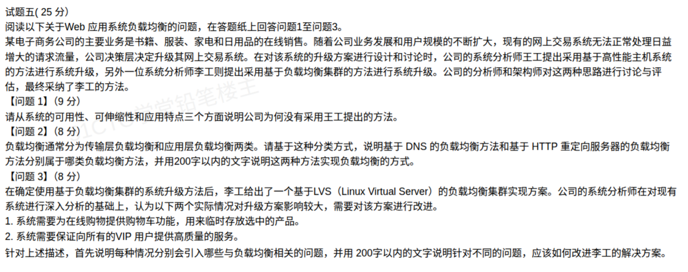

# 备考笔记：负载均衡——分类与集群实现方案

## 一、题目

> **试题五（25 分）**
>
> 某电子商务公司的主要业务是书籍、服装、家电和日用品的在线销售。随着公司业务发展和用户规模的不断扩大，现有的网上交易系统无法正常处理日益增加的请求流量，公司的决策层决定升级其网上交易系统。在对该系统的升级方案进行设计和讨论时，公司的系统分析师王工提出采用基于高性能主机系统的方法进行系统升级，另外一位系统分析师李工则提出采用基于负载均衡集群的方法进行系统升级。公司的分析师和架构师对这两种思路进行讨论与评估，最终采纳了李工的方法。
>
> **【问题 1】（9 分）**
> 请从系统的可用性、可扩展性和应用特点三个方面说明为什么没有采用王工提出的方法。
>
> **【问题 2】（8 分）**
> 负载均衡通常分为传输层负载均衡和应用层负载均衡两类。请基于这种分类方式说明基于 DNS 的负载均衡方法和基于 HTTP 重定向服务器的负载均衡方法分别属于哪类负载均衡方法，并用 200 字以内的文字说明这两种方法实现负载均衡的方式。
>
> **【问题 3】（8 分）**
> 在确定使用基于负载均衡集群的系统升级方法后，李工给出了一个基于 LVS（Linux Virtual Server）的负载均衡集群实现方案。公司的系统分析师在对现有系统进行深入分析的基础上，认为以下两个实际情况对升级方案影响较大，需要对升级方案进行改进。
> 1. 系统需要为在线购物提供购物车功能，用来临时存放选中的产品。
> 2. 系统需要保证向所有的 VIP 用户提供高质量的服务。
>
> 针对上述描述，首先说明每种情况分别会引入哪些与负载均衡相关的问题，并用 200 字以内的文字说明针对不同的问题，应该如何改进李工的解决方案。

**答案：**

- **问题 1**：王工方案是**基于高性能主机的垂直升级（Scale-up，单机增强）**，未被采纳是因为：①**可用性**——单台主机是**单点故障**，一旦宕机则整个系统不可用；②**可扩展性**——单机性能存在**物理上限**，扩充需不断更换更高规格硬件，成本急剧上升、扩展受限；③**应用特点**——电子商务系统**并发访问量大、要求 7×24 持续服务**，单机无法承载，集群才能满足。
- **问题 2**：**基于 DNS 的负载均衡属于传输层负载均衡；基于 HTTP 重定向服务器的负载均衡属于应用层负载均衡。**
- **问题 3**：①购物车 → 引入**会话保持（Session 保持/粘连）问题**，改进：采用会话保持策略（源 IP 哈希、LVS 的 `sh` 调度或持久连接）或**集中式 Session 共享存储**（Redis/数据库）；②VIP 高质量服务 → 引入**差异化/优先级服务问题**，改进：在**应用层负载均衡**按用户身份划分优先级与权重，或用**独立高性能集群 + QoS** 专门服务 VIP。

## 二、知识点：负载均衡的分类、实现方式与集群改进

### 1. 核心原理

**负载均衡（Load Balancing）**：把大量并发请求按某种策略分发到多台服务器，使系统在**高可用、可扩展、高性能**之间取得平衡。核心价值是**消除单点故障 + 横向扩展（Scale-out）**。

（1）**垂直扩展 vs 水平扩展**

| 方式 | 做法 | 特点 |
| --- | --- | --- |
| 垂直扩展（Scale-up） | 提升**单机**性能（更强 CPU、更大内存） | 有物理上限、成本指数上升、**单点故障** |
| 水平扩展（Scale-out） | **增加服务器节点**、前置负载均衡 | 可近线性扩展、单节点故障可被接管、**高可用** |

王工方案 = 垂直扩展，李工方案 = 水平扩展（负载均衡集群）。这是问题 1 的判分主线。

（2）**按协议层次分类（问题 2 的核心）**

| 层次 | 依据 | 代表技术 | 特点 |
| --- | --- | --- | --- |
| **传输层负载均衡（四层）** | 依据 **IP/端口** 转发，不看应用内容 | **DNS 轮询**、LVS（NAT/DR/TUN）、F5 四层 | 转发快、开销低，**无法感知应用内容与服务器状态** |
| **应用层负载均衡（七层）** | 依据 **HTTP 内容/URL/用户信息** 转发 | **HTTP 重定向服务器**、Nginx、HAProxy | 可做内容路由、会话保持、差异化调度，开销更大 |

（3）**问题 3 两个场景的知识落点**

- **购物车（有状态会话）** → 有状态应用在无状态分发下会**丢会话**，必须解决 **Session 保持 / 会话共享**。
- **VIP 用户（差异化服务）** → 需要**按身份区分服务质量**，四层只看 IP 无法区分用户，需上移到应用层按用户/优先级调度。

### 2. 关键公式/规则

**LVS 三种工作模式与常见调度算法**（问题 3 改进方案常考）：

| 类别 | 名称 | 说明 |
| --- | --- | --- |
| 工作模式 | NAT | 请求与响应都经 Director，**易成瓶颈** |
| 工作模式 | TUN（IP 隧道） | 响应由 Real Server 直回客户端，支持跨机房 |
| 工作模式 | **DR（直接路由）** | 性能最高，**实际部署最常用** |
| 调度算法 | rr / wrr | 轮询 / 加权轮询 |
| 调度算法 | lc / wlc | 最少连接 / 加权最少连接 |
| 调度算法 | **sh（源地址哈希）** | **同一源 IP 固定到同一 RS → 天然会话保持** |
| 调度算法 | dh（目标地址哈希） | 按目标地址哈希 |

**会话保持的三种典型手段**：

| 手段 | 做法 | 优缺点 |
| --- | --- | --- |
| 源 IP 哈希（`sh`） | 同一 IP 固定落到同一台服务器 | 简单；但 NAT/代理后 IP 可能相同，负载不均 |
| Cookie 保持 | 负载均衡器注入 Cookie 绑定后端 | 灵活；依赖 HTTP 层，需七层设备 |
| **集中式 Session 存储** | Session 存到 **Redis/数据库**，各节点共享 | **最可靠**，节点可任意扩展、故障不丢会话 |

### 3. 解题步骤

**问题 1（比较两种升级思路）**

1. 先定性：王工 = **垂直扩展/单机**，李工 = **水平扩展/集群**。
2. 按题目给的三个维度逐一对照：**可用性**（单点故障 vs 故障接管）、**可扩展性**（物理上限 vs 线性扩展）、**应用特点**（并发大、需持续服务 vs 集群承载）。
3. 每点写成"王工方案的缺陷 + 集群的优势"对照句，即可拿到分。

**问题 2（分类 + 说明实现方式）**

1. 记忆锚点：**看 IP/端口 = 传输层**，**看 HTTP 内容/重定向 = 应用层**。
2. DNS：多个 A 记录轮询解析 → **传输层**。
3. HTTP 重定向：返回 302 让客户端再访另一台 → **应用层**。
4. 各写 100 字左右实现方式即可（限 200 字内，别超）。

**问题 3（场景 → 问题 → 改进）**

1. 抓场景关键词：**购物车 = 有状态 = 会话保持**；**VIP = 差异化 = 优先级调度**。
2. 先答"引入什么问题"，再答"如何改进"。
3. 改进方案要落到**具体技术手段**（`sh` 算法 / 一致性哈希 / Redis 共享 Session / 七层按用户调度 / 独立 VIP 集群 / QoS）。

## 三、易错点

1. **问题 2 的分类最容易搞反**：DNS 名字里带"域名/名字解析"，容易被误判成应用层；但**它只按 IP 转发、不解析 HTTP 内容**，属于**传输层负载均衡**。HTTP 重定向要读 HTTP 报文并返回 302，是**应用层**。
2. **混淆"DNS 轮询"与"HTTP 重定向"的优缺点**：DNS 实现简单但受 **DNS 缓存**影响、负载不均且**感知不到服务器故障**；HTTP 重定向能感知状态但**重定向服务器本身**可能成瓶颈、且增加一次往返延迟。
3. **问题 1 只答"性能不够"会丢分**：题目**明确限定三个维度**（可用性、可扩展性、应用特点），必须逐条对应，漏一个维度扣一个维度分。
4. **问题 3 漏答"引入什么问题"**：题目要求"先说明引入哪些问题，再说明如何改进"，只写改进不写问题会失分。
5. **会话保持 ≠ 会话共享**：`sh`/Cookie 是"把同一用户粘到同一台机"（可能负载不均、节点故障仍丢会话）；**Redis 集中存储**才是彻底方案（节点无状态、可任意扩展）。高分答案通常两者结合。
6. **四层做不了差异化服务**：只按 IP 的负载均衡**无法区分 VIP/普通用户**，必须依赖应用层（七层）或独立集群，这是问题 3 的隐藏考点。
7. **字数限制**：问题 2、3 均限 200 字以内，写得过长反而扣分，要"要点 + 短句"。

## 四、扩展延伸

- **负载均衡的"分层"全景**：
  - **客户端层**：HTTP 重定向、DNS 轮询；
  - **四层（传输层）**：LVS、F5、四层交换机，按 IP+端口转发；
  - **七层（应用层）**：Nginx、HAProxy、API 网关，按 URL/Header/Cookie 做内容路由；
  - **全局负载均衡（GSLB）**：跨地域多机房，结合 DNS + 就近接入。
- **高可用配套**：负载均衡器自身也要**双机热备（主备/主主）**，否则它又变成新的单点故障；常见组合为 **Keepalived + VIP + LVS/Nginx**。
- **健康检查**：负载均衡器通过心跳（ICMP/TCP/HTTP 探测）剔除故障节点，是实现"故障接管"的前提。
- **现实类比**：把负载均衡想成**银行大堂的分流经理**——
  - 垂直扩展 = 只留一个**超级柜台**让所有客户排队（人一多就堵、柜员病假就停业）；
  - 传输层负载均衡 = 只按"客户从哪个门进来"随机指到某个窗口（快，但认不出 VIP）；
  - 应用层负载均衡 = 看清客户**要办什么业务、是不是 VIP** 再指窗口（慢一点但精准）；
  - 集中式 Session = 把客户资料统一放进**共享档案库**，任何窗口都能查到同一份记录。
- **知识连线**：本篇与 [17-分布式缓存与文件存储辨析.md](17-分布式缓存与文件存储辨析.md)（Redis 集中式缓存）、[32-微服务系统特征.md](32-微服务系统特征.md)（服务发现与网关）、[16-分布式数据库-CAP理论.md](16-分布式数据库-CAP理论.md)（高可用取舍）互为体系，可一起复习。

## 五、错题归档

| 题号 | 题型 | 考点 | 难度 | 掌握度 |
| --- | --- | --- | --- | --- |
| 系统架构设计师-案例分析 试题五 | 案例分析（3 小问） | 负载均衡：垂直/水平扩展、传输层与应用层分类、LVS 集群下的会话保持与差异化服务改进 | 中 | 待复习 |

## 六、相关图片

原题截图：`../images/65-负载均衡-分类与集群实现方案.png`（由用户上传的原题图复制改名而来）

