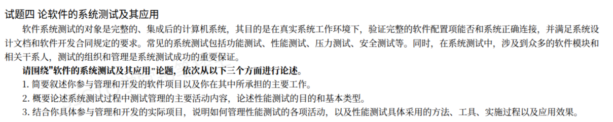

# 备考笔记：系统测试与性能测试（论文写作要点）

## 一、题目

> **试题四 论软件的系统测试及其应用**
>
> 软件系统测试的对象是完整的、集成后的计算机系统，其目的是在真实系统工作环境下，验证完整的软件配置项能否和系统正确连接，并满足系统设计文档和软件开发合同规定的要求。常见的系统测试包括功能测试、性能测试、压力测试、安全测试等。同时，在系统测试中，涉及到众多的软件模块和相关干系人，测试的组织和管理是系统测试成功的重要保证。
>
> 请围绕"软件的系统测试及其应用"论题，依次从以下三个方面进行论述。
> 1. 简要叙述你参与管理和开发的软件项目以及你在其中所承担的主要工作。
> 2. 概要论述系统测试过程中测试管理的主要活动内容，论述性能测试的目的和基本类型。
> 3. 结合你具体参与管理和开发的实际项目，说明如何管理性能测试的各项活动，以及性能测试具体采用的方法、工具、实施过程以及应用效果。

**答案：论文题（无标准选项）——按"项目背景 → 理论论述 → 项目实践"三段结构作答，核心采分点为：①系统测试的组织与管理活动；②性能测试的目的与基本类型；③结合项目论述性能测试的管理、方法、工具、实施过程与应用效果。**

解析：这是**系统分析师/系统架构设计师的论文题**，评分看"**理论准确性 + 项目真实性 + 结合紧密度**"。三段分别对应**摘要/引言**、**理论主体**、**实践论证**；失分最重的是第 2 问的理论（性能测试类型）与第 3 问的"**方法与工具是否落地**"。

## 二、知识点：系统测试与性能测试

### 1. 核心原理

**（1）系统测试的定位**

| 要素 | 内容 |
| --- | --- |
| **对象** | **完整的、集成后的**计算机系统（不是单个模块）。 |
| **环境** | **真实系统工作环境**（非模拟环境）。 |
| **目的** | 验证**完整软件配置项**能否与系统**正确连接**，并满足**系统设计文档与软件开发合同**的要求。 |
| **地位** | 位于单元测试、集成测试之后，验收测试之前，是"**测试阶段金字塔**"的顶层验证。 |

**（2）常见系统测试类型**（题干列举 + 常考补充）

功能测试、**性能测试**、压力测试、安全测试；此外还有**可靠性测试、兼容性测试、安装测试、恢复测试、界面测试、文档测试、可移植性测试**等。

**（3）系统测试组织与管理的必要性**

系统测试涉及**众多软件模块与相关干系人**（开发、测试、运维、用户、第三方），因此**测试的组织与管理是系统测试成功的重要保证**——这正是第 2 问的落点。

### 2. 关键公式/规则

**（1）系统测试管理的主要活动内容**（第 2 问前半，论文务必答全）

| 阶段 | 主要活动 |
| --- | --- |
| **测试计划** | 明确测试目标/范围、测试策略、资源（人、环境、工具）、进度与风险 |
| **测试设计** | 制定测试方案、设计测试用例、准备测试数据、开发测试脚本 |
| **测试环境与配置管理** | 搭建贴近生产的测试环境，做好**配置管理**与版本控制 |
| **测试执行与监控** | 按计划执行用例、**进度与质量监控**、回归测试 |
| **缺陷管理** | 缺陷登记、分级、指派、跟踪、验证、关闭（缺陷生命周期） |
| **测试评审与报告** | 测试用例评审、测试结果评审、测试报告与度量（覆盖率、缺陷密度） |
| **测试收尾** | 测试总结、经验归档、遗留问题与风险移交 |

> 一句话抓手：**计划 → 设计 → 环境/配置 → 执行监控 → 缺陷管理 → 评审报告 → 收尾**；贯穿始终的是**组织、协调与风险管理**。

**（2）性能测试的目的**（第 2 问后半）

1. **验证性能指标**是否满足需求（响应时间、吞吐量、并发用户数、资源利用率、TPS/QPS）；
2. **发现性能瓶颈**（CPU/内存/IO/网络/数据库/中间件）；
3. **评估系统容量与可扩展性**，为容量规划提供依据；
4. **支撑性能调优**，验证调优效果；
5. 评估系统在**极限与长期运行**下的稳定性与可靠性。

**（3）性能测试的基本类型**（高频采分点，务必写全并各配一句用途）

| 类型 | 做法 | 目的 |
| --- | --- | --- |
| **负载测试（Load）** | 逐步**增加负载**到预定值 | 测系统在不同负载下的性能表现 |
| **压力测试（Stress）** | 负载**超出正常极限**直至崩溃 | 找**瓶颈与极限**、看失效恢复能力 |
| **并发测试（Concurrency）** | 模拟**多用户同时访问**同一功能/数据 | 发现死锁、资源争用、并发缺陷 |
| **稳定性/疲劳测试（Endurance/Soak）** | **长时间持续**运行（数小时~数天） | 检验内存泄漏、性能衰减、稳定性 |
| **容量测试（Volume）** | 用**大数据量**（数据记录/文件） | 验证系统在大数据量下的处理能力 |
| **基准测试（Benchmark）** | 建立**性能基线** | 作为后续对比与回归的参照 |
| **峰值/尖峰测试（Spike）** | 负载**瞬间陡增** | 检验突发流量下的承受与恢复 |

**（4）性能测试常用方法与工具**（第 3 问落地，给出即可加分）

- **方法**：场景建模（业务比例/用户行为）、脚本参数化与关联、逐步加压、监控采样、瓶颈定位（自顶向下逐层排查）、调优—回归闭环。
- **压测工具**：**LoadRunner、Apache JMeter**、Gatling、Locust、NeoLoad、SilkPerformer、Apache Bench(ab)。
- **监控/分析工具**：nmon、Prometheus + Grafana、Zabbix、JProfiler、VisualVM、Arthas、数据库自带的慢查询/执行计划工具。

**（5）性能测试的实施过程**（第 3 问主线，按序成段）

1. **需求分析**：确定性能目标与关键指标（SLA）；
2. **测试计划与方案设计**：定义场景、业务配比、数据量、环境拓扑；
3. **环境搭建与数据准备**：尽量**生产同构**，准备足量测试数据；
4. **脚本开发与调试**：参数化、关联、事务与检查点；
5. **测试执行与监控**：基准 → 负载 → 压力 → 稳定性，**边压边监控**；
6. **结果分析与瓶颈定位**：从响应时间/吞吐量/资源曲线定位瓶颈；
7. **性能调优与回归**：改配置/改代码/加资源后**回归验证**；
8. **报告与总结**：输出性能测试报告，给出结论与优化建议。

### 3. 解题步骤（论文作答框架）

1. **摘要**：项目背景一句话 + 我担任的角色 + 本文论述的三点 + 成效。
2. **第 1 问（项目背景）**：选择一个**真实、可讲清**的项目——项目名称/规模、业务与技术栈、我的岗位与职责（如性能测试负责人）。**要点到具体**，忌空泛。
3. **第 2 问（理论）**：分两块作答——
   - 先写**系统测试管理活动**（计划→设计→环境→执行监控→缺陷→评审报告→收尾）；
   - 再写**性能测试的目的**（5 条）与**基本类型**（负载、压力、并发、稳定性、容量…），每类一句用途。
4. **第 3 问（结合项目）**：把第 2 问的理论**逐一映射到自己的项目**——
   - **管理活动**：如何定指标、组团队、搭环境、控进度、管缺陷；
   - **方法**：场景建模、逐步加压、监控采样、瓶颈定位与调优回归；
   - **工具**：JMeter/LoadRunner + Prometheus/Grafana + 数据库监控等；
   - **实施过程**：按"需求→计划→环境→脚本→执行→分析→调优→报告"叙述；
   - **应用效果**：用**量化数据**收尾（响应时间从 X 降到 Y、TPS 从 A 提到 B、瓶颈点与解决措施）。
5. **收尾**：总结效果 + 不足与改进方向（**留一句反思**是高分特征）。

## 三、易错点

1. **理论部分只写"性能测试"**：第 2 问要求的是"**系统测试过程中测试管理的主要活动**"，很多考生误答成"性能测试流程"，**跑题失分**。务必先讲**测试管理活动**，再讲性能测试。
2. **性能测试类型漏项或张冠李戴**：**负载 vs 压力**最易混——**负载**是"加压到**预期值**看表现"，**压力**是"**超出极限**找崩溃点"；稳定性和容量、峰值测试也常被遗漏。
3. **只讲理论不结合项目**：第 3 问明确要求"**结合具体项目**"，若通篇是教材语言、没有项目细节与数据，直接判为**未结合实践**。
4. **工具只报名字不给用法**：写出"用 JMeter 做压测"还不够，应说明**怎么用**（脚本参数化、场景配比、分布式压测）与**监控什么**（TPS、响应时间、CPU/内存）。
5. **缺量化效果**：第 3 问要求"**应用效果**"，务必给出**前后对比数据**，否则无法证明"应用效果"。
6. **把系统测试与集成测试混为一谈**：系统测试对象是**完整集成后的系统**、在**真实环境**下验证；集成测试关注**模块间接口**（见 [52-软件测试-测试阶段目的与接口验证辨析.md](52-软件测试-测试阶段目的与接口验证辨析.md)）。
7. **项目"假大空"**：项目背景要能与后文对得上（技术栈、并发量级、业务场景一致），前后矛盾是论文大忌。

## 四、扩展延伸

- **测试阶段全景串联**：单元 → 集成 → 系统 → 验收；系统测试承上启下，验收测试由其延伸（见 [52-软件测试-测试阶段目的与接口验证辨析.md](52-软件测试-测试阶段目的与接口验证辨析.md)）。系统测试用例多用**黑盒方法**设计（见 [57-黑盒测试方法辨析-等价类划分边界值因果图与判定表.md](57-黑盒测试方法辨析-等价类划分边界值因果图与判定表.md)、[66-黑盒测试用例设计方法清单.md](66-黑盒测试用例设计方法清单.md)）。
- **性能测试与其它测试的关系**：性能测试、压力测试、稳定性测试都可归入"**非功能测试**"；它们与功能测试互补——功能测试问"对不对"，性能测试问"快不快、稳不稳、撑不撑得住"。
- **性能指标关键词**：**响应时间（RT）、吞吐量（TPS/QPS）、并发用户数、资源利用率、错误率、命中率**。论文里报指标要**带上口径**（如"95% 响应时间 < 500ms"）。
- **性能调优的常见手段**：代码优化（算法/循环/SQL）、缓存（Redis/本地缓存）、数据库优化（索引/分库分表/读写分离）、架构优化（异步/消息队列/水平扩展）、参数调优（连接池/JVM/线程池）——可作为第 3 问的"应用效果"素材。
- **论文得分要点（通用）**：**摘要简洁有力（约 300 字）、正文分点分段、理论与实践一一对应、有数据、有反思**。避免大段背诵教材、避免与题干无关的堆砌。
- **现实类比**：**系统测试**＝整车**下线后跑真实道路**的综合验证；**性能测试**＝拉上高速测**百公里加速（响应时间）、满载上坡（压力）、连续跑 8 小时（稳定性）、拉满 7 人（容量）**。

## 五、错题归档

| 题号 | 题型 | 考点 | 难度 | 掌握度 |
| --- | --- | --- | --- | --- |
| 系统分析师-系统测试 | 论文 | 系统测试（对象=完整集成后系统、真实环境、验证配置项与合同要求）；测试管理活动；性能测试目的与**基本类型**（负载/压力/并发/稳定性/容量） | 中 | 待复习 |
| 系统分析师-系统测试 | 论文 | 性能测试方法/工具/实施过程（JMeter、LoadRunner + Prometheus/Grafana）与量化效果 | 中 | 待复习 |
| 系统分析师-系统测试 | 单选 | 测试阶段与目的辨析（第 52 篇） | 易 | 薄弱 |

## 六、相关图片

原题截图：`../images/67-系统测试与性能测试-论文写作要点.png`（由用户上传的原题图复制改名而来）

## 七、范文附录：论软件的系统测试及其应用

> 说明：以下为按本题三段框架撰写的完整论文范文（约 2700 字），可直接作为考场仿写模板。第 2 问务必**先答测试管理活动、再答性能测试目的与类型**；第 3 问务必**落到本项目的方法、工具与量化效果**；结尾留一句**不足与改进**。

### 摘要

2023 年 3 月，我参与了某大型连锁零售企业"全渠道订单中心系统"的建设工作，担任系统测试负责人，全面负责系统测试的组织、管理与性能测试工作。该系统采用微服务架构，是支撑线上商城、门店 POS、第三方平台等多渠道订单统一接入与处理的核心系统，需支撑"双 11"大促峰值压力。本文结合该项目，首先简述了项目背景与本人承担的主要工作；其次论述了系统测试过程中测试管理的主要活动内容，分析了性能测试的目的和基本类型；最后结合项目实践，详细说明了性能测试的组织管理、方法、工具、实施过程及应用效果。通过系统的性能测试与调优，系统在真实大促场景下订单创建 TPS 由 1200 提升至 3600，95% 响应时间由 1.2s 降至 260ms，错误率低于 0.1%，成功支撑了当年"双 11"大促，取得了良好的应用效果。

### 一、项目背景及本人承担的主要工作

2023 年 3 月，我所在公司承接了某大型连锁零售企业"全渠道订单中心系统"的建设项目。该企业原有线上商城、线下门店、第三方平台三套独立的订单处理系统，存在订单分散、库存不同步、无法统一对账等问题。新建的订单中心系统旨在实现"全渠道统一接入、统一库存、统一履约、统一结算"。

系统采用微服务架构，基于 Spring Cloud 体系构建，划分为订单接入、订单管理、库存中心、支付回调、履约调度、订单查询等 12 个微服务；数据层采用 MySQL 分库分表存储订单主数据，Redis 缓存热点商品与库存，Kafka 承担异步削峰与解耦，Elasticsearch 支撑多维订单检索；部署于 Kubernetes 容器云平台。系统上线后日均订单量约 500 万单，大促峰值需支撑订单创建 TPS 3000 以上。

在该项目中，我担任系统测试负责人，主要工作包括：一是组织制定系统测试计划与测试策略，划分单元、集成、系统、验收各阶段工作；二是负责测试团队（8 人）的任务分配、进度与质量管控；三是牵头搭建性能测试体系，确定性能指标、设计压测场景、组织压测执行与瓶颈调优；四是组织测试评审、缺陷管理与测试报告编制，并与开发、运维、业务方协调推进。项目于 2023 年 9 月顺利通过验收并投产，成功支撑了当年"双 11"大促。

### 二、系统测试管理活动与性能测试理论

#### （一）系统测试过程中测试管理的主要活动内容

系统测试的对象是完整的、集成后的计算机系统，其目的是在真实系统工作环境下，验证完整的软件配置项能否和系统正确连接，并满足系统设计文档和软件开发合同规定的要求。由于系统测试涉及众多软件模块和相关干系人，测试的组织与管理是系统测试成功的重要保证。在本项目中，测试管理的主要活动包括以下七个方面。

**1. 测试计划。** 明确测试目标与范围，确定测试策略（测试类型、通过准则）、测试资源（人员、环境、工具）、进度计划与风险应对措施，形成《系统测试计划》并经评审。

**2. 测试设计与开发。** 依据需求规格说明书和设计文档，制定测试方案，设计功能、性能、安全、兼容性等各类测试用例，准备测试数据并开发自动化测试脚本。

**3. 测试环境与配置管理。** 搭建贴近生产环境的测试环境，做好环境的版本控制与配置管理，保证测试环境、测试对象版本的一致性和可追溯性。

**4. 测试执行与进度质量监控。** 按计划执行测试用例，跟踪用例执行进度与通过率，开展回归测试，及时识别进度与质量偏差并采取纠偏措施。

**5. 缺陷管理。** 建立缺陷生命周期管理机制，对缺陷进行登记、分级、指派、跟踪、验证与关闭，定期分析缺陷分布与趋势，为质量决策提供依据。

**6. 测试评审与报告。** 组织测试方案、测试用例和测试结果的评审，编制测试报告，度量需求覆盖率、用例执行率、缺陷密度等指标。

**7. 测试收尾。** 完成测试总结与经验归档，移交遗留问题与风险清单，为运维和后续版本迭代提供支撑。

#### （二）性能测试的目的

性能测试的目的主要有：一是验证系统的性能指标（响应时间、吞吐量、并发用户数、资源利用率等）是否满足系统设计文档与合同的要求；二是发现系统的性能瓶颈，定位 CPU、内存、磁盘 I/O、网络、数据库、中间件等环节的薄弱点；三是评估系统的容量与可扩展性，为容量规划提供依据；四是为性能调优提供数据支撑，并验证调优效果；五是评估系统在极限负载与长期运行条件下的稳定性与可靠性。

#### （三）性能测试的基本类型

性能测试的常见类型包括：**负载测试**，逐步增加负载至预定值，考察系统在不同负载下的性能表现；**压力测试**，使负载超出正常极限直至系统崩溃，寻找瓶颈与极限并检验失效恢复能力；**并发测试**，模拟大量用户同时访问同一功能或数据，发现死锁、资源争用等并发缺陷；**稳定性（疲劳）测试**，长时间持续运行以检验内存泄漏与性能衰减；**容量测试**，用大数据量验证系统处理能力；**基准测试**，建立性能基线作为后续对比参照；**峰值（尖峰）测试**，模拟负载瞬间陡增，检验突发流量下的承受与恢复能力。

### 三、结合项目论述性能测试的应用

#### （一）性能测试的组织管理

在项目中，我把性能测试作为系统测试的重中之重进行组织管理。**一是明确指标。** 结合业务需求与合同 SLA，确定订单创建 95% 响应时间 ≤ 300ms、TPS ≥ 3000，订单查询 95% 响应时间 ≤ 200ms，大促峰值 CPU 利用率 ≤ 70%、错误率 ≤ 0.1% 等关键指标。**二是组建团队。** 由我任性能测试负责人，配备 3 名压测工程师、2 名开发骨干（负责调优）、1 名 DBA 和 1 名运维工程师，明确分工与接口。**三是制定计划。** 编制性能测试专项计划，设置基准测试、负载测试、压力测试、稳定性测试四个里程碑，并预留调优回归窗口。**四是环境与数据管理。** 搭建与生产同构的独立压测环境，按生产数据特征构造 500 万级订单存量数据，并对敏感数据脱敏。**五是过程监控与风险管理。** 采用每日站会跟踪进度，对"环境资源不足""第三方支付回调不可控"等风险提前制定预案。**六是缺陷与变更管理。** 性能缺陷单独立项、优先修复，调优后必须回归验证。

#### （二）性能测试的方法与工具

在方法上，我们采用"**场景建模—逐步加压—监控采样—瓶颈定位—调优回归**"的闭环方法：按生产日志分析提取业务比例（订单创建 60%、查询 30%、支付回调 10%）建立混合场景；对脚本进行参数化与关联，模拟真实用户行为；采用逐步加压方式观察性能拐点。

在工具上，压测工具选用 **Apache JMeter**（1 台 master + 3 台 slave 分布式压测）；监控采用 **Prometheus + Grafana** 配合 node_exporter、mysqld_exporter 采集系统与数据库指标；应用层问题定位使用 **Arthas、SkyWalking**，数据库瓶颈借助慢查询日志与执行计划分析。

#### （三）性能测试的实施过程

实施过程分为八步：**① 需求分析**，确定性能目标与关键指标；**② 计划与方案设计**，定义场景、业务配比、数据量与环境拓扑；**③ 环境搭建与数据准备**；**④ 脚本开发与调试**，完成参数化、关联与事务定义；**⑤ 测试执行与监控**，依次开展基准、负载、压力、稳定性测试，边压边监控；**⑥ 结果分析与瓶颈定位**，从响应时间、吞吐量与资源曲线中定位瓶颈；**⑦ 性能调优与回归**；**⑧ 报告与总结**。

在首轮基准测试中，订单创建 TPS 仅 1200、95% 响应时间达 1.2s，瓶颈集中在数据库热点写与库存扣减串行竞争。为此我们采取了一系列优化：引入 Redis 缓存热点商品与库存预扣、通过 Kafka 异步削峰、对订单表进行分库分表、优化慢 SQL 与索引、调整 HikariCP 连接池与 JVM 线程池参数、在网关层增加限流。调优后回归测试显示，订单创建 TPS 达到 3600，95% 响应时间降至 260ms。

#### （四）应用效果

经过三轮压测与调优，系统性能显著提升：订单创建 TPS 由 1200 提升至 3600，95% 响应时间由 1.2s 降至 260ms，订单查询 95% 响应时间稳定在 180ms 以内，峰值 CPU 利用率控制在 65% 以下；连续 24 小时稳定性测试中错误率低于 0.1%，未发现内存泄漏。系统于 2023 年 9 月投产，并在当年"双 11"大促中经受住峰值考验，订单创建峰值 TPS 达 3400，系统运行平稳，未发生性能故障，获得了业务方的高度认可。

### 四、总结

本文结合"全渠道订单中心系统"项目，论述了系统测试管理中计划、设计、环境与配置、执行监控、缺陷管理、评审报告与收尾等主要活动，分析了性能测试的目的与基本类型，并给出了性能测试在真实项目中的组织管理、方法、工具、实施过程与应用效果。实践证明，完善的测试组织管理与规范的性能测试体系是系统测试成功的重要保证。不足之处在于，本次性能测试的流量模型主要依据历史日志构建，对突发异常流量的模拟仍不够充分，后续将引入流量回放与混沌工程手段，进一步提升性能测试的真实性与覆盖面。
