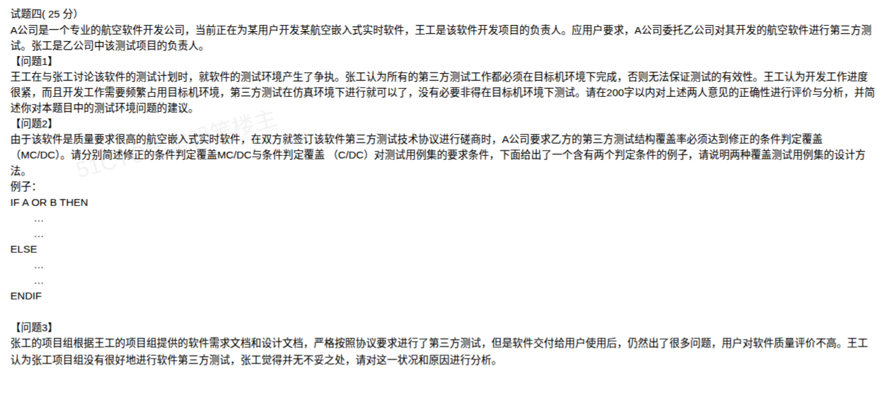

# 备考笔记：第三方软件测试（测试环境与覆盖准则）

## 一、题目

> **试题四（25 分）**
>
> A 公司是一个专业的航空软件开发公司，当前正在为某用户开发某航空嵌入式实时软件，王工是该软件开发项目的负责人。应用户要求，A 公司委托乙公司对其开发的航空软件进行第三方测试。张工是乙公司中该测试项目的负责人。
>
> **【问题 1】**
> 王工在与张工讨论该软件的测试计划时，就软件的测试环境产生了争执。张工认为所有的第三方测试工作都必须在目标机环境下完成，否则无法保证测试的有效性。王工认为开发工作进度很紧，而且开发工作需频繁占用目标机环境，第三方测试在仿真环境下进行就可以了，没有必要非得在目标机环境下测试。请在 200 字以内对上述两人意见的正确性进行评价与分析，并简述你对本题目中的测试环境问题的建议。
>
> **【问题 2】**
> 由于该软件是质量要求很高的航空嵌入式实时软件，在双方就签订该软件第三方测试技术协议进行磋商时，A 公司要求乙方的第三方测试结构覆盖率必须达到修正的条件判定覆盖（MC/DC）。请分别简述修正的条件判定覆盖 MC/DC 与条件判定覆盖（C/DC）对测试用例集的要求条件，下面给出了一个含有两个判定条件的例子，请说明两种覆盖测试用例集的设计方法。
>
> 例子：
>
> ```text
> IF A OR B THEN
>   ...
> ELSE
>   ...
> ENDIF
> ```
>
> **【问题 3】**
> 张工的项目组根据王工的项目组提供的软件需求文档和设计文档，严格按照协议要求进行了第三方测试，但是软件交付给用户使用后，仍然出了很多问题，用户对软件质量评价不高。王工认为张工项目组没有很好地进行软件第三方测试，张工觉得并无不妥之处，请对这一状况和原因进行分析。

**答案：**

**问题 1**：**张工的"必要性"正确、但"绝对化"表述欠妥；王工的"以进度挤测试环境"不正确。**第三方测试应在**尽可能真实（目标机）**的环境下进行——嵌入式实时软件的**实时性、时序、中断响应、硬件接口**等只有在目标机上方能真实暴露；仿真环境无法完全等价，故**关键测试必须回到目标机**。但"所有测试工作都必须在目标机完成"过于绝对：**静态分析、代码审查、单元测试、部分功能/逻辑测试**可在宿主机或仿真环境下高效完成，以节约目标机资源。建议：**以目标机环境为主、仿真环境为辅的分层测试策略** + **目标机资源使用计划（排期/共享/独立测试样机或半实物仿真 HIL）** + **测试环境等效性确认**。

**问题 2**：
- **条件判定覆盖（C/DC）= 判定覆盖 + 条件覆盖**：要求每个**判定**的真、假结果至少各出现一次，且每个**条件**的真、假取值至少各出现一次。
- **修正的条件判定覆盖（MC/DC）**：在 C/DC 基础上，要求每个条件都能**独立地影响判定结果**——即在其他条件不变的前提下，该条件取值的改变能独立引起判定结果的改变（同时判定真假、条件真假各至少一次）。

例：`IF A OR B`，判定 `D = A OR B`：

| 覆盖准则 | 用例集（A,B） | 说明 |
| --- | --- | --- |
| C/DC | (T,T)→D=T；(F,F)→D=F | 2 例即可：判定真/假各一次，A、B 真/假各一次 |
| MC/DC | (T,F)→T；(F,F)→F；(F,T)→T | 3 例：A 独立影响（B 固定 F），B 独立影响（A 固定 F） |

**问题 3**：**双方都不完全有理**。第三方测试"符合协议"≠"软件无缺陷"。根因主要在于**测试依据与验收标准的局限**：①测试仅依据开发方提供的**需求/设计文档**，文档本身可能不完整、不准确或偏离**用户真实需求**，需求缺陷测不出来；②协议只考核**结构覆盖率（MC/DC）**，而覆盖率只证明"代码逻辑被执行"，**不保证功能正确与需求正确**；③测试范围偏窄，**非功能质量（实时性、可靠性、安全性、容错、异常/边界/接口/时序）**覆盖不足；④**测试环境**与真实工况存在差异；⑤**测试独立性**有限（用例受开发方文档约束），进度压力下测试深度与回归不足；⑥缺陷闭环、沟通与用户需求变更同步不到位。改进：测试**尽早介入需求评审**、以**用户需求与行业标准**为测试依据、建立**功能+非功能+异常**的充分性准则、强化**目标机环境验证**与**缺陷闭环回归**，并在协议中明确**质量目标而非仅覆盖率**。

解析：本题考查**第三方测试的独立性、测试环境选择原则与结构覆盖准则**三类知识。采分核心：问题 1 要"**肯定目标机必要性、否定绝对化与唯仿真论、给出分层+资源调度建议**"；问题 2 要写准 **C/DC 与 MC/DC 的用例集要求**并**算出例子**；问题 3 要跳出"覆盖率达标即合格"的误区，从**测试依据、范围、环境、独立性、验收标准**多角度归因。

## 二、知识点：第三方软件测试

### 1. 核心原理

**（1）第三方测试的定位**

| 要素 | 内容 |
| --- | --- |
| **主体** | **独立于开发方**的第三方机构（本题中甲/乙公司相互独立）。 |
| **目的** | 保证测试的**客观性、公正性、独立性**，提高软件质量与可信度。 |
| **依据** | 软件需求规格说明、设计文档、**合同/技术协议**、行业标准（如航空 **DO-178B/C**）。 |
| **局限** | 独立性是**相对**的——测试用例仍受**开发方文档**约束；**满足覆盖率 ≠ 无缺陷**。 |

**（2）测试环境选择原则**

- **核心原则**：测试环境应**最大程度逼近真实运行环境**，否则测试结论不可信。
- **目标机（真实环境）**：能真实反映**实时性、时序、中断、硬件接口、资源约束**——嵌入式实时软件的**必测项**。
- **仿真环境（宿主机/半实物）**：成本低、可并行、易调试，适合**静态分析、代码审查、单元测试、逻辑/功能测试**，但**无法等价替代**目标机。
- **分层策略**：**目标机为主 + 仿真为辅**；用 **HIL（硬件在环）半实物仿真**补齐硬件接口验证。

**（3）覆盖率准则的层次（由弱到强）**

语句覆盖 → 判定覆盖 → **条件覆盖** → **判定/条件覆盖（C/DC）** → **条件组合覆盖** → **路径覆盖**；**MC/DC** 位于 C/DC 与条件组合覆盖之间，是**航空/适航（DO-178C A 级）**要求的强度等级。

### 2. 关键公式/规则

**（1）C/DC 与 MC/DC 的用例集要求**

| 准则 | 对判定 | 对条件 | 是否要求"独立影响" |
| --- | --- | --- | --- |
| **判定覆盖（DC）** | 真、假各 ≥1 次 | — | 否 |
| **条件覆盖（CC）** | — | 每个条件真、假各 ≥1 次 | 否 |
| **C/DC** | 真、假各 ≥1 次 | 每个条件真、假各 ≥1 次 | **否** |
| **MC/DC** | 真、假各 ≥1 次 | 每个条件真、假各 ≥1 次 | **是**：每个条件至少一次**独立改变**判定结果 |

**（2）MC/DC 用例数下界**

| 场景 | 最少用例数 |
| --- | --- |
| 含 n 个**无耦合**条件的判定 | **n + 1** |
| 本例（`A OR B`，n=2） | **3** |
| `A AND B`（n=2） | **3** |

**（3）例子设计法（`D = A OR B`）**

| 用例 | A | B | D | 作用 |
| --- | --- | --- | --- | --- |
| 1 | T | F | T | A 独立影响（B 固定 F，A:F→T 使 D:F→T） |
| 2 | F | F | F | 判定取假；作为 A、B 独立影响的基准 |
| 3 | F | T | T | B 独立影响（A 固定 F，B:F→T 使 D:F→T） |

> 对照：**`A AND B`** 的 MC/DC 用例为 (T,T)→T、(F,T)→F、(T,F)→F。

### 3. 解题步骤

**问题 1（测试环境评价）**
1. 先定性：**张工必要性正确、表述绝对化欠妥；王工不正确**。
2. 讲理由：实时/嵌入式的**实时性、时序、中断、硬件接口**只有目标机可验证。
3. 给妥协：**仿真可承担静态分析与逻辑测试**，关键项回目标机。
4. 给建议：**分层策略 + 目标机资源计划（排期/共享/独立样机/HIL）+ 环境等效性确认**。

**问题 2（覆盖准则）**
1. 先背定义：**C/DC = 判定 + 条件各取真假**；**MC/DC = C/DC + 每个条件独立影响判定**。
2. 再画真值表：代入 `A OR B` 逐条找"独立影响"。
3. 最后报用例数：`OR` 用 **3 例**（n+1），并列出每一例及其作用。
4. 加一句点睛：MC/DC **隐含**判定覆盖与条件覆盖，是适航软件强制等级。

**问题 3（质量归因）**
1. 破题：**满足协议 ≠ 软件合格**（覆盖率不等于质量）。
2. 按"**依据 → 范围 → 环境 → 独立性 → 闭环**"五条归因。
3. 收尾给改进：**需求评审早介入、以用户需求/行业标准为依据、功能+非功能充分性准则、目标机验证、缺陷闭环**。

## 三、易错点

1. **问题 1 只答"张工对、王工错"**：漏掉"**张工表述绝对化不严谨**"会失分——要答出**仿真环境的合理用途**与**分层策略**。
2. **把"覆盖率达标"等同于"质量合格"**：MC/DC 只是**结构覆盖**，无法保证**需求正确性**与**非功能质量**，问题 3 的核心陷阱即在此。
3. **C/DC 与 MC/DC 混淆**：C/DC 只要求**条件与判定各自真假都出现**；MC/DC 额外要求**每个条件能独立改变判定**。只写"覆盖率更高"不得分。
4. **MC/DC 用例数算错**：`A OR B` 是 **3 例不是 2 例**；`A AND B` 也是 **3 例**。写成 2 例即退化为 C/DC。
5. **把 C/DC 写成"条件组合覆盖"**：C/DC **不要求**条件的**全组合**（全组合需 2ⁿ 例），两者强度不同。
6. **问题 3 只怪张工或只怪王工**：应**双向归因**——协议与验收标准设计不当（A 公司侧）+ 测试依据与深度不足（乙公司侧）+ 进度挤压（项目侧）。
7. **遗漏测试依据问题**：只依据**开发方文档**测试，**需求评审缺位**，"垃圾进垃圾出"，是第三方测试最易忽视的独立性问题。

## 四、扩展延伸

- **与相关笔记串联**：测试阶段与接口验证见 [52-软件测试-测试阶段目的与接口验证辨析.md](52-软件测试-测试阶段目的与接口验证辨析.md)；静态与动态测试见 [53-软件测试-静态与动态测试辨析.md](53-软件测试-静态与动态测试辨析.md)；黑盒用例设计（等价类/边界值/因果图/判定表）见 [57-黑盒测试方法辨析-等价类划分边界值因果图与判定表.md](57-黑盒测试方法辨析-等价类划分边界值因果图与判定表.md) 与 [66-黑盒测试用例设计方法清单.md](66-黑盒测试用例设计方法清单.md)；系统测试与测试管理活动见 [67-系统测试与性能测试-论文写作要点.md](67-系统测试与性能测试-论文写作要点.md)。
- **白盒 vs 黑盒分工**：**MC/DC/C/DC 属白盒（结构）覆盖**，由代码结构驱动；**功能/需求正确性**要靠**黑盒**方法（等价类、边界值、判定表、场景法）以及**需求评审**共同保证——两者互补，缺一不可。
- **适航标准关联**：航空机载软件遵循 **DO-178B/C**，其 A 级要求 MC/DC。除覆盖准则外，还要求**需求追溯、独立验证与确认（IV&V）、配置管理、工具鉴定**等——可作为问题 3 的"改进方向"素材。
- **测试环境关键词**：**目标机（Target）、宿主机（Host）、仿真（Simulation）、半实物仿真（HIL/硬件在环）、环境等效性（Environment Equivalence）**。
- **术语对照**：C/DC = Decision/Condition Coverage（判定/条件覆盖）；MC/DC = Modified Condition/Decision Coverage（修正的条件判定覆盖）。
- **现实类比**：**目标机测试**＝真机试飞；**仿真测试**＝飞行模拟机训练——模拟机练操作流程高效，但**真机试飞**才发现真实气动与时序问题；**MC/DC**＝保证每个开关都能"单独说上话"，而不是被别的开关压着看不出作用。

## 五、错题归档

| 题号 | 题型 | 考点 | 难度 | 掌握度 |
| --- | --- | --- | --- | --- |
| 系统分析师-第三方测试 | 案例分析 | 测试环境选择（目标机 vs 仿真、分层策略、嵌入式实时特性） | 中 | 待复习 |
| 系统分析师-第三方测试 | 案例分析 | C/DC 与 MC/DC 的用例集要求、`A OR B` 用例设计（n+1=3 例） | 中 | 薄弱 |
| 系统分析师-第三方测试 | 案例分析 | 第三方测试质量归因（覆盖率的局限、测试依据/范围/环境/独立性/闭环） | 中 | 待复习 |

## 六、相关图片

原题截图：`../images/68-第三方测试-测试环境与MC-DC覆盖准则.png`（由用户上传的原题图复制改名而来）


