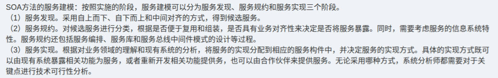

# 备考笔记：SOA服务建模三阶段

## 一、题目
> SOA方法的服务建模：按照实施的阶段，服务建模可以分为服务发现、服务规约和服务实现三个阶段。
> （1）服务发现。采用自上而下、自下而上和中间对齐的方式，得到候选服务。
> （2）服务规约。对候选服务进行分类，根据是否便于复用和组装，是否具有业务对齐性来决定是否将服务暴露。同时，需要考虑服务的信息系统特性。服务规约还包括服务编排、服务库和服务组件间接口模式的设计等过程。
> （3）服务实现。根据对业务领域的理解和现有系统的分析，将服务的实现分配到相应的服务构件中，并决定服务的实现方式。具体的实现方式既可以由现有系统暴露相关功能为服务，或者重新开发相关功能提供服务，也可以由合作伙伴来提供服务。无论采用何种方式，系统分析师都需要对于关键点进行技术可行性分析。

**答案：服务建模三阶段 = 服务发现 → 服务规约 → 服务实现**（按实施阶段划分）

解析：考法通常为"阶段划分"或"任务归属"匹配。抓住各阶段标志性关键词——发现（候选服务、三种对齐方式）、规约（分类、暴露、编排）、实现（实现方式、技术可行性分析），即可秒杀。

## 二、知识点：SOA服务建模三阶段

### 1. 核心原理
SOA 方法中，服务建模按照实施的阶段分为三个阶段：**服务发现、服务规约、服务实现**。三个阶段呈递进关系：先"找出"候选服务，再"定义/描述"服务，最后"落地"服务。

### 2. 关键公式/规则
| 阶段 | 核心任务 | 关键手段 / 产物 |
| --- | --- | --- |
| 服务发现 | 得到**候选服务** | 自上而下、自下而上、中间对齐 |
| 服务规约 | 候选服务分类，决定**是否暴露** | 判断依据：是否便于**复用和组装**、是否具有**业务对齐性**；考虑服务的**信息系统特性**；包括**服务编排、服务库、服务组件间接口模式**的设计 |
| 服务实现 | 分配到**服务构件**，决定**实现方式** | 三种方式：现有系统暴露相关功能为服务 / 重新开发相关功能 / 合作伙伴提供；对关键点进行**技术可行性分析**（主体：系统分析师） |

### 3. 解题步骤
1. 题干出现"候选服务"或"自上而下/自下而上/中间对齐" → **服务发现**。
2. 题干出现"分类、是否暴露、复用与组装、业务对齐、服务编排、服务库、接口模式" → **服务规约**。
3. 题干出现"分配到服务构件、实现方式（现有系统暴露/重新开发/合作伙伴）、技术可行性分析" → **服务实现**。

## 三、易错点
1. **阶段顺序**不能颠倒：发现 → 规约 → 实现。
2. "自上而下、自下而上、中间对齐"是**服务发现**的方式，不要误归入规约。
3. "服务编排、服务库、服务组件间接口模式的设计"属于**服务规约**的过程，不要误归入实现。
4. 实现方式共**三种**：现有系统暴露 / 重新开发 / 合作伙伴提供；无论哪种，都要对**关键点做技术可行性分析**，主语是**系统分析师**。

## 四、扩展延伸
- 服务发现三种方式的理解：自上而下从业务目标出发逐层分解；自下而上从现有系统资产出发提炼；中间对齐（meet-in-the-middle）将两者结合。
- 记忆口诀：**"发现（找）→ 规约（定）→ 实现（做）"**——先找服务、再定服务、后做服务。
- 与 [32-微服务系统特征](32-微服务系统特征.md) 对比复习：SOA 侧重服务复用与业务对齐（ESB、粗粒度），微服务侧重去中心化、独立部署（细粒度）。
- 该知识点在真题中常以"下列关于服务建模的说法，错误的是____"形式出现，错误选项常把三个阶段的任务互相调包。

## 五、错题归档
| 题号 | 题型 | 考点 | 难度 | 掌握度 |
| --- | --- | --- | --- | --- |
| — | 选择题（阶段划分/任务归属匹配） | SOA服务建模三阶段 | 中 | 待复习 |

## 六、相关图片
原题截图：`../images/74-SOA服务建模-三阶段.png`（由用户上传的原题图复制改名而来）

